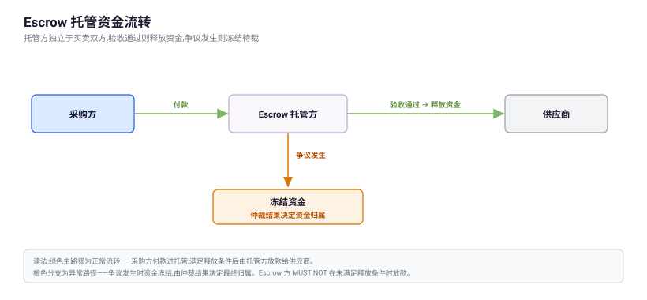

<!--
  UTP 协议章节标准模板（protocol-chapter，Markdown 版）
  ============================================================
  使用方法：
  1. 复制本文件到 docs/specification/ 目标目录（如 protocol-core/xxx.md），
     修改上方 front-matter；
  2. 在 docs/specification/manifest.json 的 navigation 与 pages 中注册
     该页面的产物路径（.html 后缀）；
  3. 页面外壳（导航、面包屑、页内目录、前后页、代码复制按钮）由文档站仓库的
     构建脚本统一生成，正文只需按本模板的写法书写；
  4. 在文档站仓库执行 npm run docs:build 后，在 public/specification/<协议版本>/
     查看渲染结果；构建会同时校验注册表与站内链接，目标缺失时直接中断。

  引用写法：
    章节链接与图片引用一律使用「相对当前 md 文件的仓库内路径」，不得使用站点
    绝对路径；带协议版本的站点地址由构建时统一生成。

  front-matter 字段：
    title    页面标题（必填，作为"页面 md"的识别标志）
    section  utp-section（默认按一级目录推导，可省略）
    owner    负责人（与 OWNERS.yaml 对应 section 一致）
    status   skeleton / drafting / review / approved / published
    version  YYYY-MM-DD（省略时取 manifest.json 的 version）

  锚点约定：
    标题行末尾用 {#s-xxx} 显式指定锚点 id（右侧页内目录自动收录 h2/h3/h4）；
    未显式指定时按标题文本自动生成。
    带章节编号的标题，锚点 id 必须将编号中的点号逐级换为连字符：
      19.1   → {#s-19-1}
      19.1.1 → {#s-19-1-1}
      19.11  → {#s-19-11}
    禁止去掉点号直接拼接（如 19.1.1 写成 s-1911），否则与 19.11（s-1911）
    无法区分；附录编号同理（H.5 → {#s-h-5}）。
-->

# 章节标题（English Title） {#s-chapter-title}

引言段紧随 h1，概述本章定位与边界。关键术语使用 **加粗** 强调，协议字段与取值使用 `行内代码` 表达（如 `interaction_level`）。规范性关键词 MUST / SHOULD / MAY 遵循 RFC 2119/8174。

---

## X.1 总览（Overview） {#s-overview}

正文段落之间空一行即可。

### X.1.1 术语与列表 {#s-overview-terms}

- **术语一**：无序列表项，术语用加粗引出。
- **术语二**：列表项可嵌套：
  - 嵌套子项一；
  - 嵌套子项二。

1. 有序列表用于规则、步骤等有先后关系的内容。
2. 每条规则一项，规范性关键词置于句中（如 MUST NOT）。

### X.1.2 提示块（NOTE） {#s-overview-note}

> **NOTE（Informative）**：信息性说明使用引用块承载，不构成规范性要求。

## X.2 超链接约定 {#s-links}

三类链接的标准写法：

- 页内锚点：[X.1 总览](#s-overview)（指向本页标题锚点）；
- 已发布章节：[协议概览](../concepts/index.md)（用相对当前 md 文件的仓库内路径，指向目标的源 `.md`；锚点直接跟在后面，如 `../protocol-core/x.md#s-19-1`）；
- 未发布章节（待补引用）：<span class="pending-ref" data-ref="../protocol-core/identity-authorization.md" title="目标章节尚未发布，链接待补">第 N 章</span>——目标章节发布后，将 `span` 恢复为 `[第 N 章]({data-ref})` 即可。

构建时上述相对路径会被换算为产物内的 `.html` 相对路径。不得使用站点绝对路径，也不得直接指向 `.html`。

## X.3 表格 {#s-tables}

字段/规则定义统一使用 Markdown 表格：

| 字段名 | 类型 | 必填 | 描述 |
| --- | --- | --- | --- |
| `field_a` | string | 是 | 字段说明；字段名一律用行内代码。 |
| `field_b` | enum | 否 | 取值 `A` / `B` / `C`。 |

## X.4 代码区 {#s-code}

示例统一使用围栏代码块并标注语言（构建时由 Shiki 静态高亮，支持 json / bash / http / javascript / typescript / yaml / html；复制按钮自动生成）。示例前应声明其性质：

以下示例仅用于说明最小语义要素，不构成唯一合法格式：

```json
{
  "session_id": "utp-session-abc123",
  "state": "PURCHASING",
  "data": {
    "purchase_id": "purchase-5-001"
  }
}
```

## X.5 图片区 {#s-figures}

图表文件放入 `docs/assets/diagrams/`，首选 Markdown 图片语法 + **相对当前 md 文件的仓库内路径**，alt 文本完整描述图中信息：



需要图题时改用 `figure` + `figcaption`（内联 HTML）：

<figure>

<figcaption>图 X-1：图题说明</figcaption>
</figure>

上例的 `../../` 对应 `specification/protocol-core/xxx.md` 这个位置（protocol-core → specification → docs），实际层数按当前文件深度计算（如 `specification/primitives/pay/index.md` 需 `../../../`）。SVG 根元素应声明 `viewBox`（不写死 `width/height`），以适配正文区自适应缩放；不得使用站点绝对路径与外部图床。

## X.6 分节与收尾 {#s-sections}

### X.6.1 三级标题示例 {#s-sections-h3}

#### X.6.1.1 四级标题示例 {#s-sections-h4}

主要小节之间使用 `---` 分隔；四级以上不再细分，改用加粗引导段。

---

> **以下附录为信息性内容**，不构成规范性要求。

## 附录 X：附录标题 {#s-appendix-x}

附录内容。
