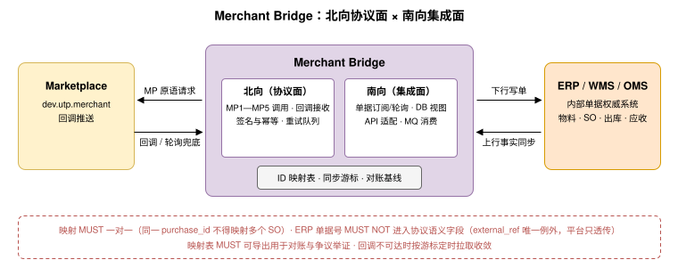

<h1 id="s-m8">M8 · ERP 集成与 Bridge（ERP Integration &amp; Merchant Bridge）</h1>

    <h2 id="s-m81">M8.1 定位（Positioning）</h2>
    
绝大多数供应商的商品、库存、订单、发货与财务事实的权威系统是其内部 ERP/WMS/OMS。本章定义 <strong>Merchant Bridge</strong>：把供应商内部系统与 UTP-M 原语连接起来的集成规范。Bridge 是主规范存量兼容思想（<a href="../guides/legacy-migration.md">Ch.22</a> 的 Bridge/Adapter 模式）在供应商侧的具体化——主规范定义了"传统系统如何映射 UTP 语义"，本章定义"供应商内部单据如何映射 MP 原语"。

    
本章内容是<strong>实现指引 + 少量互操作约束</strong>：ID 映射（M8.3）与幂等/一致性规则（M8.5）为规范性要求（RFC 关键词有效）；同步模式与部署形态为最佳实践。

    <h2 id="s-m82">M8.2 部署形态（Deployment Patterns）</h2>
    <table>
      <thead><tr><th>形态</th><th>结构</th><th>适用</th></tr></thead>
      <tbody>
        <tr><td><code>native</code>（原生集成）</td><td>ERP 厂商内置 UTP-M 客户端，直接调用 MP 原语</td><td>新一代云 ERP；变更成本低</td></tr>
        <tr><td><code>bridge</code>（独立中间件）</td><td>独立部署的 Bridge 进程：北向对接 Marketplace（MP 原语 + 回调），南向对接 ERP（DB/API/文件/MQ）</td><td>存量 ERP 不可改造；主流形态</td></tr>
        <tr><td><code>agent_embedded</code>（Agent 内嵌）</td><td>Merchant Agent（M9）内嵌 Bridge 能力，集成与决策一体</td><td>中小供应商；SaaS 化交付</td></tr>
        <tr><td><code>none</code>（人工后台）</td><td>无系统集成，人工通过商家后台操作（后台内部调用 MP 原语）</td><td>极小规模商家；协议视角与其他形态无差别</td></tr>
      </tbody>
    </table>
    
入驻时以 <code>erp_integration_mode</code> 声明形态（M2.4.1），供 Marketplace 评估时效预期（如自动接单可达性）。无论何种形态，协议交互面完全相同——这是"传输无关性"约束在集成层的延伸。

    <h2 id="s-m83">M8.3 ID 映射规范（Identifier Mapping）</h2>
    
Bridge MUST 维护双向 ID 映射表并保证映射持久、唯一、可审计：

    <table>
      <thead><tr><th>UTP-M 标识</th><th>ERP 侧典型单据</th><th>映射建立时机</th><th>协议承载字段</th></tr></thead>
      <tbody>
        <tr><td><code>listing_id</code> + <code>sku_id</code></td><td>物料/商品主数据（Item Master）</td><td><code>listing.publish</code> 成功时</td><td><code>skus[].external_ref</code>（M3.9.2）：发布时写入 ERP 物料号，平台在订单路由中原样回传</td></tr>
        <tr><td><code>purchase_id</code> / <code>transaction_id</code></td><td>销售订单（SO）</td><td><code>acceptance.accept</code> 后创建 SO 时</td><td>AcceptanceRecord 与 SO 号在 Bridge 映射表内关联（<code>transaction_id</code> 是交易边界的唯一公共锚点，主规范 <a href="../primitives/purchase/index.md#s-1325">13.2.5</a>；内部单据号与它的映射属 Bridge 私有状态，对应第 22 章 Bridge/Adapter 模式的卖方侧）</td></tr>
        <tr><td><code>shipment_id</code> / <code>batch_id</code></td><td>出库单 / 发货单</td><td>ERP 出库确认 → <code>shipment.ship</code></td><td>Shipment.packages[].items[].external_ref 回传物料号；出库单号存于映射表</td></tr>
        <tr><td><code>hold_id</code></td><td>库存预留单（Reservation）</td><td><code>hold_created</code> 回调时</td><td>InventoryHold.transaction_id 关联</td></tr>
        <tr><td><code>statement_id</code> / <code>entry_id</code></td><td>应收对账单</td><td><code>statement_issued</code> 回调时</td><td>SettlementEntry.transaction_id 关联 SO 收款核销</td></tr>
      </tbody>
    </table>
    
<strong>规范性约束：</strong>

    <ul>
      <li>映射 MUST 一对一（同一 <code>purchase_id</code> MUST NOT 映射多个 SO；拆单发货用 <code>batch_id</code> 区分，不复制订单）。</li>
      <li>ERP 侧单据号 MUST NOT 出现在跨方协议消息的语义字段中（<code>external_ref</code> 是唯一例外，且平台只做透传，不解释其内容）——对应主规范 17.0.1"Binding Terms、商家内部字段、任意 output 字段和 Evidence 内容不得成为公共迁移条件；这些业务条件必须先由对应原语处理，并通过 P0 标准 Action Response 表达"。</li>
      <li>映射表 MUST 可导出用于对账与争议举证。</li>
    </ul>

    <h2 id="s-m84">M8.4 同步模式（Synchronization Patterns）</h2>
    <h3 id="s-m841">M8.4.1 上行同步（ERP → Marketplace）</h3>
    <table>
      <thead><tr><th>数据流</th><th>MP 原语</th><th>推荐模式</th><th>要点</th></tr></thead>
      <tbody>
        <tr><td>商品主数据</td><td>MP1 <code>publish</code>/<code>update</code>（批量）</td><td>全量初始化 + 变更事件增量</td><td>低频；major 变更走审核通道（M3.2.4），Bridge SHOULD 合并同一商品短时间内的多次变更</td></tr>
        <tr><td>库存数量</td><td>MP2 <code>adjust</code>（增量优先）</td><td>事件驱动（出入库单触发）+ 定时全量校准（<code>set</code>）</td><td>高频；纯增量用 <code>commutative: true</code> 免锁；全量校准 MUST 用 <code>expected_revision</code> 防覆盖并发扣减</td></tr>
        <tr><td>接单结论</td><td>MP3 <code>accept</code>/<code>reject</code></td><td>ERP 审批流回调驱动</td><td>MUST 在 <code>deadline</code> 内完成；审批超时前 Bridge SHOULD 提前 <code>hold</code> 声明预计答复时间</td></tr>
        <tr><td>发货事实</td><td>MP4 <code>ship</code>/<code>update</code></td><td>出库确认事件驱动</td><td>出库单确认后 MUST 立即上行；运单号缺失时先 <code>prepare(completed)</code> 再补 <code>ship</code></td></tr>
      </tbody>
    </table>
    <h3 id="s-m842">M8.4.2 下行同步（Marketplace → ERP）</h3>
    <table>
      <thead><tr><th>数据流</th><th>来源</th><th>ERP 动作</th></tr></thead>
      <tbody>
        <tr><td>订单路由</td><td><code>order_routed</code> 回调（M5.7）</td><td>创建待审 SO / 触发自动审批策略</td></tr>
        <tr><td>库存占用/释放</td><td><code>hold_created</code>/<code>hold_released</code> 回调</td><td>创建/释放库存预留单</td></tr>
        <tr><td>妥投与收货回执</td><td><code>delivery_receipt</code> 回调（M6.7）</td><td>SO 履约完成、确认收入条件</td></tr>
        <tr><td>结算账单</td><td><code>statement_issued</code> 回调（M7.4）</td><td>生成应收对账任务</td></tr>
      </tbody>
    </table>
    
回调不可达时按主规范 4.3.2 轮询降级：Bridge MUST 实现基于游标的定时拉取（<code>acceptance.list</code>、<code>inventory.hold.query</code>、<code>shipment.query</code>、<code>settlement.statement.list</code>），确保任何推送丢失都能在一个轮询周期内收敛。

    <h2 id="s-m85">M8.5 库存一致性与防超卖（Inventory Consistency）</h2>
    
多渠道（线下 + 多平台）售卖同一物理库存时，Bridge MUST 遵守：

    <ol>
      <li><strong>单一权威：</strong>物理库存的权威值在 ERP；平台侧 <code>available</code> 是 ERP 分配给该渠道的<strong>渠道配额</strong>的镜像。Bridge MUST NOT 让两个渠道共享同一无划分配额（超卖根源）。</li>
      <li><strong>增量优先：</strong>渠道内销售扣减由平台 lock/consume 自动完成（M4.7），Bridge MUST NOT 对协议内订单重复下调 <code>available</code>；只同步<strong>协议外</strong>变化（线下出库、盘亏、调拨），使用 <code>adjust + reason_code + source_ref</code>。</li>
      <li><strong>校准窗口：</strong>定时全量校准（<code>set</code>）MUST 选择低峰窗口执行，且以 <code>expected_revision</code> 提交；遇 <code>INVENTORY.REVISION_CONFLICT</code> MUST 重读后基于最新占用重新计算，MUST NOT 盲目重试覆盖。</li>
      <li><strong>安全垫：</strong>高并发 SKU SHOULD 配置渠道安全库存（ERP 侧扣留缓冲量不分配），把并发窗口内的超卖概率压到接单环节可拦截的水平——最终兜底是 MP3 <code>reject(inventory_insufficient)</code>，但 SHOULD 作为异常路径而非常态。</li>
    </ol>

    <h2 id="s-m86">M8.6 幂等、顺序与容错（Idempotency, Ordering &amp; Fault Tolerance）</h2>
    <ul>
      <li><strong>幂等键派生：</strong>Bridge 的 <code>idempotency_key</code> MUST 从 ERP 侧业务单据确定性派生（如 <code>ship-{出库单号}</code>），保证进程重启/重放后同一单据不产生重复副作用。</li>
      <li><strong>顺序保证：</strong>同一资源（同一 SKU 库存、同一订单）的上行操作 MUST 串行化（按资源分片的本地队列）；跨资源无顺序要求。回调消费 MUST 容忍乱序与重复：以事件携带的资源状态与 <code>revision</code>/时间戳做幂等合并，MUST NOT 依赖到达顺序。</li>
      <li><strong>重试与死信：</strong>上行失败按指数退避重试；不可恢复错误（4xx 语义错误）MUST 进入死信队列并告警人工处理，MUST NOT 无限重试。</li>
      <li><strong>断点续传：</strong>Bridge MUST 持久化同步游标；重启后从游标恢复，配合幂等键实现精确一次的等效语义。</li>
      <li><strong>时钟与时限：</strong>接单 <code>deadline</code> 等时限判断 MUST 以消息载荷内的时间戳为准（服务端时钟），Bridge 本地时钟仅作参考。</li>
    </ul>

    <h2 id="s-m87">M8.7 对账钩子（Reconciliation Hooks）</h2>
    
Bridge SHOULD 实现三层定时对账，闭合"事件驱动可能丢失"的最后风险：

    <table>
      <thead><tr><th>层</th><th>核对对象</th><th>协议接口</th><th>差异处置</th></tr></thead>
      <tbody>
        <tr><td>商品层</td><td>ERP 在售物料 × 平台 LISTED 集合</td><td><code>listing.query</code>（列表）</td><td>缺失→补发布；多余→下架或核对映射</td></tr>
        <tr><td>库存层</td><td>ERP 渠道配额 × 平台 <code>available/holds</code></td><td><code>inventory.query</code> + <code>hold.query</code>（含 <code>revision</code> 流水与 <code>source_ref</code>）</td><td>差异→定位缺失事件→校准 <code>set</code></td></tr>
        <tr><td>单据层</td><td>ERP SO/出库/应收 × 平台受理/发货/结算记录</td><td><code>acceptance.list</code>、<code>shipment.query</code>、<code>settlement.entry.query</code></td><td>差异→补传事实或提交 M7.5 差异申报</td></tr>
      </tbody>
    </table>

    <h2 id="s-m88">M8.8 安全边界（Security Boundary）</h2>
    <ul>
      <li>Seller 私钥 MUST 由供应商侧（Bridge/HSM/密管服务）持有；MUST NOT 托管给 Marketplace。Bridge 代签场景下，Bridge 属于 Seller 信任域内组件。</li>
      <li>Bridge 北向出站 MUST 校验 Marketplace 回调签名（RFC 9421）与事件幂等；南向凭据（ERP 账号）MUST 与北向密钥隔离存储。</li>
      <li>Bridge 操作日志 MUST 记录：协议请求/响应摘要、签名指纹、ID 映射变更、游标推进——满足争议举证与审计要求（主规范 Ch.7 风控与审计的供应商侧落点）。</li>
    </ul>
