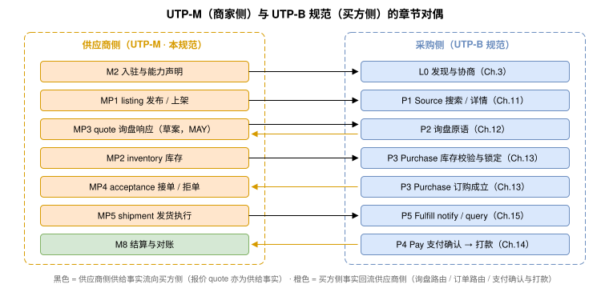

# UTP-M Specification — 2026-08-04（Draft） {#s-utp-m-specification}

## UTP 供应商侧规范（Merchant-Side Specification）— Release Candidate 1 {#s-merchant-side}

> 本规范定义 UTP（Universal Trade Protocol）v1.0 的**供应商侧能力**：商品、库存、报价、接单、交付、售后，以及结算对账、ERP 集成与供应商 Agent。本规范是与 UTP-B 规范（买方侧）**并列的独立协议（Parallel Protocol）**，面向平台托管（Market–Merchant）场景：它**复用** UTP 的通用底层能力（商业场景、商业拓扑、发现协商、通信认证、P0 原语框架、六维 Mode 维度模型、通用实体与错误码格式），但**不依赖** UTP-B 专属的两项高级能力——采购模式编排、全局状态机（2026-08-03 分层解耦裁决）。UTP-B 与本规范是两套独立的 DAG 与 trade context，通过 Marketplace 双面枢纽衔接，而非合并为一。与 UTP 规范章节体系的对应关系及治理路线见[附录 E](appendices.md#s-me)（资料性）。

## 定位与阅读方式 {#s-positioning}

UTP-B 规范定义的六大交易原语（P1—P6）以采购方（Buyer）为主要发起方，回答"交易如何执行"。本规范回答其前置与对偶问题：**商品从哪里来、订单如何被供应商受理与履行、货款如何回到供应商**。二者合起来构成完整的商业闭环：

本规范所有原语遵守 UTP 规范 [《操作定义格式》 操作定义格式](../protocol-core/primitive-framework.md#s-1023-action-definition-format)的角色绑定规则：每个 Action 恰好声明一个 `initiator_role` 与一个 `handler_role`。"UTP-M"仅是编辑与阅读上的分组名称，发现与协商流程 MUST NOT 据此推断角色方向。

## 章节目录 {#s-toc-tables}

### 导读 {#s-part-0}

| 页面 | 标题 | 内容概要 |
| --- | --- | --- |
| Quickstart | [供应商接入快速开始](quickstart.md) | 非规范性导读：最小实现面（REST 客户端 + Webhook）、入驻→铺货→日常循环三阶段、Agent/Bridge 选型指引 |

### 总纲 {#s-part-1}

| 章节 | 标题 | 内容概要 |
| --- | --- | --- |
| M1 | [供应商侧架构总览](overview.md) | 设计原则、角色模型（新增 Marketplace）、两种拓扑（平台托管/自托管）、MP 原语总表、商品—交易闭环、与 UTP-B 规范的衔接矩阵 |
| M2 | [入驻与能力声明](onboarding.md) | 供应商入驻五步流程：身份与密钥、Profile 发布、Registry 登记、资质合规、回调登记与连通性验收 |

### 供应商原语（MP 系列） {#s-part-2}

| 章节 | 原语 | 原语 ID | 方向 | 核心 Action |
| --- | --- | --- | --- | --- |
| M3 | [MP1 商品管理](primitives/listing/index.md) | `utp.listing` | Seller → Marketplace | `publish`, `update`, `list`, `delist`, `query`, `archive`, `batch` |
| M4 | [MP2 库存管理](primitives/inventory/index.md) | `utp.inventory` | Seller → Marketplace | `set`, `adjust`, `query`, `hold.query`, `batch` |
| M5 | [MP3 询盘响应（草案新增）](primitives/quote/index.md) | `utp.quote` | Seller → Marketplace | `quote, revise, bid, decline, query, list` |
| M6 | [MP4 接单](primitives/acceptance/index.md) | `utp.acceptance` | Seller → Marketplace | `accept`, `reject`, `hold`, `amend_leadtime`, `amend_price`, `query`, `list` |
| M7 | [MP5 交付原语](primitives/delivery/index.md) | `utp.delivery` | Seller → Marketplace | `prepare`, `ship`, `split`, `update`, `query` |
| M8 | [MP6 售后原语](primitives/aftersale/index.md) | `utp.aftersale` | Seller → Marketplace | `approve`, `reject`, `propose`, `confirm_return`, `query`, `list` |

### 经营与集成 {#s-part-3}

| 章节 | 标题 | 内容概要 |
| --- | --- | --- |
| M8 | [结算与对账](settlement.md) | 结算模型（佣金/分账/回款周期）、只读扩展 `utp.pay.settlement`（账单列表/明细/差异申报）、对账闭环 |
| M9 | [ERP 集成与 Bridge](erp-bridge.md) | Bridge 部署形态、ID 映射规范、上行/下行同步模式、库存防超卖、幂等与容错、对账钩子 |
| M10 | [供应商 Agent 与人机协同](merchant-agent.md) | Merchant Agent 职责边界、自动接单/报价策略（AcceptancePolicy）、HAI 控制点与挂起语义衔接、Agent 授权 |

### 场景与整合 {#s-part-4}

| 章节 | 标题 | 内容概要 |
| --- | --- | --- |
| M11 | [供应商全链路演练](walkthrough.md) | 入驻 → 发布 → 上架 → 被寻源 → 接单 → 发货 → 结算的端到端 JSON 序列演练，与买方视角对照 |
| 附录 | [附录](appendices.md) | MA 术语表、MB 错误码总表、MC Scope 总表、MD Schema 索引、ME 章节对应与整合路线、MF 开放问题 |

## 编辑约定 {#s-conventions}

- 本规范沿用 UTP 规范 README 第 4 节的全部行文规范：RFC 2119 关键词、实体四列表格（字段名/类型/必填/描述）、`snake_case` 字段、JSON 示例与实体定义严格一致。
- 章节编号使用 `M{n}` 前缀，小节使用 `M{n}.{x}`；锚点格式 `id="s-m{编号去点}"`，如 `s-m31`、`s-m311`，避免与 UTP 规范 `s-*` 冲突。
- 凡引用 UTP 规范内容，一律使用相对链接 `../{file}.html#s-xxx` 并注明章节号；本规范 MUST NOT 复制 UTP 规范定义，只做引用。
- 与 UTP 规范章节体系的对应关系与联动清单以[附录 E](appendices.md#s-me)为准（资料性）。

## 稳定性分级承诺（Stability Levels） {#s-stability}

本规范以 RC（Release Candidate）状态发布，对实现方按三级做出稳定性承诺：

| 级别 | 范围 | 承诺 |
| --- | --- | --- |
| **Stable** | MP1、MP2、MP4、MP5（商品/库存/接单/交付）操作集与 REST 路径、请求/响应 Schema、资源状态机、错误码、回调事件、签名规则（JCS+SHA-256+JWS ES256）、幂等契约、批量协议、五步入驻流程（MP3 报价、MP6 售后为本轮新增，列 Experimental，不在本行承诺内） | 正式版 MUST NOT 做破坏性变更；新增字段一律 OPTIONAL；SDK 可直接按本版本实现 |
| **Stable-with-dependency** | Profile 结构（随 UTP 规范 《发现与协商》）、MessageEnvelope、Mode 超时配置、MP4↔P3 / MP5↔P5 / MP6↔P6 衔接引用 | 自身语义稳定；若 UTP 规范对应章节变更，本规范同步修订引用（不改变本侧行为） |
| **Experimental** | MP3 报价原语与 MP6 售后原语（本轮新增，实现方反馈后可能调整字段与状态命名）；`utp.pay.settlement` 扩展、`delegation_policy` 透传模式（询盘/争议）、AI 辅助录入 `source_materials`、多仓库存投影 | MAY 在后续版本调整；生产依赖前应跟踪附录 MF 开放问题 |

## 文档信息 {#s-doc-meta}

- **版本：** 2026-08-04（日期版本，Draft；按上述稳定性分级承诺发布，稳定后随 UTP 规范按季度发布正式版）
- **基础：** UTP Protocol Specification v1.0（2026-07-03）
- **原语版本基线：** 2026-07-31（MP1—MP6 统一取值，与 UTP-B 规范 P1—P6 的原语版本对齐）
- **状态：** Release Candidate——Stable 面冻结；转正式版前待办：Marketplace 角色 RFC 流程（附录 ME 第 2 项）与 UTP 规范引用冻结点后的一致性复扫
- **机读契约：** 实体 Schema、原语定义文件与状态机见[附录 MD](appendices.md#s-md)；一致性校验工具（validate_schemas / test_fixtures）随本规范同源发布
