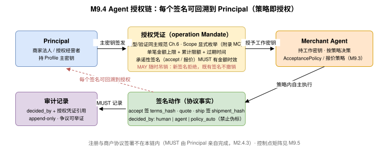

# M11 · 供应商 Agent 与人机协同（Merchant Agent &amp; Human-Agent Interaction） {#s-m11}

## 定位（Positioning） {#s-m111}

**Merchant Agent** 是代表供应商（Principal：商家法人或其授权经营者）自主执行经营决策的 AI Agent。它不是拓扑角色（既有角色的供应商侧职责）——协议交互中它以 `Seller` 身份出现，与人工后台操作在协议层不可区分；区别在于**授权链、决策审计与人机控制点**，这正是本章的规范对象。

本章将 UTP 规范人机协同框架（[人机交互协同](../protocol-core/human-agent-interaction.md)）与身份授权框架（[身份与授权](../protocol-core/identity-authorization.md)）应用到供应商侧，遵循同一交互控制等级与 HAI 挂起语义，不新造机制。

## Merchant Agent 职责边界（Responsibility Boundary） {#s-m112}

| 职责域 | Agent 可执行的动作 | 对应原语 |
| --- | --- | --- |
| 入驻资料与资质维护 | 在授权下代办资料提交、资质更新与换证（[Step 4：资质与合规（Qualification & Compliance）](onboarding.md#s-m25)）；平台账号注册与商户协议签署除外（[注册边界与访问凭证](onboarding.md#s-m243) / [人机控制点（HAI Control Points）](#s-m115)） | 入驻管理接口（非原语） |
| 商品运营 | 依据 ERP 主数据与销售策略发布/更新/上下架商品；类目属性补全；低销量商品下架建议 | MP1 |
| 库存运营 | 渠道配额分配、低库存预警响应（补货/下架）、全量校准调度 | MP2 |
| 询盘与报价 | 响应买方 P2 询盘经 MP3 应答（[M5](primitives/quote/index.md)）：`delegation_policy` 为 `passthrough` 时接收 `inquiry_routed` 回调，依据定价策略生成 `quote`/还盘并回传；框架协议客户按协议价自动报价 | P2（Seller 作为 handler 侧的应答方，执行模式见 Handler 侧执行模式：平台代答与透传（Delegation Mode）） |
| 接单决策 | 按 AcceptancePolicy 自动接单/拒单/挂起/申报交期 | MP4 |
| 履约调度 | 备货申报、选择承运商、发货上报、延迟预警与申报 | MP5 |
| 结算核对 | 三方对账（[对账闭环与差异处理（Reconciliation Loop）](settlement.md#s-m95)）、差异申报草案生成 | settlement 扩展 |
| 争议应对 | 整理证据包、生成答辩草案 | P6（提交前 MUST 人工确认，见 [人机控制点（HAI Control Points）](#s-m115)） |

## 自动决策策略（AcceptancePolicy 与定价策略） {#s-m113}

### AcceptancePolicy 实体 {#s-m1131}

自动接单策略是 MP4 `acceptance_policy.mode == "auto"`（[与 P3 Purchase 签名流程的衔接（Interlock with P3）](primitives/acceptance/index.md#s-m66)/[Mode-Driven Behavior（模式驱动行为）](primitives/acceptance/index.md#s-m68)）的供应商侧配置。策略 MUST 以结构化形式定义、版本化存档，使每次自动决策可回溯到策略版本：

| 字段名 | 类型 | 必填 | 描述 |
| --- | --- | --- | --- |
| `policy_id` / `version` | string / integer | 是 | 策略标识与版本（变更递增，旧版本存档）。 |
| `mode` | enum | 是 | `auto`（策略通过即自动 accept）/ `assisted`（策略给建议，人工/上级 Agent 终审）/ `manual`（仅路由通知）。 |
| `auto_accept_rules` | array | 条件 | 自动接单条件组（AND 语义）：如 `order_amount <= limit`、`sellable 覆盖率 == 100%`、`buyer.trust_score >= 阈值`、`region ∈ 可达区域`、`framework_agreement_ref 存在`。 |
| `auto_reject_rules` | array | 否 | 自动拒单条件组（命中即 reject，附映射的 [RejectReason 原因码枚举](primitives/acceptance/index.md#s-m6102) 原因码）。 |
| `escalation` | object | 是 | 不满足自动规则时的升级路径：`hold + 人工工单` 或 `assisted 建议`；MUST 声明升级后的答复时限策略。 |
| `amount_ceiling` | Money | 是 | 自动决策金额上限；超过 MUST 升级人工（[人机控制点（HAI Control Points）](#s-m115) 控制点）。 |
| `owner_signature` | string | 是 | Principal（商家授权人）对策略版本的 ES256 签名——策略即授权的书面化。 |

### 报价策略约束 {#s-m1132}

Merchant Agent 代表 Seller 经 MP3 应答 P2 询盘时（报价原语）：

- 报价 MUST 以 Listing 的 `pricing`（含 `pricing_tiers`）为基准，偏离幅度 MUST 在策略声明的折扣边界内（如 `max_discount_pct`）。
- 生成的 Quote/Binding Terms 遵循 UTP-B 规范 P2 的实体与签名要求；Agent 签名的授权要求见 [Agent 授权链（Delegation & Mandate）](#s-m114)。
- 金额或折扣超出策略边界的还盘 MUST 升级人工确认（SUSPENDED 控制点）。

## Agent 授权链（Delegation &amp; Mandate） {#s-m114}

Merchant Agent 的每次签名动作 MUST 可回溯到 Principal 授权，复用 UTP 规范《身份与授权》的身份与授权框架（Agent 身份凭证 + 授权链），供应商侧的授权要素：

| 要素 | 要求 |
| --- | --- |
| 授权主体 | Principal（商家法人/授权经营者）以 Profile 主密钥签发对 Agent 工作密钥的授权凭证。凭证类型 MUST 为 UTP 规范 `operation` Mandate（Profile `mandates.supported_mandate_types` 中的既有类型，不新增类型），结构与验证规则同 UTP 规范《身份与授权》；供应商侧仅约束其 Scope、金额与时效内容如下。 |
| 授权范围 | MUST 按 Scope 枚举（附录 MC）：如 `listing:*`、`inventory:*`、`acceptance:accept`（含金额上限）、`delivery:*`；结算读取 `pay:settlement:read` SHOULD 单独授予。 |
| 金额与时效 | 涉及承诺性签名（`acceptance:accept`、P2 报价）的授权 MUST 声明单笔金额上限与累计限额，MUST 有过期时间。 |
| 可撤销 | Principal MAY 随时吊销授权；吊销后 Agent 既有签名仍有效（不可撤销承诺），新签名 MUST 被拒绝。 |
| 审计 | 每条 AcceptanceRecord/Quote/Shipment 的 `decided_by` 维度（`human`/`agent`/`policy_auto`）+ 授权凭证引用 MUST 进入审计记录。 |

## 人机控制点（HAI Control Points） {#s-m115}

复用 UTP 规范《人机交互协同》的三级交互控制等级（AUTONOMOUS &lt; SUPERVISED &lt; CONFIRMED，[交互控制等级（interaction_level）](../protocol-core/human-agent-interaction.md#s-19-1-2)：自动执行 / 监督执行（非阻断，倒计时窗口内可人工撤回）/ 人工确认（阻断执行门））与 HAI 挂起语义（Suspend Record，《人机交互协同》；执行前控制，《全局状态机》.6），定义供应商侧默认控制点矩阵：

| 决策场景 | 默认交互等级 | 说明 |
| --- | --- | --- |
| 商品发布/上下架（常规） | AUTONOMOUS | Agent 自主执行，事后可查。 |
| 价格调整（降价超阈值 / 任何涨价 major 变更） | CONFIRMED | MUST 经 Principal 确认后提交 `update`。 |
| 询盘报价（策略内，MP3） | AUTONOMOUS | 按报价策略自动 quote 并签名（报价原语）；策略外或超授权限额升级 CONFIRMED。 |
| 价格调整（降价、阈值内） | SUPERVISED | 非阻断执行：SHOULD 提供倒计时窗口供人工撤回，窗口结束自动提交 update。 |
| 自动接单（策略内） | AUTONOMOUS | 策略内自动执行并事后通知 Principal（通知属运营实践，不构成 HAI 确认点）；策略外升级 CONFIRMED。 |
| 接单金额超 `amount_ceiling` / 低毛利 / 黑名单区域 | CONFIRMED | 受理任务 `hold`，等待人工结论；MUST 在 M6 deadline 内完成，否则超时策略兜底。 |
| 交期变更申报 | AUTONOMOUS | Agent 可自主申报，SHOULD 同步通知 Principal（通知属运营实践，不构成 HAI 确认点）。 |
| 发货（常规） | AUTONOMOUS | 随 ERP 出库事实自动上报。 |
| 结算差异申报 / 争议答辩提交 | CONFIRMED | 涉及资金与法律立场，MUST 人工确认。 |
| 平台账号注册、商户协议签署、密钥轮换、授权变更 | CONFIRMED（仅 Principal） | MUST NOT 委托给 Agent（[注册边界与访问凭证](onboarding.md#s-m243)）。 |

**与买方侧 HAI 挂起的关系**：供应商侧人工确认发生在 MP4 受理窗口内（`ON_HOLD` 状态），属于供应商内部流程，**不产生**买方会话的 HAI 挂起记录（Suspend Record）——后者是买方 Principal 对待确认 Action 的控制语义（UTP 规范 《人机交互协同》，执行前控制见 《全局状态机》.6）。两侧时限的衔接由 M6 的 `deadline` 统一约束。

## 决策审计（Decision Audit） {#s-m116}

本节审计要求继承 UTP 规范[风控与审计](../protocol-core/risk-audit.md)：审计记录结构、保留期限与风控信号采集规则以《风控与审计》为准，本节只补充供应商侧的决策来源维度。

- 每次 Agent 自主决策 MUST 记录：输入摘要（路由订单/询盘要点）、命中的策略规则与版本、输出动作、授权凭证引用、时间戳。
- 审计记录 SHOULD 以追加式存储（append-only）保存，保存期不低于争议时效期；争议中 MAY 作为证据提交（Evidence Bundle）。
- Marketplace 对 `decided_by == 'agent' | 'policy_auto'` 的决策 MAY 施加额外风控采样（UTP 规范《风控与审计》风控信号框架）；供应商 MUST NOT 将人工决策伪标为自动或反之。

## Agent 失效与降级（Failure &amp; Fallback） {#s-m117}

| 失效场景 | 降级行为 |
| --- | --- |
| Agent 不可用（宕机/授权过期） | 回调事件积压由 Bridge 队列承接；受理任务按 M6 `timeout_policy` 兜底；Principal SHOULD 收到不可用告警并可切换人工后台。 |
| 策略配置错误（异常批量拒单/异常报价） | Principal MAY 紧急吊销授权并回滚策略版本；已产生的承诺性签名不可撤销，善后走 P6。 |
| Agent 与 ERP 数据不一致 | 以 ERP 为南向权威、协议凭证为北向事实，按 对账钩子（Reconciliation Hooks） 对账钩子收敛；决策暂降级为 `assisted`。 |
