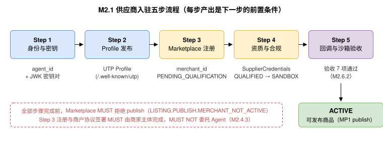
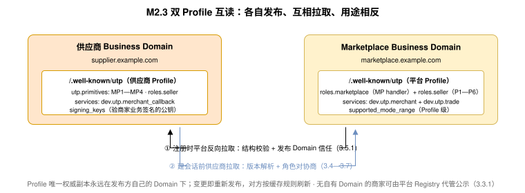
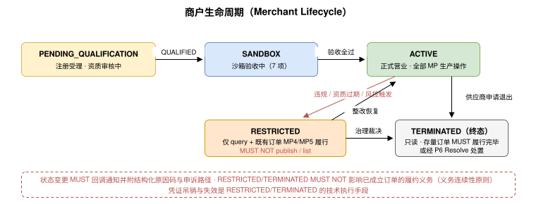

# 商家入驻（Merchant Onboarding &amp; Profile Declaration） {#s-m2}

## 入驻总流程（Onboarding Flow） {#s-m21}

供应商接入 UTP 网络（平台托管拓扑）MUST 依次完成五个步骤。每一步产出的凭证是下一步的前置条件：



全部步骤完成前，Marketplace MUST 拒绝该供应商的 MP1 `publish` 请求（返回 `LISTING.PUBLISH.MERCHANT_NOT_ACTIVE`，见附录 MB）。

## Step 1：身份与密钥（Identity &amp; Keys） {#s-m22}

- 供应商 MUST 持有全局唯一 `agent_id`。SHOULD 采用可验证标识形式（如 `did:web:supplier.example.com`）；`agent_id` 与法人主体的绑定由 Step 4 资质审核确认（`legal_name` 与资质文件一致，[MerchantRegistration 实体](#s-m241)）。
- 供应商 MUST 生成 ES256（P-256）密钥对，公钥以 JWK 形式进入 Profile 的 `signing_keys`；私钥 MUST NOT 交给 Marketplace 或任何第三方。
- 密钥轮换：新增 JWK MUST 保留旧 `kid` 至少 30 天用于验证存量凭证；轮换后 MUST 更新并重新发布 Profile（`signing_keys` 仅用于验证后续认证消息与业务签名，不对 Profile 本身签名， UTP 规范 《发现与协商》）。
- 身份验证与授权（WIT/WPT、OAuth）遵循 UTP 规范[第 6 章](../protocol-core/identity-authorization.md)，本规范不重复定义。

## Step 2：Profile 发布（Profile Declaration） {#s-m23}



供应商 MUST 在自己的 Endpoint 上按 UTP 规范 [Profile 发现](../protocol-core/discovery-negotiation.md#profile-discovery) 发布 Profile（`GET {utp_endpoint}/.well-known/utp`）。UTP-M 对 Profile 的增量要求：

- `utp.primitives` MUST 声明其支持的 MP 原语及版本；`utp.supported_mode_range` MUST 声明适用于全部 Role 与 Primitive 的六维 Mode 范围（六维均必须存在且非空， UTP 规范 《发现与协商》）。Profile 只声明能力事实，不声明调用方向；方向由原语定义文件的 `initiator_role=Seller` 固定（UTP 规范 [操作定义格式](../protocol-core/primitive-framework.md#s-1023-action-definition-format)）。
- 供应商若需接收订单路由与结算账单推送（[订单路由（Order Routing）](primitives/acceptance/index.md#s-m67)、[账单出具与查询（Statements）](settlement.md#s-m94)），MUST 在 `utp.services` 中声明自己的回调 Service（`dev.utp.merchant_callback`）。

**供应商 Profile 示例（仅示 UTP-M 增量部分，结构遵循 UTP 规范 《发现与协商》）：**

```json
{
  "$schema": "https://ut-protocol.com/schemas/discovery/profile.json",
  "display_name": "上海示例供应链有限公司",
  "utp": {
    "version": "2026-07-01",
    "supported_mode_range": {
      "pricing_mode": ["L0", "L1", "L2"],
      "decision_path": ["L0", "L1", "L2"],
      "payment_structure": ["L0", "L1"],
      "fulfillment_structure": ["L0", "L1", "L2"],
      "relationship_mode": ["L0", "L1", "L2"],
      "compliance_level": ["L0", "L1"]
    },
    "services": {
      "dev.utp.merchant_callback": [
        {
          "id": "merchant-callback-rest",
          "version": "2026-07-01",
          "spec": "https://utp.dev/2026-07-01/services/merchant_callback",
          "transport": "rest",
          "endpoint": "https://supplier.example.com/utp-m/callback",
          "schema": "https://ut-protocol.com/schemas/services/merchant_callback/2026-07-01/rest.openapi.json"
        }
      ]
    },
    "primitives": {
      "utp.listing":    [ { "version": "2026-07-31", "spec": "https://utp.dev/2026-07-31/primitives/listing", "schema": "https://ut-protocol.com/schemas/primitives/listing/primitive.json", "authorization": { "scope": "listing", "required": true } } ],
      "utp.inventory":  [ { "version": "2026-07-31", "spec": "https://utp.dev/2026-07-31/primitives/inventory", "schema": "https://ut-protocol.com/schemas/primitives/inventory/primitive.json", "authorization": { "scope": "inventory", "required": true } } ],
      "utp.quote":      [ { "version": "2026-07-31", "spec": "https://utp.dev/2026-07-31/primitives/quote", "schema": "https://ut-protocol.com/schemas/primitives/quote/primitive.json", "authorization": { "scope": "quote", "required": true } } ],
      "utp.acceptance": [ { "version": "2026-07-31", "spec": "https://utp.dev/2026-07-31/primitives/acceptance", "schema": "https://ut-protocol.com/schemas/primitives/acceptance/primitive.json", "authorization": { "scope": "acceptance", "required": true } } ],
      "utp.delivery":   [ { "version": "2026-07-31", "spec": "https://utp.dev/2026-07-31/primitives/delivery", "schema": "https://ut-protocol.com/schemas/primitives/delivery/primitive.json", "authorization": { "scope": "delivery", "required": true } } ],
      "utp.aftersale":  [ { "version": "2026-07-31", "spec": "https://utp.dev/2026-07-31/primitives/aftersale", "schema": "https://ut-protocol.com/schemas/primitives/aftersale/primitive.json", "authorization": { "scope": "aftersale", "required": true } } ]
    },
    "roles": {
      "seller": {
        "primitives": ["utp.listing", "utp.inventory", "utp.acceptance", "utp.delivery", "utp.aftersale", "utp.quote"]
      }
    }
  },
  "signing_keys": [
    {
      "kid": "key-2026-07",
      "alg": "ES256",
      "public_key_jwk": { "kty": "EC", "crv": "P-256", "x": "f83OJ3GkZvBmN0kR2lXqW8YpA7dC5eF1gH9iJ3kL5mN", "y": "oP7qR9sT1uV3wX5yZ0aB2cD4eF6gH8iJ0kL2mN4oP6q" }
    }
  ]
}
```

说明：示例仅展示 UTP-M 增量部分；`utp.quote`（MP3 询盘响应）为 MAY 级能力，仅服务一口价直购的商家可不声明（[关键设计原则](primitives/quote/index.md#s-m512)）；兼营买卖双方角色或同时提供 P1—P6 能力时，按 UTP 规范 《发现与协商》 在同一 Profile 的 `utp.primitives` / `utp.roles` 下一并声明；`agent_authentication`、`user_authorization`、`mandates` 等安全能力声明同 UTP 规范 《发现与协商》，不因角色而变。

对应地，Marketplace 的 Profile MUST 在 `utp.supported_mode_range` 中声明其适用于全部 Role 与 Primitive 的 Mode 范围（处理方向由原语定义文件的 `handler_role=Marketplace` 固定），并在 `utp.services` 中声明承载 MP 原语的 `dev.utp.merchant` Service。供应商在建立会话前 MUST 按 UTP 规范 [Profile 发现](../protocol-core/discovery-negotiation.md#profile-discovery)—《发现与协商》 完成协议版本解析、Profile 验证与角色对协商，Mode 范围交集的计算规则见 《发现与协商》。

**Marketplace（平台）Profile 示例（仅示与 UTP-M 相关部分；平台同时声明买方侧 `dev.utp.trade` Service 与 P1—P6，结构同 UTP 规范 《发现与协商》）：**

```json
{
  "$schema": "https://ut-protocol.com/schemas/discovery/profile.json",
  "display_name": "1688 Marketplace",
  "utp": {
    "version": "2026-07-01",
    "supported_mode_range": {
      "pricing_mode": ["L0", "L1", "L2", "L3"],
      "decision_path": ["L0", "L1", "L2", "L3"],
      "payment_structure": ["L0", "L1", "L2"],
      "fulfillment_structure": ["L0", "L1", "L2", "L3"],
      "relationship_mode": ["L0", "L1", "L2"],
      "compliance_level": ["L0", "L1", "L2"]
    },
    "services": {
      "dev.utp.merchant": [
        {
          "id": "merchant-rest-primary",
          "version": "2026-07-01",
          "spec": "https://utp.dev/2026-07-01/services/merchant",
          "transport": "rest",
          "endpoint": "https://marketplace.example.com/utp/m",
          "schema": "https://ut-protocol.com/schemas/services/merchant/2026-07-01/rest.openapi.json"
        }
      ],
      "dev.utp.trade": [
        {
          "id": "trade-rest-primary",
          "version": "2026-07-01",
          "spec": "https://utp.dev/2026-07-01/services/trade",
          "transport": "rest",
          "endpoint": "https://marketplace.example.com/utp",
          "schema": "https://ut-protocol.com/schemas/services/trade/2026-07-01/rest.openapi.json"
        }
      ]
    },
    "primitives": {
      "utp.listing":    [ { "version": "2026-07-31", "spec": "https://utp.dev/2026-07-31/primitives/listing", "schema": "https://ut-protocol.com/schemas/primitives/listing/primitive.json", "authorization": { "scope": "listing", "required": true } } ],
      "utp.inventory":  [ { "version": "2026-07-31", "spec": "https://utp.dev/2026-07-31/primitives/inventory", "schema": "https://ut-protocol.com/schemas/primitives/inventory/primitive.json", "authorization": { "scope": "inventory", "required": true } } ],
      "utp.quote":      [ { "version": "2026-07-31", "spec": "https://utp.dev/2026-07-31/primitives/quote", "schema": "https://ut-protocol.com/schemas/primitives/quote/primitive.json", "authorization": { "scope": "quote", "required": true } } ],
      "utp.acceptance": [ { "version": "2026-07-31", "spec": "https://utp.dev/2026-07-31/primitives/acceptance", "schema": "https://ut-protocol.com/schemas/primitives/acceptance/primitive.json", "authorization": { "scope": "acceptance", "required": true } } ],
      "utp.delivery":   [ { "version": "2026-07-31", "spec": "https://utp.dev/2026-07-31/primitives/delivery", "schema": "https://ut-protocol.com/schemas/primitives/delivery/primitive.json", "authorization": { "scope": "delivery", "required": true } } ],
      "utp.aftersale":  [ { "version": "2026-07-31", "spec": "https://utp.dev/2026-07-31/primitives/aftersale", "schema": "https://ut-protocol.com/schemas/primitives/aftersale/primitive.json", "authorization": { "scope": "aftersale", "required": true } } ]
    },
    "roles": {
      "marketplace": {
        "primitives": ["utp.listing", "utp.inventory", "utp.acceptance", "utp.delivery", "utp.aftersale", "utp.quote"]
      },
      "seller": {
        "primitives": ["utp.source", "utp.negotiate", "utp.purchase", "utp.pay", "utp.fulfill", "utp.resolve"]
      }
    }
  },
  "signing_keys": [ { "kid": "mkt-key-2026-07", "alg": "ES256", "public_key_jwk": { "kty": "EC", "crv": "P-256", "x": "...", "y": "..." } } ]
}
```

说明：`roles.marketplace` 列出其作为 MP 原语 handler 的承接集；`roles.seller` 是平台在买方侧的处理身份（平台托管拓扑，平台托管拓扑（Marketplace-Hosted））。同一 Profile、同一 `supported_mode_range`、同一安全能力声明覆盖全部角色（UTP 规范 《发现与协商》）；`marketplace` 为 R3 领域角色试点命名，进入 R2 后不变（新增角色：Marketplace）。

### UTP-M Service 规格（Service Registry） {#s-m231}

UTP-M 定义两个 Service，规格如下（命名遵循 UTP 规范反域名风格，同 `dev.utp.trade`）：

| Service | 提供方 | 承载内容 | 绑定要求 | 定义位置 |
| --- | --- | --- | --- | --- |
| `dev.utp.merchant` | Marketplace | MP1—MP6 全部操作 + M9 结算扩展只读操作（供应商 → 平台方向） | REST MUST；MCP/A2A MAY（通用规则继承（Commons Inheritance）） | 各原语章传输绑定小节；机读定义见附录 MD 原语定义文件 |
| `dev.utp.merchant_callback` | Seller（供应商自己部署） | [回调事件类型注册表](#s-m261) 全部回调事件（平台 → 供应商方向），信封/签名/重试同 UTP 规范 《Push Notification》 | REST MUST（单一 webhook 端点即可，事件类型在信封内区分） | [回调事件类型注册表](#s-m261) 事件表；事件 Schema 见 merchant/events.json |

边界声明：两个 Service 与 UTP-B 规范 `dev.utp.trade` 完全分离，平台 MAY 独立部署与限流；供应商兼营买方时，买卖两侧 Service 在同一 Profile 中并列声明，互不影响。

## Step 3：Marketplace 注册（Registration） {#s-m24}

供应商向 Marketplace 提交注册请求，建立商户档案并获取 `merchant_id`。注册是一次性管理动作，不是原语；本规范定义其标准接口以保证跨平台可互操作。

### MerchantRegistration 实体 {#s-m241}

| 字段名 | 类型 | 必填 | 描述 |
| --- | --- | --- | --- |
| `agent_id` | string | 是 | 供应商全局标识，MUST 与注册请求的身份主体一致。 |
| `utp_endpoint` | string | 是 | 供应商 Endpoint URI，Marketplace 由此获取并验证 Profile。 |
| `legal_name` | string | 是 | 法人名称，MUST 与资质文件一致。 |
| `contact` | object | 是 | 运营联系人（`name`、`email`、`phone`）。 |
| `categories` | array | 是 | 申请经营的类目标识列表。 |
| `settlement_account` | object | 是 | 结算收款账户引用（脱敏形式，详见 [结算模型（Settlement Model）](settlement.md#s-m92)）。 |
| `erp_integration_mode` | enum | 否 | `none` / `bridge` / `native` / `agent_embedded`，声明 ERP 集成形态（与 部署形态（Deployment Patterns） 四种部署形态一一对应）。 |
| `delegation_policy` | object | 否 | 按原语声明 Handler 侧执行模式：键为原语 ID（`utp.negotiate` / `utp.resolve`），值为 `{mode: direct\|passthrough, on_timeout: direct_fallback\|structured_timeout}`；缺省全部为 `direct`。语义见 Handler 侧执行模式：平台代答与透传（Delegation Mode）。 |

### 注册接口与结果 {#s-m242}

```
POST {marketplace_endpoint}/utp/m/v1/merchants/registrations
Content-Type: application/json
（RFC 9421 签名，覆盖请求体）
```

响应 MUST 包含 `merchant_id`、`status`（`PENDING_QUALIFICATION`）与 `valid_next_actions`。`merchant_id` 是 Marketplace 域内标识；协议消息中的身份主体始终是 `agent_id`，`merchant_id` 仅用于平台侧资源寻址。

Marketplace 在注册受理时 MUST：验证 `utp_endpoint` 可达且 Profile 结构与发布 Domain 满足 UTP 规范 [声明模型与可信来源](../protocol-core/discovery-negotiation.md#declaration-model) 的验证规则；对同一 `agent_id` 的重复注册返回既有 `merchant_id`（幂等）。

### 注册边界与访问凭证 {#s-m243}

- **注册不可委托：**平台账号注册与商户协议签署 MUST 由商家主体（Principal）自行完成，MUST NOT 委托给 Agent（对应 人机控制点（HAI Control Points） 控制点）；注册完成后的资料提交、资质维护等操作 MAY 在授权下由 Agent 代办（[Step 4：资质与合规（Qualification & Compliance）](#s-m25)）。
- **身份复用：**同一 `agent_id` MAY 同时承担买方与卖方身份——在 Profile 的 `utp.roles` 中同时声明 `buyer` 与 `seller`（复用 UTP 规范 [声明模型与可信来源](../protocol-core/discovery-negotiation.md#declaration-model)“同一 Business Domain MAY 承担多个 Role，共用同一份版本化 Profile”）；入驻仅叠加 Seller 侧能力，不要求独立账号。
- **访问凭证：**商户状态进入 `ACTIVE` 后，按 UTP 规范[第 6 章](../protocol-core/identity-authorization.md)的身份与授权框架颁发访问凭证；后续全部 MP 原语调用 MUST 携带有效凭证。凭证的吊销与失效是 `RESTRICTED`/`TERMINATED`（[商户生命周期状态（Merchant Lifecycle）](#s-m27)）的技术执行手段。

## Step 4：资质与合规（Qualification &amp; Compliance） {#s-m25}

- **资质内容不进协议：**具体需要哪些资质文件由 Marketplace 按类目与商业场景公示（平台策略域，各平台对商家要求不同）；协议层只标准化资质的**提交通道、审核状态与引用结构**（复用 UTP-B 规范 SupplierCredentials 实体与 `credential_id` 引用，[《寻源原语》](../primitives/source/index.md)）。供应商 MUST 按平台公示清单提交。
- Marketplace MUST 审核资质并给出结论：`QUALIFIED` / `REJECTED`（附结构化原因码）。审核期间状态为 `PENDING_QUALIFICATION`。
- **资质维护是持续义务：**资质的更新、补充与到期换证与首次提交使用同一提交通道与状态机；在商家授权下 MAY 由 Merchant Agent 代办（Merchant Agent 职责边界（Responsibility Boundary）），但账号注册与商户协议签署除外（[注册边界与访问凭证](#s-m243)）。
- 当交易 `compliance_level ≥ L1` 时，Marketplace 在 P1 Source 响应中返回的供应商资质摘要 MUST 来自本步骤审核通过的文件；过期或吊销的资质 MUST 触发对应商品自动下架（[Guidelines（角色职责指引）](primitives/listing/index.md#s-m35) 的 `SUSPENDED_BY_PLATFORM` 路径）。
- 资质有效期到期前 30 天，Marketplace SHOULD 通过回调通知供应商换证。

## Step 5：回调登记与连通性验收（Callback &amp; Readiness） {#s-m26}

[订单路由](primitives/acceptance/index.md#s-m67)、结算账单（[账单出具与查询（Statements）](settlement.md#s-m94)）、审核结论（[Scopes（权限范围）](primitives/listing/index.md#s-m34)）等 Marketplace → Seller 的异步通知，统一通过供应商声明的 `dev.utp.merchant_callback` Service 推送，遵循 UTP 规范 [《Push Notification》 Push Notification](../protocol-core/transport-communication.md#s-431) 的信封、签名与重试规则。

### 回调事件类型注册表 {#s-m261}

| 事件类型 | 触发方 | 触发时机 | 对应章节 |
| --- | --- | --- | --- |
| `utp.listing.review_result` | Marketplace | 商品审核通过/驳回 | [Scopes（权限范围）](primitives/listing/index.md#s-m34) |
| `utp.inventory.hold_created` / `hold_released` | Marketplace | P3 触发库存占用/释放 | [与 P3 Purchase 的库存一致性契约（Interlock with P3）](primitives/inventory/index.md#s-m47) |
| `utp.acceptance.order_routed` | Marketplace | 买方订购草案待受理 | [订单路由（Order Routing）](primitives/acceptance/index.md#s-m67) |
| `utp.acceptance.expired` | Marketplace | 受理超时自动处置 | [Error Handling（错误处理）](primitives/acceptance/index.md#s-m63) |
| `utp.quote.inquiry_routed` | Marketplace | 买方询盘待应答（仅声明 `utp.quote` 的商户推送） | [询盘路由（Inquiry Routing）](primitives/quote/index.md#s-m57) |
| `utp.quote.expired` | Marketplace | 询盘应答超时自动谢绝 | [Error Handling（错误处理）](primitives/quote/index.md#s-m53) |
| `utp.quote.withdrawn` | Marketplace | 买方撤回询盘，在途报价作废 | [后置条件与语义契约](primitives/quote/index.md#s-m515) |
| `utp.resolve.dispute_routed` | Marketplace | 争议答辩透传路由（同上） | Handler 侧执行模式：平台代答与透传（Delegation Mode） |
| `utp.delivery.receipt` | Marketplace | 物流妥投/买方收货回执 | [与 P5 Fulfill 的事实传导契约（Interlock with P5）](primitives/delivery/index.md#s-m77) |
| `utp.settlement.statement_issued` | Marketplace | 结算账单出具 | [账单出具与查询（Statements）](settlement.md#s-m94) |
| `utp.settlement.paid` | Marketplace | 账单打款成功（条目 BILLED → PAID_OUT） | [打款动作（Payout）](settlement.md#s-m99) |

接收方 MUST 返回 `2xx` 确认；推送失败按 UTP 规范指数退避重试（最多 5 次）后转入轮询降级——供应商可通过各原语的 `query`/`list` 操作主动拉取，保证推送丢失不阻塞业务（与 UTP 规范 《Polling 降级》 一致）。

### 沙箱验收清单（Readiness Checklist） {#s-m262}

Marketplace MUST 提供沙箱环境。供应商转为 `ACTIVE` 前 MUST 通过以下验收：

| # | 验收项 | 通过标准 |
| --- | --- | --- |
| 1 | 签名互验 | 双向 RFC 9421 验签通过；Seller JWS 业务签名可被 Marketplace 用 Profile 公钥验证 |
| 2 | 商品发布 | `listing.publish → list` 全流程成功，商品在沙箱 Source 可搜索 |
| 3 | 库存同步 | `inventory.set/adjust` 生效且 `query` 一致 |
| 4 | 接单闭环 | 模拟订单路由 → `acceptance.accept` → 沙箱订购成立 |
| 5 | 发货闭环 | `delivery.ship` → 沙箱买方收到 `fulfill.notify(SHIPPED)` |
| 6 | 回调可达 | 全部 [回调事件类型注册表](#s-m261) 事件推送返回 `2xx`，验签通过 |
| 7 | 幂等 | 重复 `idempotency_key` 返回缓存结果，无重复副作用 |
| 8 | 询盘应答闭环（条件项） | 仅声明 `utp.quote` 的商户 MUST 通过：模拟询盘路由 → `quote.quote`（附覆盖 `terms_hash` 的签名）→ 沙箱买方收到报价；未声明该原语的商户本项不适用（[关键设计原则](primitives/quote/index.md#s-m512)） |

## 商户生命周期状态（Merchant Lifecycle） {#s-m27}



| 状态 | 含义 | 进入条件 | 允许的操作 |
| --- | --- | --- | --- |
| `PENDING_QUALIFICATION` | 注册已受理，资质审核中 | 注册请求通过基本校验 | 补充资质、查询状态 |
| `SANDBOX` | 资质通过，沙箱验收中 | 资质审核 `QUALIFIED` | 沙箱内全部 MP 操作 |
| `ACTIVE` | 正式营业 | 沙箱验收全部通过 | 全部 MP 原语生产操作 |
| `RESTRICTED` | 受限（违规/资质过期/风控） | Marketplace 依据治理规则触发 | 只允许 `query` 类与既有订单的 MP4/MP5 履行操作；MUST NOT `publish`/`list` |
| `TERMINATED` | 退出 | 供应商申请或治理裁决 | 只读；存量订单 MUST 履行完毕或经 P6 Resolve 处置 |

状态变更 MUST 通过回调通知供应商，并附结构化原因码与申诉路径。`RESTRICTED`/`TERMINATED` MUST NOT 影响已成立订单的履约义务——这是与 UTP-B 规范"Purchase 后不可单方面撤回"一致的义务连续性原则。
