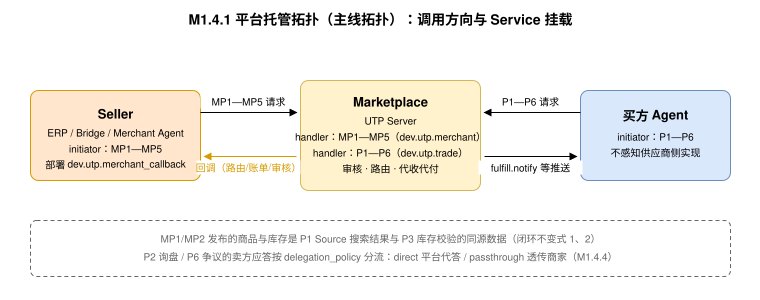
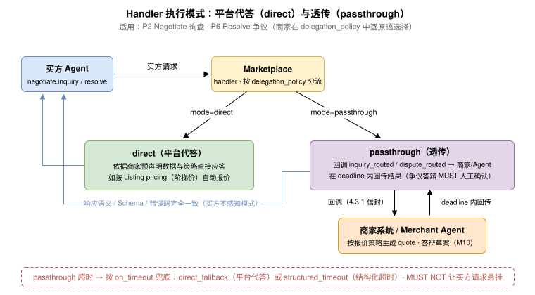
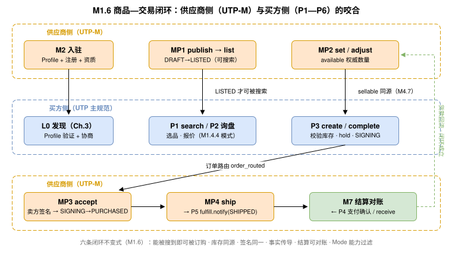

# M1 · 供应商侧架构总览（Merchant-Side Architecture Overview） {#s-m1}

## 问题与边界（Problem &amp; Scope） {#s-m11}

UTP UTP-B 规范是一个**交易执行协议**：P1—P6 原语覆盖从寻源到争议解决的交易过程，但假设商品已经存在于可搜索的目录中、订单会被供应商自动接受、发货由实现层自行完成。对供应商而言，接入 UTP 生态还需要回答四个 UTP-B 规范未定义的问题：

| # | 问题 | 本规范的回答 |
| --- | --- | --- |
| 1 | 商品如何进入 UTP 网络并可被 P1 Source 搜索到？ | MP1 `utp.listing`（[M3](primitives/listing/index.md)）+ MP2 `utp.inventory`（[M4](primitives/inventory/index.md)） |
| 2 | 订单成立前，供应商如何显式接单、拒单或申报交期变更？ | MP4 `utp.acceptance`（[M6](primitives/acceptance/index.md)） |
| 3 | 供应商如何以协议动作完成备货、发货、拆单与异常申报？ | MP5 `utp.delivery`（[M7](primitives/delivery/index.md)） |
| 4 | 交付之后出现质量争议、错发漏发时，如何以协议动作给出可判定的处置结论？ | MP6 `utp.aftersale`（[M8](primitives/aftersale/index.md)） |
| 5 | 货款如何对账回款、供应商系统（ERP/WMS）与 Agent 如何接入？ | 结算扩展（[M9](settlement.md)）、Bridge 规范（[M10](erp-bridge.md)）、Merchant Agent（[M11](merchant-agent.md)） |

**不在本规范范围内**：营销与广告投放、店铺装修、类目治理细则、平台内部审核算法、税务申报。这些属于平台运营域，MAY 由平台以私有 API 提供，不构成协议互操作面。

## 设计原则（Design Principles） {#s-m12}

本规范在 UTP 规范五条核心设计约束（原语正交性、状态机确定性、模式参数化、传输无关性、向后兼容）之上，增加四条供应商侧原则：

1. **方向一致性（Directional Consistency）**：所有 MP 原语的 `initiator_role` MUST 为 `Seller`，`handler_role` MUST 为 `Marketplace`（[角色模型（Role Model）](#s-m13)）。供应商侧能力不通过“给既有原语增加反向 Action”表达，避免破坏 UTP 规范 [操作定义格式](../protocol-core/primitive-framework.md#s-1023-action-definition-format) 中“每个 Action 恰好声明一个 `initiator_role` 与一个 `handler_role`，不得声明多组角色对”的不变式。
2. **资源状态与交易状态分离（Resource vs. Transaction State）**：商品、库存、发货单是**资源级状态**，其状态机由各 MP 原语在原语内部定义；全局状态机（UTP-B 规范 [《全局状态机》](../protocol-core/global-state-machine.md)）只管理 `transaction_id` 生命周期。MP 原语 MUST NOT 定义或迁移任何全局交易状态；MP 原语对交易的影响只能通过 UTP-B 规范已定义的事实（如库存校验结果、卖方签名、履约 Evidence）传导。
3. **单一事实源（Single Source of Truth）**：供应商通过 MP1/MP2 发布的商品与库存结构，与买方通过 P1 Source 查询到的 `item`/`skus`/`pricing` 结构 MUST 字段对齐（对齐关系见 [Entities（实体定义）](primitives/listing/index.md#s-m39) 与附录 MD）。"发布的即是被搜到的"，禁止两套商品模型。
4. **协议并列与分层解耦（Parallel Protocol &amp; Layered Decoupling）**：本规范与 UTP-B 是**并列的独立协议**而非其子集（2026-08-03 分层解耦裁决）。二者共享 UTP 通用底层（商业场景、商业拓扑、发现协商、通信认证、P0 原语框架、六维 Mode 维度模型、通用实体与错误码格式）；但 UTP-B 的两项高级能力——**采购模式编排**（[采购模式](../protocol-core/procurement-models.md)中的模式档位组合与模式驱动的流程编排）、**全局状态机**（[全局状态机](../protocol-core/global-state-machine.md)）——为 UTP-B 专属，本规范 MUST NOT 依赖。本规范对这两项能力的引用仅用于**声明边界**（说明 MP 原语不进入其管辖，见 全局状态机边界声明（State Machine Boundary）），而非复用其机制。**路径编排**（[路径编排](../protocol-core/path-orchestration.md)）属共享底层，但其 `primitive_dag_skeleton` 只编排买方侧 P1—P6；MP 原语 MUST NOT 出现在 DAG 骨架中（见 全局状态机边界声明（State Machine Boundary））。**边界辨析**：[采购模式](../protocol-core/procurement-models.md)定义的**六维 Mode 维度模型**属共享底层（在 Profile 的 `supported_mode_range` 中声明、发现协商时逐维求交集，见 UTP 规范 《发现与协商》），因此 MP 原语复用该模型（见 Mode 对供应商侧的影响（Mode Awareness）、[B2B 与 B2C 场景的改价策略](primitives/acceptance/index.md#s-m6122)）不构成对 UTP-B 专属能力的依赖。

## 角色模型（Role Model） {#s-m13}

### 新增角色：Marketplace {#s-m131}

UTP 规范 R2 [标准角色集](../protocol-core/business-topology.md#s-922-standard-roles)没有承载商品目录与订单路由的平台角色。本规范按 R1 [角色元规则](../protocol-core/business-topology.md#s-924-r1)论证并新增扩展角色 `Marketplace`：

| R1 条件 | 论证 |
| --- | --- |
| 职责可区分性 | Marketplace 托管商品目录、执行上架审核、路由订单、代收代付结算——与 Seller（供货）和 Buyer（采购）职责本质不同。 |
| 原语绑定性 | Marketplace 是 MP1—MP6 全部六个原语的 `handler_role`，并在结算扩展中承担账单出具义务。 |
| 权限差异性 | Marketplace 可见全量商品与订单路由信息，但 MUST NOT 可见供应商成本结构；对买方侧仅暴露已上架（LISTED）商品。 |

**RoleDefinition（按 UTP 规范 [RoleDefinition 与 RolePermissions 实体](../protocol-core/business-topology.md#s-921-roledefinition) 格式）：**

```json
{
  "role_id": "Marketplace",
  "display_name": "平台方",
  "description": "托管商品目录与订单路由的 UTP Server 运营方：受理商品发布与上下架、维护库存视图、向供应商路由订单并收集受理结果、汇聚发货事实、出具结算账单",
  "governance_layer": "R2",
  "bound_primitives": ["utp.listing", "utp.inventory", "utp.acceptance", "utp.delivery", "utp.aftersale", "utp.pay"],
  "default_permissions": {
    "visible_primitives": ["utp.listing", "utp.inventory", "utp.acceptance", "utp.delivery", "utp.aftersale", "utp.pay"],
    "visible_fields": ["listing.*", "inventory.*", "order.*", "delivery.*", "aftersale.*", "settlement.*"],
    "executable_actions": ["listing.review", "acceptance.route", "settlement.issue"],
    "data_restrictions": [
      { "field": "seller.cost_structure", "access": "denied" },
      { "field": "seller.profit_margin", "access": "denied" }
    ]
  },
  "validity_conditions": [
    "职责可区分性：Marketplace 托管目录与路由订单，与 Buyer/Seller 职责本质不同",
    "原语绑定性：Marketplace 承担 MP1—MP6 原语的处理方义务",
    "权限差异性：可见全量目录与路由信息，不可见供应商成本结构"
  ]
}
```

> 整合说明：`Marketplace` 进入 UTP 规范 R2 标准角色集 MUST 走 RFC 治理流程（UTP 规范 《R2：标准角色集与角色加入规则》 变更规则）。在进入 R2 前，实现方 MAY 以 R3 领域角色 `marketplace.Marketplace` 形式先行注册试点。

### 既有角色的供应商侧职责 {#s-m132}

| 角色 | 来源 | 在 UTP-M 中的职责 |
| --- | --- | --- |
| `Seller` | UTP 规范 R2 核心角色 | MP1—MP6 全部原语的 `initiator_role`；商品信息、库存数量、接单结论、交付事实与售后处置结论的责任主体。 |
| `Shipper` | UTP 规范 R2 扩展角色 | 当 `fulfillment_structure ≥ L1` 时，MP5 `delivery.ship` 产出的运单移交给 Shipper 执行运输；Shipper 的轨迹回执经 Marketplace 汇聚后转换为买方侧 `fulfill.notify`。 |
| `Payee` | UTP 规范 R2 核心角色 | 结算扩展中的收款主体，通常与 Seller 为同一实体。 |

**Merchant Agent 不是拓扑角色**。它是 Seller 的一种运行时实现形态（详见 [M11](merchant-agent.md)），与"人工商家后台操作"在协议层不可区分——二者都以 Seller 身份签名并调用 MP 原语。

## 两种部署拓扑（Deployment Topologies） {#s-m14}

### 平台托管拓扑（Marketplace-Hosted） {#s-m141}

本规范的主线拓扑。供应商将商品发布到 Marketplace 运营的 UTP Server；买方的 P1—P6 请求由 Marketplace 的 Endpoint 处理（Marketplace 同时以 `Seller` 代理身份或路由方式响应），供应商通过 MP 原语与 Marketplace 交互：



- Marketplace MUST 将 LISTED 状态的商品纳入其 P1 Source 的可搜索范围（`handler_role=Seller` 的 Source 由 Marketplace 的 Business Domain 承载，见 UTP 规范 [声明模型与可信来源](../protocol-core/discovery-negotiation.md#declaration-model)“同一 Business Domain MAY 承担多个 Role”）。
- 买方 `purchase.create`/`complete` 触发的库存校验与锁定 MUST 落到 MP2 维护的同一库存视图（[与 P3 Purchase 的库存一致性契约（Interlock with P3）](primitives/inventory/index.md#s-m47)）。
- 订购成立所需的"卖方承诺处理"（UTP-B 规范 《状态迁移的原子性》），经 MP4 `acceptance.accept` 以签名形式完成（[与 P3 Purchase 签名流程的衔接（Interlock with P3）](primitives/acceptance/index.md#s-m66)）。

**买家不感知原则（Buyer Non-Perception）**：平台托管拓扑下，买方 Agent 只与 Marketplace 交互，**MUST NOT 感知供应商背后的供应链角色**（供应商自有的承运商、支付服务商、代工方等）。这些角色对买方是透明的——Marketplace 以统一门面呈现商品、承接订单、代收代付。这正是本规范与 UTP-B 定位分野的根源之一：UTP-B 拓扑要求各参与角色**显式建模并被买方感知**（分布式多角色协商），而本规范把供应商侧的角色复杂度**收敛在 Marketplace 之后**（中心化托管）。因此二者是两套独立的商业拓扑与 DAG，而非同一拓扑的繁简两版。

### 自托管拓扑（Self-Hosted） {#s-m142}

供应商自行运营 UTP Endpoint（P=2 直连买方）。此拓扑下 **MP 原语不出现在跨方拓扑中**：商品目录、库存、接单、发货都是供应商 Endpoint 的内部实现，通过 UTP-B 规范既有机制对外表达——商品经其 P1 Source 直接可搜索、接单以 `purchase.complete` 卖方签名表达、发货以 `fulfill.notify` 推送表达。

自托管实现方 SHOULD 参照 MP 原语的实体与状态机（M3—M7）组织内部模型，以保证未来切换到平台托管拓扑时数据结构无损迁移；但协议层 MUST NOT 要求自托管方暴露 MP 端点。

### 拓扑选择规则 {#s-m143}

| 条件 | 拓扑 | MP 原语 |
| --- | --- | --- |
| 商品需进入平台聚合目录、由平台代收代付 | 平台托管 | MP1、MP2、MP4、MP5 MUST 全部支持；MP3 报价与 MP6 售后 MAY（MP3 见 [关键设计原则](primitives/quote/index.md#s-m512)、MP6 见 [Overview（定位与意图）](primitives/aftersale/index.md#s-m81)） |
| 供应商仅自营渠道、直连买方 | 自托管 | 不适用（内部实现） |
| 混合（自营 + 平台分销） | 两者并存 | 对平台侧 MUST 支持 MP1、MP2、MP4、MP5（MP3、MP6 MAY）；两侧库存一致性由供应商 ERP 保证（库存一致性与防超卖（Inventory Consistency）） |

### Handler 侧执行模式：平台代答与透传（Delegation Mode） {#s-m144}



平台托管拓扑下，`handler_role = Seller` 的既有原语由 Marketplace 的 Endpoint 承载。其中 P1 Source 的应答 MUST 为平台直接处理（其数据即 MP1/MP2 发布结构的投影，[与买方侧 Source 投影的字段对齐](primitives/listing/index.md#s-m396)）；对 **P2 询盘（标准应答通道为 MP3 询盘响应，M5）与 P6 Resolve 的卖方应答义务**，商家 MUST 在入驻时（[MerchantRegistration 实体](onboarding.md#s-m241) `delegation_policy`）逐原语选择一种执行模式：

| 模式 | 语义 | 适用 |
| --- | --- | --- |
| `direct`（平台代答） | Marketplace 依据商家预先声明的数据与策略直接应答：如 Negotiate 基于 Listing `pricing`（含 PricingTiers）自动报价。 | 标准化程度高、时效敏感的场景（B2C、阶梯价询盘） |
| `passthrough`（透传） | Marketplace 将请求经回调事件路由给商家（[回调事件类型注册表](onboarding.md#s-m261) 的 `inquiry_routed`/`dispute_routed`），由商家系统或 Merchant Agent 处理后回传结果，再由 Marketplace 应答买方。 | 需要商家实时决策的场景（议价、争议答辩、定制品） |

**约束：**

- 执行模式对买方 MUST 透明：两种模式下的响应语义、Schema 与错误码 MUST 完全一致，买方 MUST NOT 感知或依赖商家的执行模式。
- `passthrough` MUST 受时限约束（按 Mode 超时配置， UTP 规范 《会话超时上下文》）；商家未在时限内回传时，Marketplace MUST 按 `delegation_policy` 预配置的兜底策略降级（`direct` 代答或返回结构化超时），MUST NOT 让买方请求悬挂。
- MP 原语不适用本节：其方向均为 Seller → Marketplace，天然由商家侧发起（MP3 询盘响应虽应答 P2 询盘，但其提交方向仍是商家侧发起，故同样不适用委派模式）。订单受理路由（[订单路由（Order Routing）](primitives/acceptance/index.md#s-m67)）在结构上等价于 P3 卖方签署义务的 `passthrough` 特化，其超时兜底由 `timeout_policy` 承担。

## MP 原语总表（Primitive Summary） {#s-m15}

| 原语 | 原语 ID | 版本 | initiator_role | handler_role | actions |
| --- | --- | --- | --- | --- | --- |
| MP1 商品原语 | `utp.listing` | `2026-07-31` | `Seller` | `Marketplace` | `publish, update, list, delist, query, archive, batch` |
| MP2 库存原语 | `utp.inventory` | `2026-07-31` | `Seller` | `Marketplace` | `set, adjust, query, hold.query, batch` |
| MP3 报价原语（MAY） | `utp.quote` | `2026-07-31` | `Seller` | `Marketplace` | `quote, revise, bid, decline, query, list` |
| MP4 接单原语 | `utp.acceptance` | `2026-07-31` | `Seller` | `Marketplace` | `accept, reject, hold, amend_leadtime, amend_price, query, list` |
| MP5 交付原语 | `utp.delivery` | `2026-07-31` | `Seller` | `Marketplace` | `prepare, ship, split, update, query` |
| MP6 售后原语（新增，MAY） | `utp.aftersale` | `2026-07-31` | `Seller` | `Marketplace` | `approve, reject, propose, confirm_return, query, list` |

六个原语的投递端点由 Marketplace Profile `utp.services` 中承载供应商侧 API 面的传输配置项提供（传输配置与回调端点，见 [Step 2：Profile 发布（Profile Declaration）](onboarding.md#s-m23)），与买方侧传输配置分离（不同 Endpoint），便于平台按侧别独立部署与限流。B/M 原语对偶不复用命名（例如买方侧 P2 询盘与卖方侧 MP3 报价各自独立声明），同一 Agent Server 可在一份 Profile 中按角色分别声明两侧原语。

**正交性检查：**

- MP1 管商品**信息与生命周期**，不管数量——库存数量的任何变更 MUST 走 MP2。
- MP2 管**数量**，不管商品信息，也不直接锁库存——交易性锁定（hold/lock）由 P3 Purchase 触发、Marketplace 执行，MP2 仅提供数量事实与占用查询。
- MP4 管**受理结论**（接受/拒绝/挂起/交期变更），不管发货——受理产出承诺处理证据（卖方签名），衔接 P3。
- MP5 管**履约执行事实**（备货/发货/拆单/异常），不管验收——验收（receive/reject/inspect）始终是买方侧 P5 的职责。
- MP3 管**报价与应答**（报价/修订/投标/谢绝），不管条款绑定——绑定核查与 `terms_hash` 生成始终是 P2 的权威职责（[与 P2 询盘原语的衔接（Interlock with P2）](primitives/quote/index.md#s-m56)）。

## 商品—交易闭环（End-to-End Loop） {#s-m16}



**闭环不变式（协议引擎 MUST 保证）：**

1. `source.lookup` 返回的商品结构 == MP1 发布的 Listing 结构在买方可见字段上的投影（[Entities（实体定义）](primitives/listing/index.md#s-m39)）。
2. `purchase` 校验/锁定的库存 == MP2 维护的 `available` 同一数据源；锁定成功 MUST 反映为 InventoryHold（[与 P3 Purchase 的库存一致性契约（Interlock with P3）](primitives/inventory/index.md#s-m47)）。
3. P2 询盘的卖方侧报价事实 == MP3 `quote` 提交的签名报价（承载同一份 UTP-B 规范 `Quote` 实体，签名覆盖同一 `terms_hash`）；条款绑定后 MP4 `accept` MUST NOT 偏离已绑定条款（[与 P2 询盘原语的衔接（Interlock with P2）](primitives/quote/index.md#s-m56)，仅适用于声明 `utp.quote` 的商户）。
4. `purchase.complete` 所需的卖方承诺处理 == MP4 `accept`（签名覆盖同一 `terms_hash`，[与 P3 Purchase 签名流程的衔接（Interlock with P3）](primitives/acceptance/index.md#s-m66)）。
5. MP5 `ship` 产出的 Shipment == 买方侧 `fulfill.notify`/`track` 呈现的同一 `shipment_id` 与运单（[与 P5 Fulfill 的事实传导契约（Interlock with P5）](primitives/delivery/index.md#s-m77)）。
6. MP1 `delist` 生效后，`source.lookup` MUST 返回 `SOURCE.LOOKUP.ITEM_NOT_FOUND`，`purchase.create` MUST 返回 `PURCHASE.CREATE.INVALID_ITEMS`（UTP 规范既有错误码的触发源在此闭合）。
7. Mode 能力过滤：商品的有效 Mode 范围（商户 Profile 范围 ∩ 商品级 `mode_constraints`）不包含会话 `ModeConfiguration` 时，该商品 MUST NOT 出现在 `source.search` 结果中——“能被搜到即可被履约”（[Mode-Driven Behavior（模式驱动行为）](primitives/listing/index.md#s-m36)）。

## 与 UTP-B 规范 P1—P6 的衔接矩阵（Interlock Matrix） {#s-m17}

| UTP-B 规范原语 | 衔接点 | UTP-M 提供的事实 | 约束级别 |
| --- | --- | --- | --- |
| P1 Source | `search/lookup` 的数据源 | LISTED 商品 + 实时 `available` 快照 | MUST（平台托管） |
| P2 询盘 | 询盘的卖方侧应答与报价事实 | MP3 询盘响应（quote/revise/bid/decline，M5）；报价口径与 Listing `pricing` 一致（商品原语） | MAY（声明 `utp.quote` 的商户 MUST 按 M5 应答） |
| P3 Purchase | 库存校验、临时 hold、最终锁定；卖方承诺处理 | MP2 库存视图；MP4 受理结论与签名 | MUST |
| P4 Pay | 支付确认、Escrow 释放 | M9 结算账单以 PaymentConfirmation 为对账基准 | MUST |
| P5 Fulfill | `notify` 推送的事实来源 | MP5 的 Shipment 事件（SHIPPED/DELAYED/妥投回执） | MUST |
| P6 Resolve | 争议证据 | MP1—MP6 全部凭证（ListingSnapshot、AcceptanceRecord、Shipment、AftersaleRecord）MUST 可纳入 Evidence Bundle；**MP6 售后 MUST 先行于 P6 争议**——售后处置记录（含拒绝原因与举证）是争议阶段的证据基础（[与 P6 Resolve 的边界（Aftersale vs Dispute）](primitives/aftersale/index.md#s-m82)） | MUST |

## Mode 对供应商侧的影响（Mode Awareness） {#s-m18}

MP 原语复用 UTP 规范六个 Mode 维度（[采购模式](../protocol-core/procurement-models.md)），不新增维度。

**Mode 默认无关性原则（Mode-Agnostic by Default，规范性裁决）**：MP 原语的操作语义、状态机与错误码**默认不随 Mode 变化**（publish 就是 publish，ship 就是 ship）。Mode 对供应商侧的影响被收敛在三个显式接触点：① **数据要求**（如 pricing_mode 决定价格字段，已由 Schema 条件必填机器化）；② **时限配置**（受理/履约 deadline 取自 Mode 协商的超时配置，《会话超时上下文》）；③ **搜索可见性**（supported_mode_range ∩ mode_constraints 过滤，[Mode-Driven Behavior（模式驱动行为）](primitives/listing/index.md#s-m36)）。下表是 Mode 影响的**穷尽清单**：本表未列出的行为差异不存在，各原语章不再逐一定义六维行为矩阵，实现方 MUST NOT 自行引入未声明的 Mode 分支。该裁决的目的是把供应商接入复杂度锁定在最小值：**零 Mode 配置即可跑通全流程**（mode_constraints 缺省继承 Profile 全量范围）。

| Mode 维度 | 对 MP 原语的影响 |
| --- | --- |
| `pricing_mode` | **数据要求**：L0：Listing MUST 含固定 `unit_price`。L1+：Listing MUST 含 `pricing_tiers`（与 UTP-B 规范 PricingTiers 同构）。L2+：MAY 标记 `negotiable: true`。**适用性**：L0 时 MP3 询盘响应不适用（询盘不产生、不路由）；L1 时 MP3 SHOULD 按分档价自动报价；L2+ 时 MP3 多轮议价生效，轮次上限取自会话 Mode 配置（[Mode-Driven Behavior（模式驱动行为）](primitives/quote/index.md#s-m58)）。 |
| `decision_path` | L0：MP4 MAY 配置自动接单（[Mode-Driven Behavior（模式驱动行为）](primitives/acceptance/index.md#s-m68)、自动决策策略（AcceptancePolicy 与定价策略））。L2+：MP4 SHOULD 人工或策略确认。 |
| `payment_structure` | L1+：MP4 `accept` 响应 MUST 确认 TradeMethod 子步骤可执行；M9 账单按期次拆分。 |
| `fulfillment_structure` | L1：MP5 `ship` MUST 携带独立履约服务方的交接信息。L2：MP5 产生的履约事实与凭证 MUST 能够关联到其所属履约阶段，并按阶段责任记录交接信息；是否允许 `split` 分批由已锁定交易条款决定。 |
| `relationship_mode` | L2+：框架协议客户的订单路由 SHOULD 携带 `framework_agreement_ref`，MP4 按协议配额校验；MP3 报价 MUST 引用框架价基线，偏离 MUST 显式标注（[Mode-Driven Behavior（模式驱动行为）](primitives/quote/index.md#s-m58)）。 |
| `compliance_level` | L1+：MP1 `publish` MUST 附合规资质引用（[Mode-Driven Behavior（模式驱动行为）](primitives/listing/index.md#s-m36)），Marketplace MUST 审核。L2+：跨境单证进入 MP5 `update` 事件流；MP3 报价 SHOULD 声明贸易术语（Incoterms）与单证费用归属（[Mode-Driven Behavior（模式驱动行为）](primitives/quote/index.md#s-m58)）。 |

## 全局状态机边界声明（State Machine Boundary） {#s-m19}

本规范**不新增任何全局状态**。对照 UTP-B 规范 [《全局状态机》 状态枚举](../protocol-core/global-state-machine.md)：

- Listing 状态机（[Error Handling（错误处理）](primitives/listing/index.md#s-m33)）、Shipment 状态机（[Error Handling（错误处理）](primitives/delivery/index.md#s-m73)）、Acceptance 状态机（[Error Handling（错误处理）](primitives/acceptance/index.md#s-m63)）均为**资源级/原语内部状态**，与 `trade_context_id`/`transaction_id` 两个作用域并列存在第三个作用域：**资源作用域（resource scope）**，以 `listing_id`/`shipment_id` 等资源标识为生命周期锚点。
- MP 原语**不参与买方侧 DAG 的节点生成**：路径编排（UTP 规范[路径编排](../protocol-core/path-orchestration.md)，`primitive_dag_skeleton`）只编排买方侧 P1—P6；MP 原语是 DAG 节点执行时在供应商侧被触发的对偶动作（订单路由、询盘路由）或供应商自主发起的供给侧动作（发品、库存），因此 MUST NOT 出现在 DAG 骨架中。MP 原语的执行结果只能通过 UTP-B 规范已定义的机制影响全局状态：MP4 的受理结论完成 《状态迁移的原子性》 的"卖方承诺处理"，驱动 `SIGNING → PURCHASED` 原子迁移；MP5 的发货事实经 `fulfill.notify` 驱动买方可观测状态机。符合 UTP-B 规范 《全局状态机》 "Binding Terms、商家内部字段、任意 output 字段和 Evidence 内容不得成为公共迁移条件；这些业务条件必须先由对应原语处理，并通过 P0 标准 Action Response 表达"的约束。

## 通用规则继承（Commons Inheritance） {#s-m110}

MP 原语 MUST 完整继承 UTP 规范 P0 原语通用框架（[原语通用框架](../protocol-core/primitive-framework.md)）：

- **消息信封**：使用 MessageEnvelope（[MessageEnvelope](../protocol-core/transport-communication.md#s-411)），`primitive` 字段取值扩展为含 `utp.listing`、`utp.inventory`、`utp.quote`、`utp.acceptance`、`utp.delivery`（UTP 规范信封 Schema 的 `primitive` 枚举扩展为发布协调事项，登记于附录 ME 第 4 项；枚举扩展生效前，处理 MP 原语的实现方 MUST 按本规范声明接受上述取值）。
- **签名**：全部写操作 MUST 携带 RFC 9421 请求签名；`publish`/`accept`/`ship` 等产生凭证的操作 MUST 附 Seller ES256 业务签名（JWS）。**业务签名统一规则**：JWS payload MUST 是单一 SHA-256 哈希的十六进制小写串；哈希输入由各操作显式定义（accept → 订单路由提供的 `terms_hash`；publish → `version_hash`，[版本化与变更分级](primitives/listing/index.md#s-m324)；ship/split → `shipment_hash`/`plan_hash`，[Shipment（发货凭证）](primitives/delivery/index.md#s-m791)；quote/bid → UTP 规范 `Quote.terms_hash`，[terms_hash 计算规则（补充 UTP-B 规范留白）](primitives/quote/index.md#s-m5101a)）；对象哈希的 JSON 规范化 MUST 使用 RFC 8785（JCS）。实现方 MUST NOT 自行选择签名覆盖范围。
- **操作准入**：Marketplace 处理 MP 写操作前 MUST 按 UTP 规范《安全与信任》的 [操作准入语义（Operation Admission Semantics）](../protocol-core/security-trust.md#s-5-trust-profile) 节完成操作准入判定，判定顺序与失败语义同 UTP 规范；认证与授权失败 MUST 使用全局错误码（`UTP.AUTH_UNAUTHORIZED` / `UTP.AUTH_FORBIDDEN`，《全局错误类别》）。Merchant Agent 代理操作时的 Mandate 要求见 Agent 授权链（Delegation & Mandate）。
- **幂等**：全部写操作 MUST 携带 `idempotency_key`；重复请求 MUST 返回首次执行的缓存结果。幂等键 MUST 保留不短于 24 小时；同一键携带不同请求体 MUST 返回冲突错误（HTTP 409，不执行）。
- **错误响应**：使用 UTP 规范 《标准错误响应格式》 标准错误响应格式；本规范错误码统一登记在[附录 MB](appendices.md#s-mb)。
- **响应自描述**：遵循 UTP 规范 [Agent 友好界面](../protocol-core/agent-friendly-interface.md) 自描述响应原则（《总览（Overview）》）：响应 MUST 携带 `valid_next_actions`，元素 MUST 为全限定 Action 名（如 `utp.acceptance.query`；Schema 约束见 `primitives/common/valid_next_actions.json`）。列表操作的分页 MUST 使用游标语义（`cursor`/`limit`，`primitives/common/pagination.json`）。
- **迁移触发载体（适用于全部 MP 原语）**：原语定义文件的状态机迁移 MUST 将三类触发分开承载，三者 MUST NOT 混用：
  - **供应商可调用的动作** 置于 `action` 字段，使用全限定名（`utp.{primitive}.{action}`），且 MUST 在本原语 `actions` 中有定义；
  - **回调事件**（Marketplace → Seller 推送的事实）置于 `event` 字段并用裸名，其对外全限定事件名 MUST 登记于[回调事件类型注册表](onboarding.md#s-m261)；
  - **系统事件**（时限到期、资金事实、平台治理动作等）置于 `event` 字段并用裸名。

  `event` 取值 MUST NOT 被实现方理解为可调用 Action——供应商只能接收回调或用 `query`/`list` 观测其结果；各原语可调用的动作以该原语 Actions 小节为唯一权威清单。
- **传输绑定支持要求**：MP 原语的 REST Binding 为 MUST（基线，所有 Marketplace 必须提供）；MCP / A2A Binding 为 MAY（面向 Agent 原生接入）；Embedded SDK Binding 不适用于供应商侧（无对应场景，不定义）。供应商只需实现 REST 客户端 + 回调接收端即可完整接入。
