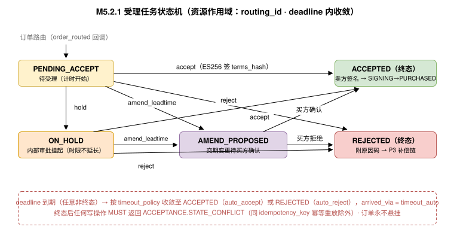

# 接单原语（Acceptance） {#s-m6}

## 目录 {#s-m6-toc}

- [Overview（概述）](#s-m61)
- [Lifecycle / State Machine（生命周期 / 状态机）](#s-m62)
- [Error Handling（错误处理）](#s-m63)
- [Scopes（权限范围）](#s-m64)
- [Guidelines（角色职责指引）](#s-m65)
- [与 P3 Purchase 签名流程的衔接（Interlock with P3）](#s-m66)
- [订单路由（Order Routing）](#s-m67)
- [Mode-Driven Behavior（模式驱动行为）](#s-m68)
- [操作矩阵（Operations Matrix）](#s-m69)
- [Entities（实体定义）](#s-m610)
- [Use Case Walkthroughs（用例演练）](#s-m611a2)
- [改价提议（Price Amendment）](#s-m612)

---

## 原语身份 {#s-m6-identity}

```
primitive_id:   utp.acceptance
version:        2026-07-31
initiator_role: Seller
handler_role:   Marketplace
intent:         供应商对路由到达的订购请求给出可核验的受理结论（接受/拒绝/挂起/交期变更/价格调整提议）
state_delta:    order_routed → acceptance_record（资源作用域）
actions:        accept, reject, hold, amend_leadtime, amend_price, query, list
compensation:   受理超时 → 按 acceptance_policy 自动处置并通知双方
service:        dev.utp.merchant
```

---

## Overview（概述） {#s-m61}

### 意图 {#s-m611a}

Acceptance 是 UTP-M 第四个供应商原语（MP4），其意图是让供应商对买方发起的订购给出**显式、签名、可审计的受理结论**。 UTP-B 规范 P3 将卖方接受抽象为"卖方完成自身承诺处理"（[状态迁移的原子性](../../../primitives/purchase/index.md#s-1323)），并要求卖方在 complete 前"确认可行性"（[Seller 角色职责](../../../primitives/purchase/index.md#s-1352-seller)），但未定义承诺处理的产生机制，拒绝只能以错误码被动表达。MP4 将这一留白定义为显式协议动作，使供应商 Agent、ERP 审批流和人工后台都能以统一接口参与接单决策。

### 关键设计原则 {#s-m612}

- **MP4 不替代 P3，而是喂给 P3。**订购成立的唯一路径仍然是 UTP-B 规范 `purchase.complete` 的原子迁移（`SIGNING → PURCHASED`）；MP4 `accept` 即 《状态迁移的原子性》 所要求的"卖方承诺处理"在平台托管拓扑下的规范化实现，其产出（卖方 ES256 签名，覆盖 `terms_hash`）是承诺处理完成的可审计证据。MP4 `reject` 则触发 P3 既有补偿链（释放库存 → `CANCELLED`）。
- **受理结论是不可撤销承诺。**`accept` 一经提交，供应商即受条款约束（与买方签名对称）；反悔只能走 P6 Resolve。
- **超时必有确定性处置。**每笔路由订单 MUST 关联受理时限与超时策略（自动接受 / 自动拒绝），杜绝订单悬挂。

### 范围 {#s-m613}

- **接受（accept）**：确认库存、交期、Trade Method 可执行，提交卖方签名。
- **拒绝（reject）**：以结构化原因码拒绝（库存不足、区域限售、风控、价格失效等）。
- **挂起（hold）**：在受理时限内暂缓（等待 ERP 审批/人工确认），MUST 声明预计答复时间。
- **交期变更申报（amend_leadtime）**：接受订单但申报与 Listing 承诺不同的交期，交买方确认。
- **改价提议（amend_price）**：接受订单但提议与下单条款不同的价格（运费重算、规格差价、阶梯价等），交买方确认后按新条款成立。改价 MUST NOT 单方生效，且是否允许由交易模式（B2B / B2C）与受理策略决定（[改价提议（Price Amendment）](#s-m612)）。
- **查询（query / list）**：待受理与历史受理记录检索。

MP4 不覆盖：订购草案的创建与修改（Buyer 专属， UTP-B 规范 《角色与访问约束》）、询盘与报价（P2 询盘 / MP3 询盘响应，M5）、发货（MP5）。

### 前置条件 {#s-m614}

| 条件 | 必需？ | 说明 |
| --- | --- | --- |
| 存在有效的订单路由通知（OrderRouting） | MUST | Marketplace 已将买方订购草案/签名请求路由给供应商（[订单路由（Order Routing）](#s-m67)）。 |
| `purchase.status ∈ {DRAFT, SIGNING}` | MUST | 受理窗口仅存在于订购成立之前。 |
| `merchant.status ∈ {ACTIVE, RESTRICTED}` | MUST | `RESTRICTED` 商户 MUST 仍可履行既有路由订单的受理义务。 |
| `acceptance.deadline > now()` | MUST | 受理时限内。 |

### 后置条件与语义契约 {#s-m615}

```json
{
  "primitive": "utp.acceptance",
  "postconditions": [
    "acceptance.record_id != null",
    "acceptance.conclusion ∈ {ACCEPTED, REJECTED, LEADTIME_AMENDED}",
    "conclusion == 'ACCEPTED' → seller_signature 覆盖 purchase.terms_hash",
    "conclusion == 'REJECTED' → P3 补偿链已触发（释放 hold → CANCELLED）",
    "acceptance_record ∈ evidence_bundle"
  ],
  "invariants": [
    "同一 purchase_id 至多存在一个终局受理结论（ACCEPTED/REJECTED）",
    "accept 后条款对供应商不可单方面撤回",
    "受理结论 MUST 在 deadline 前给出，否则按 timeout_policy 自动处置"
  ],
  "side_effects": [
    "ACCEPTED：卖方签名注入 purchase.complete 流程，库存 hold → LOCKED（M4.7）",
    "REJECTED：hold → RELEASED，买方收到结构化拒绝通知",
    "LEADTIME_AMENDED：买方收到确认请求，确认后按新交期成立"
  ],
  "compensation": {
    "on_timeout": "按 acceptance_policy.on_timeout 执行 auto_accept 或 auto_reject，推送 utp.acceptance.expired",
    "on_amend_rejected_by_buyer": "视同 REJECTED，走拒绝补偿路径"
  }
}
```

---

## Lifecycle / State Machine（生命周期 / 状态机） {#s-m62}

### 受理任务状态机 {#s-m621}



### 状态定义与迁移规则 {#s-m622}

| 状态 | 含义 | 进入条件 | 允许的操作 |
| --- | --- | --- | --- |
| `PENDING_ACCEPT` | 待受理 | 订单路由送达 | `accept`, `reject`, `hold`, `amend_leadtime`, `amend_price`, `query` |
| `ON_HOLD` | 供应商挂起（内部审批中） | `hold` 成功执行 | `accept`, `reject`, `amend_leadtime`, `amend_price`, `query`（时限不因挂起延长） |
| `AMEND_PROPOSED` | 交期/价格变更待买方确认 | `amend_leadtime` 或 `amend_price` 成功执行 | `query`；等待买方确认/拒绝或超时 |
| `ACCEPTED` | 已接受（终态） | `accept` 签名验证通过；或买方确认交期/价格变更；或超时策略 auto_accept | `query`；衔接 `purchase.complete`（[与 P3 Purchase 签名流程的衔接（Interlock with P3）](#s-m66)） |
| `REJECTED` | 已拒绝（终态） | `reject`；或买方拒绝交期/价格变更；或超时策略 auto_reject | `query`（只读） |

**确定性约束：**终态到达后任何写操作 MUST 返回 `ACCEPTANCE.STATE_CONFLICT`（幂等重放同一 `idempotency_key` 除外）。`deadline` 由订单路由时的 Mode 超时配置决定（UTP 规范 [会话超时上下文](../../../protocol-core/transport-communication.md#s-424) Mode 协商确定的超时配置），挂起不延长时限；延时需求 MUST 走 `amend_leadtime` 或买方侧 HAI 超时扩展。

---

## Error Handling（错误处理） {#s-m63}

| 错误码 | 严重级别 | HTTP 映射 | 描述 | 建议处理 |
| --- | --- | --- | --- | --- |
| `ACCEPTANCE.NOT_FOUND` | error | 404 | 受理任务不存在或不属于调用方。 | 以 `list` 核对待受理队列。 |
| `ACCEPTANCE.EXPIRED` | error | 410 | 受理时限已过，已按超时策略自动处置。 | `query` 查看自动处置结论。 |
| `ACCEPTANCE.STATE_CONFLICT` | warning | 409 | 受理任务已达终态。 | 幂等返回既有结论。 |
| `ACCEPTANCE.SIGNATURE_INVALID` | error | 400 | `accept` 携带的卖方签名无效或未覆盖 `terms_hash`。 | 用正确密钥重签（同 UTP-B 规范 `PURCHASE.COMPLETE.SIGNATURE_INVALID` 语义）。 |
| `ACCEPTANCE.INVENTORY_INSUFFICIENT` | error | 409 | `accept` 时最终库存校验失败。 | 拒绝或先补货；对应 hold 已失效需重路由。 |
| `ACCEPTANCE.REJECT.REASON_REQUIRED` | error | 400 | `reject` 缺少结构化原因码。 | 按 [RejectReason 原因码枚举](#s-m6102) 原因码枚举补充。 |
| `ACCEPTANCE.AMEND.OUT_OF_RANGE` | error | 422 | 申报交期超出平台允许的变更幅度。 | 调整交期或直接 `reject`。 |
| `ACCEPTANCE.HOLD.LIMIT_EXCEEDED` | error | 429 | 同一订单重复挂起超过上限（MUST ≤ 1 次）。 | 在时限内给出终局结论。 |
| `ACCEPTANCE.TERMS_MISMATCH` | error | 409 | `amend_price` 携带的 `base_terms_hash` 与当前订购条款快照不一致。 | 用最新 `terms_hash` 重新提议；防止基于过期条款改价。 |
| `ACCEPTANCE.AMEND_PRICE.TOTAL_MISMATCH` | error | 422 | `proposed_total` 与逐行及整单调整的累加结果不一致。 | 重算总额；确认逐行与整单调整未重复计入同一项。 |
| `ACCEPTANCE.AMEND_PRICE.NOT_ALLOWED` | error | 403 | 受理策略禁止本类目/本商户改价（`amend_price_allowed = false`，B2C 闪购默认禁止）。 | 改用 `accept`，或以 `price_stale` `reject`；改价能力由平台受理策略与交易模式控制。 |

---

## Scopes（权限范围） {#s-m64}

| Scope | 类型 | 描述 | 授予方 | 默认分配 |
| --- | --- | --- | --- | --- |
| `acceptance:accept` | Action Scope | 接受订单并提交卖方签名。 | Marketplace | Seller 角色（仅本方路由订单） |
| `acceptance:reject` | Action Scope | 拒绝订单。 | Marketplace | Seller 角色 |
| `acceptance:hold` | Action Scope | 挂起待内部审批。 | Marketplace | Seller 角色 |
| `acceptance:amend` | Action Scope | 申报交期变更。 | Marketplace | Seller 角色 |
| `acceptance:query` | Action Scope | 查询受理任务与历史结论。 | Marketplace | Seller 角色 |

**约束：**`accept` 的签名主体 MUST 是 Seller 的 Profile 公钥对应私钥。Merchant Agent 代签时 MUST 满足 Agent 授权链（Delegation & Mandate） 的授权链要求（Agent 持有覆盖 `acceptance:accept` 的有效授权）。

---

## Guidelines（角色职责指引） {#s-m65}

### Seller 角色职责 {#s-m651}

| 职责 | 级别 | 说明 |
| --- | --- | --- |
| 时限内答复 | MUST | MUST 在 `deadline` 前给出终局结论；依赖超时自动处置 SHOULD 仅作为兜底。 |
| 接受前核验 | MUST | `accept` 前 MUST 确认库存充足、交期可行、Trade Method 可执行（对应 UTP-B 规范 《Seller 角色职责》"确认可行性"）。 |
| 结构化拒绝 | MUST | `reject` MUST 携带 [RejectReason 原因码枚举](#s-m6102) 原因码；SHOULD 附替代建议（如可供替代 SKU、预计到货时间）。 |
| 低拒单率 | SHOULD | SHOULD 通过 MP2 及时同步库存降低拒单率；持续高拒单率是平台治理依据。 |
| 订单映射 | MUST（实现层） | ACCEPTED 后 MUST 在业务层生成订单/合同记录并建立 `purchase_id ↔ 内部单号` 映射（ID 映射规范（Identifier Mapping））。 |

### Marketplace 角色职责 {#s-m652}

| 职责 | 级别 | 说明 |
| --- | --- | --- |
| 及时路由 | MUST | 订购进入受理窗口后 MUST 立即推送 `order_routed`（[订单路由（Order Routing）](#s-m67)），推送失败按重试与轮询降级兜底。 |
| 结论转发 | MUST | 受理结论 MUST 如实转换为买方可见结果：ACCEPTED → 推进 `purchase.complete`；REJECTED → 结构化取消通知 + P3 补偿。 |
| 超时执行 | MUST | MUST 按订单路由时声明的 `timeout_policy` 执行自动处置，并推送 `utp.acceptance.expired`。 |
| 证据归档 | MUST | AcceptanceRecord（含签名、原因码、时间戳）MUST 纳入交易 Evidence Bundle。 |

---

## 与 P3 Purchase 签名流程的衔接（Interlock with P3） {#s-m66}

本节是闭环不变式 3（商品—交易闭环（End-to-End Loop））的规范定义：

1. 买方 `purchase.complete` 通过第 5 章 Mandate 操作准入后，P3 进入 `SIGNING`；平台托管拓扑下，协议引擎 MUST 生成受理任务并路由给供应商（[订单路由（Order Routing）](#s-m67)）。
2. MP4 `accept` 请求 MUST 携带卖方 ES256 签名（JWS），签名内容 MUST 覆盖该订购的 `terms_hash`。 UTP-B 规范未规定"卖方承诺处理"的具体形式（《状态迁移的原子性》 留白）；**本规范将带签名的 `accept` 定义为平台托管拓扑下承诺处理的规范形式**，AcceptanceRecord 即其可审计凭证。
3. 协议引擎确认卖方承诺处理完成后，按 UTP-B 规范 《状态迁移的原子性》 执行 `SIGNING → PURCHASED` 原子迁移（承诺处理完成、最终库存锁定、terms_hash 与条款快照一致）；任一失败按 《补偿链执行》 补偿链处理，MP4 侧受理任务保持 ACCEPTED（签名事实不回滚，重试由引擎负责）。
4. B2C 全 L0 模式的"自动承诺处理"（UTP-B 规范 《B2C 退化行为详解》）在本模型中实现为：`acceptance_policy.mode == "auto"` 时由 Merchant Agent 或平台代理组件按预授权策略即时调用 `accept`（自动决策策略（AcceptancePolicy 与定价策略）），协议语义完全一致，无特殊路径。
5. `amend_leadtime` 被买方确认后，协议引擎 MUST 以 `purchase.update` 语义刷新履约条款（交期属于可变履约信息），再走签名收集；买方拒绝则视同 REJECTED。
6. `amend_price` 被买方确认后，协议引擎 MUST 以 `proposed_terms_hash` 作为订购的新权威条款哈希（**价格是核心条款，不同于交期这类可变履约信息**），并重新收集覆盖新哈希的双方签名；买方拒绝则任务按 `AMEND_PROPOSED` 的既有收敛规则处置。因此改价与交期变更的关键区别是：前者改变 `terms_hash`（须重签、买方重新授权），后者仅刷新履约信息。

---

## 订单路由（Order Routing） {#s-m67}

订单路由是 Marketplace → Seller 的推送事件（回调 Service，[回调事件类型注册表](../../onboarding.md#s-m261)），不是供应商可调用的 Action。

### OrderRouting 事件载荷 {#s-m671}

| 字段名 | 类型 | 必填 | 描述 |
| --- | --- | --- | --- |
| `routing_id` | string | 是 | 路由事件唯一标识（受理任务标识）。 |
| `purchase_id` | string | 是 | 关联订购标识。 |
| `transaction_id` | string | 是 | 全局事务标识。 |
| `terms_hash` | string | 是 | 条款快照哈希；`accept` 签名 MUST 覆盖此值。 |
| `order_summary` | object | 是 | 商品项（含 `external_ref` 回传）、数量、金额、收货地址、Trade Method、发票要求。 |
| `buyer_ref` | object | 是 | 买方脱敏信息（`agent_id`、资质摘要；PII 按权限裁剪）。 |
| `framework_agreement_ref` | string | 否 | 框架协议引用（`relationship_mode ≥ L2`）。 |
| `deadline` | ISO-8601 | 是 | 受理截止时间。 |
| `timeout_policy` | enum | 是 | `auto_accept` / `auto_reject`（订单路由时按商户配置与 Mode 确定）。 |

推送遵循 UTP 规范 《Push Notification》（MessageEnvelope + 签名 + 指数退避重试）；供应商 MUST 以 `2xx` 确认。推送不可达时，供应商可通过 `acceptance.list`（`status=PENDING_ACCEPT`）轮询兜底，确保推送丢失不导致订单悬挂。

---

## 操作矩阵（Operations Matrix） {#s-m68}

| Mode 配置 | 受理行为 |
| --- | --- |
| decision=L0（B2C 闪购） | `acceptance_policy.mode` SHOULD 为 `auto`：策略核验通过即时 `accept`（毫秒级），买方无感知。 |
| decision=L1—L2（标准 B2B） | 策略预筛 + 人工/Agent 复核；`deadline` 按 Mode 超时配置（小时级）。 |
| payment=L1+（分期） | `accept` 响应 MUST 确认 TradeMethod 全部子步骤可执行；任一子步骤不可执行 MUST `reject`（原因码 `trade_method_unavailable`）。 |
| relationship=L2+（框架协议） | MUST 校验框架配额余量；配额不足 MUST `reject`（原因码 `quota_exceeded`）。框架内订单 SHOULD 自动接受。 |
| compliance=L2+（跨境） | `accept` 前 MUST 确认出口单证能力；SHOULD 在 `acceptance_note` 中声明单证办理时线。 |

---

## Operations 与 Transport Bindings {#s-m69}

### 操作矩阵 {#s-m691}

| 操作 | 适用状态 | 状态影响 | `valid_next_actions` | 关键约束 |
| --- | --- | --- | --- | --- |
| `utp.acceptance.accept` | `PENDING_ACCEPT`, `ON_HOLD` | 进入 `ACCEPTED` 终态；卖方签名注入 P3 | `query`, `utp.delivery.prepare` | Seller；签名 MUST 覆盖 `terms_hash`；接受前 MUST 完成可行性核验。 |
| `utp.acceptance.reject` | `PENDING_ACCEPT`, `ON_HOLD` | 进入 `REJECTED` 终态；触发 P3 补偿 | `query` | Seller；MUST 携带结构化原因码。 |
| `utp.acceptance.hold` | `PENDING_ACCEPT` | 进入 `ON_HOLD`；不延长 deadline | `accept`, `reject`, `amend_leadtime`, `query` | Seller；每单至多一次；MUST 声明 `expected_reply_at`。 |
| `utp.acceptance.amend_leadtime` | `PENDING_ACCEPT`, `ON_HOLD` | 进入 `AMEND_PROPOSED`，等待买方确认 | `query` | Seller；新交期 MUST 在平台允许幅度内；MUST 提供 `amended_leadtime_days`（相对交期）或 `promised_ship_at`（绝对发货时间）至少其一；买方确认后视同 ACCEPTED。 |
| `utp.acceptance.amend_price` | `PENDING_ACCEPT`, `ON_HOLD` | 进入 `AMEND_PROPOSED`，等待买方确认 | `query` | Seller；受理策略 MUST 允许改价（`amend_price_allowed`，B2C 默认禁止）；MUST 携带 `base_terms_hash` 与覆盖 `proposed_terms_hash` 的卖方签名；`line_adjustments`/`order_adjustments` 至少其一；买方确认后按新 `terms_hash` 视同 ACCEPTED（[改价提议（Price Amendment）](#s-m612)）。 |
| `utp.acceptance.query` | 任意 | 无 | 当前状态下可执行动作 | Seller；按 `routing_id`/`purchase_id` 查询。 |
| `utp.acceptance.list` | — | 无 | `accept`, `reject`, `hold`, `query` | Seller；按状态/时间筛选，分页；轮询降级通道。 |

## Entities（实体定义） {#s-m610}

### AcceptanceRecord {#s-m6101}

| 字段名 | 类型 | 必填 | 描述 |
| --- | --- | --- | --- |
| `record_id` | string | 是 | 受理记录唯一标识。 |
| `routing_id` | string | 是 | 关联路由任务。 |
| `purchase_id` / `transaction_id` | string | 是 | 关联订购与全局事务标识。 |
| `conclusion` | enum | 是 | `ACCEPTED` / `REJECTED` / `LEADTIME_AMENDED`。 |
| `arrived_via` | enum | 是 | `explicit`（显式操作）/ `timeout_auto`（超时自动处置）/ `buyer_confirm`（交期变更被确认）。 |
| `terms_hash` | string | 是 | 受理时的条款快照哈希。 |
| `seller_signature` | string | 条件 | Seller ES256 签名（JWS）；`conclusion == ACCEPTED` 时必填。 |
| `reject_reason` | RejectReason | 条件 | `conclusion == REJECTED` 时必填（[RejectReason 原因码枚举](#s-m6102)）。 |
| `amended_leadtime_days` | integer | 条件 | 交期变更申报值（相对交期，自然日）。 |
| `promised_ship_at` | ISO-8601 | 条件 | 承诺发货时间（绝对时间）。`conclusion == LEADTIME_AMENDED` 时，本字段与 `amended_leadtime_days` MUST 至少提供其一；两者同时存在时 MUST 语义一致。 |
| `acceptance_note` | string | 否 | 补充说明（单证时线、替代建议等）。 |
| `decided_by` | enum | 是 | `human` / `agent` / `policy_auto`（审计维度，见 人机控制点（HAI Control Points））。 |
| `decided_at` | ISO-8601 | 是 | 结论时间。 |

### RejectReason 原因码枚举 {#s-m6102}

| 原因码 | 含义 | 建议买方处理 |
| --- | --- | --- |
| `inventory_insufficient` | 库存不足 | 减少数量或更换供应商 |
| `price_stale` | 价格已失效（原材料波动等） | 回到 P2 重新议价 |
| `region_restricted` | 收货区域限售/不可达 | 更换收货地址 |
| `trade_method_unavailable` | 所选 Trade Method 当前不可执行 | 更换支付/贸易方式 |
| `quota_exceeded` | 框架协议配额不足 | 协商增额或走一次性采购 |
| `compliance_unable` | 无法满足合规/单证要求 | 更换供应商或降低合规要求 |
| `risk_control` | 供应商侧风控拦截 | 联系供应商或平台 |
| `other` | 其他（MUST 附 `detail` 说明） | 阅读说明 |

---

## Use Case Walkthroughs（用例演练） {#s-m611a2}

### 标准接单 {#s-m6111}

```
// 1. 回调：订单路由
{
  "event": "utp.acceptance.order_routed",
  "routing_id": "route-20260722-0335",
  "purchase_id": "ORD-20260722-88721",
  "transaction_id": "utp-txn-01J4X7K9M2P5Q8R3V6W0YZ",
  "terms_hash": "sha256:d4e5f6a7b8c9...",
  "order_summary": {
    "items": [ { "listing_id": "item-BT-NC-001", "sku_id": "sku-X3-BLK",
                 "external_ref": "ERP-MAT-004512", "quantity": 100,
                 "unit_price": { "amount": "268.00", "currency": "CNY" } } ],
    "total_amount": { "amount": "26800.00", "currency": "CNY" },
    "trade_method": { "method_id": "tm-fullpay-alipay", "type": "full_payment" }
  },
  "deadline": "2026-07-22T18:00:00Z",
  "timeout_policy": "auto_reject"
}

// 2. Seller 接受（ERP 核验库存与交期通过后）
POST /utp/m/v1/acceptances/route-20260722-0335/accept
{
  "idempotency_key": "idem-acc-20260722-007",
  "terms_hash": "sha256:d4e5f6a7b8c9...",
  "seller_signature": "eyJhbGciOiJFUzI1NiJ9...",
  "decided_by": "agent"
}

// 3. 响应：结论 + 引擎推进 P3
{
  "record_id": "acc-20260722-0335",
  "conclusion": "ACCEPTED",
  "purchase_status": "PURCHASED",        // SIGNING → PURCHASED 原子迁移完成
  "valid_next_actions": ["utp.acceptance.query", "utp.delivery.prepare"]
}
```

### 缺货拒单与超时兜底 {#s-m6112}

```
拒单：POST .../reject { "reject_reason": { "code": "inventory_insufficient",
      "detail": "黑色缺货，白色 sku-X3-WHT 可 48h 内发货" } }
      → P3 补偿链：释放 hold → 订购 CANCELLED → 买方收到结构化通知

超时：deadline 到期未答复 → 按 timeout_policy=auto_reject 自动 REJECTED，
      arrived_via=timeout_auto，推送 utp.acceptance.expired 给供应商
```

---

## 改价提议（Price Amendment） {#s-m612}

`utp.acceptance.amend_price` 允许供应商在受理阶段提出价格调整。本节确立两条约束：**其一，本动作是提议，不是变更**（改价 MUST NOT 单方生效）；**其二，改价是否可用、如何被确认，由交易模式（B2B / B2C）与受理策略参数化决定**（[B2B 与 B2C 场景的改价策略](#s-m6122)），而非对场景硬编码。

### 为什么改价必须是提议 {#s-m6121}

订购条款一旦被买方签署，其哈希（`terms_hash`）就是 P3 原子迁移三条件之一（UTP-B 规范 [状态迁移的原子性](../../../primitives/purchase/index.md#s-1323)）。若允许卖方单方改价：

- 已签条款与实际条款不一致，**双签机制失效**——买方 Agent 无法确认自己同意的是什么；
- 价格证据链断裂——`quote.terms_hash` → 订购 `terms_hash` 的链条被中途替换；
- 买方 Agent 无法自动化——因为"下单价"不再可信。

因此协议规定：`amend_price` MUST NOT 单方生效。供应商提出提议后任务进入 `AMEND_PROPOSED`，**买方确认后新条款方成立**，此时 `proposed_terms_hash` 成为订购的权威条款哈希，供应商需在新条款下完成 `accept`。

### B2B 与 B2C 场景的改价策略 {#s-m6122}

改价**是否被允许**、买方**如何确认**，不是两套独立规则，而是沿 UTP 规范[交易模式频谱](../../../protocol-core/procurement-models.md)（第 8 章）`decision` 维度参数化的同一机制——`amend_price_allowed`（受理策略字段）与买方侧确认阈值随模式取值不同。“B2C” 与 “B2B” 是 `decision=L0` 与 `decision=L1—L2` 两类常见取值的通俗称呼，协议 MUST NOT 为它们硬编码特例。

| 维度 | B2C（`decision=L0` 闪购/即时零售） | B2B（`decision=L1—L2` 标准采购/大宗） |
| --- | --- | --- |
| `amend_price_allowed` 默认 | **false**（默认禁止） | **true**（受类目规则约束） |
| 语义定位 | 受限例外，非常态 | 常态议价环节 |
| 典型合法场景 | 仅偏远/超尺寸目的地的 `freight_recalculation`，且 MUST 在平台公示封顶内 | `freight_recalculation`、`volume_tier_change`、`spec_difference`、`cost_fluctuation`、`tax_or_duty_change` |
| 价格不符时首选动作 | `reject`（`price_stale`）→ 买方重新寻源 | `amend_price` 提议 → 买方评估 |
| 买方确认方式 | Agent 在极小阈值内 MAY 自动确认，超阈值 → 自动拒绝（即时零售通常无人工在环） | Agent 按采购授权容差评估：容差内 MAY 自动确认，超容差 → 升级人工（[HAI](../../merchant-agent.md)） |
| 底层理由 | 消费者“所见即所得”信任；买方 Agent 授权低值且窄 | 采购 Agent 持议价授权、金额容差与审批链 |

**B2C（`decision=L0`）为什么默认禁止改价。**即时零售场景中，买方 Agent 以下单价即时成交、且通常无人工在环。若允许卖方在受理阶段抬价，买方 Agent 既无授权确认、也无人可升级，只能超时拒绝——这既伤害“所见即所得”的消费者信任，也让订单在 `AMEND_PROPOSED` 空耗时限。因此 B2C 默认 `amend_price_allowed = false`：价格错误 MUST 以 `reject`（`price_stale`）表达，由买方回到寻源。唯一窄例外是偏远/超尺寸目的地的运费重算，且平台 MUST 对可自动接受的运费差额设封顶，超封顶仍走拒绝。

**B2B（`decision=L1—L2`）为什么改价是常态。**大宗采购中，运费按实际抛重结算、数量落入不同阶梯价、原材料成本波动都是订单成立前的正常变量。买方是持采购授权（Mandate，第 5 章）的采购 Agent，天然具备“在授权容差内接受价格调整”的能力。因此 B2B 默认允许改价：卖方以 `amend_price` 结构化提议，买方 Agent 依原因码（[适用场景与原因码](#s-m6123)）与采购授权的金额容差自动判定——容差内 MAY 自动确认，超容差 MUST 升级人工买家（HAI）。提议—确认的双动作全程保持双签与 `terms_hash` 证据链完整。

**框架协议（`relationship=L2+`）下的改价。**存在框架协议时，价格 MUST 遵循框架的定价规则；受理阶段的 `amend_price` SHOULD 仅反映框架许可的调整（如指数化的原材料成本、约定的运费公式），并 MUST 在 `reason_note` 中引用 `framework_agreement_ref`。超出框架条款的价格变化 MUST 以 `reject` 处置或走框架重新协商，而非逐单改价。

### 适用场景与原因码 {#s-m6123}

| 原因码 | 典型场景 | 买方 Agent 自动处置建议 |
| --- | --- | --- |
| `freight_recalculation` | 按实际重量/体积/目的地重算运费 | 在阈值内 MAY 自动接受 |
| `spec_difference` | 实际可供规格与下单规格有差异 | SHOULD 人工确认（涉及货品实质） |
| `volume_tier_change` | 实际数量落入不同阶梯价区间 | 可按阶梯价规则自动校验后接受 |
| `cost_fluctuation` | 原材料或采购成本波动 | SHOULD 人工确认 |
| `tax_or_duty_change` | 税费或关税政策变化 | 核对政策依据后处置 |
| `promotion_expired` | 下单时引用的促销价已失效 | SHOULD 人工确认（可能触发重新寻源） |
| `quotation_superseded` | 引用的报价已被新报价取代 | MUST 核对新 `quote_id`（见 [M5](../../primitives/quote/index.md)） |
| `other` | 其他 | MUST 提供 `reason_note`，人工处置 |

### 约束（MUST / MUST NOT） {#s-m6124}

- 请求 MUST 携带 `base_terms_hash`（被调整的原条款）。与当前订购条款快照不一致时 MUST 返回 `ACCEPTANCE.TERMS_MISMATCH`——防止基于过期条款提议。
- MUST 提供 `proposed_terms_hash`，且 `seller_signature` MUST 覆盖该值。买方 MUST 在确认前验签。
- 逐行调整（`line_adjustments`）与整单调整（`order_adjustments`）**至少其一**。`proposed_total` MUST 与调整累加结果一致，否则返回 `ACCEPTANCE.AMEND_PRICE.TOTAL_MISMATCH`。
- 改价可用性 MUST 由受理策略 `amend_price_allowed` 声明，其默认值随 `decision` 模式取值（B2C `decision=L0` 默认 `false`、B2B `decision=L1—L2` 默认 `true`）；Marketplace MAY 进一步按类目与商户等级收紧。`amend_price_allowed = false` 时 `amend_price` MUST 返回 `ACCEPTANCE.AMEND_PRICE.NOT_ALLOWED`。
- `decided_by = policy_auto` 时 MUST 提供 `policy_ref`（命中的定价策略与版本），供决策审计追溯（见 决策审计（Decision Audit））。
- 本动作与 `amend_leadtime` 共用 `AMEND_PROPOSED` 状态。同一受理任务上二者 MUST NOT 并存未决提议——存在未决提议时新提议 MUST 返回 `ACCEPTANCE.STATE_CONFLICT`。

### 与 MP3 报价的关系 {#s-m6125}

若订购前已走过询盘报价（MP3），`accept` MUST NOT 偏离已绑定条款。此时 **改价是对已绑定报价的重新协商**，SHOULD 优先在报价阶段完成（`utp.quote.revise`），受理阶段改价 SHOULD 仅用于报价无法预见的因素（实际运费、税费政策）。原因码为 `quotation_superseded` 时 MUST 在 `reason_note` 中引用新的 `quote_id`。

### 示例 {#s-m6126}

```
// 供应商提出运费重算提议
POST /utp/m/v1/acceptances/rt-4471/amend-price
{ "idempotency_key": "rt-4471-amendprice-1",
  "base_terms_hash": "a91f…3c07",
  "reason_code": "freight_recalculation",
  "reason_note": "实际抛重 380kg（下单估重 260kg），按承运商抛重规则重算干线运费。",
  "order_adjustments": [
    { "category": "freight",
      "amount": { "amount": "420.00", "currency": "CNY" },
      "note": "抛重差额 120kg × 3.5 元/kg" } ],
  "proposed_total": { "amount": "18420.00", "currency": "CNY" },
  "proposed_terms_hash": "d55b…9a12",
  "seller_signature": { "algorithm": "ES256", "key_id": "sup-key-01", "value": "eyJhbGc…" },
  "valid_until": "2026-08-05T12:00:00Z",
  "decided_by": "policy_auto", "policy_ref": "freight-policy-v7" }

→ 200 { "routing_id": "rt-4471", "amendment_id": "amd-8830",
        "status": "AMEND_PROPOSED",
        "proposed_terms_hash": "d55b…9a12",
        "buyer_confirmation_required": true,
        "valid_until": "2026-08-05T12:00:00Z",
        "valid_next_actions": ["utp.acceptance.query"] }

// 买方确认（回调）→ 新 terms_hash 生效，供应商在新条款下 accept
{ "event": "utp.acceptance.amendment_result",
  "payload": { "routing_id": "rt-4471", "amendment_id": "amd-8830",
               "buyer_response": "accepted",
               "effective_terms_hash": "d55b…9a12" } }

// 买方拒绝 → 回到待受理，供应商可按原价 accept 或 reject
```

**逐行改价示例（规格差价）**：`line_adjustments` 中给出 `line_no`、`original_unit_price`、`proposed_unit_price` 与适用 `quantity`；未列出的订单行 MUST 视为不调整。

**B2C 对比。**同一运费重算若发生在 `decision=L0` 闪购订单且差额超过平台封顶，卖方 MUST NOT 走 `amend_price`（将返回 `ACCEPTANCE.AMEND_PRICE.NOT_ALLOWED`），而应以 `reject`（`reason_code = price_stale`）结束，由买方 Agent 重新寻源。
