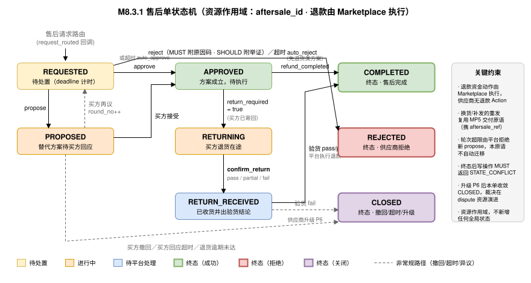

<h1 id="s-m8">M8 · MP6 售后原语（Aftersale）</h1>

    
供应商侧售后处置原语。对买方提出的退款、退货退款、换货、补发与维修请求作出结构化处置结论，并在需要退货的方案下确认退货收货与验货结果。本原语规范的是<strong>买卖双方在协议层的售后协商与执行</strong>，与主规范 <a href="../../../primitives/resolve/index.md">第 16 章</a>（P6 Resolve 争议解决）分工明确：售后先行，协商不成才升级争议裁决。

    <h2 id="s-m81">M8.1 Overview（定位与意图）</h2>

    
<strong>意图。</strong>Aftersale 是 UTP-M 第六个供应商原语（MP6）。交付完成不等于交易结束。质量争议、错发漏发、运输损坏在 B2B 场景中是常态，而这些请求的处置结论直接决定资金去向（退款金额）与货物归属（是否退回）。若不在协议层规范，买方 Agent 无法预期"申请多久有回应""拒绝的理由是否可判定"，供应商也无法把售后决策交给 Agent 自动化。本原语把售后处置从平台私有流程提升为可协商、可审计、可自动化的协议动作。

    
<strong>原语判据。</strong>本原语通过 <a href="../../overview.md#s-m17">M1.7</a> 三关判据：

    <ul>
      <li><strong>T1 运行时性：</strong>售后请求在交易运行时产生，处置结论有 deadline 约束，不是签约前的一次性配置。</li>
      <li><strong>T2 双边对手性：</strong>买方提出诉求、供应商给出结论，双方可多轮协商——存在真实的对手方与合意过程。</li>
      <li><strong>T3 可重复交易性：</strong>每笔已交付订单都可能触发售后，动作可重复执行且需幂等。</li>
    </ul>

    
<strong>原语身份</strong>

<pre class="highlight"><code>primitive_id:   utp.aftersale
version:        2026-07-31
initiator_role: Seller
handler_role:   Marketplace
intent:         对买方售后请求（退款/退货退款/换货/补发/维修）给出结构化处置结论，并确认退货收货与验货结果
state_delta:    aftersale_request → aftersale_record（资源作用域：aftersale_id）
actions:        approve, reject, propose, confirm_return, query, list
compensation:   处置超时 → 按 timeout_policy 自动收敛（auto_approve / auto_reject），推送 utp.aftersale.closed
service:        dev.utp.merchant
</code></pre>

    
<strong>职责边界（本原语不做什么）</strong>

    <table>
      <thead><tr><th>不属于本原语</th><th>归属</th><th>理由</th></tr></thead>
      <tbody>
        <tr><td>执行退款资金动作</td><td>Marketplace（代收代付方）</td><td>平台托管拓扑下资金在平台账户，供应商无退款通道；供应商只通过 <code>utp.aftersale.refund_completed</code> 观测结果</td></tr>
        <tr><td>换货与补发的发货动作</td><td>MP5 交付原语 <code>utp.delivery.ship</code></td><td>原语正交性——发货能力已在 MP5 定义，售后场景携带 <code>aftersale_ref</code> 复用即可，MUST NOT 重复定义</td></tr>
        <tr><td>争议裁决与补偿裁定</td><td>主规范 P6 Resolve</td><td>裁决需第三方（Arbiter）介入并产出约束性结论，本原语只表达双方合意</td></tr>
        <tr><td>买方发起售后申请</td><td>买方侧（经 Marketplace 路由）</td><td>本原语是供应商侧应答面，申请动作在买方侧</td></tr>
        <tr><td>退货物流的承运与轨迹</td><td>Shipper 角色</td><td>退货物流单号经 <code>utp.aftersale.return_shipped</code> 透传，供应商是消费方</td></tr>
      </tbody>
    </table>

    <h2 id="s-m82">M8.2 与 P6 Resolve 的边界（Aftersale vs Dispute）</h2>

    
这是本章最容易被误解的部分。售后与争议解决<strong>不是同一件事的两种叫法</strong>，而是两个前后衔接、性质不同的阶段：

    <table>
      <thead><tr><th>维度</th><th>MP6 售后原语（本章）</th><th>P6 Resolve（主规范第 16 章）</th></tr></thead>
      <tbody>
        <tr><td>性质</td><td>双方<strong>协商执行</strong></td><td>第三方<strong>裁决</strong></td></tr>
        <tr><td>参与方</td><td>Buyer ↔ Marketplace ↔ Seller</td><td>Buyer ↔ Arbiter（Seller 应答）</td></tr>
        <tr><td>触发条件</td><td>买方提出售后诉求</td><td>售后协商不成、供应商拒绝后买方不服、验货结论有异议</td></tr>
        <tr><td>产出</td><td><code>AftersaleResolution</code>（双方合意方案）</td><td><code>ResolutionOutcome</code> + <code>CompensationOrder</code>（约束性裁定）</td></tr>
        <tr><td>资源标识</td><td><code>aftersale_id</code></td><td><code>dispute_id</code></td></tr>
        <tr><td>供应商动作</td><td>本原语 6 个 Action</td><td>无新增原语——经 <code>utp.resolve.dispute_routed</code> 回调答辩（见 <a href="../../merchant-agent.md#s-m114">M11.4</a>）</td></tr>
      </tbody>
    </table>

    
<strong>衔接规则（MUST）</strong>

    <ul>
      <li>售后 MUST 先行。买方 SHOULD 先提交售后申请；平台 MAY 对未经售后直接发起争议的请求要求先走售后（严重违约场景例外）。</li>
      <li>升级后本售后单 MUST 收敛至 <code>CLOSED</code>（<code>close_reason = escalated_to_dispute</code>），并在 <code>dispute_ref</code> 中记录争议标识。争议在 dispute 资源上独立演进，本原语 MUST NOT 表达裁决过程。</li>
      <li>本原语的处置记录（含拒绝原因与举证）MUST 可作为争议阶段的 Evidence Bundle 组成部分——这是"售后先行"的实际价值：<strong>拒绝时不举证，升级后将处于举证不利地位</strong>。</li>
      <li>裁决产出的补偿 MUST 通过结算调整项落地（见 <a href="../../settlement.md#s-m94">M9.4</a>），不在本原语内表达。</li>
    </ul>

    <h2 id="s-m83">M8.3 Lifecycle / State Machine（售后单生命周期）</h2>

    
状态作用域为 <code>resource</code>，锚点 <code>aftersale_id</code>。本状态机 MUST NOT 与主规范全局状态机混同——售后的执行结果通过退款事实与结算冲销影响交易，<strong>不新增任何全局状态</strong>（见 <a href="../../overview.md#s-m19">M1.9</a>）。

    

      
      
图 M8-1　售后单状态机：处置协商（含多轮提议）→ 退货验货 → 退款完成，三个终态覆盖完成、拒绝与关闭

    

    <table>
      <thead><tr><th>状态</th><th>语义</th><th>终态</th><th>本状态下供应商可执行</th></tr></thead>
      <tbody>
        <tr><td><code>REQUESTED</code></td><td>售后请求已路由，等待处置结论</td><td>否</td><td><code>approve</code> / <code>reject</code> / <code>propose</code> / <code>query</code></td></tr>
        <tr><td><code>PROPOSED</code></td><td>已提替代方案，等待买方回应</td><td>否</td><td>仅 <code>query</code></td></tr>
        <tr><td><code>APPROVED</code></td><td>方案已成立，待执行（退货或退款）</td><td>否</td><td>仅 <code>query</code>（需重发时用 <code>utp.delivery.ship</code>）</td></tr>
        <tr><td><code>RETURNING</code></td><td>买方退货在途</td><td>否</td><td><code>confirm_return</code> / <code>query</code></td></tr>
        <tr><td><code>RETURN_RECEIVED</code></td><td>退货已收且验货结论已提交，待退款</td><td>否</td><td>仅 <code>query</code></td></tr>
        <tr><td><code>COMPLETED</code></td><td>售后完成（退款到账 / 换货已发 / 补发完成）</td><td><strong>是</strong></td><td>仅 <code>query</code></td></tr>
        <tr><td><code>REJECTED</code></td><td>供应商拒绝，本售后单终结</td><td><strong>是</strong></td><td>仅 <code>query</code></td></tr>
        <tr><td><code>CLOSED</code></td><td>买方撤回 / 回应超时 / 退货逾期 / 升级争议</td><td><strong>是</strong></td><td>仅 <code>query</code></td></tr>
      </tbody>
    </table>

    
<strong>迁移规则</strong>

    <table>
      <thead><tr><th>From</th><th>触发</th><th>To</th><th>条件</th></tr></thead>
      <tbody>
        <tr><td>—</td><td><code>request_routed</code>（回调）</td><td><code>REQUESTED</code></td><td>Marketplace 校验售后窗口与订单状态后路由</td></tr>
        <tr><td><code>REQUESTED</code></td><td><code>utp.aftersale.approve</code></td><td><code>APPROVED</code></td><td>方案未超出买方诉求范围且签名覆盖 <code>resolution_hash</code></td></tr>
        <tr><td><code>REQUESTED</code></td><td><code>utp.aftersale.reject</code></td><td><code>REJECTED</code></td><td>已提供结构化拒绝原因码</td></tr>
        <tr><td><code>REQUESTED</code></td><td><code>utp.aftersale.propose</code></td><td><code>PROPOSED</code></td><td>未超出协商轮次上限</td></tr>
        <tr><td><code>REQUESTED</code></td><td><code>deadline_expired</code></td><td><code>APPROVED</code></td><td><code>timeout_policy = auto_approve</code>（方案取买方诉求原样）</td></tr>
        <tr><td><code>REQUESTED</code></td><td><code>deadline_expired</code></td><td><code>REJECTED</code></td><td><code>timeout_policy = auto_reject</code></td></tr>
        <tr><td><code>PROPOSED</code></td><td><code>buyer_accept_proposal</code></td><td><code>APPROVED</code></td><td>买方接受替代方案</td></tr>
        <tr><td><code>PROPOSED</code></td><td><code>buyer_counter_proposal</code></td><td><code>REQUESTED</code></td><td>买方再议，<code>round_no</code> 递增</td></tr>
        <tr><td><code>APPROVED</code></td><td><code>buyer_return_shipped</code></td><td><code>RETURNING</code></td><td>方案 <code>return_required = true</code> 且买方已寄回</td></tr>
        <tr><td><code>APPROVED</code></td><td><code>refund_completed</code></td><td><code>COMPLETED</code></td><td>方案不需退货，平台已退款或重发已完成</td></tr>
        <tr><td><code>RETURNING</code></td><td><code>utp.aftersale.confirm_return</code></td><td><code>RETURN_RECEIVED</code></td><td>已提交验货结论</td></tr>
        <tr><td><code>RETURN_RECEIVED</code></td><td><code>refund_completed</code></td><td><code>COMPLETED</code></td><td>验货 <code>pass</code> 或 <code>partial</code>，平台按结论退款</td></tr>
        <tr><td><code>RETURN_RECEIVED</code></td><td><code>dispute_escalated</code></td><td><code>CLOSED</code></td><td>验货 <code>fail</code> 且供应商已升级 P6</td></tr>
      </tbody>
    </table>

    
<strong>确定性保证。</strong>同一状态下同一触发 MUST 只有一条可用迁移。<code>deadline_expired</code> 的多目标迁移由互斥的 <code>timeout_policy</code> 条件区分（见 <a href="../../overview.md#s-m110">M1.10</a> 通用规则）。状态机迁移触发器的载体约定（与其余 MP 原语及主规范 P1—P6 一致）：<strong>供应商可调用动作置于 <code>action</code> 字段并用全限定名</strong>（<code>utp.aftersale.*</code>），<strong>回调与系统触发置于 <code>event</code> 字段并用裸名</strong>（<code>request_routed</code> / <code>refund_completed</code> / <code>deadline_expired</code>），二者 MUST NOT 混用。

    
<strong>轮次上限。</strong>协商轮次上限由 Marketplace 受理策略声明。超限后 Marketplace MUST 拒绝新的 <code>propose</code> 并返回 <code>AFTERSALE.MAX_ROUNDS</code>，售后单停留在 <code>REQUESTED</code>——<strong>本原语不因轮次超限自动迁移，供应商无需为此 <code>reject</code></strong>。

    <h2 id="s-m84">M8.4 Actions（动作定义）</h2>

    <table>
      <thead><tr><th>Action</th><th>语义</th><th>幂等</th><th>签名要求</th></tr></thead>
      <tbody>
        <tr><td><code>utp.aftersale.approve</code></td><td>同意售后并给出最终方案（类型、退款金额、是否退货、运费责任）</td><td>是</td><td>MUST 覆盖 <code>resolution_hash</code></td></tr>
        <tr><td><code>utp.aftersale.reject</code></td><td>拒绝售后请求，MUST 附结构化原因码</td><td>是</td><td>—</td></tr>
        <tr><td><code>utp.aftersale.propose</code></td><td>提出替代方案，等待买方回应</td><td>是</td><td>MUST 覆盖 <code>resolution_hash</code></td></tr>
        <tr><td><code>utp.aftersale.confirm_return</code></td><td>确认退货收货并给出验货结论</td><td>是</td><td>MUST 覆盖验货结论快照</td></tr>
        <tr><td><code>utp.aftersale.query</code></td><td>查询单个售后单权威档案</td><td>是</td><td>—</td></tr>
        <tr><td><code>utp.aftersale.list</code></td><td>筛选售后单，游标分页（轮询降级通道）</td><td>是</td><td>—</td></tr>
      </tbody>
    </table>

    
<strong>M8.4.1 approve — 处置方案的约束</strong>

    <ul>
      <li>方案退款金额 MUST NOT 大于 <code>AftersaleRequest.requested_amount</code>；超出时返回 <code>AFTERSALE.RESOLUTION_EXCEEDS_REQUEST</code>。需要提出更优或结构不同的方案时 MUST 使用 <code>propose</code>。</li>
      <li><code>aftersale_type</code> MAY 与买方请求类型不同（如买方请求退货退款、方案为仅退款折让），此时 <strong>MUST 视为提议性质</strong>——实现上 SHOULD 使用 <code>propose</code> 以获得买方明确确认。</li>
      <li><code>return_required = true</code> 时 MUST 提供 <code>return_address</code>，响应 MUST 返回 <code>return_deadline</code>。</li>
      <li><code>replacement_required = true</code> 时，重发 MUST 通过 <code>utp.delivery.ship</code> 携带 <code>aftersale_ref</code> 执行——本原语不定义发货动作。</li>
    </ul>

    
<strong>M8.4.2 reject — 举证义务</strong>

    
原因码为 <code>no_defect_found</code> / <code>buyer_damage</code> / <code>used_or_altered</code> 时 SHOULD 附举证材料（<code>EvidenceReference</code>）。<strong>这不是形式要求</strong>：拒绝记录会进入争议阶段的证据包，缺失举证将使供应商在裁决中处于不利地位。<code>reason_code = other</code> 时 MUST 提供 <code>reason_note</code>。

    
<strong>M8.4.3 confirm_return — 验货结论的资金后果</strong>

    <table>
      <thead><tr><th><code>inspection_result</code></th><th>语义</th><th>退款执行</th></tr></thead>
      <tbody>
        <tr><td><code>pass</code></td><td>退回货物与方案一致</td><td>按方案 <code>refund_amount</code> 全额退款</td></tr>
        <tr><td><code>partial</code></td><td>部分符合（数量短少、轻微损耗）</td><td>按 <code>accepted_amount</code> 退款，MUST 提供 <code>discrepancy_note</code></td></tr>
        <tr><td><code>fail</code></td><td>与方案严重不符</td><td>暂不退款，供应商 MAY 升级 P6；本售后单收敛 <code>CLOSED</code></td></tr>
      </tbody>
    </table>
    
结果非 <code>pass</code> 时 MUST 提供 <code>discrepancy_note</code>，并 SHOULD 附开箱照片等举证。<code>received_lines</code> 的数量 MUST NOT 超过方案涉及数量，否则返回 <code>AFTERSALE.QUANTITY_EXCEEDS_RETURN</code>。

    <h2 id="s-m85">M8.5 Entities（实体定义）</h2>

    <table>
      <thead><tr><th>实体</th><th>用途</th><th>关键约束</th></tr></thead>
      <tbody>
        <tr><td><code>AftersaleRequest</code></td><td>买方售后请求（回调载荷核心）</td><td><code>requested_amount</code> 构成方案金额上限</td></tr>
        <tr><td><code>AftersaleResolution</code></td><td>处置方案</td><td><code>resolution_hash</code> 为签名对象；<code>return_required</code> 决定后续状态路径</td></tr>
        <tr><td><code>AftersaleRecord</code></td><td>售后单权威档案</td><td>含历史提议、验货结论、退款凭据与关闭原因，支持按 <code>aftersale_id</code> 幂等重放</td></tr>
        <tr><td><code>ReturnReceipt</code></td><td>退货收货与验货结论</td><td>非 <code>pass</code> 时 MUST 提供差异说明</td></tr>
        <tr><td><code>AftersaleType</code></td><td>售后类型枚举</td><td><code>refund_only</code> / <code>return_refund</code> / <code>exchange</code> / <code>replenish</code> / <code>repair</code></td></tr>
        <tr><td><code>AftersaleReason</code></td><td>买方申请原因码</td><td>9 项，供 Agent 自动决策判定</td></tr>
        <tr><td><code>AftersaleRejectReason</code></td><td>供应商拒绝原因码</td><td>7 项，MUST 结构化</td></tr>
        <tr><td><code>InspectionResult</code></td><td>验货结论</td><td><code>pass</code> / <code>partial</code> / <code>fail</code></td></tr>
        <tr><td><code>FreightResponsibility</code></td><td>退货运费责任方</td><td>质量问题类 SHOULD 由卖方承担</td></tr>
      </tbody>
    </table>

    
<strong>通用类型复用（MUST NOT 自建副本）：</strong><code>Money</code>、<code>Address</code>、<code>Signature</code>、<code>EvidenceReference</code> 全部引用主规范通用实体（见 <a href="../../../schemas/index.md#s-common-money">Ch.25</a>）。分页复用 <code>common/pagination.json</code>（游标制）。

    <h2 id="s-m86">M8.6 Error Handling（错误码）</h2>

    
错误码格式继承主规范 <a href="../../../protocol-core/primitive-framework.md#s-1043-standard-error-response">10.4.3</a> 标准错误响应。

    <table>
      <thead><tr><th>错误码</th><th>HTTP</th><th>语义</th><th>恢复建议</th></tr></thead>
      <tbody>
        <tr><td><code>AFTERSALE.NOT_FOUND</code></td><td>404</td><td>售后单不存在或无权访问</td><td>核对 <code>aftersale_id</code>；用 <code>list</code> 拉取当前待处理队列</td></tr>
        <tr><td><code>AFTERSALE.STATE_CONFLICT</code></td><td>409</td><td>当前状态不允许该动作（含终态后写操作）</td><td><code>query</code> 获取权威状态与 <code>valid_next_actions</code></td></tr>
        <tr><td><code>AFTERSALE.DEADLINE_PASSED</code></td><td>409</td><td>处置截止时间已过，已按 <code>timeout_policy</code> 自动收敛</td><td><code>query</code> 确认自动处置结论</td></tr>
        <tr><td><code>AFTERSALE.RESOLUTION_EXCEEDS_REQUEST</code></td><td>422</td><td>方案退款金额超过买方诉求上限</td><td>下调金额，或改用 <code>propose</code> 提出结构不同的方案</td></tr>
        <tr><td><code>AFTERSALE.MAX_ROUNDS</code></td><td>409</td><td>已达协商轮次上限</td><td><code>approve</code> 或 <code>reject</code> 收敛；不可继续 <code>propose</code></td></tr>
        <tr><td><code>AFTERSALE.RETURN_NOT_REQUIRED</code></td><td>422</td><td>方案不需退货，<code>confirm_return</code> 不适用</td><td>核对方案 <code>return_required</code></td></tr>
        <tr><td><code>AFTERSALE.QUANTITY_EXCEEDS_RETURN</code></td><td>422</td><td>验货数量超过方案涉及数量</td><td>核对 <code>received_lines</code> 与方案 <code>lines</code></td></tr>
        <tr><td><code>AFTERSALE.REASON_REQUIRED</code></td><td>422</td><td>缺少必需的原因码或原因说明</td><td>补充结构化 <code>reason_code</code>（<code>other</code> 时补 <code>reason_note</code>）</td></tr>
        <tr><td><code>AFTERSALE.SIGNATURE_INVALID</code></td><td>401</td><td>业务签名验证失败或未覆盖应签哈希</td><td>核对签名对象与 <code>key_id</code>；重新签署</td></tr>
        <tr><td><code>AFTERSALE.INVALID_CURSOR</code></td><td>422</td><td>分页游标无效或已过期</td><td>从首页重新拉取</td></tr>
      </tbody>
    </table>

    <h2 id="s-m87">M8.7 Scopes（授权范围）</h2>

    <table>
      <thead><tr><th>Scope</th><th>覆盖动作</th><th>Mandate 类型</th></tr></thead>
      <tbody>
        <tr><td><code>aftersale:write</code></td><td><code>approve</code> / <code>reject</code> / <code>propose</code> / <code>confirm_return</code></td><td><code>operation</code></td></tr>
        <tr><td><code>aftersale:read</code></td><td><code>query</code> / <code>list</code></td><td><code>operation</code></td></tr>
      </tbody>
    </table>

    
写操作 MUST 先完成主规范 <a href="../../../protocol-core/security-trust.md">第 5 章</a>操作准入判定，并持有 <code>operation</code> Mandate（见 <a href="../../overview.md#s-m110">M1.10</a>）。Agent 自主处置时 MUST 记录决策审计（见 <a href="../../merchant-agent.md#s-m116">M11.6</a>），<code>decided_by = policy_auto</code> 时 MUST 提供 <code>policy_ref</code>。

    <h2 id="s-m88">M8.8 Callbacks（回调事件）</h2>

    <table>
      <thead><tr><th>事件</th><th>触发时机</th><th>供应商动作</th></tr></thead>
      <tbody>
        <tr><td><code>utp.aftersale.request_routed</code></td><td>买方售后请求已路由</td><td><strong>deadline 内 approve / reject / propose</strong></td></tr>
        <tr><td><code>utp.aftersale.proposal_result</code></td><td>买方对替代方案的回应</td><td><code>countered</code> 时需重新处置；<code>accepted</code> / <code>rejected</code> 为只读</td></tr>
        <tr><td><code>utp.aftersale.return_shipped</code></td><td>买方已寄回退货（附物流单号）</td><td>准备收货，收货后 <code>confirm_return</code></td></tr>
        <tr><td><code>utp.aftersale.refund_completed</code></td><td>平台退款完成（附退款凭据）</td><td>只读——冲销 ERP 应收，核对结算调整项</td></tr>
        <tr><td><code>utp.aftersale.closed</code></td><td>售后关闭（撤回 / 超时 / 逾期 / 升级）</td><td>只读；<code>escalated_to_dispute</code> 时准备争议答辩</td></tr>
      </tbody>
    </table>

    
推送失败按指数退避重试（≤5 次）后转轮询降级——<code>list</code> 与 <code>query</code> 是兜底通道，<strong>推送丢失 MUST NOT 阻塞业务</strong>（见 <a href="../../onboarding.md#s-m26">M2.6</a>）。

    <h2 id="s-m89">M8.9 Transport Bindings（传输绑定）</h2>

    <table>
      <thead><tr><th>Action</th><th>REST</th><th>MCP Tool</th><th>A2A Task</th></tr></thead>
      <tbody>
        <tr><td><code>approve</code></td><td><code>POST /utp/m/v1/aftersales/{aftersale_id}/approve</code></td><td><code>utp_aftersale_approve</code></td><td><code>utp:aftersale:approve</code></td></tr>
        <tr><td><code>reject</code></td><td><code>POST /utp/m/v1/aftersales/{aftersale_id}/reject</code></td><td><code>utp_aftersale_reject</code></td><td><code>utp:aftersale:reject</code></td></tr>
        <tr><td><code>propose</code></td><td><code>POST /utp/m/v1/aftersales/{aftersale_id}/proposals</code></td><td><code>utp_aftersale_propose</code></td><td><code>utp:aftersale:propose</code></td></tr>
        <tr><td><code>confirm_return</code></td><td><code>POST /utp/m/v1/aftersales/{aftersale_id}/return-receipt</code></td><td><code>utp_aftersale_confirm_return</code></td><td><code>utp:aftersale:confirm_return</code></td></tr>
        <tr><td><code>query</code></td><td><code>GET /utp/m/v1/aftersales/{aftersale_id}</code></td><td><code>utp_aftersale_query</code></td><td><code>utp:aftersale:query</code></td></tr>
        <tr><td><code>list</code></td><td><code>GET /utp/m/v1/aftersales</code></td><td><code>utp_aftersale_list</code></td><td><code>utp:aftersale:list</code></td></tr>
      </tbody>
    </table>

    
Embedded 绑定不适用于本原语（供应商侧 Endpoint 必须可被平台反向调用）。传输语义与 <code>MessageEnvelope</code> 继承主规范 <a href="../../../protocol-core/transport-communication.md#s-411">4.1.1</a>。

    <h2 id="s-m810">M8.10 Mode 影响（Mode Sensitivity）</h2>

    
本原语默认 Mode 无关（见 <a href="../../overview.md#s-m18">M1.8</a>）。Mode 仅在以下三处影响行为，未列出的差异 MUST 视为不存在：

    <table>
      <thead><tr><th>Mode 维度</th><th>影响点</th><th>行为</th></tr></thead>
      <tbody>
        <tr><td><code>settlement_mode</code></td><td>退款执行路径</td><td><code>escrow</code>：退款从平台托管账户直接退回，冲销结算未打款条目；<code>direct</code>：若已打款，退款生成结算负向调整项在后续账期扣回</td></tr>
        <tr><td><code>fulfillment_mode</code></td><td>退货收货方</td><td><code>platform_warehouse</code>：退货寄回平台仓，验货由平台执行，供应商收到验货结论后确认；<code>seller_direct</code>：退货直寄供应商，由供应商验货</td></tr>
        <tr><td><code>trade_scale</code></td><td>处置时限与轮次</td><td>大额/批量订单的 <code>deadline</code> 与协商轮次上限 SHOULD 更宽松，具体值由 Marketplace 受理策略声明</td></tr>
      </tbody>
    </table>

    <h2 id="s-m811">M8.11 Examples（示例）</h2>

    
<strong>示例 1：质量问题退货退款（完整闭环）</strong>

<pre class="highlight"><code class="language-json">// ① 回调：售后请求路由
{ "event": "utp.aftersale.request_routed",
  "event_id": "evt-as-8891", "occurred_at": "2026-08-04T09:12:00Z",
  "payload": {
    "aftersale_id": "as-7721", "purchase_id": "po-5580",
    "transaction_id": "txn-3310", "delivery_ref": "shp-9042",
    "aftersale_type": "return_refund", "reason_code": "quality_defect",
    "requested_amount": { "amount": "4800.00", "currency": "CNY" },
    "evidence_count": 3, "round_no": 1,
    "deadline": "2026-08-06T09:12:00Z", "timeout_policy": "auto_approve" } }

// ② 供应商同意（方案：退货退款，卖方承担运费）
POST /utp/m/v1/aftersales/as-7721/approve
{ "idempotency_key": "as-7721-approve-1",
  "resolution": {
    "aftersale_type": "return_refund",
    "refund_amount": { "amount": "4800.00", "currency": "CNY" },
    "return_required": true, "replacement_required": false,
    "freight_responsibility": "seller",
    "return_address": { "country": "CN", "province": "浙江省", "city": "金华市",
                        "detail": "义乌市××工业区 3 号仓 退货组" },
    "resolution_hash": "b41c…8ff2" },
  "seller_signature": { "algorithm": "ES256", "key_id": "sup-key-01", "value": "eyJhbGc…" },
  "decided_by": "agent", "policy_ref": "aftersale-policy-v3" }

→ 200 { "aftersale_id": "as-7721", "status": "APPROVED",
        "return_deadline": "2026-08-11T23:59:59Z",
        "refund_execution_owner": "marketplace",
        "valid_next_actions": ["utp.aftersale.query"] }

// ③ 回调：买方寄回 → ④ 供应商确认收货与验货
POST /utp/m/v1/aftersales/as-7721/return-receipt
{ "idempotency_key": "as-7721-return-1",
  "return_receipt": {
    "received_at": "2026-08-08T14:30:00Z",
    "received_lines": [ { "line_no": 1, "quantity": 200 } ],
    "inspection_result": "pass", "inspector": "human" },
  "seller_signature": { "algorithm": "ES256", "key_id": "sup-key-01", "value": "eyJhbGc…" },
  "decided_by": "human" }

→ 200 { "status": "RETURN_RECEIVED", "inspection_result": "pass",
        "refund_amount_to_execute": { "amount": "4800.00", "currency": "CNY" },
        "refund_execution_owner": "marketplace" }

// ⑤ 回调：平台退款完成 → COMPLETED
{ "event": "utp.aftersale.refund_completed",
  "payload": { "aftersale_id": "as-7721", "refund_ref": "rfd-20260808-4471",
               "refund_amount": { "amount": "4800.00", "currency": "CNY" },
               "settlement_adjustment_ref": "adj-88301",
               "completed_at": "2026-08-08T16:05:00Z" } }
</code></pre>

    
<strong>示例 2：替代方案协商（供应商提议部分退款免退货）</strong>

<pre class="highlight"><code class="language-json">POST /utp/m/v1/aftersales/as-7902/proposals
{ "idempotency_key": "as-7902-propose-1",
  "resolution": {
    "aftersale_type": "refund_only",
    "refund_amount": { "amount": "600.00", "currency": "CNY" },
    "return_required": false, "freight_responsibility": "seller",
    "compensation_note": "保留货物，按 12.5% 折让补偿外观瑕疵",
    "resolution_hash": "77ad…c105" },
  "rationale": "经比对买方举证照片，瑕疵属表面划痕，不影响功能使用；退货运费与再包装成本高于折让金额，折让方案对双方更优。",
  "evidence": [ { "evidence_id": "ev-insp-5512" } ],
  "valid_until": "2026-08-05T18:00:00Z",
  "seller_signature": { "algorithm": "ES256", "key_id": "sup-key-01", "value": "eyJhbGc…" },
  "decided_by": "agent", "policy_ref": "aftersale-policy-v3" }

→ 200 { "aftersale_id": "as-7902", "status": "PROPOSED", "round_no": 1,
        "buyer_confirmation_required": true,
        "valid_next_actions": ["utp.aftersale.query"] }

// 买方回应（回调）
{ "event": "utp.aftersale.proposal_result",
  "payload": { "aftersale_id": "as-7902", "round_no": 1, "buyer_response": "accepted" } }
→ 售后单进入 APPROVED，平台执行 600.00 退款
</code></pre>

    
<strong>示例 3：拒绝售后（附举证）</strong>

<pre class="highlight"><code class="language-json">POST /utp/m/v1/aftersales/as-8033/reject
{ "idempotency_key": "as-8033-reject-1",
  "reason_code": "buyer_damage",
  "reason_note": "退回样品的断裂面呈外力冲击特征，与出厂检测记录（ev-qc-2201）及发货前影像（ev-img-7740）不一致。",
  "evidence": [ { "evidence_id": "ev-qc-2201" }, { "evidence_id": "ev-img-7740" } ],
  "decided_by": "human" }

→ 200 { "aftersale_id": "as-8033", "status": "REJECTED",
        "reject_reason": "buyer_damage",
        "valid_next_actions": [] }

// 买方不服 → 通过 P6 Resolve 发起争议（新 dispute 资源）
// 本售后单保持 REJECTED；供应商经 utp.resolve.dispute_routed 回调答辩，
// 本次拒绝的原因码与举证 MUST 可作为 Evidence Bundle 组成部分。
</code></pre>

    
<strong>示例 4：换货（复用 MP5 交付原语重发）</strong>

<pre class="highlight"><code>① approve  → resolution { aftersale_type: "exchange",
                          return_required: true, replacement_required: true }
② 回调 return_shipped → 买方寄回
③ confirm_return（inspection_result: pass）→ RETURN_RECEIVED
④ 重发 MUST 用 MP5：
   POST /utp/m/v1/deliveries
   { "purchase_ref": "po-5580", "aftersale_ref": "as-7721", … }
   ↑ 携带 aftersale_ref 建立关联；本原语不定义发货动作（原语正交性）
⑤ 回调 refund_completed（换货场景表达"重发已完成"）→ COMPLETED
</code></pre>
