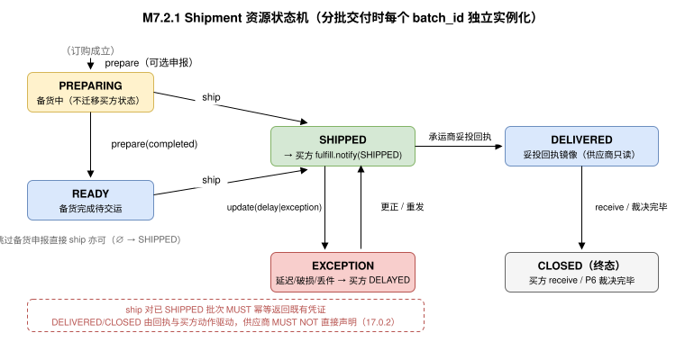

<h1 id="s-m7">M7 · MP5 交付原语（Delivery）</h1>
    <h2 id="s-m7-toc">目录</h2>
    <ul>
      <li><a href="#s-m71">M7.1 Overview（概述）</a></li>
      <li><a href="#s-m72">M7.2 Lifecycle / State Machine（生命周期 / 状态机）</a></li>
      <li><a href="#s-m73">M7.3 Error Handling（错误处理）</a></li>
      <li><a href="#s-m74">M7.4 Scopes（权限范围）</a></li>
      <li><a href="#s-m75">M7.5 Guidelines（角色职责指引）</a></li>
      <li><a href="#s-m76">M7.6 Mode-Driven Behavior（模式驱动行为）</a></li>
      <li><a href="#s-m77">M7.7 与 P5 Fulfill 的事实传导契约</a></li>
      <li><a href="#s-m78">M7.8 Operations 与 Transport Bindings</a></li>
      <li><a href="#s-m79">M7.9 Entities（实体定义）</a></li>
      <li><a href="#s-m710">M7.10 Use Case Walkthroughs（用例演练）</a></li>
    </ul>
    

    <h2 id="s-m7-identity">原语身份</h2>
<pre class="highlight"><code>primitive_id:   utp.delivery
version:        2026-07-31
initiator_role: Seller
handler_role:   Marketplace
intent:         供应商以协议动作完成备货申报、发货、拆单与履约异常申报
state_delta:    purchase_credential → delivery(SHIPPED)（资源作用域）
actions:        prepare, ship, split, update, query
compensation:   异常申报（update: exception/delay）→ 传导为买方侧 DELAYED；
                拒收/争议由 P5/P6 处理，MP5 不定义逆向物流原语
service:        dev.utp.merchant
</code></pre>

    

    <h2 id="s-m71">M7.1 Overview（概述）</h2>
    <h3 id="s-m711">M7.1.1 意图</h3>
    
Delivery 是 UTP-M 第五个供应商原语（MP5），其意图是让供应商以标准协议动作申报<strong>履约执行事实</strong>：备货进度、发货（运单）、分批拆单、延迟与异常。主规范 P5 Fulfill 是"采购方可观测"的履约原语（<a href="../../../primitives/fulfill/index.md#s-1531">15.3.1</a>），其 <code>notify</code> 推送的事实来源在主规范中留白——MP5 正式定义这些事实的产生方式，闭合"供应商发货 → 买方感知"的链路。

    <h3 id="s-m712">M7.1.2 关键设计原则</h3>
    <ul>
      <li><strong>MP5 产生事实，P5 消费事实。</strong>MP5 的每个生效动作 MUST 由 Marketplace 转换为买方侧 <code>fulfill.notify</code> 推送（载荷 <code>FulfillNotifyInput</code>）与 <code>fulfill.query</code> 可查询的履约事件（<code>FulfillmentEvent</code>，M7.7）。买方可观测状态机（SHIPPED/DELAYED/DELIVERED）的驱动源即 MP5。</li>
      <li><strong>备货态是供应商内部状态的最小外露。</strong>主规范明确"备货、待发等供应方内部状态不在（买方可观测）状态机范围内"（15.3.1）。MP5 的 <code>prepare</code> 仅用于供应商向平台申报备货进度（供 <code>leadtime</code> 查询参考与延迟预警），MUST NOT 触发买方可观测状态迁移。</li>
      <li><strong>验收永远在买方。</strong><code>receive</code>/<code>reject</code>/<code>inspect</code> 是 P5 的买方/检验方动作；MP5 不定义任何验收或逆向物流动作，退换货走 P6 Resolve 的补偿指令。</li>
    </ul>
    <h3 id="s-m713">M7.1.3 范围</h3>
    <ul>
      <li><strong>备货申报（prepare）</strong>：申报备货开始/完成，更新预计发货时间。</li>
      <li><strong>发货（ship）</strong>：提交运单（承运商、运单号、包裹明细、批次），产出签名的 Shipment 凭证；触发库存核销（M4.7）。</li>
      <li><strong>拆单（split）</strong>：将一笔订单拆分为多个交付批次（需 Listing 声明 <code>splittable</code> 且已锁定交易条款允许）。</li>
      <li><strong>异常申报（update）</strong>：延迟、破损重发、物流商变更、跨境单证事件等履约事实的补充申报。</li>
      <li><strong>查询（query）</strong>：发货单与批次状态检索。</li>
    </ul>
    <h3 id="s-m714">M7.1.4 前置条件</h3>
    <table>
      <thead><tr><th>条件</th><th>必需？</th><th>说明</th></tr></thead>
      <tbody>
        <tr><td><code>purchase.status == 'PURCHASED'</code></td><td>MUST</td><td>订购已成立（MP4 ACCEPTED 且 P3 原子迁移完成）。</td></tr>
        <tr><td>TradeMethod 履约前置条件已满足</td><td>MUST</td><td>与主规范 15.2.4 前置条件一致：<code>payment_structure == L0</code>（全额预付）时付款完成后方可发货；分期/后付按 TradeMethod 锁定的子步骤执行。</td></tr>
        <tr><td><code>session.state ∈ {FULFILLING, PAYING}</code></td><td>MUST</td><td>分期场景 Pay 与 Fulfill 交叉执行（主规范 15.2.4）。</td></tr>
        <tr><td><code>split → listing.fulfillment_terms.splittable == true</code></td><td>MUST</td><td>拆单需商品声明支持，且已锁定交易条款明确允许分批交付；不得仅根据 <code>fulfillment_structure</code> 等级推导。</td></tr>
      </tbody>
    </table>
    <h3 id="s-m715">M7.1.5 后置条件与语义契约</h3>
<pre class="highlight"><code class="language-json">{
  "primitive": "utp.delivery",
  "postconditions": [
    "delivery.shipment_id != null（ship 成功后）",
    "shipment.status == 'SHIPPED' → 买方收到 fulfill.notify(SHIPPED)",
    "inventory.lock(对应数量) → CONSUMED（M4.7 核销映射）",
    "shipment ∈ evidence_bundle（含运单、签名、时间戳）"
  ],
  "invariants": [
    "Σ(全部批次数量) == purchase.line_items 数量（不多发不漏发）",
    "shipment.transaction_id == purchase.transaction_id",
    "ship 后运单核心字段（承运商、运单号）不可篡改，更正 MUST 以 update 事件追加"
  ],
  "side_effects": [
    "买方侧可观测状态迁移（经 fulfill.notify）",
    "库存核销（LOCKED → CONSUMED）",
    "分期场景：发货事实 MAY 触发下一期支付条件（TradeMethod 子步骤）"
  ],
  "compensation": {
    "on_delay": "update(type=delay) → 买方侧 DELAYED；超过约定时限买方可发起 Resolve",
    "on_logistics_exception": "update(type=exception) + 重发批次（新 package）；原包裹事实保留",
    "on_buyer_reject": "P5 reject → P6 Resolve 补偿指令决定退货/退款；MP5 只读关联"
  }
}
</code></pre>

    

    <h2 id="s-m72">M7.2 Lifecycle / State Machine（生命周期 / 状态机）</h2>
    <h3 id="s-m721">M7.2.1 Shipment 资源状态机（供应商视角）</h3>

    
分批交付时，每个批次（<code>batch_id</code>）独立走上述状态机；订单级视图是全部批次状态的聚合。

    <h3 id="s-m722">M7.2.2 状态定义与迁移规则</h3>
    <table>
      <thead><tr><th>状态</th><th>含义</th><th>进入条件</th><th>允许的操作</th><th>买方可观测映射</th></tr></thead>
      <tbody>
        <tr><td><code>PREPARING</code></td><td>备货中（内部状态外露）</td><td><code>prepare</code> 申报</td><td><code>prepare</code>, <code>ship</code>, <code>split</code>, <code>update</code>, <code>query</code></td><td>无（不迁移买方状态；供 leadtime 参考）</td></tr>
        <tr><td><code>READY</code></td><td>备货完成待交运</td><td><code>prepare(completed)</code></td><td><code>ship</code>, <code>split</code>, <code>update</code>, <code>query</code></td><td>无</td></tr>
        <tr><td><code>SHIPPED</code></td><td>已交运（凭证已生成）</td><td><code>ship</code> 成功（运单校验通过）</td><td><code>update</code>, <code>query</code></td><td><code>fulfill.notify → SHIPPED</code></td></tr>
        <tr><td><code>EXCEPTION</code></td><td>履约异常（延迟/破损/丢件）</td><td><code>update(type=delay|exception)</code></td><td><code>update</code>（更正/重发）, <code>query</code></td><td><code>fulfill.notify → DELAYED</code>（发货前延迟）或异常履约事件</td></tr>
        <tr><td><code>DELIVERED</code></td><td>已妥投（物流回执镜像，只读）</td><td>承运商妥投回执经 Marketplace 确认</td><td><code>query</code></td><td><code>fulfill.notify → DELIVERED</code></td></tr>
        <tr><td><code>CLOSED</code></td><td>批次履约事实闭合（终态）</td><td>买方 <code>receive</code>（或 <code>reject</code> 进入 Resolve 后裁决完毕）</td><td><code>query</code>（只读）</td><td><code>RECEIVED / FULFILLED</code>（P5 内部）</td></tr>
      </tbody>
    </table>
    
<strong>确定性约束：</strong><code>ship</code> 对已 <code>SHIPPED</code> 批次 MUST 幂等返回既有凭证；<code>DELIVERED</code>/<code>CLOSED</code> 由回执与买方动作驱动，供应商 MUST NOT 直接声明（与主规范 17.0.2"状态不能因参与方直接声明目标状态而推进"一致）。

    

    <h2 id="s-m73">M7.3 Error Handling（错误处理）</h2>
    <table>
      <thead><tr><th>错误码</th><th>严重级别</th><th>HTTP 映射</th><th>描述</th><th>建议处理</th></tr></thead>
      <tbody>
        <tr><td><code>DELIVERY.ORDER_NOT_PURCHASED</code></td><td>error</td><td>409</td><td>订购未成立（非 <code>PURCHASED</code>）即尝试发货。</td><td>等待 MP4 受理与 P3 成立。</td></tr>
        <tr><td><code>DELIVERY.PAYMENT_PRECONDITION</code></td><td>error</td><td>409</td><td>TradeMethod 约定的支付前置条件未满足（如定金未确认）。</td><td>等待 PaymentConfirmation。</td></tr>
        <tr><td><code>DELIVERY.QUANTITY_MISMATCH</code></td><td>error</td><td>422</td><td>批次数量合计与订单数量不一致（超发/漏发）。</td><td>校正包裹明细。</td></tr>
        <tr><td><code>DELIVERY.SPLIT_NOT_ALLOWED</code></td><td>error</td><td>403</td><td>商品未声明 <code>splittable</code>，或已锁定交易条款不允许分批交付。</td><td>整单发货或与买方协商变更条款。</td></tr>
        <tr><td><code>DELIVERY.TRACKING_INVALID</code></td><td>error</td><td>422</td><td>运单号格式无效或承运商不可识别。</td><td>校验 <code>carrier_code</code> 与运单号。</td></tr>
        <tr><td><code>DELIVERY.ALREADY_SHIPPED</code></td><td>warning</td><td>409</td><td>批次已发货。</td><td>幂等返回既有 Shipment 凭证。</td></tr>
        <tr><td><code>DELIVERY.OVERDUE</code></td><td>warning</td><td>200</td><td>发货已超过承诺交期（响应内警示，非拒绝）。</td><td>立即发货或 <code>update(delay)</code> 申报延迟。</td></tr>
        <tr><td><code>DELIVERY.NOT_FOUND</code></td><td>error</td><td>404</td><td>发货单/批次不存在或不属于调用方。</td><td>校验标识。</td></tr>
      </tbody>
    </table>

    

    <h2 id="s-m74">M7.4 Scopes（权限范围）</h2>
    <table>
      <thead><tr><th>Scope</th><th>类型</th><th>描述</th><th>授予方</th><th>默认分配</th></tr></thead>
      <tbody>
        <tr><td><code>delivery:prepare</code></td><td>Action Scope</td><td>申报备货进度。</td><td>Marketplace</td><td>Seller 角色（仅本方订单）</td></tr>
        <tr><td><code>delivery:ship</code></td><td>Action Scope</td><td>提交发货凭证。</td><td>Marketplace</td><td>Seller 角色</td></tr>
        <tr><td><code>delivery:split</code></td><td>Action Scope</td><td>声明分批交付计划。</td><td>Marketplace</td><td>Seller 角色（Listing 与已锁定交易条款允许时）</td></tr>
        <tr><td><code>delivery:update</code></td><td>Action Scope</td><td>申报延迟/异常/更正事件。</td><td>Marketplace</td><td>Seller 角色</td></tr>
        <tr><td><code>delivery:query</code></td><td>Action Scope</td><td>查询发货单与批次状态。</td><td>Marketplace</td><td>Seller 角色；Shipper 对其承运批次可读</td></tr>
      </tbody>
    </table>
    
<strong>约束：</strong><code>ship</code> 的 Shipment 凭证 MUST 携带 Seller ES256 签名；当某段履约责任由独立物流方承担时，承运段的轨迹事实由 Shipper 按主规范 <code>Fulfill.track</code> 义务提交，MP5 不代替 Shipper 签名。

    

    <h2 id="s-m75">M7.5 Guidelines（角色职责指引）</h2>
    <h3 id="s-m751">M7.5.1 Seller 角色职责</h3>
    <table>
      <thead><tr><th>职责</th><th>级别</th><th>说明</th></tr></thead>
      <tbody>
        <tr><td>按期发货</td><td>MUST</td><td>MUST 在承诺交期（Listing <code>leadtime_days</code> 或 MP4 修订值）内 <code>ship</code>；预见延迟 MUST 提前 <code>update(delay)</code> 申报。</td></tr>
        <tr><td>运单真实</td><td>MUST</td><td>承运商、运单号 MUST 真实有效；虚假发货（空单号刷时效）是平台治理与 P6 争议中的重责事实。</td></tr>
        <tr><td>包裹明细完整</td><td>MUST</td><td><code>packages[].items</code> MUST 精确到 <code>sku_id + quantity</code>，与订单行对齐；含 <code>external_ref</code> 便于买方与 ERP 对单。</td></tr>
        <tr><td>批次计划先行</td><td>SHOULD</td><td>分批交付 SHOULD 先以 <code>split</code> 声明完整批次计划，再逐批 <code>ship</code>，让买方对齐预期。</td></tr>
        <tr><td>单证同步</td><td>MUST（<code>compliance_level ≥ L2</code>）</td><td>跨境单证（报关、原产地证）事件 MUST 经 <code>update(type=customs)</code> 申报并附文档引用。</td></tr>
      </tbody>
    </table>
    <h3 id="s-m752">M7.5.2 Marketplace 角色职责</h3>
    <table>
      <thead><tr><th>职责</th><th>级别</th><th>说明</th></tr></thead>
      <tbody>
        <tr><td>事实转换</td><td>MUST</td><td>MP5 生效事件 MUST 在声明时限（SHOULD ≤ 60s）内转换为买方侧 <code>fulfill.notify</code> 推送与履约事件流（M7.7 映射表）。</td></tr>
        <tr><td>回执汇聚</td><td>MUST</td><td>MUST 汇聚承运商/Shipper 回执，驱动 <code>DELIVERED</code> 镜像状态，并向供应商推送 <code>delivery_receipt</code> 回调（M2.6.1）。</td></tr>
        <tr><td>凭证归档</td><td>MUST</td><td>Shipment 凭证、异常事件、回执 MUST 纳入 Evidence Bundle，保存期不低于争议时效期。</td></tr>
        <tr><td>时效监控</td><td>SHOULD</td><td>SHOULD 监控发货时效并在临近超期时预警供应商（<code>DELIVERY.OVERDUE</code> 警示）。</td></tr>
      </tbody>
    </table>

    

    <h2 id="s-m76">M7.6 Mode-Driven Behavior（模式驱动行为）</h2>
    <table>
      <thead><tr><th>Mode 配置</th><th>MP5 行为</th></tr></thead>
      <tbody>
        <tr><td>fulfillment=L0（直接履约）</td><td>Seller 自行配送：<code>ship</code> 的 <code>carrier_code</code> MAY 为 <code>self_delivery</code>；轨迹事件由 Seller 经 <code>update</code> 自行申报。</td></tr>
        <tr><td>fulfillment=L1（标准委托）</td><td><code>ship</code> MUST 携带承运商与运单号；轨迹由承运商数据源汇聚。</td></tr>
        <tr><td>fulfillment=L2（分阶段履约）</td><td>阶段性发货事实和凭证 MUST 可关联到所属履约阶段；<code>split</code> 仅在交易条款允许时可用；某阶段要求独立检验时，<code>INSPECTED</code> 结论由 Inspector 提交（P5），MP5 只读。</td></tr>
        <tr><td>fulfillment=L3（跨境）</td><td><code>update</code> 事件类型扩展 <code>customs</code>/<code>document</code>；清关事实经 <code>fulfill.notify</code> 进入买方可观测履约事件流（<code>FulfillNotifyInput.event_type = CUSTOMS</code>）。</td></tr>
        <tr><td>payment=L1+（分期/里程碑）</td><td><code>ship</code>/<code>DELIVERED</code>/检验合格等事实按 TradeMethod 子步骤 MAY 触发下一期支付条件；MP5 响应 MUST 回显所触发的子步骤标识。</td></tr>
        <tr><td>type=service/digital（服务/虚拟）</td><td>物流状态跳过：<code>ship</code> 语义为"服务激活/交付物开通"，<code>tracking</code> 字段以激活凭证替代（主规范 15.6 虚拟商品条款的供给侧对应）。</td></tr>
      </tbody>
    </table>

    

    <h2 id="s-m77">M7.7 与 P5 Fulfill 的事实传导契约（Interlock with P5）</h2>
    
本节是闭环不变式 4（<a href="../../overview.md#s-m16">M1.6</a>）的规范定义。Marketplace MUST 按下表执行 MP5 → P5 的事实转换：

    <table>
      <thead><tr><th>MP5 事件</th><th>买方侧 <code>fulfill.notify</code></th><th><code>FulfillNotifyInput.status</code></th><th>买方可观测状态</th></tr></thead>
      <tbody>
        <tr><td><code>ship</code> 成功</td><td>发货通知（含运单、批次、ETA）</td><td><code>SHIPPED</code></td><td><code>SHIPPED</code></td></tr>
        <tr><td><code>update(type=delay)</code>（发货前）</td><td>延迟通知（含新 ETA 与原因）</td><td><code>DELAYED</code></td><td><code>DELAYED</code></td></tr>
        <tr><td><code>update(type=exception)</code>（在途）</td><td>异常通知</td><td><code>IN_TRANSIT</code>（附异常描述）</td><td>不变（事件流可见）</td></tr>
        <tr><td>承运商妥投回执</td><td>妥投通知</td><td><code>DELIVERED</code></td><td><code>DELIVERED</code></td></tr>
        <tr><td><code>update(type=customs)</code></td><td>清关事件（L3）</td><td><code>CUSTOMS</code></td><td>不变（事件流可见）</td></tr>
      </tbody>
    </table>
    <ul>
      <li><code>shipment_id</code>、<code>batch_id</code>、<code>tracking_number</code> 在两侧 MUST 同值——买方 <code>track</code> 查到的与供应商 <code>query</code> 查到的 是同一记录的两个投影（字段可见性按角色权限裁剪）。</li>
      <li>转换生成的通知载荷 MUST 符合主规范 <a href="../../../primitives/fulfill/index.md#s-1571">订单履约事件通知（notify）</a>定义的 <code>FulfillNotifyInput</code> 结构并携带 <code>transaction_id</code>。</li>
      <li>买方 <code>receive</code> 生成的收货凭证（<code>FulfillReceiveOutput</code>）、<code>reject</code> 生成的拒收凭证（<code>FulfillRejectOutput</code>，含 <code>RejectionConfirmation</code>）MUST 经回调 <code>utp.delivery.receipt</code> 通知供应商（M2.6.1），驱动 MP5 侧 <code>CLOSED</code>。</li>
      <li>全部批次 <code>CLOSED</code> 且其他义务完成后，全局状态是否迁移 <code>SETTLED</code> 由全局状态机决定（主规范 15.3.2），MP5 不参与该判定。</li>
    </ul>

    

    <h2 id="s-m78">M7.8 Operations 与 Transport Bindings</h2>
    <h3 id="s-m781">M7.8.1 操作矩阵</h3>
    <table>
      <thead><tr><th>操作</th><th>适用状态</th><th>状态影响</th><th><code>valid_next_actions</code></th><th>关键约束</th></tr></thead>
      <tbody>
        <tr><td><code>utp.delivery.prepare</code></td><td>（订购成立后）, <code>PREPARING</code></td><td>进入/更新 <code>PREPARING</code>；<code>completed</code> 时进入 <code>READY</code></td><td><code>ship</code>, <code>split</code>, <code>update</code>, <code>query</code></td><td>Seller；可选动作；不触发买方状态迁移。</td></tr>
        <tr><td><code>utp.delivery.split</code></td><td><code>PREPARING</code>, <code>READY</code></td><td>登记批次计划（不发货）</td><td><code>ship</code>, <code>update</code>, <code>query</code></td><td>Seller；MUST 满足 Listing 的 <code>splittable</code> 声明与已锁定交易条款；批次数量合计 == 订单数量。</td></tr>
        <tr><td><code>utp.delivery.ship</code></td><td><code>PREPARING</code>, <code>READY</code>（或直接首次调用）</td><td>批次进入 <code>SHIPPED</code>；生成签名凭证；库存核销；触发买方 notify</td><td><code>update</code>, <code>query</code></td><td>Seller；MUST 附运单与包裹明细；MUST 携带 Seller 签名；幂等。</td></tr>
        <tr><td><code>utp.delivery.update</code></td><td><code>PREPARING</code>, <code>READY</code>, <code>SHIPPED</code>, <code>EXCEPTION</code></td><td>追加事件（delay/exception/customs/correction）；delay 使买方侧 <code>DELAYED</code></td><td><code>ship</code>（重发）, <code>query</code></td><td>Seller；事件 MUST 附结构化类型与说明；不可覆盖既有事实，只可追加。</td></tr>
        <tr><td><code>utp.delivery.query</code></td><td>任意</td><td>无</td><td>当前状态可执行动作</td><td>Seller；按 <code>transaction_id</code>/<code>shipment_id</code>/<code>batch_id</code> 查询，含回执与买方验收结论镜像。</td></tr>
      </tbody>
    </table>
    <h3 id="s-m782">M7.8.2 传输绑定</h3>
    <table>
      <thead><tr><th>操作</th><th>REST</th><th>MCP Tool</th><th>A2A Task</th></tr></thead>
      <tbody>
        <tr><td><code>prepare</code></td><td><code>POST /utp/m/v1/deliveries/preparations</code></td><td><code>utp_delivery_prepare</code></td><td><code>utp:delivery:prepare</code></td></tr>
        <tr><td><code>split</code></td><td><code>POST /utp/m/v1/deliveries/split-plans</code></td><td><code>utp_delivery_split</code></td><td><code>utp:delivery:split</code></td></tr>
        <tr><td><code>ship</code></td><td><code>POST /utp/m/v1/deliveries</code></td><td><code>utp_delivery_ship</code></td><td><code>utp:delivery:ship</code></td></tr>
        <tr><td><code>update</code></td><td><code>POST /utp/m/v1/deliveries/{shipment_id}/events</code></td><td><code>utp_delivery_update</code></td><td><code>utp:delivery:update</code></td></tr>
        <tr><td><code>query</code></td><td><code>GET /utp/m/v1/deliveries?transaction_id=&amp;shipment_id=</code></td><td><code>utp_delivery_query</code></td><td><code>utp:delivery:query</code></td></tr>
      </tbody>
    </table>
    
标识符与参数一律置于请求体（与主规范 15.8.1 的 Fulfill REST 风格一致）；全部写操作 MUST 携带 <code>idempotency_key</code>。

    

    <h2 id="s-m79">M7.9 Entities（实体定义）</h2>
    <h3 id="s-m791">M7.9.1 Shipment（发货凭证）</h3>
    <table>
      <thead><tr><th>字段名</th><th>类型</th><th>必填</th><th>描述</th></tr></thead>
      <tbody>
        <tr><td><code>shipment_id</code></td><td>string</td><td>是</td><td>发货单唯一标识；与主规范 P5 履约事件与 <code>Shipment</code> 实体的 <code>shipment_id</code> 同值。</td></tr>
        <tr><td><code>transaction_id</code> / <code>purchase_id</code></td><td>string</td><td>是</td><td>关联全局事务与订购标识。</td></tr>
        <tr><td><code>batch_id</code></td><td>string</td><td>条件</td><td>批次标识；分批交付时必填，整单发货可省略。</td></tr>
        <tr><td><code>status</code></td><td>enum</td><td>是</td><td>M7.2.2 状态枚举。</td></tr>
        <tr><td><code>carrier_code</code></td><td>string</td><td>是</td><td>承运商标识（标准承运商码表或 <code>self_delivery</code>）。</td></tr>
        <tr><td><code>tracking_number</code></td><td>string</td><td>条件</td><td>运单号；<code>self_delivery</code>/虚拟交付可以激活凭证替代。</td></tr>
        <tr><td><code>packages</code></td><td>Package[]</td><td>是</td><td>包裹明细（M7.9.2），至少一件。</td></tr>
        <tr><td><code>ships_from</code></td><td>string</td><td>是</td><td>实际发货地。</td></tr>
        <tr><td><code>estimated_delivery_at</code></td><td>ISO-8601</td><td>否</td><td>预计送达时间（ETA）。</td></tr>
        <tr><td><code>shipped_at</code></td><td>ISO-8601</td><td>是</td><td>交运时间。</td></tr>
        <tr><td><code>document_refs</code></td><td>array</td><td>否</td><td>单证引用（发货单、报关单、原产地证等）；<code>compliance_level ≥ L2</code> 时按要求必附。</td></tr>
        <tr><td><code>seller_signature</code></td><td>string</td><td>是</td><td>Seller ES256 签名（JWS），覆盖 <code>shipment_hash</code>。<strong>shipment_hash 定义（规范性）：</strong>对对象 <code>{transaction_id, batch_id, carrier_code, tracking_number, packages, ships_from, shipped_at}</code>（缺省字段省略键）按 RFC 8785（JCS）规范化后的 UTF-8 字节串计算 SHA-256，十六进制小写串作为 JWS payload（统一规则见 M1.10）。Marketplace MUST 重算并验证，不一致返回 <code>DELIVERY.TRACKING_INVALID</code>。</td></tr>
      </tbody>
    </table>
    <h3 id="s-m792">M7.9.2 Package</h3>
    <table>
      <thead><tr><th>字段名</th><th>类型</th><th>必填</th><th>描述</th></tr></thead>
      <tbody>
        <tr><td><code>package_no</code></td><td>string</td><td>是</td><td>包裹编号（发货单内唯一）。</td></tr>
        <tr><td><code>items</code></td><td>array</td><td>是</td><td>装箱明细：<code>{listing_id, sku_id, external_ref, quantity}</code>。</td></tr>
        <tr><td><code>weight_kg</code> / <code>dimensions_cm</code></td><td>number / object</td><td>否</td><td>重量与体积（长宽高）。</td></tr>
      </tbody>
    </table>
    <h3 id="s-m793">M7.9.3 ShipmentEvent（异常/补充事件）</h3>
    <table>
      <thead><tr><th>字段名</th><th>类型</th><th>必填</th><th>描述</th></tr></thead>
      <tbody>
        <tr><td><code>event_id</code></td><td>string</td><td>是</td><td>事件唯一标识。</td></tr>
        <tr><td><code>shipment_id</code></td><td>string</td><td>是</td><td>关联发货单。</td></tr>
        <tr><td><code>type</code></td><td>enum</td><td>是</td><td><code>delay</code> / <code>exception</code> / <code>customs</code> / <code>document</code> / <code>correction</code>。</td></tr>
        <tr><td><code>reason_code</code></td><td>string</td><td>是</td><td>结构化原因码（如 <code>stockout_delay</code>、<code>carrier_lost</code>、<code>customs_inspection</code>）。</td></tr>
        <tr><td><code>detail</code></td><td>string</td><td>否</td><td>补充说明。</td></tr>
        <tr><td><code>new_eta</code></td><td>ISO-8601</td><td>条件</td><td><code>type == delay</code> 时必填。</td></tr>
        <tr><td><code>evidence_refs</code></td><td>array</td><td>否</td><td>证据引用（破损照片、承运商异常单等）。</td></tr>
        <tr><td><code>occurred_at</code></td><td>ISO-8601</td><td>是</td><td>事件时间。</td></tr>
        <tr><td><code>seller_signature</code></td><td>string</td><td>是</td><td>Seller ES256 签名。</td></tr>
      </tbody>
    </table>
    <h3 id="s-m794">M7.9.4 SplitPlan</h3>
    
<code>SplitPlan</code> 记录 <code>plan_id</code>、<code>transaction_id</code>、批次数组（每批 <code>batch_id</code>、商品明细、计划发货时间）与 <code>seller_signature</code>（覆盖 <code>plan_hash</code>：对 <code>{transaction_id, batches}</code> 按 RFC 8785 规范化后的 SHA-256，统一规则见 M1.10）。批次数量合计 MUST 等于订单数量；计划登记后各批次按 <code>ship</code> 独立执行，计划变更以新版本追加（不可删除已发货批次）。

    

    <h2 id="s-m710">M7.10 Use Case Walkthroughs（用例演练）</h2>
    <h3 id="s-m7101">M7.10.1 标准发货与买方感知</h3>
<pre class="highlight"><code class="language-json">// Seller 发货
POST /utp/m/v1/deliveries
{
  "idempotency_key": "idem-ship-20260723-001",
  "transaction_id": "utp-txn-01J4X7K9M2P5Q8R3V6W0YZ",
  "purchase_id": "ORD-20260722-88721",
  "shipment": {
    "carrier_code": "SF",
    "tracking_number": "SF1234567890123",
    "ships_from": "上海",
    "estimated_delivery_at": "2026-07-26T18:00:00Z",
    "packages": [
      { "package_no": "PKG-001",
        "items": [ { "listing_id": "item-BT-NC-001", "sku_id": "sku-X3-BLK",
                     "external_ref": "ERP-MAT-004512", "quantity": 100 } ],
        "weight_kg": 25.0 }
    ]
  },
  "seller_signature": "eyJhbGciOiJFUzI1NiJ9..."
}

// 响应
{
  "shipment_id": "shp-20260723-0442",
  "status": "SHIPPED",
  "inventory_effect": { "sku-X3-BLK": { "locked_consumed": 100 } },
  "valid_next_actions": ["utp.delivery.update", "utp.delivery.query"]
}

// Marketplace 同步转换为买方侧 fulfill.notify（主规范 15.7.1）：
// POST {buyer_callback_base}/utp/v1/fulfillments/notifications
// { "transaction_id": "...", "shipment_id": "shp-20260723-0442",
//   "status": "SHIPPED", "tracking_number": "SF1234567890123", ... }
</code></pre>
    <h3 id="s-m7102">M7.10.2 延迟申报与分批发货</h3>
<pre class="highlight"><code>延迟：POST /utp/m/v1/deliveries/{id}/events
      { "type": "delay", "reason_code": "stockout_delay",
        "new_eta": "2026-07-30T18:00:00Z" }
      → 买方可观测状态 → DELAYED；买方可依约发起 Resolve 或等待

分批：split（批次 A 60 件 / 批次 B 40 件）→ ship(A) → 买方 receive(A)
      → PARTIAL_DELIVERED（P5）→ ship(B) → receive(B) → FULFILLED
</code></pre>
