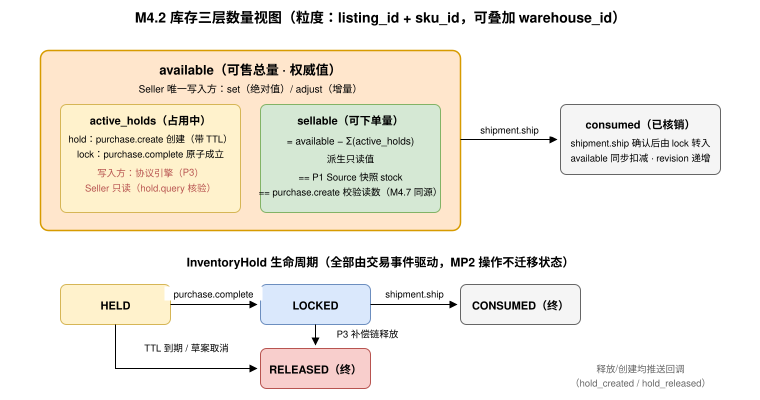

<h1 id="s-m4">库存原语（Inventory）</h1>
    <h2 id="s-m4-toc">目录</h2>
    <ul>
      <li><a href="#s-m41">Overview（概述）</a></li>
      <li><a href="#s-m42">库存模型（Inventory Model）</a></li>
      <li><a href="#s-m43">Error Handling（错误处理）</a></li>
      <li><a href="#s-m44">Scopes（权限范围）</a></li>
      <li><a href="#s-m45">Guidelines（角色职责指引）</a></li>
      <li><a href="#s-m46">Mode-Driven Behavior（模式驱动行为）</a></li>
      <li><a href="#s-m47">与 P3 Purchase 的库存一致性契约（Interlock with P3）</a></li>
      <li><a href="#s-m48">操作矩阵（Operations Matrix）</a></li>
      <li><a href="#s-m49">Entities（实体定义）</a></li>
      <li><a href="#s-m410">Use Case Walkthroughs（用例演练）</a></li>
    </ul>
    

    <h2 id="s-m4-identity">原语身份</h2>
<pre class="highlight"><code>primitive_id:   utp.inventory
version:        2026-07-31
initiator_role: Seller
handler_role:   Marketplace
intent:         供应商维护商品可售数量，并与交易性占用（hold/lock）保持可核验一致
state_delta:    inventory.available 数值变更（资源作用域，无独立状态机）
actions:        set, adjust, query, hold.query, batch
compensation:   adjust（反向调整）；交易性占用的释放由 P3 补偿链触发
service:        dev.utp.merchant
</code></pre>

    

    <h2 id="s-m41">Overview（概述）</h2>
    <h3 id="s-m411">意图</h3>
    
Inventory 是 UTP-M 第二个供应商原语（MP2），其意图是让供应商维护 SKU 级可售数量（<code>available</code>），并让交易过程中由 P3 Purchase 触发的库存占用（hold）与锁定（lock）对供应商<strong>可见、可查询、可对账</strong>。Inventory 是防止超卖的协议基础。

    <h3 id="s-m412">关键设计原则</h3>
    <ul>
      <li><strong>数量与信息分离：</strong>Inventory 只管数量，商品信息属于 MP1。二者可独立变更、独立授权、独立限流（库存变更频率通常比商品信息高 2—3 个数量级）。</li>
      <li><strong>供应商是数量的唯一权威写入方：</strong><code>available</code> 只能由 Seller 通过 <code>set</code>/<code>adjust</code> 写入；Marketplace MUST NOT 主动修改 <code>available</code>，只能在其上叠加交易性占用。</li>
      <li><strong>交易性占用是 P3 的副作用，不是 MP2 的 Action：</strong>hold（临时占用）与 lock（最终锁定）由 UTP-B 规范 <code>purchase.create</code>/<code>complete</code> 触发（<a href="../../../primitives/purchase/index.md#s-1352-seller">《Seller 角色职责》 Seller 职责"锁定库存"</a>），MP2 提供 <code>hold.query</code> 让供应商核验占用明细。这保持了 P3 与 MP2 的正交：P3 消费库存，MP2 供给库存。</li>
      <li><strong>乐观并发：</strong>写操作 MUST 携带 <code>expected_revision</code>（乐观锁）或声明 <code>commutative: true</code>（纯增量可交换模式，仅 <code>adjust</code>），防止 ERP 回写与平台扣减的并发丢失更新（库存一致性与防超卖（Inventory Consistency） 的防超卖基础）。<strong>最简接入路径：</strong>日常同步只用 <code>adjust + commutative: true</code>（无需维护版本号、天然抗乱序重试），仅在盘点校准时用 <code>set + expected_revision</code>——两个操作、两个场景，足以覆盖全部库存需求。</li>
    </ul>
    <h3 id="s-m413">前置条件与后置条件</h3>
    <table>
      <thead><tr><th>条件</th><th>类型</th><th>说明</th></tr></thead>
      <tbody>
        <tr><td><code>listing.status ∈ {PUBLISHED, LISTED, DELISTED}</code></td><td>前置 MUST</td><td>库存挂在已建档商品的 SKU 上；<code>ARCHIVED</code> 商品 MUST 拒绝写入。</td></tr>
        <tr><td><code>merchant.status ∈ {ACTIVE, RESTRICTED}</code></td><td>前置 MUST</td><td><code>RESTRICTED</code> 仅允许下调（保护既有订单履行）。</td></tr>
        <tr><td><code>inventory.available >= 0</code></td><td>后置 MUST</td><td>任何操作后可售数量不为负。</td></tr>
        <tr><td><code>inventory.revision</code> 单调递增</td><td>后置 MUST</td><td>每次生效写入递增，供对账与并发控制。</td></tr>
      </tbody>
    </table>
    <h3 id="s-m414">语义契约</h3>
<pre class="highlight"><code class="language-json">{
  "primitive": "utp.inventory",
  "preconditions": [
    "listing.status ∈ {PUBLISHED, LISTED, DELISTED}",
    "merchant.status ∈ {ACTIVE, RESTRICTED}",
    "write_op → request.expected_revision != null"
  ],
  "postconditions": [
    "inventory.available >= 0",
    "inventory.revision == previous.revision + 1（生效写入时）",
    "sellable(sku) == available - Σ(active_holds) 且 >= 0"
  ],
  "invariants": [
    "available 只能由 Seller 写入；hold/lock 只能由 P3 交易事件产生",
    "任意时刻 Σ(active_holds) <= available",
    "source 返回的 stock 快照 == 查询时点 sellable(sku)（非绑定）"
  ],
  "side_effects": [
    "sellable 归零/恢复时，Source 投影的 in_stock 标记同步翻转",
    "低于 low_stock_threshold 时向供应商推送预警（可选配置）"
  ],
  "compensation": {
    "on_concurrent_conflict": "返回 INVENTORY.REVISION_CONFLICT，调用方重读后重试",
    "on_purchase_failure": "P3 补偿链释放 hold/lock（UTP-B 规范 13.3.2），MP2 侧 hold 记录状态 → RELEASED"
  }
}
</code></pre>

    

    <h2 id="s-m42">库存模型（Inventory Model）</h2>
    
MP2 定义三层数量视图，粒度为 <code>listing_id + sku_id</code>（可选叠加 <code>warehouse_id</code> 多仓维度）：

    <table>
      <thead><tr><th>数量语义</th><th>写入方</th><th>变更途径</th></tr></thead>
      <tbody>
        <tr><td><code>available</code></td><td>Seller</td><td><code>set</code>（绝对值覆盖）/ <code>adjust</code>（增量）；发货核销时系统扣减</td></tr>
        <tr><td><code>hold</code>（临时占用）</td><td>协议引擎（P3）</td><td><code>purchase.create</code> 创建（带 TTL）；草案取消/过期释放</td></tr>
        <tr><td><code>lock</code>（最终锁定）</td><td>协议引擎（P3）</td><td><code>purchase.complete</code> 原子成立；P3 补偿链释放</td></tr>
        <tr><td><code>consumed</code>（已核销）</td><td>协议引擎（MP5）</td><td><code>delivery.ship</code> 确认后由 lock 转入</td></tr>
        <tr><td><code>sellable</code></td><td>派生</td><td>只读，= <code>available - Σ(active_holds)</code></td></tr>
      </tbody>
    </table>
    
Inventory 无独立资源状态机；<code>hold</code> 记录具有生命周期：<code>HELD → LOCKED → CONSUMED</code> 或 <code>HELD/LOCKED → RELEASED</code>，全部由交易事件驱动，供应商通过 <code>hold.query</code> 只读核验。

    

    <h2 id="s-m43">Error Handling（错误处理）</h2>
    <table>
      <thead><tr><th>错误码</th><th>严重级别</th><th>HTTP 映射</th><th>描述</th><th>建议处理</th></tr></thead>
      <tbody>
        <tr><td><code>INVENTORY.SKU_NOT_FOUND</code></td><td>error</td><td>404</td><td><code>listing_id + sku_id</code> 不存在或不属于调用方。</td><td>校验标识。</td></tr>
        <tr><td><code>INVENTORY.REVISION_CONFLICT</code></td><td>error</td><td>409</td><td><code>expected_revision</code> 与当前不一致（并发写入）。</td><td><code>query</code> 重读后重试；Bridge 场景见 库存一致性与防超卖（Inventory Consistency）。</td></tr>
        <tr><td><code>INVENTORY.NEGATIVE_RESULT</code></td><td>error</td><td>422</td><td>操作将导致 <code>available &lt; Σ(active_holds)</code> 或负值。</td><td>下调幅度不得低于当前占用量；先待占用释放。</td></tr>
        <tr><td><code>INVENTORY.LISTING_ARCHIVED</code></td><td>error</td><td>409</td><td>商品已归档，库存不可写。</td><td>无需操作。</td></tr>
        <tr><td><code>INVENTORY.MERCHANT_RESTRICTED</code></td><td>error</td><td>403</td><td><code>RESTRICTED</code> 商户尝试上调库存。</td><td>仅允许下调；联系平台。</td></tr>
        <tr><td><code>INVENTORY.RATE_LIMITED</code></td><td>warning</td><td>429</td><td>变更频率超限。</td><td>合并变更或使用批量接口。</td></tr>
        <tr><td><code>INVENTORY.HOLD_NOT_FOUND</code></td><td>error</td><td>404</td><td>查询的 <code>hold_id</code> 不存在。</td><td>以 <code>transaction_id</code> 维度重查。</td></tr>
      </tbody>
    </table>

    

    <h2 id="s-m44">Scopes（权限范围）</h2>
    <table>
      <thead><tr><th>Scope</th><th>类型</th><th>描述</th><th>授予方</th><th>默认分配</th></tr></thead>
      <tbody>
        <tr><td><code>inventory:set</code></td><td>Action Scope</td><td>绝对值覆盖可售数量。</td><td>Marketplace</td><td>Seller 角色（仅本方 SKU）</td></tr>
        <tr><td><code>inventory:adjust</code></td><td>Action Scope</td><td>增量调整可售数量。</td><td>Marketplace</td><td>Seller 角色（仅本方 SKU）</td></tr>
        <tr><td><code>inventory:query</code></td><td>Action Scope</td><td>查询数量视图与 revision。</td><td>Marketplace</td><td>Seller 角色（仅本方 SKU）</td></tr>
        <tr><td><code>inventory:hold:query</code></td><td>Action Scope</td><td>查询占用/锁定明细。</td><td>Marketplace</td><td>Seller 角色（仅本方 SKU）</td></tr>
      </tbody>
    </table>
    
<strong>权限约束：</strong>不存在 <code>hold:create</code>/<code>hold:release</code> Scope——占用的创建与释放是 P3 交易事件的副作用，任何角色 MUST NOT 通过 MP2 直接操纵占用。

    

    <h2 id="s-m45">Guidelines（角色职责指引）</h2>
    <h3 id="s-m451">Seller 角色职责</h3>
    <table>
      <thead><tr><th>职责</th><th>级别</th><th>说明</th></tr></thead>
      <tbody>
        <tr><td>数量真实</td><td>MUST</td><td><code>available</code> MUST 反映真实可履约数量；系统性虚高导致的高拒单率是平台治理（<a href="onboarding.md#s-m27">商户生命周期状态（Merchant Lifecycle）</a> <code>RESTRICTED</code>）的依据。</td></tr>
        <tr><td>及时同步</td><td>MUST</td><td>线下渠道或多平台销售导致实际库存变化时，MUST 及时下调；SHOULD 通过 Bridge 事件驱动同步（同步模式（Synchronization Patterns））。</td></tr>
        <tr><td>使用 adjust 而非 set</td><td>SHOULD</td><td>并发环境下 SHOULD 优先使用增量 <code>adjust</code>（交换律成立，冲突率低）；<code>set</code> 仅用于全量校准。</td></tr>
        <tr><td>预警配置</td><td>SHOULD</td><td>SHOULD 配置 <code>low_stock_threshold</code>，在低库存预警时补货或主动 <code>delist</code>。</td></tr>
      </tbody>
    </table>
    <h3 id="s-m452">Marketplace 角色职责</h3>
    <table>
      <thead><tr><th>职责</th><th>级别</th><th>说明</th></tr></thead>
      <tbody>
        <tr><td>占用可见</td><td>MUST</td><td>每笔 hold/lock MUST 关联 <code>transaction_id</code> 并可被 <code>hold.query</code> 查询；创建与释放 MUST 推送回调事件（<a href="onboarding.md#s-m261">回调事件类型注册表</a>）。</td></tr>
        <tr><td>TTL 强制</td><td>MUST</td><td>临时 hold MUST 有有效期；到期 MUST 自动释放并推送 <code>hold_released</code>（与 UTP-B 规范 《状态定义与迁移规则》 草案过期一致）。</td></tr>
        <tr><td>快照非绑定声明</td><td>MUST</td><td>Source 投影中的 <code>stock</code> 是查询时点快照，MUST 遵循 UTP-B 规范 《与全局状态机的关系》 非绑定信息声明。</td></tr>
        <tr><td>原子扣减</td><td>MUST</td><td><code>purchase.complete</code> 的最终锁定与 MP2 数量视图的变更 MUST 原子一致（同一事务或可线性化等价）。</td></tr>
      </tbody>
    </table>

    

    <h2 id="s-m46">Mode-Driven Behavior（模式驱动行为）</h2>
    <table>
      <thead><tr><th>Mode 维度</th><th>对 Inventory 的影响</th></tr></thead>
      <tbody>
        <tr><td><code>decision_path</code> L0（即时下单）</td><td>hold 生命周期极短（create→complete 秒级），TTL SHOULD ≤ 30 分钟。</td></tr>
        <tr><td><code>decision_path</code> L2+（审批流）</td><td>草案可能长时间停留，hold TTL 由 Mode 协商的超时配置决定（UTP 规范 《会话超时上下文》）；供应商 SHOULD 关注长期占用。</td></tr>
        <tr><td><code>fulfillment_structure</code> L2（分阶段履约）</td><td>当某履约阶段包含数量交付义务时，lock MUST 按该阶段实际交付数量核销，剩余数量保持 LOCKED；是否采用分批发货由已锁定交易条款决定。</td></tr>
        <tr><td><code>relationship_mode</code> L2+（框架协议）</td><td>MAY 为框架协议客户配置专属库存池（<code>pool_id</code>），框架内订单优先从专属池占用。</td></tr>
      </tbody>
    </table>

    

    <h2 id="s-m47">与 P3 Purchase 的库存一致性契约（Interlock with P3）</h2>
    
本节是闭环不变式 2（商品—交易闭环（End-to-End Loop））的规范定义。平台托管拓扑下，协议引擎 MUST 保证：

    <ol>
      <li><strong>同源：</strong><code>purchase.create</code> 校验库存可用性（UTP-B 规范 《Seller 角色职责》 Seller 职责与 《操作定义（Actions）》 操作定义）读取的数量 == MP2 的 <code>sellable</code>。</li>
      <li><strong>hold 映射：</strong><code>purchase.create</code> 创建的临时库存 hold（UTP-B 规范 《Seller 角色职责》）MUST 生成 MP2 InventoryHold 记录（状态 <code>HELD</code>，含 <code>transaction_id</code>、TTL）。</li>
      <li><strong>lock 映射：</strong><code>purchase.complete</code> 的原子迁移条件之一"最终库存锁定成功"（UTP-B 规范 《状态迁移的原子性》）在 MP2 侧表现为对应 hold 状态 <code>HELD → LOCKED</code>；若无先行 hold，则直接创建 <code>LOCKED</code> 记录。</li>
      <li><strong>释放映射：</strong>P3 补偿链（UTP-B 规范 《补偿链执行》"释放已锁库存"）执行时，MP2 侧对应记录 MUST 迁移至 <code>RELEASED</code> 并推送 <code>hold_released</code> 回调。</li>
      <li><strong>核销映射：</strong>MP5 <code>delivery.ship</code> 确认后，对应 <code>LOCKED</code> 数量迁移至 <code>CONSUMED</code>，<code>available</code> 同步扣减（<a href="#s-m42">库存模型（Inventory Model）</a>）。</li>
      <li><strong>证据：</strong>P3 要求的 <code>inventory_receipt</code> / <code>inventory_release_receipt</code>（UTP-B 规范状态机 T5 与 C-PURCHASE-FAILURE 的 required_evidence）由 Marketplace 基于 InventoryHold 状态迁移记录生成，供应商可通过 <code>hold.query</code> 获取同一记录用于对账。</li>
    </ol>
    
自托管拓扑下，上述契约退化为供应商 Endpoint 的内部实现义务（其对买方承诺的 《Seller 角色职责》 职责不变）。

    

    <h2 id="s-m48">操作矩阵（Operations Matrix）</h2>
    <h3 id="s-m481">操作矩阵</h3>
    <table>
      <thead><tr><th>操作</th><th>语义</th><th><code>valid_next_actions</code></th><th>关键约束</th></tr></thead>
      <tbody>
        <tr><td><code>utp.inventory.set</code></td><td>绝对值覆盖 <code>available</code></td><td><code>query</code>, <code>adjust</code></td><td>Seller；MUST 携带 <code>expected_revision</code>；结果不得低于当前占用量。</td></tr>
        <tr><td><code>utp.inventory.adjust</code></td><td>增量调整（±delta）</td><td><code>query</code>, <code>adjust</code></td><td>Seller；MUST 携带 <code>expected_revision</code> 或声明 <code>commutative: true</code>（纯增量模式，跳过版本检查）；结果非负。</td></tr>
        <tr><td><code>utp.inventory.query</code></td><td>查询数量视图</td><td><code>set</code>, <code>adjust</code>, <code>hold.query</code></td><td>Seller；支持按 <code>listing_id</code>/<code>sku_id</code> 批量查询。</td></tr>
        <tr><td><code>utp.inventory.hold.query</code></td><td>查询占用明细</td><td><code>query</code></td><td>Seller；支持按 <code>sku_id</code>/<code>transaction_id</code>/状态筛选，分页。</td></tr>
        <tr><td><code>utp.inventory.batch</code></td><td>同 <code>set</code>/<code>adjust</code>，批量提交</td><td>逐条同单条操作</td><td>Seller；单批 ≤ 500 条、逐条独立成败，MAY 异步；规则同 <a href="primitives/listing/index.md#s-m372">批量模式（Batch Mode）</a>。</td></tr>
      </tbody>
    </table>
<h2 id="s-m49">Entities（实体定义）</h2>
    <h3 id="s-m491">InventoryRecord</h3>
    <table>
      <thead><tr><th>字段名</th><th>类型</th><th>必填</th><th>描述</th></tr></thead>
      <tbody>
        <tr><td><code>listing_id</code></td><td>string</td><td>是</td><td>商品标识（<a href="primitives/listing/index.md#s-m391">Listing</a>）。</td></tr>
        <tr><td><code>sku_id</code></td><td>string</td><td>是</td><td>SKU 标识。</td></tr>
        <tr><td><code>warehouse_id</code></td><td>string</td><td>否</td><td>仓库维度标识；缺省为单仓合并视图。</td></tr>
        <tr><td><code>available</code></td><td>integer</td><td>是</td><td>可售总量（Seller 权威值）。</td></tr>
        <tr><td><code>held</code></td><td>integer</td><td>是</td><td>当前临时占用合计（派生）。</td></tr>
        <tr><td><code>locked</code></td><td>integer</td><td>是</td><td>当前最终锁定合计（派生）。</td></tr>
        <tr><td><code>sellable</code></td><td>integer</td><td>是</td><td>可下单量 = <code>available - held - locked</code>（派生）。</td></tr>
        <tr><td><code>revision</code></td><td>integer</td><td>是</td><td>版本号，单调递增。</td></tr>
        <tr><td><code>low_stock_threshold</code></td><td>integer</td><td>否</td><td>低库存预警阈值。</td></tr>
        <tr><td><code>updated_at</code></td><td>ISO-8601</td><td>是</td><td>最近变更时间。</td></tr>
      </tbody>
    </table>
    <h3 id="s-m492">InventoryAdjustment</h3>
    <table>
      <thead><tr><th>字段名</th><th>类型</th><th>必填</th><th>描述</th></tr></thead>
      <tbody>
        <tr><td><code>adjustment_id</code></td><td>string</td><td>是</td><td>调整记录唯一标识。</td></tr>
        <tr><td><code>listing_id</code> / <code>sku_id</code></td><td>string</td><td>是</td><td>目标 SKU。</td></tr>
        <tr><td><code>delta</code></td><td>integer</td><td>是</td><td>调整量（正为补货，负为核减）。</td></tr>
        <tr><td><code>reason_code</code></td><td>enum</td><td>是</td><td><code>restock</code> / <code>offline_sale</code> / <code>damage</code> / <code>correction</code> / <code>channel_sync</code>。</td></tr>
        <tr><td><code>expected_revision</code></td><td>integer</td><td>否</td><td>乐观锁版本；<code>commutative: true</code> 时可省略。</td></tr>
        <tr><td><code>source_ref</code></td><td>string</td><td>否</td><td>来源单据引用（ERP 出入库单号，供 M10 对账）。</td></tr>
        <tr><td><code>adjusted_at</code></td><td>ISO-8601</td><td>是</td><td>调整时间。</td></tr>
      </tbody>
    </table>
    <h3 id="s-m493">InventoryHold</h3>
    <table>
      <thead><tr><th>字段名</th><th>类型</th><th>必填</th><th>描述</th></tr></thead>
      <tbody>
        <tr><td><code>hold_id</code></td><td>string</td><td>是</td><td>占用记录唯一标识。</td></tr>
        <tr><td><code>listing_id</code> / <code>sku_id</code></td><td>string</td><td>是</td><td>目标 SKU。</td></tr>
        <tr><td><code>transaction_id</code></td><td>string</td><td>是</td><td>关联的全局事务标识（P3 交易边界）。</td></tr>
        <tr><td><code>purchase_id</code></td><td>string</td><td>是</td><td>关联的订购标识。</td></tr>
        <tr><td><code>quantity</code></td><td>integer</td><td>是</td><td>占用数量。</td></tr>
        <tr><td><code>status</code></td><td>enum</td><td>是</td><td><code>HELD</code> / <code>LOCKED</code> / <code>CONSUMED</code> / <code>RELEASED</code>。</td></tr>
        <tr><td><code>expires_at</code></td><td>ISO-8601</td><td>条件</td><td>TTL 到期时间；<code>HELD</code> 状态必填。</td></tr>
        <tr><td><code>created_at</code> / <code>updated_at</code></td><td>ISO-8601</td><td>是</td><td>创建/最近迁移时间。</td></tr>
      </tbody>
    </table>

    

    <h2 id="s-m410">Use Case Walkthroughs（用例演练）</h2>
    <h3 id="s-m4101">上架后设置库存并被下单占用</h3>
<pre class="highlight"><code class="language-json">// 1. Seller 设置库存
PUT /utp/m/v1/inventory/item-BT-NC-001/sku-X3-BLK
{
  "idempotency_key": "idem-inv-20260722-001",
  "available": 500,
  "expected_revision": 0,
  "low_stock_threshold": 50
}
// 响应
{ "available": 500, "held": 0, "locked": 0, "sellable": 500, "revision": 1 }

// 2. 买方 purchase.create（数量 100）触发 hold —— 回调推送给供应商
{
  "event": "utp.inventory.hold_created",
  "hold_id": "hold-20260722-0091",
  "sku_id": "sku-X3-BLK",
  "transaction_id": "utp-txn-01J4X7K9M2P5Q8R3V6W0YZ",
  "quantity": 100,
  "status": "HELD",
  "expires_at": "2026-07-22T11:00:00Z"
}

// 3. purchase.complete 成功 → hold 转 LOCKED；此时数量视图：
{ "available": 500, "held": 0, "locked": 100, "sellable": 400, "revision": 1 }

// 4. delivery.ship 确认 100 件 → LOCKED 转 CONSUMED，available 核销：
{ "available": 400, "held": 0, "locked": 0, "sellable": 400, "revision": 2 }
</code></pre>
    <h3 id="s-m4102">ERP 增量同步（并发安全）</h3>
<pre class="highlight"><code>ERP 出库 30 件（线下渠道） → Bridge 推送：
POST /utp/m/v1/inventory/item-BT-NC-001/sku-X3-BLK/adjustments
{ "delta": -30, "reason_code": "offline_sale", "commutative": true,
  "source_ref": "ERP-OUT-20260722-118" }

同一时刻平台侧 lock 扣减并发发生 → 增量语义无冲突，
最终 available 一致收敛；对账以 revision 流水 + source_ref 核对（M10.6）。
</code></pre>
