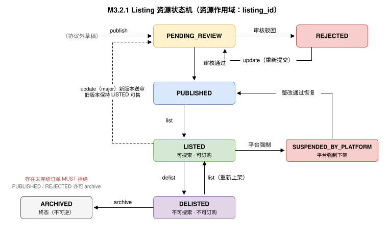

# 商品原语（Listing） {#s-m3}

## 目录 {#s-m3-toc}

- [Overview（概述）](#s-m31)
- [Lifecycle / State Machine（生命周期 / 状态机）](#s-m32)
- [Error Handling（错误处理）](#s-m33)
- [Scopes（权限范围）](#s-m34)
- [Guidelines（角色职责指引）](#s-m35)
- [Mode-Driven Behavior（模式驱动行为）](#s-m36)
- [Operations（操作定义）](#s-m37)
- [Entities（实体定义）](#s-m39)
- [Use Case Walkthroughs（用例演练）](#s-m310)

---

## 原语身份 {#s-m3-identity}

```
primitive_id:   utp.listing
version:        2026-07-31
initiator_role: Seller
handler_role:   Marketplace
intent:         供应商发布、更新并控制商品在 UTP 网络中的可交易状态
state_delta:    ∅ → listing(LISTED)（资源作用域，不产生全局交易状态）
actions:        publish, update, list, delist, query, archive, batch
compensation:   delist（使商品退出可交易范围，不影响已成立订单）
service:        dev.utp.merchant
```

---

## Overview（概述） {#s-m31}

### 意图 {#s-m311}

Listing 是 UTP-M 第一个供应商原语（MP1），其意图是使供应商能够把商品（Goods）或服务（Service）以标准结构发布到 Marketplace，并控制其可交易状态。Listing 的产出是**商品档案（Listing）**及其状态；只有处于 `LISTED` 状态的商品才进入买方 P1 Source 的可搜索范围。

Listing 是整个商业闭环的起点：没有 Listing，P1 Source 无货可搜。 UTP-B 规范中"商品已下架"（`PURCHASE.CREATE.INVALID_ITEMS`）、"商品不存在或已下架"（`SOURCE.LOOKUP.ITEM_NOT_FOUND`）等既有错误码的触发源，由本原语的 `delist`/`archive` 正式闭合。

### 关键设计原则 {#s-m312}

**"商品发布"与"商品上架"是两个独立动作。**`publish` 建立商品档案并进入平台审核；`list` 使审核通过的商品进入可交易状态。分离的原因：审核是平台治理动作（时长不可控），上架是供应商经营决策（可反复执行）。供应商 MAY 在 `publish` 请求中声明 `auto_list: true`，审核通过后自动上架。

**Listing 管信息，不管数量。**商品的可售数量由 MP2 Inventory（[M4](../../primitives/inventory/index.md)）独立管理。`publish`/`update` 请求 MUST NOT 携带库存数量字段；实现方若在同一 UI 中同时编辑信息与库存，MUST 在协议层拆分为 MP1 与 MP2 两次调用。

### 范围 {#s-m313}

Listing 覆盖以下场景：

- **商品发布（Publish）**：创建商品档案（标题、类目、属性、SKU、定价、履约条款、媒体资源、合规资质引用）。发布请求 MAY 携带 AI 辅助录入素材（[SourceMaterials（AI 辅助录入素材）](#s-m397) SourceMaterials：图片/商品链接/表格），由 Marketplace 解析为结构化草稿供供应商确认。
- **商品更新（Update）**：修改商品档案；价格与核心属性变更受版本化快照保护（[版本化与变更分级](#s-m324)）。
- **上架/下架（List / Delist）**：控制商品是否可被搜索与订购。
- **查询（Query）**：查询商品档案、状态与审核结论。
- **归档（Archive）**：商品永久退出经营（终态）。

Listing 不覆盖：库存数量（MP2）、订单处理（MP4）、类目体系治理（平台运营域）、搜索排序与推荐（平台实现域）。

### 前置条件 {#s-m314}

| 条件 | 必需？ | 说明 |
| --- | --- | --- |
| `merchant.status == 'ACTIVE'` | MUST | 供应商已完成入驻五步流程（[商户生命周期状态（Merchant Lifecycle）](../../onboarding.md#s-m27)）。`SANDBOX` 状态仅允许沙箱环境操作。 |
| `seller.identity.verified == true` | MUST | Seller 身份已验证，请求携带有效 RFC 9421 签名。 |
| `category ∈ merchant.qualified_categories` | MUST | 商品类目在供应商资质核准范围内。 |
| `compliance_level ≥ L1 → compliance_refs != null` | MUST | 合规要求类目 MUST 附资质文件引用。 |

### 后置条件 {#s-m315}

| 条件 | 说明 |
| --- | --- |
| `listing.listing_id != null` | 商品档案已建立，含全局唯一标识。 |
| `listing.status == 'LISTED'`（完成 `list` 后） | 商品进入可交易状态。 |
| `source.lookup(item_id == listing.listing_id) 可命中` | 买方 P1 Source 可搜索/查询该商品（平台托管拓扑）。 |
| `listing.version_hash` 已生成 | 当前版本快照的 SHA256 哈希，供订单条款快照引用。 |
| `listing_snapshot 已存档` | 每次生效版本 MUST 存档，可纳入 Evidence Bundle。 |

### 语义契约 {#s-m316}

```json
{
  "primitive": "utp.listing",
  "preconditions": [
    "merchant.status == 'ACTIVE'",
    "seller.identity.verified == true",
    "category ∈ merchant.qualified_categories",
    "IF mode.compliance_level >= L1 → compliance_refs != null"
  ],
  "postconditions": [
    "listing.listing_id != null",
    "listing.status ∈ {PENDING_REVIEW, PUBLISHED, LISTED}",
    "listing.version_hash == SHA256(JCS(listing))  // JCS = RFC 8785 规范化 JSON",
    "listing.status == 'LISTED' → source.searchable(listing_id) == true"
  ],
  "invariants": [
    "listing 请求与档案 MUST NOT 包含库存数量字段（数量属于 utp.inventory）",
    "LISTED 状态的商品，其买方可见投影 MUST 与最新生效版本一致",
    "已被有效订单引用的 version_hash 对应快照 MUST NOT 被删除"
  ],
  "side_effects": [
    "商品进入/退出 Source 可搜索范围（Marketplace 索引更新）",
    "审核任务创建（publish/重大 update 触发）",
    "版本快照存档（每次生效变更）"
  ],
  "compensation": {
    "on_review_rejected": "状态 → REJECTED，附结构化原因码，供应商修改后重新 publish/update",
    "on_delist": "退出可搜索范围；已成立订单不受影响，MUST 继续履行",
    "on_platform_suspend": "平台依据治理规则强制下架（SUSPENDED_BY_PLATFORM），MUST 通知供应商并附申诉路径"
  }
}
```

---

## Lifecycle / State Machine（生命周期 / 状态机） {#s-m32}

### Listing 资源状态机 {#s-m321}



### 状态定义与迁移规则 {#s-m322}

| 状态 | 含义 | 进入条件 | 允许的操作 |
| --- | --- | --- | --- |
| `PENDING_REVIEW` | 已提交，平台审核中 | `publish`，或对 LISTED 商品的重大 `update`（[版本化与变更分级](#s-m324)） | `query`；供应商 MAY 撤回（视为 `archive`） |
| `REJECTED` | 审核驳回 | 平台审核不通过，附原因码 | `update`（修改后自动重新进入 `PENDING_REVIEW`）, `query`, `archive` |
| `PUBLISHED` | 审核通过，未上架 | 审核通过；或从 `LISTED` 执行 `delist` 前的历史状态恢复 | `list`, `update`, `query`, `archive` |
| `LISTED` | 已上架，可搜索可订购 | `list` 成功执行 | `update`, `delist`, `query` |
| `DELISTED` | 已下架，不可搜索不可订购 | `delist` 成功执行 | `list`（重新上架）, `update`, `query`, `archive` |
| `SUSPENDED_BY_PLATFORM` | 平台强制下架（治理动作） | 资质过期、违规、风控触发 | `query`；整改通过后由平台恢复至 `PUBLISHED` |
| `ARCHIVED` | 永久退出（终态） | `archive` 成功执行 | `query`（只读） |

### 状态迁移的确定性 {#s-m323}

同一状态下同一操作 MUST 产生唯一确定的迁移结果（继承 UTP 规范状态机确定性约束）。特别地：

- `list` 仅在 `PUBLISHED`、`DELISTED` 状态允许；对 `PENDING_REVIEW` 执行 `list` MUST 返回 `LISTING.LIST.NOT_REVIEWED`。
- `delist` 生效 MUST 是原子的：生效时刻之后的 `source.lookup` MUST 返回 `SOURCE.LOOKUP.ITEM_NOT_FOUND`，`purchase.create` MUST 返回 `PURCHASE.CREATE.INVALID_ITEMS`；生效时刻之前已创建的订购草案按其条款快照继续（`complete` 时的最终校验以下架事实为准，失败走 P3 既有补偿链）。
- `archive` 对存在未完结订单的商品 MUST 被拒绝（`LISTING.ARCHIVE.OPEN_ORDERS`），供应商应先 `delist` 并待订单完结。

### 版本化与变更分级 {#s-m324}

每次生效变更产生新的 `version`（单调递增整数）与 `version_hash`。变更分两级：

| 变更级别 | 字段范围 | 处理方式 |
| --- | --- | --- |
| 轻量变更（minor） | `description`、`media`、`fulfillment_terms.leadtime_days`、SKU 增补 | 即时生效，商品保持 `LISTED`；生成新版本快照 |
| 重大变更（major） | `title`、`category`、`pricing`（降价除外）、SKU 删除、`compliance_refs` | MUST 重新审核：商品保持旧版本继续可售，新版本进入 `PENDING_REVIEW`，审核通过后原子切换 |

订购条款快照（P3 的 `terms_snapshot`）MUST 引用下单时刻的 `listing_id + version_hash`；价格一致性校验（`PURCHASE.CREATE.PRICE_CHANGED`）以该版本为基准。被任何有效订单引用的版本快照 MUST 保留至争议时效期结束。

---

## Error Handling（错误处理） {#s-m33}

错误响应 MUST 使用 UTP 规范 P0 通[标准错误响应格式](../../../protocol-core/primitive-framework.md#s-1043-standard-error-response)。本节定义 Listing 特有错误码：

| 错误码 | 严重级别 | HTTP 映射 | 描述 | 建议处理 |
| --- | --- | --- | --- | --- |
| `LISTING.PUBLISH.MERCHANT_NOT_ACTIVE` | error | 403 | 供应商未完成入驻或处于 `RESTRICTED`/`TERMINATED` 状态。 | 完成入驻流程或联系平台解除限制。 |
| `LISTING.PUBLISH.CATEGORY_NOT_QUALIFIED` | error | 403 | 商品类目不在供应商资质核准范围内。 | 申请类目资质后重试。 |
| `LISTING.PUBLISH.SCHEMA_INVALID` | error | 400 | 商品结构不符合 Listing Schema（缺必填字段、SKU 结构错误、含库存数量字段等）。 | 按错误详情修正后重试。 |
| `LISTING.PUBLISH.COMPLIANCE_MISSING` | error | 422 | `compliance_level ≥ L1` 类目缺少资质文件引用。 | 补充 `compliance_refs` 后重试。 |
| `LISTING.PUBLISH.DUPLICATE` | error | 409 | 幂等键重复但请求内容不一致。 | 使用新的幂等键。 |
| `LISTING.PUBLISH.INGEST_FAILED` | error | 422 | AI 辅助录入素材解析失败或置信度不足（图片不可读、链接不可达、表格结构无法识别）。响应 MUST 附逐素材的解析报告。 | 修正素材后重试，或改为结构化字段直接提交。 |
| `LISTING.UPDATE.NOT_FOUND` | error | 404 | 指定 `listing_id` 不存在或不属于调用方。 | 校验 `listing_id`。 |
| `LISTING.UPDATE.VERSION_CONFLICT` | error | 409 | `expected_version` 与当前版本不一致（并发修改）。 | 重新 `query` 获取最新版本后重试。 |
| `LISTING.UPDATE.IMMUTABLE_FIELD` | error | 400 | 尝试修改不可变字段（`listing_id`、`merchant_id`、库存数量字段）。 | 数量走 `utp.inventory`；其余字段不可改。 |
| `LISTING.LIST.NOT_REVIEWED` | error | 409 | 商品未通过审核（`PENDING_REVIEW`/`REJECTED`）不可上架。 | 等待或按驳回原因修改。 |
| `LISTING.LIST.SUSPENDED` | error | 403 | 商品处于 `SUSPENDED_BY_PLATFORM`，供应商不可自行上架。 | 按整改要求处理并申诉。 |
| `LISTING.DELIST.STATE_CONFLICT` | warning | 409 | 商品已处于下架/归档状态。 | 幂等返回当前状态。 |
| `LISTING.ARCHIVE.OPEN_ORDERS` | error | 409 | 存在未完结订单，不可归档。 | 先 `delist`，待订单完结后归档。 |
| `LISTING.QUERY.NOT_FOUND` | error | 404 | 商品不存在或调用方无权访问。 | 校验标识与权限。 |
| `LISTING.RATE_LIMITED` | warning | 429 | 发布/更新频率超过平台限流阈值。 | 按 `Retry-After` 等待后重试；批量场景改用 [批量模式（Batch Mode）](#s-m372) 批量模式。 |

---

## Scopes（权限范围） {#s-m34}

| Scope | 类型 | 描述 | 授予方 | 默认分配 |
| --- | --- | --- | --- | --- |
| `listing:publish` | Action Scope | 发布商品档案。 | Marketplace（入驻通过后） | Seller 角色 |
| `listing:update` | Action Scope | 更新商品档案。 | Marketplace | Seller 角色（仅本方商品） |
| `listing:list` | Action Scope | 上架商品。 | Marketplace | Seller 角色（仅本方商品） |
| `listing:delist` | Action Scope | 下架商品。 | Marketplace | Seller 角色（仅本方商品） |
| `listing:query` | Action Scope | 查询商品档案、状态与审核结论。 | Marketplace | Seller 角色（仅本方商品） |
| `listing:archive` | Action Scope | 归档商品。 | Marketplace | Seller 角色（仅本方商品） |

**权限约束：**

- 全部 Listing 操作 MUST 仅作用于调用方（`agent_id`）名下的商品；跨商户访问 MUST 返回 `LISTING.QUERY.NOT_FOUND`（不泄露存在性）。
- `SUSPENDED_BY_PLATFORM` 的进入与解除是 Marketplace 的治理动作，不对应供应商 Scope。
- 审核（review）是 Marketplace 内部义务，不是协议 Action；审核结论通过回调事件 `utp.listing.review_result`（[回调事件类型注册表](../../onboarding.md#s-m261)）通知。

---

## Guidelines（角色职责指引） {#s-m35}

### Seller 角色职责 {#s-m351}

| 职责 | 级别 | 说明 |
| --- | --- | --- |
| 信息真实准确 | MUST | 商品标题、属性、资质 MUST 真实；虚假信息导致的争议中 ListingSnapshot 将作为对供应商不利的证据。 |
| 结构化发布 | MUST | MUST 按 Listing Schema 提供结构化字段，MUST NOT 把关键交易条件（价格、交期）只写在描述富文本中。 |
| 价格一致性 | MUST | `pricing` MUST 与其经 MP3 应答 P2 询盘的报价口径一致（[Seller 角色职责](../../primitives/quote/index.md#s-m551)）；`pricing_mode ≥ L1` 时 MUST 提供 `pricing_tiers`。 |
| 及时下架 | MUST | 停售、断货长期无法补货、资质失效时 MUST 及时 `delist`，减少 `PURCHASE.CREATE.INVALID_ITEMS` 对买方体验的冲击。 |
| 版本自洽 | SHOULD | 重大变更 SHOULD 避开销售高峰；利用 [版本化与变更分级](#s-m324) 的"旧版本可售 + 新版本审核"机制平滑切换。 |
| 媒体合规 | SHOULD | 图片/视频资源 SHOULD 使用持久 URI，MUST 拥有合法版权。 |

### Marketplace 角色职责 {#s-m352}

| 职责 | 级别 | 说明 |
| --- | --- | --- |
| 审核时效 | MUST | MUST 公示审核 SLA 并在 SLA 内给出结论；驳回 MUST 附结构化原因码（附录 MB 的 `REVIEW.*` 原因码空间）。 |
| 索引一致性 | MUST | `list`/`delist` 生效后，Source 可搜索范围 MUST 在声明的传播时限（SHOULD ≤ 60s）内一致；生效时刻以状态迁移时间戳为准。 |
| 投影保真 | MUST | Source 返回的商品投影 MUST 来自最新生效版本，MUST NOT 篡改供应商声明的价格与条款。 |
| 快照存档 | MUST | MUST 存档每个生效版本快照，保存期不低于争议时效期；被订单引用的版本 MUST NOT 删除。 |
| 治理透明 | MUST | 强制下架 MUST 通知供应商，附原因与申诉路径；恢复条件 MUST 可核验。 |
| 限流公示 | SHOULD | SHOULD 公示发布/更新限流阈值与批量通道规格。 |

---

## Mode-Driven Behavior（模式驱动行为） {#s-m36}

| Mode 维度 | 对 Listing 的影响 |
| --- | --- |
| `pricing_mode` L0 | `pricing.unit_price` MUST 存在；`pricing_tiers` MUST NOT 存在。 |
| `pricing_mode` L1 | `pricing_tiers`（MOQ/MOA 阶梯）MUST 存在，与 UTP-B 规范 PricingTiers 同构。 |
| `pricing_mode` L2/L3 | MAY 标记 `negotiable: true`；L3 竞价商品 MUST 提供 `bid_starting_price` 与 `bid_deadline`。 |
| `fulfillment_structure` L1+ | `fulfillment_terms` MUST 声明 `ships_from`、`leadtime_days`；L2 的阶段划分、前置条件和完成条件 MUST 在交易条款锁定时确定。Listing 已知相关条件时 MAY 预告，但不得仅因 L2 自动推导可分批。 |
| `relationship_mode` L2+ | MAY 发布仅对框架协议客户可见的协议价商品（`visibility: "framework_only"`）。 |
| `compliance_level` L1+ | `compliance_refs` MUST 存在且审核通过；L2+（跨境）MUST 含原产地与进出口许可引用；L3 MUST 附审计报告引用。 |

**搜索可见性规则（Mode 过滤）：**商品的有效 Mode 范围 = 商户 Profile 中对应原语的 `supported_mode_range`（`utp.roles.seller.primitives`， UTP 规范 《发现与协商》） ∩ 商品 `mode_constraints`（缺省为前者）。Marketplace 的 P1 Source MUST 按会话 `ModeConfiguration` 过滤：会话 Mode 任一维度不在商品有效范围内的商品，MUST NOT 出现在携带任意 `filters` 的 `search` 结果中，对其 `lookup` MUST 返回 `SOURCE.MODE.UNSUPPORTED`（UTP-B 规范 《错误码定义》）。该规则将 UTP 规范的运行时错误前置为搜索期过滤，消除“能搜到却无法按该模式成交”的供需错配（闭环不变式 6，见 商品—交易闭环（End-to-End Loop））。

---

## Operations（操作定义） {#s-m37}

Listing 的核心操作为 `publish`、`update`、`list`、`delist`、`query`、`archive`，复用 UTP 规范 [《操作定义格式》 操作定义格式](../../../protocol-core/primitive-framework.md#s-1023-action-definition-format)。

### Listing 操作矩阵 {#s-m371}

| 操作 | 适用状态 | 状态影响 | `valid_next_actions` | 关键约束 |
| --- | --- | --- | --- | --- |
| `utp.listing.publish` | （新建） | 创建档案并进入 `PENDING_REVIEW`；`auto_list: true` 时审核通过后自动 `LISTED` | `query` | Seller；MUST 通过 Schema 校验与类目资质校验；MUST 携带 Seller JWS 签名覆盖 `version_hash`；MAY 携带 `source_materials`（AI 解析产出的字段与显式提交字段冲突时，显式字段 MUST 优先）。 |
| `utp.listing.update` | `REJECTED`, `PUBLISHED`, `LISTED`, `DELISTED` | minor：即时生效新版本；major：新版本进入 `PENDING_REVIEW`，旧版本继续可售 | `query`, `list`, `delist` | Seller；MUST 携带 `expected_version` 乐观锁；MUST NOT 修改库存数量。 |
| `utp.listing.list` | `PUBLISHED`, `DELISTED` | 进入 `LISTED`，纳入 Source 可搜索范围 | `update`, `delist`, `query`, `utp.inventory.set` | Seller；上架前 SHOULD 已通过 `utp.inventory.set` 设置可售数量，否则商品可搜索但不可订购。 |
| `utp.listing.delist` | `LISTED` | 进入 `DELISTED`，原子退出可搜索/可订购范围 | `list`, `update`, `query`, `archive` | Seller；已成立订单不受影响；幂等。 |
| `utp.listing.query` | 任意 | 无状态影响 | 当前状态下可执行的动作 | Seller；支持按 `listing_id` 单查、按状态/类目/时间的列表查询（分页）及按 `batch_id` 轮询批量任务逐条结果（[批量模式（Batch Mode）](#s-m372)）。 |
| `utp.listing.archive` | `PUBLISHED`, `DELISTED`, `REJECTED` | 进入 `ARCHIVED` 终态 | `query` | Seller；存在未完结订单 MUST 拒绝；不可逆。 |
| `utp.listing.batch` | 同 `publish`/`update` | 逐条同单条操作 | `query`（按 `batch_id`） | Seller；批量提交通道，单批 ≤ 500 条、逐条独立成败，MAY 异步；规则见 [批量模式（Batch Mode）](#s-m372)。 |

### 批量模式（Batch Mode） {#s-m372}

面向 ERP 全量/增量同步场景（同步模式（Synchronization Patterns）），`publish` 与 `update` MUST 支持批量提交：

- 批量请求为条目数组（单批 MUST ≤ 500 条），整批共享一个 `idempotency_key`，逐条独立校验、独立成败。
- 响应 MUST 逐条返回 `{index, listing_id | error}`；部分失败不影响其余条目（部分成功语义）。
- 批量任务 MAY 异步执行：响应返回 `batch_id`，供应商以 `query`（`batch_id` 维度）轮询结果；推送模式下以回调通知完成。

---

## Entities（实体定义） {#s-m39}

### Listing {#s-m391}

| 字段名 | 类型 | 必填 | 描述 |
| --- | --- | --- | --- |
| `listing_id` | string | 是 | 商品全局唯一标识，由 Marketplace 在 `publish` 时生成。买方侧 P1 Source 的 `item_id` 与此同值。 |
| `merchant_id` | string | 是 | 所属供应商在平台域内的标识（[注册接口与结果](../../onboarding.md#s-m242)）。 |
| `status` | enum | 是 | [状态定义与迁移规则](#s-m322) 定义的状态枚举。 |
| `version` | integer | 是 | 版本号，单调递增。 |
| `version_hash` | string | 是 | 当前版本规范化 JSON 的 SHA256 哈希。 |
| `type` | enum | 是 | `goods`（实物）/ `service`（服务）/ `digital`（虚拟）。 |
| `title` | string | 是 | 商品标题。 |
| `category` | string | 是 | 平台类目标识。 |
| `description` | string | 否 | 商品描述（富文本引用或纯文本）。 |
| `attributes` | object | 否 | 类目属性键值对（品牌、型号、材质等），键空间由类目 Schema 定义。 |
| `skus` | ListingSku[] | 是 | SKU 列表，MUST 至少一条（[ListingSku](#s-m392)）。 |
| `pricing` | ListingPricing | 是 | 定价结构（[ListingPricing](#s-m393)）。 |
| `fulfillment_terms` | FulfillmentTerms | 是 | 履约条款（[FulfillmentTerms](#s-m394)）。 |
| `trade_methods` | array | 是 | 支持的 Trade Method 列表，结构同 UTP-B 规范 （[《订购原语》](../../../primitives/purchase/index.md) 引用的 TradeMethod）。 |
| `media` | ListingMedia[] | 否 | 图片/视频资源（[ListingMedia 与 ListingSnapshot](#s-m395)）。 |
| `compliance_refs` | array | 否 | 资质文件引用列表（`credential_id` + 类型）；`compliance_level ≥ L1` 时必填。 |
| `visibility` | enum | 否 | `public`（默认）/ `framework_only`（仅框架协议客户可见）。 |
| `mode_constraints` | object | 否 | 商品级 Mode 能力收窄声明：六个核心维度各为 Level 数组，MUST 为商户 Profile 对应原语 `supported_mode_range` 对应维度的非空子集；缺省继承 Profile 全量范围。驱动 Source 搜索可见性过滤（[Mode-Driven Behavior（模式驱动行为）](#s-m36)）。 |
| `auto_list` | boolean | 否 | 审核通过后是否自动上架，默认 `false`。 |
| `seller_signature` | string | 是 | Seller ES256 签名（JWS），覆盖 `version_hash`。 |
| `created_at` / `updated_at` | ISO-8601 | 是 | 创建/最近生效变更时间。 |

> Listing MUST NOT 含任何库存数量字段。库存见 [Entities（实体定义）](../../primitives/inventory/index.md#s-m49)。

### ListingSku {#s-m392}

| 字段名 | 类型 | 必填 | 描述 |
| --- | --- | --- | --- |
| `sku_id` | string | 是 | SKU 标识，商品内唯一。买方侧 P1/P3 的 `sku_id` 与此同值。 |
| `spec` | object | 是 | 规格键值对（如 `{"color": "黑色", "size": "L"}`）。 |
| `price_offset` | Money | 否 | 相对 `pricing.unit_price` 的差价；缺省为零差价。 |
| `barcode` | string | 否 | 商品条码（EAN/UPC）。 |
| `external_ref` | string | 否 | 供应商内部编码（ERP 物料号），用于 M10 ID 映射；平台 MUST 原样保存并在订单路由中回传。 |
| `status` | enum | 是 | `active` / `inactive`（SKU 级停售，不影响其它 SKU）。 |

### ListingPricing {#s-m393}

| 字段名 | 类型 | 必填 | 描述 |
| --- | --- | --- | --- |
| `pricing_mode` | enum | 是 | 本商品支持的最低定价模式：`L0`—`L3`，MUST 落在会话 Mode 协商范围内。 |
| `unit_price` | Money | 条件 | 固定单价；`pricing_mode == L0` 时必填。Money 结构同 UTP 规范 [25.2 Money](../../../schemas/index.md)。 |
| `pricing_tiers` | array | 条件 | 阶梯价数组 `{min_quantity, unit_price}`；`pricing_mode ≥ L1` 时必填，与 UTP-B 规范 PricingTiers 同构。 |
| `negotiable` | boolean | 否 | 是否可议价（对应 `pricing_mode ≥ L2`）。 |
| `bid_starting_price` / `bid_deadline` | Money / ISO-8601 | 条件 | 竞价起拍价与截止时间；`pricing_mode == L3` 时必填。 |
| `currency` | string | 是 | ISO 4217 币种，商品内全部价格 MUST 同币种。 |

### FulfillmentTerms {#s-m394}

| 字段名 | 类型 | 必填 | 描述 |
| --- | --- | --- | --- |
| `ships_from` | string | 是 | 发货地。 |
| `leadtime_days` | integer | 是 | 标准备货交期（自然日）。MP4 `amend_leadtime` 的变更基准。 |
| `shipping_fee_policy` | object | 是 | 运费策略（`type`: `free`/`flat`/`threshold_free`，及金额参数）。 |
| `return_policy` | string | 是 | 退换货政策声明。 |
| `splittable` | boolean | 否 | 是否支持分批发货，默认 `false`；MP5 `split` 的前提。 |
| `moq` | integer | 否 | 最小起订量；P3 校验 `PURCHASE.CREATE.INVALID_ITEMS`（数量不满足 MOQ）的依据。 |

### ListingMedia 与 ListingSnapshot {#s-m395}

`ListingMedia` 记录 `media_id`、`type`（`image`/`video`）、`uri`、`sort_order`。`ListingSnapshot` 是版本快照存档实体，包含 `listing_id`、`version`、`version_hash`、完整 Listing 规范化 JSON、`effective_from`/`effective_to` 与 `seller_signature`；被订单条款快照引用时 MUST 可按 `listing_id + version_hash` 检索，并可纳入 Evidence Bundle。

### 与买方侧 Source 投影的字段对齐 {#s-m396}

| 买方侧字段（P1 Source lookup） | 供应商侧来源（本章） |
| --- | --- |
| `item.item_id` | `listing.listing_id` |
| `item.title` / `specifications` | `listing.title` / `listing.attributes` |
| `item.skus[]`（`sku_id`/`spec`/`price`） | `listing.skus[]`（价格 = `unit_price + price_offset`；`stock` 来自 MP2 `available` 快照） |
| `item.pricing`（含 `tiered_pricing`） | `listing.pricing` |
| `item.fulfillment` | `listing.fulfillment_terms` |
| `item.trade_methods` | `listing.trade_methods` |
| `item.seller`（资质摘要） | [Step 4：资质与合规（Qualification & Compliance）](../../onboarding.md#s-m25) 审核通过的 SupplierCredentials |

### SourceMaterials（AI 辅助录入素材） {#s-m397}

面向研发能力较弱或商品资料非结构化的供应商，`publish` 请求 MAY 携带原始素材，由 Marketplace 的解析能力生成结构化商品草稿。本实体**仅存在于请求侧**：解析产出 MUST 落为标准 Listing 字段后才能生效，素材本身 MUST NOT 作为商品语义存储或进入买方投影；解析失败返回 `LISTING.PUBLISH.INGEST_FAILED`（[Error Handling（错误处理）](#s-m33)）。

| 字段名 | 类型 | 必填 | 描述 |
| --- | --- | --- | --- |
| `image_urls` | array | 否 | 产品原始图片 URI 列表；用于自动预测类目、属性与规格。 |
| `product_urls` | array | 否 | 商品原始链接列表；用于自动解析链接内商品信息。 |
| `spreadsheet_url` | string | 否 | 供应商自维护的货品信息表格 URI（Excel/CSV）。 |

约束：三个字段 MUST 至少提供其一；解析产出与请求中显式提交的字段冲突时，显式字段 MUST 优先；解析置信度信息 SHOULD 随响应返回供供应商/Agent 复核（对应 人机控制点（HAI Control Points） 控制点：价格类解析结果 SHOULD 经确认后生效）。

---

## Use Case Walkthroughs（用例演练） {#s-m310}

### 发布并上架一个多 SKU 商品 {#s-m3101}

```
// 请求：utp.listing.publish
POST /utp/m/v1/listings
{
  "session_id": "utp-session-m-20260722-s01",
  "idempotency_key": "idem-pub-20260722-001",
  "listing": {
    "type": "goods",
    "title": "ProSound X3 主动降噪蓝牙耳机",
    "category": "electronics/audio",
    "attributes": { "brand": "ProSound", "model": "X3", "bluetooth_version": "5.3" },
    "skus": [
      { "sku_id": "sku-X3-BLK", "spec": { "color": "黑色" }, "external_ref": "ERP-MAT-004512", "status": "active" },
      { "sku_id": "sku-X3-WHT", "spec": { "color": "白色" }, "external_ref": "ERP-MAT-004513", "status": "active" }
    ],
    "pricing": {
      "pricing_mode": "L1",
      "currency": "CNY",
      "pricing_tiers": [
        { "min_quantity": 1,   "unit_price": { "amount": "299.00", "currency": "CNY" } },
        { "min_quantity": 100, "unit_price": { "amount": "268.00", "currency": "CNY" } }
      ]
    },
    "fulfillment_terms": {
      "ships_from": "上海",
      "leadtime_days": 3,
      "shipping_fee_policy": { "type": "threshold_free", "threshold": { "amount": "99.00", "currency": "CNY" } },
      "return_policy": "7天无理由退换",
      "splittable": true,
      "moq": 1
    },
    "trade_methods": [
      { "method_id": "tm-fullpay-alipay", "type": "full_payment", "channel": "alipay" }
    ],
    "auto_list": true
  },
  "seller_signature": "eyJhbGciOiJFUzI1NiJ9..."
}

// 响应
{
  "listing_id": "item-BT-NC-001",
  "status": "PENDING_REVIEW",
  "version": 1,
  "version_hash": "sha256:9f2c4e...",
  "valid_next_actions": ["utp.listing.query"]
}

// 审核通过后回调：utp.listing.review_result（auto_list 生效，直接 LISTED）
{
  "event": "utp.listing.review_result",
  "listing_id": "item-BT-NC-001",
  "result": "APPROVED",
  "status": "LISTED",
  "effective_at": "2026-07-22T10:30:00Z"
}
```

### 下架与闭环验证 {#s-m3102}

```
1. Seller: POST /utp/m/v1/listings/item-BT-NC-001/delist  → status = DELISTED
2. Buyer:  GET  /utp/v1/source/items/item-BT-NC-001       → 404 SOURCE.LOOKUP.ITEM_NOT_FOUND
3. Buyer:  POST /utp/purchase/create（含该 item）          → 400 PURCHASE.CREATE.INVALID_ITEMS
4. 既有订单（下架前 PURCHASED）：MP4/MP5 义务不变，继续履行
```
