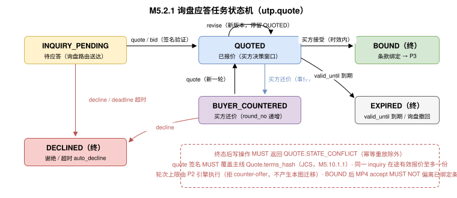

# 报价原语（Quote） {#s-m5}

## 目录 {#s-m5-toc}

- [Overview（概述）](#s-m51)
- [Lifecycle / State Machine（生命周期 / 状态机）](#s-m52)
- [Error Handling（错误处理）](#s-m53)
- [Scopes（权限范围）](#s-m54)
- [Guidelines（角色职责指引）](#s-m55)
- [与 P2 询盘原语的衔接（Interlock with P2）](#s-m56)
- [询盘路由（Inquiry Routing）](#s-m57)
- [Mode-Driven Behavior（模式驱动行为）](#s-m58)
- [操作矩阵（Operations Matrix）](#s-m59)
- [Entities（实体定义）](#s-m510)
- [Use Case Walkthroughs（用例演练）](#s-m511)

---

## 原语身份 {#s-m5-identity}

```
primitive_id:   utp.quote
version:        2026-07-31
initiator_role: Seller
handler_role:   Marketplace
intent:         供应商对路由到达的买方询盘给出可核验的报价/应答（报价/修订/投标/谢绝）
state_delta:    inquiry_routed → quote_record（资源作用域）
actions:        quote, revise, bid, decline, query, list
compensation:   应答超时 → 按 quote_policy 自动谢绝并通知双方
```

---

## Overview（概述） {#s-m51}

### 意图 {#s-m511a}

Quote 是 UTP-M 第三个供应商原语（MP3），其意图是让供应商对买方发起的询盘给出**显式、签名、可审计的报价与应答**。 UTP-B 规范 [P2 询盘原语](../../../primitives/negotiate/index.md)的 `utp.negotiate.quote` 方向为 `seller_to_buyer`（回调至买方 `{callback_base}`）。平台托管拓扑下供应商既无买方回调地址、也无与买方的直接会话，报价交付因此是**串联两跳**：`utp.quote.quote`（供应商 → Marketplace，本原语）→ `utp.negotiate.quote`（Marketplace → 买方， UTP-B 规范 P2）。本原语标准化第一跳，使供应商报价成为显式、签名、可审计的协议动作；**报价内容复用 UTP-B 规范权威 Quote 实体，Action 集按卖方任务视角独立命名**（与 P2 不复用命名，两侧各自声明、互不混淆）。衔接细节见 [与 P2 询盘原语的衔接（Interlock with P2）](#s-m56)。

### 关键设计原则 {#s-m512}

- **MP3 不替代 P2，而是 P2 报价交付的第一跳**。协商的权威状态机在 P2（询盘/报价/议价/条款绑定）；MP3 `quote` 的产出（卖方 ES256 签名，覆盖 UTP-B 规范 `Quote.terms_hash`）由 Marketplace 以 `utp.negotiate.quote` 原样交付买方，条款绑定仍由 P2 完成并产出订购 `terms_hash` 进入 P3。
- **报价是有时效的承诺。**`quote` 在 `quote.validity` 内对供应商有约束力（买方在时效内接受即绑定）；到期自动失效，不产生义务。
- **应答超时必有确定性处置**。每条路由询盘 MUST 关联应答时限；超时按 `quote_policy.on_timeout` 自动谢绝（询盘不同于订单，超时缺省为 `auto_decline`，不存在 auto_accept）。
- **可选能力**。MP3 为 MAY 级能力：仅服务一口价直购（pricing_mode = L0）的供应商可不声明本原语，不影响 MP1/MP2/MP4/MP5 闭环（Mode 对供应商侧的影响（Mode Awareness） Mode 接触点不新增）。

### 范围 {#s-m513}

- **报价（quote）**：对询盘给出结构化报价（分档价、MOQ、交期、有效期），附卖方签名。
- **修订（revise）**：对买方还价或自身原因修订在途报价（新版本，旧版本保留可溯）。
- **投标（bid）**：应答招投标类询盘（RFQ/招标），在投标窗口内提交密封报价。
- **谢绝（decline）**：以结构化原因码谢绝询盘（区域不可服务、MOQ 不满足、产能不足等）。
- **查询（query / list）**：待应答与历史应答记录检索。

MP3 不覆盖：询盘的发起与撤回（Buyer 专属，P2）、条款绑定核查与 `terms_hash` 生成（P2 权威）、订购受理（MP4）。

### 前置条件 {#s-m514}

| 条件 | 必需？ | 说明 |
| --- | --- | --- |
| 存在有效的询盘路由通知（InquiryRouting） | MUST | Marketplace 已将买方 P2 [询盘路由](#s-m57)。 |
| `merchant.status == ACTIVE` | MUST | 与 MP4 不同：`RESTRICTED` 商户 MUST NOT 产生新报价承诺（无既有履约义务可言）。 |
| `inquiry.deadline > now()` | MUST | 应答时限内；投标另受 `bid_window` 约束。 |
| Profile 已声明 `utp.quote` | MUST | 未声明本原语的商户不接收询盘路由。 |

### 后置条件与语义契约 {#s-m515}

```json
{
  "primitive": "utp.quote",
  "postconditions": [
    "quote.record_id != null",
    "conclusion ∈ {QUOTED, BOUND, DECLINED, EXPIRED}",
    "status == 'QUOTED' → seller_signature 覆盖 quote.terms_hash 且 quote.validity.end_at > decided_at",
    "conclusion == 'BOUND' → P2 条款绑定完成，terms_hash 生成（进入 P3）",
    "quote_record ∈ evidence_bundle"
  ],
  "invariants": [
    "同一 inquiry_id 的在途有效报价至多一份（revise 产生新版本并使旧版本失效）",
    "valid_until 内买方接受报价，供应商即受报价条款约束（时效性承诺）",
    "应答 MUST 在 deadline 前给出，否则按 quote_policy 自动谢绝"
  ],
  "side_effects": [
    "QUOTED：报价推送买方（P2 quote 语义），进入买方决策窗口",
    "BOUND：协商结果落入 NegotiationResult，衔接 P3 订购（UTP 规范 3.7）",
    "DECLINED/EXPIRED：买方收到结构化谢绝/失效通知，P2 侧协商终止"
  ],
  "compensation": {
    "on_timeout": "按 quote_policy.on_timeout 执行 auto_decline，推送 utp.quote.expired",
    "on_buyer_withdraw": "询盘撤回 → 在途报价作废（无补偿义务），推送 utp.quote.withdrawn"
  }
}
```

---

## Lifecycle / State Machine（生命周期 / 状态机） {#s-m52}

### 应答任务状态机 {#s-m521}



### 状态定义与迁移规则 {#s-m522}

| 状态 | 含义 | 进入条件 | 允许的操作 |
| --- | --- | --- | --- |
| `INQUIRY_PENDING` | 待应答 | 询盘路由送达 | `quote`, `bid`, `decline`, `query` |
| `QUOTED` | 已报价（买方决策窗口） | `quote`/`bid` 签名验证通过 | `revise`, `decline`, `query`（revise 产生新版本） |
| `BUYER_COUNTERED` | 买方还价（回到可应答） | 买方 P2 还价事件 | `quote`（新一轮报价）, `decline`, `query` |
| `BOUND` | 条款绑定（终态） | 买方在时效内接受报价，P2 绑定核查通过 | `query`；衔接 P3 订购与 MP4 受理 |
| `DECLINED` | 已谢绝（终态） | `decline`；或超时策略 auto_decline | `query`（只读） |
| `EXPIRED` | 报价失效（终态） | `valid_until` 到期买方未接受；或询盘撤回 | `query`（只读） |

**确定性约束**：终态到达后任何写操作 MUST 返回 `QUOTE.STATE_CONFLICT`（幂等重放同一 `idempotency_key` 除外）。多轮议价 = `QUOTED ⇄ BUYER_COUNTERED` 循环，轮次 `round_no` 单调递增；**轮次上限由 UTP-B 规范 P2 引擎执行**（拒绝超限的买方 `counter-offer` 并返回 `NEGOTIATE.COUNTER_OFFER.MAX_ROUNDS`，协商停留 `QUOTED`），本原语不因轮次超限产生迁移。各状态与 UTP-B 规范 P2 协商状态的对应见 [状态映射（State Correspondence）](#s-m562)。

---

## Error Handling（错误处理） {#s-m53}

| 错误码 | 严重级别 | HTTP 映射 | 描述 | 建议处理 |
| --- | --- | --- | --- | --- |
| `QUOTE.NOT_FOUND` | error | 404 | 应答任务不存在或不属于调用方。 | 以 `list` 核对待应答队列。 |
| `QUOTE.EXPIRED` | error | 410 | 应答时限已过或报价已失效。 | `query` 查看终局状态。 |
| `QUOTE.STATE_CONFLICT` | warning | 409 | 应答任务已达终态。 | 幂等返回既有结论。 |
| `QUOTE.SIGNATURE_INVALID` | error | 400 | `quote`/`bid` 携带的卖方签名无效或未覆盖 `quote.terms_hash`。 | 用正确密钥按 通用规则继承（Commons Inheritance） 统一规则重签。 |
| `QUOTE.PRICE_OUT_OF_POLICY` | error | 422 | 报价超出平台价格治理边界（如低于成本预警线、超出类目波动阈值）。 | 调整报价或走人工审核通道。 |
| `QUOTE.BID.WINDOW_CLOSED` | error | 410 | 投标窗口已关闭。 | 不可恢复；等待下一次招标。 |
| `QUOTE.DECLINE.REASON_REQUIRED` | error | 400 | `decline` 缺少结构化原因码。 | 按 [DeclineReason 原因码枚举](#s-m5102) 原因码枚举补充。 |
| `QUOTE.MERCHANT_RESTRICTED` | error | 403 | 商户状态不允许产生新报价承诺（[前置条件](#s-m514)）。 | 恢复 ACTIVE 后重试。 |

---

## Scopes（权限范围） {#s-m54}

| Scope | 类型 | 描述 | 授予方 | 默认分配 |
| --- | --- | --- | --- | --- |
| `quote:quote` | Action Scope | 提交报价并附卖方签名。 | Marketplace | Seller 角色（仅本方路由询盘） |
| `quote:revise` | Action Scope | 修订在途报价。 | Marketplace | Seller 角色 |
| `quote:bid` | Action Scope | 提交招投标报价。 | Marketplace | Seller 角色 |
| `quote:decline` | Action Scope | 谢绝询盘。 | Marketplace | Seller 角色 |
| `quote:query` | Action Scope | 查询应答任务与历史记录。 | Marketplace | Seller 角色 |

**约束：**`quote`/`bid` 的签名主体 MUST 是 Seller 的 Profile 公钥对应私钥。Merchant Agent 代签时 MUST 满足 Agent 授权链（Delegation & Mandate） 授权链要求（operation Mandate 覆盖 `quote:quote`，且报价金额在授权限额内）。

---

## Guidelines（角色职责指引） {#s-m55}

### Seller 角色职责 {#s-m551}

| 职责 | 级别 | 说明 |
| --- | --- | --- |
| 时限内应答 | MUST | MUST 在 `deadline` 前给出应答（报价或谢绝）；依赖超时自动谢绝 SHOULD 仅作为兜底。 |
| 报价可履行 | MUST | `quote` 前 MUST 确认价格、MOQ、交期在报价有效期内可履行；报价口径 MUST 与 Listing `pricing` 一致（M3 价格一致性）。 |
| 结构化谢绝 | MUST | `decline` MUST 携带 [DeclineReason 原因码枚举](#s-m5102) 原因码；SHOULD 附替代建议。 |
| 报价纪律 | SHOULD | SHOULD 避免频繁修订在途报价；高失效率/高谢绝率是平台治理信号。 |

### Marketplace 角色职责 {#s-m552}

| 职责 | 级别 | 说明 |
| --- | --- | --- |
| 及时路由 | MUST | P2 询盘定向到达后 MUST 立即推送 `inquiry_routed`（[询盘路由（Inquiry Routing）](#s-m57)）；仅路由给 Profile 声明 `utp.quote` 的商户。 |
| 如实转达 | MUST | 报价 MUST 原样进入 P2 买方侧（金额、有效期、条款不得改写）；平台加价/补贴 MUST 以独立条目呈现，不得混入卖方报价。 |
| 投标密封 | MUST | 招投标场景，投标窗口关闭前 MUST NOT 向任何买方或其他竞标者披露报价内容。 |
| 证据归档 | MUST | QuoteRecord（含签名、轮次、时间戳）MUST 纳入协商 Evidence Bundle，供 P6 争议举证。 |

---

## 与 P2 询盘原语的衔接（Interlock with P2） {#s-m56}

### 串联两跳（Two-Hop Delivery） {#s-m561}

UTP-B 规范 P2 的 `utp.negotiate.quote` 的方向是 `seller_to_buyer`（供应商交付报价，回调至买方 `{callback_base}`）。平台托管拓扑下，供应商既没有买方的回调地址，也没有与买方的直接会话，因此报价交付是**串联两跳**而非并列的两个通道：

1. **第一跳（本原语）**：Seller → Marketplace，`utp.quote.quote` 提交带签名的报价事实。
2. **第二跳（UTP-B 规范 P2）**：Marketplace 以 Seller 侧 handler 身份执行 `utp.negotiate.quote`，把**同一份 Quote 实体**交付买方。Marketplace MUST NOT 改写报价内容（金额、有效期、条款、`terms_hash` 逐字节保持）；平台加价或补贴 MUST 以独立条目呈现。

自托管拓扑（自托管拓扑（Self-Hosted））下本原语不适用：供应商 Endpoint 直接作为 P2 的 handler 执行 `utp.negotiate.quote` 回调，本原语是其内部模型的参考。

### 状态映射（State Correspondence） {#s-m562}

本原语状态机是同一协商在供应商侧的**任务视图**，与 UTP-B 规范 P2 协商状态机（`primitives/negotiate/state_machine.json`）逐状态对应：

| 本原语（应答任务） | UTP-B 规范 P2（协商） | 说明 |
| --- | --- | --- |
| `INQUIRY_PENDING` | `INQUIRED` | 询盘已提交、等待供应商报价。 |
| `QUOTED` | `QUOTED` | 报价已交付买方（两跳完成）。 |
| `BUYER_COUNTERED` | `COUNTERED` | 买方经 `utp.negotiate.counter-offer` 还价。 |
| `BOUND`（终） | `BOUND` | 买方经 `utp.negotiate.binding` 绑定条款，全局状态迁移至 PURCHASING。 |
| `DECLINED` / `EXPIRED`（终） | `RELEASED` | 协商失败、超时或买方退出。 |

**终态不可逆与协商重启的关系**：UTP-B 规范允许 `RELEASED` 后买方重新发起 `utp.negotiate.inquiry`。此时协议引擎 MUST 生成**新的 `inquiry_id`**，即产生一个新的应答任务；本原语的终态不可逆**不妨碍**协商重启（新询盘 = 新任务，历史记录仍可 `query`）。

### 职责边界 {#s-m563}

1. **条款绑定是 P2 的权威职责**。买方在 `quote.validity` 内接受报价后，由 P2 执行绑定核查并产出 `terms_hash` 与 NegotiationResult（UTP 规范 《发现与协商》），随后进入 P3 订购；本原语 MUST NOT 自行宣称绑定成立。
2. **签名与哈希同源**。本原语 `quote` 的签名覆盖 UTP 规范 `Quote.terms_hash`（计算规则见 [terms_hash 计算规则（补充 UTP-B 规范留白）](#s-m5101a)）。绑定后 MP4 `accept` 的签名覆盖订购 `terms_hash`，二者构成完整价格证据链；**MP4 `accept` MUST NOT 偏离已绑定条款**。
3. **轮次上限由 P2 引擎执行**。会话锁定轮次约束时，超限的买方 `counter-offer` 由 P2 引擎拒绝并返回 `NEGOTIATE.COUNTER_OFFER.MAX_ROUNDS`，协商停留在 `QUOTED`；**本原语不因轮次超限产生迁移，供应商无需为此 `decline`**。
4. **报价修订的第二跳表达。**`revise` 产生新版本后，Marketplace MUST 以新的 `utp.negotiate.quote` 交付修订报价， UTP-B 规范协商状态停留 `QUOTED`。 UTP-B 规范状态机当前未定义 `QUOTED` 自环，该表达已登记为跨规范协调项（附录 ME）。
5. **L3 竞价的分支独立性**。多供应商竞价时各报价分支相互独立（UTP-B 规范 P2 约束），买方 `binding` 只能选择其中一个分支；未被选中的分支收敛为 `EXPIRED`。

---

## 询盘路由（Inquiry Routing） {#s-m57}

询盘路由是 Marketplace → Seller 的推送事件（回调推送，[回调事件类型注册表](../../onboarding.md#s-m261)），不是供应商可调用的 Action。

### InquiryRouting 事件载荷 {#s-m571}

| 字段名 | 类型 | 必填 | 描述 |
| --- | --- | --- | --- |
| `inquiry_id` | string | 是 | 路由事件唯一标识（应答任务标识）。 |
| `negotiation_id` | string | 是 | P2 协商上下文标识（跨 B/M 共享）。 |
| `trade_context_id` | string | 是 | 交易上下文标识（询盘阶段尚无 transaction_id）。 |
| `inquiry_type` | enum | 是 | `standard`（标准询盘）/ `rfq_bid`（招投标；附 `bid_window`）。 |
| `items` | array | 是 | 询盘商品项（`listing_id`/`sku_id`、`external_ref` 回传、数量区间、目标价 MAY）。 |
| `buyer_ref` | object | 是 | 买方脱敏信息（`agent_id`、资质摘要；PII 按权限裁剪）。 |
| `requirements` | object | 否 | 交期/合规/物流等结构化要求。 |
| `deadline` | ISO-8601 | 是 | 应答截止时间（超时 auto_decline）。 |
| `round_no` | integer | 是 | 当前轮次（首轮为 1；`buyer_countered` 事件递增）。 |

推送遵循 UTP 规范 《Push Notification》（MessageEnvelope + 签名 + 指数退避重试）；供应商 MUST 以 `2xx` 确认。推送不可达时，供应商可通过 `quote.list`（`status=INQUIRY_PENDING`）轮询兜底。

---

## 操作矩阵（Operations Matrix） {#s-m58}

| Mode 配置 | 应答行为 |
| --- | --- |
| pricing=L0（一口价） | MP3 不适用：询盘不产生、不路由；价格事实由 Listing `pricing` 直接承载。 |
| pricing=L1（分档价） | `quote_policy.mode` SHOULD 为 `auto`：按 PricingTiers 即时报价（毫秒级）。 |
| pricing=L2—L3（协商价/动态价） | 策略预筛 + 人工/Agent 复核；多轮议价激活，轮次上限按会话 Mode 配置。 |
| relationship=L2+（框架协议） | 报价 MUST 引用框架价基线；偏离基线 MUST 显式标注偏差与理由。 |
| compliance=L2+（跨境） | 报价 SHOULD 声明贸易术语（Incoterms）与单证费用归属。 |

---

## Operations 与 Transport Bindings {#s-m59}

### 操作矩阵 {#s-m591}

| 操作 | 适用状态 | 状态影响 | `valid_next_actions` | 关键约束 |
| --- | --- | --- | --- | --- |
| `utp.quote.quote` | `INQUIRY_PENDING`, `BUYER_COUNTERED` | 进入 `QUOTED` | `revise`, `decline`, `query` | Seller；签名 MUST 覆盖 `quote.terms_hash`；SHOULD 声明 `quote.validity`（缺省时平台按默认有效期补全）。 |
| `utp.quote.revise` | `QUOTED` | 停留 `QUOTED`（新版本，旧版本失效并保留） | `revise`, `decline`, `query` | Seller；新版本 MUST 重新签名；`version` 递增；仅适用于 `quote` 产生的 `QUOTED`（`bid` 产生的密封报价 MUST 返回 `QUOTE.STATE_CONFLICT`）。第二跳表达见 [职责边界](#s-m563) 第 4 项。 |
| `utp.quote.bid` | `INQUIRY_PENDING`（`inquiry_type=rfq_bid`） | 进入 `QUOTED`（密封） | `query` | Seller；投标窗口内；窗口关闭前平台 MUST NOT 向任何买方或竞标者披露，窗口关闭后统一开标；**投标 MUST NOT 通过 `revise` 修订**（密封不可变；需变更 MUST 先 `decline` 再在窗口内重新 `bid`）。 |
| `utp.quote.decline` | `INQUIRY_PENDING`, `QUOTED`, `BUYER_COUNTERED` | 进入 `DECLINED` 终态 | `query` | Seller；MUST 携带结构化原因码。 |
| `utp.quote.query` | 任意 | 无 | 当前状态下可执行动作 | Seller；按 `inquiry_id`/`negotiation_id` 查询。 |
| `utp.quote.list` | — | 无 | `quote`, `decline`, `query` | Seller；按状态/时间筛选，分页；轮询降级通道。 |

## Entities（实体定义） {#s-m510}

### QuoteRecord {#s-m5101}

**报价内容复用 UTP-B 规范权威实体**。本原语 MUST NOT 重复定义报价结构：报价以 UTP-B 规范 P2 的 `Quote` 实体承载（`primitives/negotiate/entities/quote.json`，字段 `quote_id`/`inquiry_ref`/`supplier_id`/`round`/`line_items`/`prices`/`lead_time`/`available_trade_modes`/`answers`/`validity`/`stock_guaranteed`/`terms_hash`）。QuoteRecord 只增加供应商侧的任务状态、版本与审计维度：

| 字段名 | 类型 | 必填 | 描述 |
| --- | --- | --- | --- |
| `record_id` | string | 是 | 应答记录唯一标识。 |
| `inquiry_id` | string | 是 | 询盘路由标识（本原语状态机的资源键）。 |
| `negotiation_id` | string | 是 | P2 协商上下文标识（跨买卖双侧共享，[与 P2 询盘原语的衔接（Interlock with P2）](#s-m56)）。 |
| `trade_context_id` | string | 否 | 交易上下文标识；询盘阶段尚无 `transaction_id`。 |
| `status` | enum | 是 | `INQUIRY_PENDING` / `QUOTED` / `BUYER_COUNTERED` / `BOUND` / `DECLINED` / `EXPIRED`。 |
| `round_no` | integer | 是 | 议价轮次（对应 UTP-B 规范 `Quote.round`）；买方还价事件递增。 |
| `version` | integer | 是 | 本轮报价版本；`revise` 递增，旧版本失效并保留可溯。 |
| `quote` | Quote | 条件 | 报价内容（UTP-B 规范权威实体，见上）。`status == QUOTED` 时必填。 |
| `seller_signature` | Signature | 条件 | Seller 业务签名（`primitives/common/entities/signature.json`，`algorithm` MUST 为 `ES256`），覆盖 `quote.terms_hash`。`status == QUOTED` 时必填。 |
| `decline_reason` | DeclineReason | 条件 | `status == DECLINED` 时必填（[DeclineReason 原因码枚举](#s-m5102)）。 |
| `quote_note` | string | 否 | 补充说明（贸易术语、单证费用归属、替代建议等）。 |
| `decided_by` | enum | 是 | `human` / `agent` / `policy_auto`（审计维度，人机控制点（HAI Control Points））。 |
| `decided_at` | ISO-8601 | 是 | 应答时间。 |

#### terms_hash 计算规则（补充 UTP-B 规范留白） {#s-m5101a}

UTP-B 规范 `Quote.terms_hash` 的计算范围此前未定义。本规范给出规范化规则，供应商与 Marketplace MUST 一致执行：

- 取 `Quote` 实体，**移除** `terms_hash` 自身与任何签名字段；
- 按 RFC 8785（JCS）规范化序列化，计算 SHA-256；
- 格式为 `sha256:<64 位小写十六进制>`（与 UTP 规范 `Quote.terms_hash` 的 pattern 一致）；
- `seller_signature` 的 JWS payload MUST 为该哈希串（通用规则继承（Commons Inheritance） 业务签名统一规则）；实现方 MUST NOT 自行选择签名覆盖范围。

### DeclineReason 原因码枚举 {#s-m5102}

| 原因码 | 含义 | 建议买方处理 |
| --- | --- | --- |
| `moq_not_met` | 询盘量低于 MOQ | 提高数量或更换供应商 |
| `capacity_full` | 产能排期已满 | 放宽交期或更换供应商 |
| `region_unserved` | 目标区域不可服务 | 更换收货区域 |
| `spec_unsupported` | 规格/定制要求无法满足 | 调整规格或寻找定制供应商 |
| `compliance_unable` | 无法满足合规/单证要求 | 更换供应商或降低合规要求 |
| `risk_control` | 供应商侧风控拦截 | 联系供应商或平台 |
| `other` | 其他（MUST 附 `detail` 说明） | 阅读说明 |

---

## Use Case Walkthroughs（用例演练） {#s-m511}

### 标准询盘报价至条款绑定 {#s-m5111}

```
// 1. 回调：询盘路由
{
  "event": "utp.quote.inquiry_routed",
  "inquiry_id": "inq-20260730-0812",
  "negotiation_id": "neg-01J5AB2C3D4E",
  "trade_context_id": "tc-01J5AB0XYZ",
  "inquiry_type": "standard",
  "items": [ { "listing_id": "item-BT-NC-001", "sku_id": "sku-X3-BLK",
               "external_ref": "ERP-MAT-004512",
               "quantity_range": { "min": 500, "max": 1000 },
               "target_price": { "amount": "255.00", "currency": "CNY" } } ],
  "deadline": "2026-07-31T10:00:00Z",
  "round_no": 1
}

// 2. Seller 报价（策略核验通过，Agent 代签）——报价体为 UTP-B 规范 Quote 实体
POST /utp/m/v1/quotes/inq-20260730-0812/quote
{
  "idempotency_key": "idem-quo-20260730-003",
  "quote": {
    "quote_id": "q-20260730-0812-1",
    "inquiry_ref": "inq-20260730-0812",
    "supplier_id": "did:web:supplier.example.com",
    "round": 1,
    "line_items": [ { "item_id": "item-BT-NC-001", "sku_id": "sku-X3-BLK",
                      "quantity": 800,
                      "unit_price": { "amount": "258.00", "currency": "CNY" } } ],
    "prices": [ { "type": "total", "amount": { "amount": "206400.00", "currency": "CNY" } } ],
    "lead_time": { "preparation_days": 7, "shipping_days": 3, "total_days": 10 },
    "available_trade_modes": [ { "mode_id": "tm-fullpay-alipay", "type": "full_payment" } ],
    "validity": { "start_at": "2026-07-30T10:00:00Z", "end_at": "2026-08-03T10:00:00Z" },
    "stock_guaranteed": true,
    "terms_hash": "sha256:7c9e2b4a1f08d3c5e6f7a8b9c0d1e2f3a4b5c6d7e8f9a0b1c2d3e4f5a6b7c8d9"
  },
  "seller_signature": { "algorithm": "ES256", "key_id": "supplier-key-1",
                        "value": "eyJhbGciOiJFUzI1NiJ9..." },
  "decided_by": "agent"
}

// 3. 响应
{
  "record_id": "quo-20260730-0812",
  "status": "QUOTED",
  "round_no": 1, "version": 1,
  "valid_next_actions": ["utp.quote.revise", "utp.quote.decline", "utp.quote.query"]
}

// 4. 买方接受（P2 条款绑定）→ 回调通知
{ "event": "utp.quote.bound", "inquiry_id": "inq-20260730-0812",
  "terms_hash": "sha256:d4e5f6a7b8c9...",   // 进入 P3；MP4 受理签名覆盖此值
  "next": "订单路由后按 M6 受理（accept 不得偏离已绑定条款）" }
```

### 谢绝与超时兜底 {#s-m5112}

```
谢绝：POST .../decline { "decline_reason": { "code": "moq_not_met",
      "detail": "该 SKU 起订量 500，询盘量 200；如可拼单请重新询盘" } }
      → P2 侧协商终止，买方收到结构化通知

超时：deadline 到期未应答 → 按 quote_policy=auto_decline 自动 DECLINED，
      推送 utp.quote.expired 给供应商（decided_by 记录 policy_auto）
```
