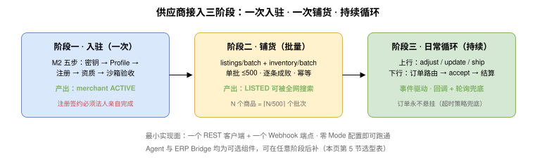

<h1 id="s-mqs">供应商接入快速开始（Merchant Quickstart）</h1>
    
本页是 UTP-M 的非规范性（Informative）导读：用最短路径说明一个供应商从零到"商品可被全网买方 Agent 购买"需要做什么。全部规范性细节以各章正文为准，本页每一步都给出对应章节。

    <h2 id="s-mqs1">1. 接入前提：你只需要实现两个东西</h2>

    
UTP-M 的最简实现面（M1.10 传输绑定支持要求）：

<pre class="highlight"><code>① 一个 REST 客户端     → 调用 Marketplace 的 dev.utp.merchant Service（MP1—MP6）
② 一个 Webhook 端点    → 接收 dev.utp.merchant_callback 回调（订单路由、审核结论、账单）

不需要：MCP/A2A（可选）、Merchant Agent（可选）、ERP Bridge（有 ERP 才需要）
Mode 配置：零配置即可跑通全流程（M1.8 Mode 默认无关性原则）
</code></pre>

    <h2 id="s-mqs2">2. 第一阶段：入驻（一次性，M2）</h2>
    <table>
      <thead><tr><th>步骤</th><th>动作</th><th>产出</th><th>参考</th></tr></thead>
      <tbody>
        <tr><td>1</td><td>生成 ES256 密钥对，确定 <code>agent_id</code>（如 <code>did:web:你的域名</code>）</td><td>身份与密钥</td><td>M2.2</td></tr>
        <tr><td>2</td><td>在你的域名 <code>/.well-known/utp</code> 发布 Profile（声明 MP 原语 + 回调 Service）</td><td>能力声明</td><td>M2.3（含可复制示例）</td></tr>
        <tr><td>3</td><td>向 Marketplace 提交注册（<strong>必须法人主体亲自完成，不可委托 Agent</strong>）</td><td><code>merchant_id</code></td><td>M2.4</td></tr>
        <tr><td>4</td><td>按平台公示清单提交资质</td><td><code>QUALIFIED</code></td><td>M2.5</td></tr>
        <tr><td>5</td><td>沙箱验收（签名互验、发布/接单/发货全流程跑通）</td><td><code>ACTIVE</code>，可发商品</td><td>M2.6.2 验收清单</td></tr>
      </tbody>
    </table>

    <h2 id="s-mqs3">3. 第二阶段：铺货（批量，M3 + M4）</h2>
<pre class="highlight"><code>N 个商品 = ⌈N / 500⌉ 个批次（单批 ≤ 500 条，整批一个 idempotency_key，逐条独立成败）

POST /utp/m/v1/listings/batch   → batch_id → 轮询/回调取逐条结果     （M3.7.2）
POST /utp/m/v1/inventory/batch  → 初始库存 set                      （M4.8.2）

商品数据来源三选一：
  ERP 导出映射（M10.4） / AI 辅助录入 source_materials，确认后生效（M3.9.7） / 人工录入
</code></pre>
    
商品经 <code>DRAFT → PENDING_REVIEW → LISTED</code>（M3.3）后自动进入平台 P1 Source 可搜索范围；审核结论走 <code>review_result</code> 回调推送，无需轮询。

    <h2 id="s-mqs4">4. 第三阶段：日常循环（事件驱动）</h2>
<pre class="highlight"><code>上行（你 → 平台，随 ERP 变化触发）：
  库存变化   → inventory.adjust + commutative:true（最简路径，M4.1.2）
  信息修改   → listing.update（major 变更重新送审）
  发货       → delivery.ship（运单号；平台转为买方侧 fulfill.notify）

下行（平台 → 你的 Webhook）：
  order_routed      → 在 deadline 内 accept（附卖方签名）/ reject / hold    （M6）
inquiry_routed    → （可选，声明 utp.quote 后）在 deadline 内 quote / decline （M5）
  hold_created/…    → 核对库存占用                                        （M4.7）
  statement_issued  → 对账，异议走 discrepancy.submit                      （M9）

兜底铁律：所有回调丢失均可通过 query/list 游标轮询补齐（M2.6.1）；
接单超时平台按预设策略处置，订单永不悬挂（M6.3）。
</code></pre>

    <h2 id="s-mqs5">5. 什么时候才需要 Agent 和 Bridge</h2>
    <table>
      <thead><tr><th>你的情况</th><th>需要的组件</th><th>参考</th></tr></thead>
      <tbody>
        <tr><td>有 ERP，希望全自动</td><td>Merchant Bridge（单据映射 + 增量同步）+ AcceptancePolicy 自动接单</td><td>M10、M6.8</td></tr>
        <tr><td>无 ERP、数据不规范</td><td>AI 辅助录入 + Merchant Agent 代办日常运营（授权与边界见 M11）</td><td>M3.9.7、M10</td></tr>
        <tr><td>只想最小接入</td><td>REST 客户端 + Webhook + 人工后台，全部组件皆可后补</td><td>本页第 1 节</td></tr>
      </tbody>
    </table>
    
接入完成的判定标准即 M2.6.2 沙箱验收清单；端到端报文序列与行为对照见 <a href="walkthrough.md">M12 全链路演练</a>；机读契约（JSON Schema 与原语定义文件）索引见<a href="appendices.md#s-md">附录 MD</a>。

