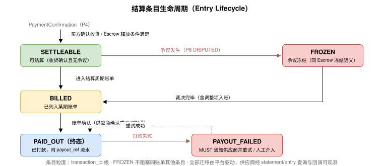
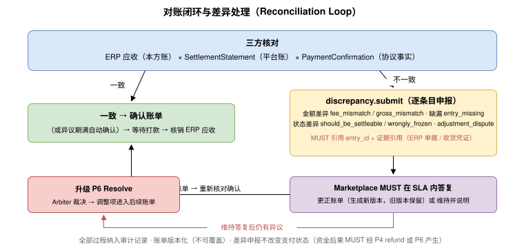

# 结算与对账（Settlement &amp; Reconciliation） {#s-m9}

## 定位与设计选择（Positioning） {#s-m91}

平台托管拓扑下，货款通常经 Marketplace（或其委托的 PaymentProcessor/Escrow）代收，再按结算周期与分账规则支付给供应商。本章定义供应商侧结算能力的协议表达。

**设计选择：结算不是新原语，而是 P4 Pay 的只读扩展域。**理由：

1. 资金转移的协议语义（支付、确认和退款）已由 UTP-B 规范 P4 Pay 完整定义；供应商结算是这些事实的**汇总视图**，不产生新的资金转移语义。
2. 本章按 UTP [原语扩展规范](../protocol-core/primitive-framework.md#s-105-extension-spec)挂载 `utp.pay.settlement` 扩展：命名遵循 《扩展命名》（`utp.{primitive}.{extension_domain}`），Marketplace 在 Profile 的 `utp.primitives["utp.pay"][].extensions` 中声明 `{ "name": "utp.pay.settlement" }`（同 UTP 规范 《发现与协商》 示例中 `utp.source.cart` 的声明方式）；双方声明兼容版本后扩展生效（《版本协商与生效规则》）。扩展只新增只读操作，不改变 P4 核心语义与状态迁移（《扩展概念与边界》）。
3. 差异申报（[对账闭环与差异处理（Reconciliation Loop）](#s-m95)）虽是写操作，但其语义是"对账异议登记"，不改变任何支付状态；异议的资金后果 MUST 经 P4 `refund` 或 P6 Resolve 产生。

扩展动作：`settlement.statement.list`、`settlement.statement.detail`、`settlement.entry.query`、`settlement.discrepancy.submit`。调用方向：caller=Seller（Payee），handler=Marketplace（或其 PaymentProcessor）。

## 结算模型（Settlement Model） {#s-m92}

### 结算要素 {#s-m921}

| 要素 | 说明 | 确定时机 |
| --- | --- | --- |
| 结算账户 | 供应商收款账户引用（脱敏），入驻时登记（[MerchantRegistration 实体](onboarding.md#s-m241) `settlement_account`） | 入驻；变更需重新验证 |
| 结算周期 | `T+n`（确认收货后 n 日）/ 半月结 / 月结 | 入驻时从 Marketplace 公示的账期选项中选择；MUST 在商户协议中签署并可查询 |
| 佣金与费用 | 平台佣金率（类目维度）、支付通道费、增值服务费 | 商户协议 + 账单逐笔明示 |
| 结算触发条件 | 默认：买方 `fulfill.receive` 确认收货 + 无未决争议；Escrow 拓扑下等价于 Escrow 释放条件（Escrow 角色见 UTP 规范 [R2：标准角色集与角色加入规则](../protocol-core/business-topology.md#s-922-standard-roles)；释放约束见第 14 章 P4，Seller MUST NOT 直接触发资金释放） | Mode/拓扑锁定时 |

### 结算金额构成不变式 {#s-m922}

```
payable(entry) = gross_amount            // 订单实收（PaymentConfirmation 金额）
               - platform_commission     // 平台佣金
               - channel_fee             // 支付通道费
               - service_fee             // 增值服务费（可为 0）
               ± adjustment              // 争议裁决/补偿指令产生的调整项

不变式：
1. gross_amount MUST 与该 transaction_id 下 PaymentConfirmation 合计一致
2. 每笔扣减项 MUST 有费率依据引用（商户协议条款 ID）
3. adjustment MUST 引用 P6 CompensationOrder 或 P4 refund 凭证
4. Σ(entries.payable) == statement.total_payable
```

## 结算条目生命周期（Entry Lifecycle） {#s-m93}



| 状态 | 含义 | 进入条件 |
| --- | --- | --- |
| `SETTLEABLE` | 满足结算触发条件 | 收货确认且无未决争议 |
| `FROZEN` | 争议冻结 | 关联交易进入 DISPUTED（与 Escrow 冻结语义一致） |
| `BILLED` | 已列入某期账单 | 结算周期出账 |
| `PAID_OUT` | 已打款 | 打款成功，附 `payout_ref` 流水 |
| `PAYOUT_FAILED` | 打款失败 | 账户异常等；MUST 通知供应商并重试 |

## 账单出具与查询（Statements） {#s-m94}

- Marketplace MUST 按结算周期出具 SettlementStatement，并推送回调事件 `utp.settlement.statement_issued`（[回调事件类型注册表](onboarding.md#s-m261)）。
- 账单 MUST 逐笔可追溯：每个条目 MUST 携带 `transaction_id`、`purchase_id`、`shipment_id`、PaymentConfirmation 引用与费用依据。
- 供应商 MAY 在异议期（SHOULD ≥ 7 天）内提交差异申报（[对账闭环与差异处理（Reconciliation Loop）](#s-m95)）；异议期满未申报视为确认。
- 账单与打款流水 MUST 归档，保存期不低于所在法域的财务凭证要求与争议时效期两者较长者。

### 操作与传输绑定 {#s-m941}

| 操作 | 语义 | REST | MCP Tool |
| --- | --- | --- | --- |
| `utp.pay.settlement.statement.list` | 账单列表（按周期/状态筛选，分页） | `GET /utp/m/v1/settlements/statements` | `utp_pay_settlement_statement_list` |
| `utp.pay.settlement.statement.detail` | 单期账单全量条目 | `GET /utp/m/v1/settlements/statements/{statement_id}` | `utp_pay_settlement_statement_detail` |
| `utp.pay.settlement.entry.query` | 按交易维度查结算条目 | `GET /utp/m/v1/settlements/entries?transaction_id=` | `utp_pay_settlement_entry_query` |
| `utp.pay.settlement.discrepancy.submit` | 差异申报 | `POST /utp/m/v1/settlements/statements/{statement_id}/discrepancies` | `utp_pay_settlement_discrepancy_submit` |

A2A Task 命名遵循 `utp:pay:settlement:{...}`。查询类操作 MUST NOT 改变任何状态；`discrepancy.submit` 仅登记异议，资金后果走 P4/P6。

## 对账闭环与差异处理（Reconciliation Loop） {#s-m95}



差异申报 MUST 引用具体 `entry_id` 并附证据引用（ERP 单据、收货凭证等）；Marketplace 的答复与更正 MUST 生成新账单版本（旧版本保留），全部过程纳入审计记录。

## 实体定义（Entities） {#s-m96}

### SettlementStatement {#s-m961}

| 字段名 | 类型 | 必填 | 描述 |
| --- | --- | --- | --- |
| `statement_id` | string | 是 | 账单唯一标识。 |
| `merchant_id` | string | 是 | 供应商标识。 |
| `period` | object | 是 | 结算周期（`from` / `to`，ISO-8601）。 |
| `version` | integer | 是 | 账单版本（差异更正递增）。 |
| `entries` | SettlementEntry[] | 是 | 结算条目列表。 |
| `total_gross` / `total_fees` / `total_payable` | Money | 是 | 汇总金额；MUST 满足 [结算金额构成不变式](#s-m922) 不变式。 |
| `status` | enum | 是 | `ISSUED` / `CONFIRMED` / `IN_DISPUTE` / `PAID_OUT`。 |
| `dispute_deadline` | ISO-8601 | 是 | 异议截止时间。 |
| `payout_ref` | string | 否 | 打款流水引用（`PAID_OUT` 后必有）。 |
| `issuer_signature` | string | 是 | Marketplace ES256 签名（JWS），覆盖账单哈希。 |

### SettlementEntry {#s-m962}

| 字段名 | 类型 | 必填 | 描述 |
| --- | --- | --- | --- |
| `entry_id` | string | 是 | 条目唯一标识。 |
| `transaction_id` / `purchase_id` | string | 是 | 关联交易与订购。 |
| `shipment_id` | string | 否 | 关联发货单（分批或多阶段付款时定位阶段）。 |
| `payment_confirmation_ref` | string | 是 | PaymentConfirmation 引用（UTP 规范 25.x pay Schema）。 |
| `gross_amount` | Money | 是 | 订单实收金额。 |
| `fees` | array | 是 | 扣减项数组 `{type, amount, basis_ref}`；`basis_ref` 引用商户协议条款。 |
| `adjustments` | array | 否 | 调整项数组 `{direction, amount, order_ref}`；`direction` 枚举 `credit`（增加应结）/ `debit`（减少应结），`amount` 恒为非负 Money，方向由 `direction` 表达；`order_ref` 引用 CompensationOrder 或退款凭证。 |
| `payable_amount` | Money | 是 | 应结金额。 |
| `status` | enum | 是 | [结算条目生命周期（Entry Lifecycle）](#s-m93) 条目状态枚举。 |

### SettlementDiscrepancy {#s-m963}

| 字段名 | 类型 | 必填 | 描述 |
| --- | --- | --- | --- |
| `discrepancy_id` | string | 是 | 差异申报唯一标识。 |
| `statement_id` / `entry_id` | string | 是 | 关联账单与条目。 |
| `type` | enum | 是 | `gross_mismatch` / `fee_mismatch` / `entry_missing` / `should_be_settleable` / `wrongly_frozen` / `adjustment_dispute`。 |
| `expected` / `actual` | object | 是 | 期望值与账单值对照。 |
| `evidence_refs` | array | 是 | 证据引用列表。 |
| `status` | enum | 是 | `SUBMITTED` / `ACCEPTED`（账单更正）/ `MAINTAINED`（维持并说明）/ `ESCALATED`（升级 Resolve）。 |
| `seller_signature` | string | 是 | Seller ES256 签名。 |
| `submitted_at` | ISO-8601 | 是 | 提交时间。 |

## 错误码（Error Codes） {#s-m97}

| 错误码 | HTTP | 描述 | 建议处理 |
| --- | --- | --- | --- |
| `SETTLEMENT.UNSUPPORTED` | 404 | Marketplace 未声明 `settlement` 扩展域。 | 回退为线下对账。 |
| `SETTLEMENT.STATEMENT_NOT_FOUND` | 404 | 账单不存在或无权访问。 | 校验 `statement_id`。 |
| `SETTLEMENT.DISCREPANCY_WINDOW_CLOSED` | 410 | 异议期已过。 | 后续期次核对或走 Resolve。 |
| `SETTLEMENT.DISCREPANCY_EVIDENCE_REQUIRED` | 400 | 差异申报缺少证据引用。 | 补充证据。 |
| `SETTLEMENT.LIST_EMPTY` | 200 | 无匹配账单（info，非错误）。 | 调整筛选条件。 |

## Scope 与授权 {#s-m98}

| Scope | 类型 | 描述 | 默认分配 |
| --- | --- | --- | --- |
| `pay:settlement:read` | Data Scope | 账单与条目查询（list/detail/entry.query）。 | Seller（Payee）角色，仅本方数据 |
| `pay:settlement:discrepancy` | Action Scope | 提交差异申报。 | Seller（Payee）角色 |

结算数据含资金敏感信息：服务端 MUST 仅返回调用方本方数据；Merchant Agent 访问结算数据 MUST 持有覆盖 `pay:settlement:read` 的显式授权（Agent 授权链（Delegation & Mandate）），且 SHOULD 在授权中单列（不随经营类 Scope 默认捆绑）。

---

## 打款动作（Payout） {#s-m99}

打款是资金流的最后一跳：平台（代收主体，经 PaymentProcessor）将已确认账单的 `total_payable` 打至供应商收款账户。**协议定位：打款不是新原语**——它是 P4 Pay（意图：执行资金转移）在结算扩展 `utp.pay.settlement` 内的**平台驱动 Action**，对应条目生命周期（[结算条目生命周期（Entry Lifecycle）](#s-m93)）的 `BILLED → PAID_OUT` 迁移；在全局 DAG 中挂接在买方确认收货（P5 receive）与账单确认之后，作为交易闭环的收尾节点。

| 要素 | 规定 |
| --- | --- |
| 触发条件 | 账单 `CONFIRMED`（供应商确认或异议期满自动确认）且条目非 `FROZEN`。打款 MUST 由平台驱动，供应商无可调用的打款 Action（只读观测）。 |
| 执行语义 | 每次打款 MUST 生成 `PayoutInstruction`（含 `statement_id`、金额、收款账户摘要、发起时间）；成功后 MUST 回写 `payout_ref`（支付渠道流水）并推送 `utp.settlement.paid` 回调；失败进入 `PAYOUT_FAILED`，MUST 通知供应商并重试（[结算条目生命周期（Entry Lifecycle）](#s-m93)）。 |
| 金额不变式 | `payout.amount == statement.total_payable`（分次打款 MAY，但 Σ 打款 MUST 等于账单应付，每笔均需独立 `payout_ref`）。 |
| 可追溯性 | `payout_ref` MUST 可关联到账单、条目与原始 PaymentConfirmation，构成“买方付款 → 平台代收 → 平台打款”的完整资金证据链，纳入 Evidence Bundle 供 P6 争议举证。 |
| 拓扑适用 | 仅平台代收模式（escrow/担保交易）适用；买卖直付（买方直接付至卖方账户）无打款环节，结算仅剩对账职能。 |
