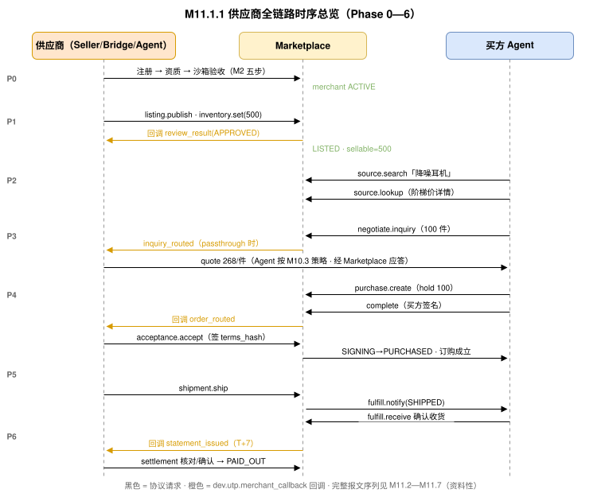

# M12 · 供应商全链路演练（Merchant End-to-End Walkthrough） {#s-m12}

> **本章为资料性（Informative）。**演练序列与 JSON 报文示例用于说明各章规范性条款的组合使用方式，不新增任何规范性要求；示例与各章条款或机读 Schema 不一致时，以条款与 Schema 为准。[闭环总验证清单（Loop Verification Checklist）](#s-m129) 验证清单是对 商品—交易闭环（End-to-End Loop） 闭环不变式（规范性，定义于各引用章节）的检查索引。

## 场景设定（Scenario Setup） {#s-m121}

本章以一家电子产品制造商"上海示例供应链有限公司"接入 Marketplace 为主线，演练**入驻 → 发布 → 上架 → 被寻源 → 报价 → 接单 → 发货 → 结算**的完整闭环。它是 UTP-B 规范[第 24 章标准采购全链路](../guides/procurement-walkthrough.md)的**供应商侧镜像**——UTP-B 规范第 24 章从买方视角走完同一笔交易，两章互为对照。

| 项目 | 设定 |
| --- | --- |
| 供应商 | `agent_id: did:web:supplier.example.com`；ERP 集成形态 `bridge`；Merchant Agent 启用（`assisted` 接单） |
| Marketplace | `marketplace.example.com`，承载 `dev.utp.merchant` 与 `dev.utp.trade` 两个 Service |
| 商品 | ProSound X3 降噪耳机（阶梯价，L1 定价） |
| 交易 Mode | `(L1, L1, L0, L1, L0, L0)`：阶梯定价 + 简单询价 + 全额支付 + 委托物流 |

### 全链路时序总览 {#s-m1211}



## Phase 0：入驻（Onboarding） {#s-m122}

按 M2 五步流程完成：生成 ES256 密钥对 → 发布 Profile（声明 Seller 角色 + MP1—MP6 原语 + `dev.utp.merchant_callback` Service，示例见 [Step 2：Profile 发布（Profile Declaration）](onboarding.md#s-m23)）→ 注册获取 `merchant_id: mch-sh-00812` → 资质审核 `QUALIFIED` → 沙箱验收 7 项全过 → 状态 `ACTIVE`。

## Phase 1：发布商品与设置库存 {#s-m123}

Bridge 从 ERP 物料主数据生成发布请求（完整示例见 [发布并上架一个多 SKU 商品](primitives/listing/index.md#s-m3101)）：

```
1. POST /utp/m/v1/listings           → listing_id=item-BT-NC-001, PENDING_REVIEW
2. 回调 utp.listing.review_result    → APPROVED, auto_list 生效 → LISTED
3. PUT  /utp/m/v1/inventory/item-BT-NC-001/sku-X3-BLK
   { "available": 500, "expected_revision": 0 }
   → { available:500, sellable:500, revision:1 }
```

**闭环检查点 ①（对应 商品—交易闭环（End-to-End Loop） 不变式 1/2）：**此刻买方侧 `source.lookup(item-BT-NC-001)` 返回的 `skus[].stock=500`、`pricing.tiered_pricing` 与供应商发布结构逐字段对齐。

## Phase 2—3：被寻源与报价（买方视角对照） {#s-m124}

买方按 UTP-B 规范流程 `source.search → source.lookup → negotiate.inquiry`（询 100 件价格与交期）。供应商侧：

```
// Marketplace 将询盘转给供应商回调（P2 的 Seller handler 侧）；
// Merchant Agent 按 M11.3.2 策略生成报价（阶梯价内，无需人工）：
// negotiate.quote 应答
{
  "quote": {
    "subject_ref": { "listing_id": "item-BT-NC-001", "sku_id": "sku-X3-BLK" },
    "quantity": 100,
    "unit_price": { "amount": "268.00", "currency": "CNY" },
    "leadtime_days": 3,
    "valid_until": "2026-07-23T18:00:00Z"
  },
  "decided_by": "agent"
}
```

买方接受报价形成 Binding Terms（UTP-B 规范 P2），报价与 Listing `pricing_tiers` 一致（100 件档 268 元）——报价不越界，Agent 自主完成。

## Phase 4：下单、路由与接单 {#s-m125}

```
// 1. 买方 purchase.create（100 件）→ 协议引擎创建临时 hold
//    供应商收到回调：
{ "event": "utp.inventory.hold_created", "hold_id": "hold-20260722-0091",
  "quantity": 100, "status": "HELD", "expires_at": "2026-07-22T20:00:00Z" }
//    此刻库存视图：available=500, held=100, sellable=400

// 2. 买方 purchase.complete（买方签名）→ P3 进入 SIGNING
//    → Marketplace 路由受理任务（M6.7）：
{ "event": "utp.acceptance.order_routed", "routing_id": "route-20260722-0335",
  "purchase_id": "ORD-20260722-88721",
  "transaction_id": "utp-txn-01J4X7K9M2P5Q8R3V6W0YZ",
  "terms_hash": "sha256:d4e5f6a7b8c9...",
  "deadline": "2026-07-22T18:00:00Z", "timeout_policy": "auto_reject" }

// 3. assisted 模式：Agent 核验（ERP 库存/交期/金额 26,800 < ceiling 50,000）
//    → 建议 accept → 运营点击确认 → Bridge 提交：
POST /utp/m/v1/acceptances/route-20260722-0335/accept
{ "terms_hash": "sha256:d4e5f6a7b8c9...",
  "seller_signature": "eyJhbGciOiJFUzI1NiJ9...", "decided_by": "human" }

// 4. 协议引擎完成 SIGNING → PURCHASED 原子迁移（承诺处理/库存锁定/terms_hash 校验， UTP-B 规范 13.2.3）
//    hold-20260722-0091: HELD → LOCKED；ERP 创建 SO-2026-07553 并建立映射
```

**闭环检查点 ②（不变式 3）：**MP4 提交的卖方签名覆盖订购 `terms_hash`，与买方侧 Mandate 操作准入共同构成双边承诺，订购凭证成立，全局状态 `PURCHASING → PAYING`。买方支付（P4，全额 alipay）确认后进入 `FULFILLING`。

## Phase 5：发货与买方收货 {#s-m126}

```
// 1. ERP 出库单确认 → Bridge 幂等键 ship-OUT-20260723-081 → 发货：
POST /utp/m/v1/deliveries
{ "transaction_id": "utp-txn-01J4X7K9M2P5Q8R3V6W0YZ",
  "purchase_id": "ORD-20260722-88721",
  "shipment": { "carrier_code": "SF", "tracking_number": "SF1234567890123",
    "ships_from": "上海", "estimated_delivery_at": "2026-07-26T18:00:00Z",
    "packages": [ { "package_no": "PKG-001",
      "items": [ { "listing_id": "item-BT-NC-001", "sku_id": "sku-X3-BLK",
                   "external_ref": "ERP-MAT-004512", "quantity": 100 } ] } ] },
  "seller_signature": "eyJhbGciOiJFUzI1NiJ9..." }
// → SHIPPED；lock 100 → CONSUMED；available 500→400

// 2. Marketplace 转换为买方 fulfill.notify(SHIPPED)（M7.7 映射表）
// 3. 承运商妥投回执 → DELIVERED → 买方 fulfill.receive 确认收货
// 4. 供应商收到回调：
{ "event": "utp.delivery.receipt",
  "shipment_id": "shp-20260723-0442",
  "receipt": { "result": "ACCEPTED", "received_quantity": 100,
               "received_at": "2026-07-26T15:20:00Z" } }
// → 批次 CLOSED；全局状态 FULFILLING → SETTLED（全局状态机判定）
```

**闭环检查点 ③（不变式 4）：**买方 `fulfill.query` 与供应商 `delivery.query` 呈现同一 `shipment_id / tracking_number` 的两个投影。

## Phase 6：结算与对账 {#s-m127}

```
// T+7 账单出具回调 → 供应商拉取明细：
GET /utp/m/v1/settlements/statements/stmt-202607-C-0031
{
  "statement_id": "stmt-202607-C-0031",
  "period": { "from": "2026-07-20", "to": "2026-07-26" },
  "entries": [ {
    "entry_id": "ent-88721-01",
    "transaction_id": "utp-txn-01J4X7K9M2P5Q8R3V6W0YZ",
    "payment_confirmation_ref": "payconf-20260722-5501",
    "gross_amount": { "amount": "26800.00", "currency": "CNY" },
    "fees": [
      { "type": "platform_commission", "amount": { "amount": "1340.00", "currency": "CNY" }, "basis_ref": "agmt-fee-3.2" },
      { "type": "channel_fee", "amount": { "amount": "160.80", "currency": "CNY" }, "basis_ref": "agmt-fee-4.1" }
    ],
    "payable_amount": { "amount": "25299.20", "currency": "CNY" },
    "status": "BILLED"
  } ],
  "total_payable": { "amount": "25299.20", "currency": "CNY" },
  "dispute_deadline": "2026-08-02T00:00:00Z",
  "issuer_signature": "eyJhbGciOiJFUzI1NiJ9..."
}
// Bridge 三方核对（ERP 应收 × 账单 × PaymentConfirmation）一致 → 确认
// → PAID_OUT（附打款流水 payout-20260803-771）→ ERP 应收核销
```

**闭环检查点 ④（不变式 [结算金额构成不变式](settlement.md#s-m922)）：**`gross_amount` 与 PaymentConfirmation 一致；每笔扣减有协议条款引用；账单可逐笔回溯到 `transaction_id`。至此货、款、单三流闭合。

## 异常支线演练（Exception Paths） {#s-m128}

| 支线 | 触发 | 协议路径 | 收敛结果 |
| --- | --- | --- | --- |
| 缺货拒单 | 接单核验发现 ERP 实际库存不足 | `acceptance.reject(inventory_insufficient)` → P3 补偿链释放 hold → 订购 `CANCELLED`；Bridge 随即 `inventory.set` 校准 | 买方收到结构化拒绝与替代建议；无资金损失 |
| 受理超时 | ERP 审批流卡住超过 deadline | `timeout_policy=auto_reject` 自动处置 + `acceptance.expired` 回调 | 订单不悬挂；供应商复盘审批时效 |
| 发货延迟 | 原料短缺，无法按 3 天交期发货 | `delivery.update(delay, new_eta)` → 买方侧 `DELAYED`；买方可等待或 `resolve.raise` | 延迟事实留痕；争议按证据裁决 |
| 买方拒收 | 到货外观破损 | 买方 `fulfill.reject`（P5）→ Resolve 激活 → 裁决退款 → CompensationOrder 进入结算 `adjustments`（[SettlementEntry](settlement.md#s-m962)） | 结算条目冻结 → 裁决后按调整项出账 |
| 账单差异 | 佣金费率与商户协议不符 | `settlement.discrepancy.submit(fee_mismatch)` → Marketplace 更正账单新版本 | 新版账单确认后打款 |
| 商品强制下架 | 资质到期未换证 | 平台 `SUSPENDED_BY_PLATFORM` + 回调通知 → 供应商补证 → 恢复 `PUBLISHED` → 重新 `list` | 存量订单履约义务不变（[商户生命周期状态（Merchant Lifecycle）](onboarding.md#s-m27)） |

## 闭环总验证清单（Loop Verification Checklist） {#s-m129}

| # | 不变式（商品—交易闭环（End-to-End Loop）） | 本章验证位置 |
| --- | --- | --- |
| 1 | Source 投影 == Listing 发布结构 | [Phase 1：发布商品与设置库存](#s-m123) 检查点 ① |
| 2 | Purchase 库存校验/锁定 == MP2 同一数据源 | [Phase 4：下单、路由与接单](#s-m125)（hold→LOCKED→CONSUMED 全程可查） |
| 3 | 卖方承诺处理经 MP4 完成并注入 P3 原子迁移 | [Phase 4：下单、路由与接单](#s-m125) 检查点 ② |
| 4 | MP5 Delivery == 买方 fulfill 同一记录 | [Phase 5：发货与买方收货](#s-m126) 检查点 ③ |
| 5 | delist 后 Source/Purchase 既有错误码生效 | [下架与闭环验证](primitives/listing/index.md#s-m3102)（专项演练） |
| — | 结算三流闭合（货/款/单） | [Phase 6：结算与对账](#s-m127) 检查点 ④ |
