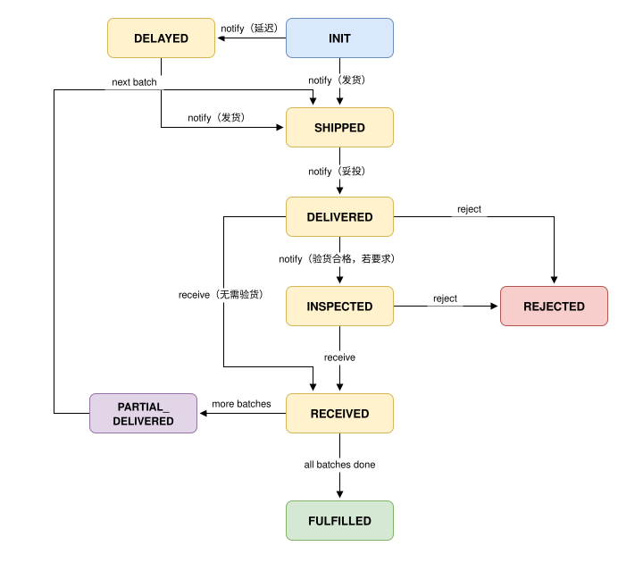

# 履约原语（Fulfill） {#s-15-p5-fulfill}

## 原语身份（Primitive Identity） {#s-151}

```
primitive_id:   utp.fulfill
version:        2026-07-01
intent:         跟踪交付进展、验收并确认收货
state_delta:    FULFILLING → SETTLED
actions:        leadtime, list, query, notify, receive, reject
compensation:   reject → 激活 Resolve；冻结后续资金释放条件
precondition:   TradeMethod 约定的履约前置条件已满足
```

## 概述（Overview） {#s-152}

### 意图 {#s-1521}

Fulfill（P5）面向采购方，提供对订单中商品或服务实际交付的时效查询、进展感知、验收确认与拒收能力。履约的直接标的是 `order_id`；同一 `purchase_id` 下的多个订单分别推进履约。采购方通过 `notify` 接收订单发货、延迟、妥投和验货结论等关键履约事件，通过 `query` 查询单个订单的完整履约进展，在已满足交付和验货条件时执行 `receive` 或 `reject`。

### 范围 {#s-1522}

Fulfill 覆盖采购方在履约阶段的以下能力：

- **感知履约进展**：通过 `notify` 接收订单发货、延迟、妥投、验货结论等关键事件；通过 `query` 查看单个订单的物流、交付、清关、验货和证据摘要；通过 `list` 检索关联订单；通过 `leadtime` 查询预计时效。
- **确认收货**：在交付条件满足后，通过 `receive` 对商品或服务进行确认收货。
- **拒收**：在交付不符合约定时，通过 `reject` 提交拒收理由与证据，并进入 Resolve 处理路径。

上述能力适用于一次性交付、分批交付、跨境或其他复杂履约模式。分批交付时，采购方 MAY 对订单中的已到达批次分别查询、确认收货或拒收；跨境履约时，`query` 可呈现运输、清关、单证和验货等履约事实。物流单、包裹和运单号是订单履约事件可选关联资源，不构成 P5 的直接履约锚点。

### 关键设计原则 {#s-1523}

`notify` 为订单履约事件推送，由 Seller 在发货、延迟、妥投和验货结论等关键节点推送给采购方，驱动可观测状态机迁移。`leadtime`、`list` 与 `query` 为采购方主动发起的只读操作，MUST NOT 改变 P5 状态。采购方改变验收结论的动作仅为 `receive` 与 `reject`。

### 前置条件 {#s-1524}

| 条件 | 必需？ | 说明 |
| --- | --- | --- |
| 存在有效的 PaymentConfirmation | MUST | 至少已完成首期支付（全额支付或首期分期）。或按 TradeMethod 约定的后付条款执行。 |
| `session.state ∈ {FULFILLING, PAYING}` | MUST | `payment_structure == L0` 时会话 MUST 处于 `FULFILLING`；`payment_structure ≥ L1`（分期或里程碑支付）时会话 MAY 处于 `FULFILLING` 或 `PAYING`，即 Pay 与 Fulfill 交叉执行，交叉顺序以 TradeMethod 锁定的子步骤为准。 |
| PurchaseCredential 可访问 | MUST | Fulfill 操作需要引用承诺条款中的商品明细、收货地址等信息。 |

### 后置条件 {#s-1525}

| 条件 | 说明 |
| --- | --- |
| `session.state == 'SETTLED'` | 全部商品已交付并确认收货。 |
| FulfillmentReceipt 已生成 | 包含所有批次的交付确认记录。 |
| Escrow 资金已释放（若适用） | 当拓扑包含 Escrow 角色且 `receive` 通过时，触发 Escrow 释放。 |
| `evidence_bundle` 已追加履约证据 | 物流记录、验货报告、签收确认等已追加至证据包。 |

## 生命周期与状态机（Lifecycle and State Machine） {#s-153}

### 采购方可观测状态机 {#s-1531}



采购方可观测状态机按订单建模会通知采购方的履约节点——`SHIPPED`（已发货）、`DELAYED`（延迟）、`DELIVERED`（已妥投）；备货、待发等供应方内部状态不在本状态机范围内。这些节点由 `notify` 推送给采购方并驱动状态迁移；`query` 仅供采购方主动查询单个订单，不驱动迁移。

`DELIVERED` 表示物流妥投，`RECEIVED` 表示采购方确认收货。`FULFILLED`（全部批次均已确认收货）与 `REJECTED`（批次被拒收）均为 P5 内部终态。需要验货时，只有合格验货结论才使状态进入 `INSPECTED` 并暴露 `receive`。

`reject` 使当前批次进入 `REJECTED` 内部终态，生成 RejectionConfirmation 并激活 Resolve 原语；被拒批次不再进入 `RECEIVED` 或 `FULFILLED`。验货不合格同样保留为履约事实和证据，并经 `reject` 进入 Resolve 路径。

### 状态定义 {#s-1532}

| 状态 | 含义 | 允许的采购方动作 |
| --- | --- | --- |
| `INIT` | 订单尚未开始履约 | `leadtime`, `query` |
| `SHIPPED` | 订单商品已发出 | `leadtime`（适用时）, `query` |
| `DELAYED` | 订单发货前延迟（备货或发货延迟） | `leadtime`, `query`, `utp.resolve.raise` |
| `DELIVERED` | 订单当前批次已妥投 | 无需验货时可 `receive`、`reject`；需验货时可 `query`、`reject` 或进入 Resolve。 |
| `INSPECTED` | 订单验货合格 | `receive`, `reject`, `query` |
| `RECEIVED` / `PARTIAL_DELIVERED` | 订单当前批次已收；或仍有后续批次 | `query`, `leadtime`（适用时） |
| `FULFILLED` | 订单全部收货完成 | `query`（只读） |
| `REJECTED` | 订单当前批次已拒收（内部终态） | `query`（只读）, `utp.resolve.raise` |

全部收货后，是否从全局 `FULFILLING` 迁移至 `SETTLED`，由全局状态机根据支付、争议、审计和其他义务决定。查询动作不触发全局迁移。

## 错误处理（Error Handling） {#s-154}

| 错误码 | HTTP | 描述 | 建议处理 |
| --- | --- | --- | --- |
| `FULFILL.RECEIVE_BEFORE_DELIVERY` | 409 | 货物送达前尝试确认收货。 | 等待妥投后再确认。 |
| `FULFILL.RECEIVE_QUANTITY_MISMATCH` | 422 | 确认数量超过应交付数量。 | 校正数量或改为部分收货。 |
| `FULFILL.INSPECTION_REQUIRED` | 409 | 要求验货但尚未产生验货结论。 | 等待验货结论。 |
| `FULFILL.ALREADY_RECEIVED` | 409 | 批次已确认收货。 | 幂等返回既有 FulfillmentReceipt。 |
| `FULFILL.ALREADY_REJECTED` | 409 | 批次已有拒收记录。 | 幂等返回既有 RejectionConfirmation。 |

尚未发货、暂无物流事件或订单列表为空是正常结果，MUST 通过 `output.status`、空集合或 `valid_next_actions` 表达，不使用错误响应。

## 采购方职责与访问约束（Buyer Guidelines and Access Constraints） {#s-155}

Fulfill 的授权要求由能力提供方在 Profile 的 `utp.fulfill.authorization` 中声明；物流、签收、拒收与证据字段的可见性由能力提供方的访问策略控制。

**约束：** `receive` 和 `reject` MUST 仅由 Buyer 执行。采购方只能通过 `list` 和 `query` 访问与自身关联的订单；采购方 SHOULD 通过 `query` 关注关键节点，对已到达批次 SHOULD 独立验收；拒收时 MUST 提供结构化理由和证据。

## 模式驱动行为（Mode-Driven Behavior） {#s-156}

| `fulfillment_structure` | 采购方行为 |
| --- | --- |
| L0 直接履约 | `leadtime` 与 `query` 可简化；交付后执行 `receive` 或 `reject`。 |
| L1 标准委托履约 | 通过 `query` 查看订单物流事件；妥投后验收或拒收。 |
| L2 分阶段履约 | 通过 `query` 查看订单各履约阶段的状态和完成证据；仅当前置条件满足时开放后续阶段动作。分批交付或验收仅在相应阶段条款要求时执行。 |
| L3 跨境、复杂履约 | 读取物流、清关、单证与验货事件；异常时按证据进入 Resolve。 |

当 `payment_structure` 约定分期或里程碑支付时，Pay 与 Fulfill MAY 交叉执行；此时 P5 可在全局 `PAYING` 阶段产出履约事实或收货确认条件，具体顺序以 TradeMethod 的已锁定子步骤为准。

虚拟商品或服务可跳过物流状态，采购方在服务激活或授权生效后执行 `receive`，或在不符合约定时执行 `reject`。

## 操作定义（Actions） {#s-157}

- **`utp.fulfill.list`**
  - **角色绑定：** Buyer → Seller
  - **执行说明：** Buyer 检索与自身关联的订单摘要；Seller 按访问策略返回可见订单，并支持状态、时间和供应商筛选。
  - **适用状态：** 任意
  - **状态影响：** 无
  - **后续操作：** `list`、`query`
- **`utp.fulfill.query`**
  - **角色绑定：** Buyer → Seller
  - **执行说明：** Buyer 按 `order_id` 查询单笔订单的履约事件、批次、物流、验货和凭证摘要；Seller 返回当前可见状态，履约状态保持不变。
  - **适用状态：** 任意
  - **状态影响：** 无
  - **后续操作：** 当前状态可执行的操作
- **`utp.fulfill.leadtime`**
  - **角色绑定：** Buyer → Seller
  - **执行说明：** Buyer 请求订单的备货、运输、清关或服务激活预估；Seller 汇总自身已知履约计划后返回时效信息。
  - **适用状态：** `INIT`、`SHIPPED`、`DELAYED`、`PARTIAL_DELIVERED`
  - **状态影响：** 无
  - **后续操作：** `query`
- **`utp.fulfill.notify`**
  - **角色绑定：** Seller → Buyer
  - **执行说明：** Seller 将其已确认的发货、延迟、妥投或验货结论推送给 Buyer；Buyer 验证来源和订单关联后更新采购方可观测状态。
  - **适用状态：** `INIT`、`SHIPPED`、`DELAYED`、`DELIVERED`、`PARTIAL_DELIVERED`
  - **状态影响：** 驱动订单可观测状态迁移：发货至 `SHIPPED`、延迟至 `DELAYED`、妥投至 `DELIVERED`、验货合格至 `INSPECTED`
  - **后续操作：** `query`，满足条件时的 `receive`、`reject`、`utp.resolve.raise`
- **`utp.fulfill.receive`**
  - **角色绑定：** Buyer → Seller
  - **执行说明：** Buyer 对已妥投且满足验货要求的订单或批次确认收货；Seller 记录确认结果并据此更新履约完成度。
  - **适用状态：** `DELIVERED`、`INSPECTED`、`PARTIAL_DELIVERED`
  - **状态影响：** 当前批次进入 `RECEIVED`；全部批次完成时进入 `FULFILLED`
  - **后续操作：** `query`、`utp.resolve.raise`
- **`utp.fulfill.reject`**
  - **角色绑定：** Buyer → Seller
  - **执行说明：** Buyer 对不符合约定的已交付批次提交拒收理由和证据；Seller 记录拒收事实并使交易进入争议处理路径。
  - **适用状态：** `DELIVERED`、`INSPECTED`、`PARTIAL_DELIVERED`
  - **状态影响：** 当前批次进入 `REJECTED` 终态，生成 RejectionConfirmation 并激活 Resolve
  - **后续操作：** `query`、`utp.resolve.raise`

### 订单履约事件通知（notify） {#s-1571}

`notify` 是 Seller 向采购方推送的订单履约事件通知，在发货、延迟、妥投、验货结论等关键节点触发，用于驱动采购方可观测状态机迁移。通知 MUST 携带 `order_id`，SHOULD 携带其所属 `purchase_id` 与 `transaction_id`；物流单、包裹和运单号作为事件的可选关联资源返回。

`notify` 与 `query` 职责区分明确：`notify` 为对端主动推送并驱动状态迁移；`query` 为采购方针对单个 `order_id` 主动发起的只读查询，不驱动状态迁移。采购方 MAY 仅依赖 `notify` 感知进展，也 MAY 在任意时刻用 `query` 主动核对。
