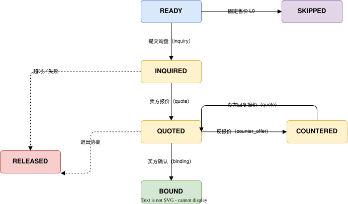

# 询盘原语（Negotiate） {#s-12-p2-negotiate}

## 原语身份（Primitive Identity） {#s-negotiate-identity}

```
primitive_id:   utp.negotiate
version:        2026-07-01
intent:         买卖双方就交易条款进行定价协商
state_delta:    candidate_set → binding_terms
actions:        inquiry, quote, counter-offer, binding, query
compensation:   释放报价锁定、撤销报价承诺
precondition:   pricing_mode == L3
```

---

## 概述（Overview） {#s-121-overview}

### 意图 {#s-1211}

Negotiate 是 UTP 第二个交易原语（P2），其意图是使买卖双方就交易条款（价格、数量、交期、付款方式等）进行结构化协商，最终产出一组**绑定的交易条款（Binding Terms）**。Seller 在最终 `quote` 中对报价条款签名；Buyer 对该有效报价执行 `binding` 后，生成包含双方签名、在有效期内不可撤销的报价绑定信息，作为 Purchase 原语的前置输入。Binding Terms 不等同于 Purchase Credential 所代表的正式交易承诺。

Negotiate 仅在 `pricing_mode == L3`（询报价）时执行：L0—L2 的当前有效价格由 Source 按固定价、阶梯价或确定性规则直接取得，Negotiate 自动跳过；L3 则展开为询盘、报价、改价或议价、绑定流程。同一套协议中，`pricing_mode` 决定是否需要取得正式 Quote，`decision_path` 决定取得 Quote 后的交互方式和轮次约束。

### 范围 {#s-1212}

Negotiate 覆盖以下场景：

- **询盘（Inquiry）**：采购方向一个或多个供应商提交结构化采购需求。
- **报价（Quote）**：供应商根据询盘内容回复报价单。
- **议价（Counter-offer）**：采购方对报价提出修改建议；供应商通过后续 `quote` 回复接受、拒绝或修订后的报价。支持多轮循环。
- **条款绑定（Binding）**：双方就最终条款达成一致，生成 Binding Terms 对象。
- **协商查询（Query）**：参与方查询本方可见的协商状态、当前报价和授权范围内的历史或竞争信息。

Negotiate 不覆盖商品、服务或供应商寻源（属于 Source 原语）和正式交易承诺（属于 Purchase 原语）。

### 前置条件 {#s-1213}

| 条件 | 必需？ | 说明 |
| --- | --- | --- |
| `session.mode.pricing_mode == L3` | MUST | 仅询报价进入 Negotiate；当 `pricing_mode ∈ {L0, L1, L2}` 时 Negotiate 自动退化跳过。 |
| `session.state ∈ {SOURCING, NEGOTIATING}` | MUST | 会话处于发现或协商阶段。 |
| `candidate_set != null` | MUST | 询盘项 MUST 引用 Source 返回的候选商品与供应商事实。 |
| `session.topology.locked == true` | MUST | 商业拓扑已锁定。 |
| `buyer.identity.verified == true` | MUST | 采购方身份已验证。供应商 MUST NOT 对未验证身份的采购方返回报价。 |

### 后置条件 {#s-1214}

| 条件 | 说明 |
| --- | --- |
| `session.state == 'NEGOTIATING'` 或 `'PURCHASING'` | 协商中或协商完成进入承诺阶段。 |
| `binding_terms != null`（成功路径） | Binding Terms 对象已生成，含双方签名和条款哈希。 |
| `binding_terms.terms_hash != null` | 条款快照的 SHA256 哈希已锁定，确保条款不可篡改。 |
| `binding_terms.expiry > now()` | Binding Terms 在有效期内。 |

### 语义契约 {#s-1215}

```json
{
  "primitive": "utp.negotiate",
  "preconditions": [
    "session.mode.pricing_mode == L3",
    "session.state ∈ {SOURCING, NEGOTIATING}",
    "session.topology.locked == true",
    "buyer.identity.verified == true"
  ],
  "postconditions": [
    "session.state ∈ {NEGOTIATING, PURCHASING}",
    "IF binding 成功 → binding_terms != null",
    "binding_terms.terms_hash == SHA256(条款快照)",
    "binding_terms.signatures ⊇ {buyer, seller}",
    "binding_terms.expiry > now()"
  ],
  "invariants": [
    "每轮 quote/counter-offer 的有效期 MUST > 当前时间",
    "negotiation_rounds <= inquiry.max_rounds",
    "同一 inquiry 的多个 quote 之间 MUST 相互独立（竞价场景）"
  ],
  "side_effects": [
    "供应商侧报价资源锁定（库存预占、价格保证）",
    "询盘/报价记录存储（供审计和争议解决使用）"
  ],
  "compensation": {
    "on_binding_failure": "释放所有报价锁定 → 撤销报价承诺 → 通知各方",
    "on_timeout": "释放报价资源 → 标记协商超时 → 通知采购方",
    "on_withdrawal": "释放报价锁定 → 通知供应商采购方已退出协商"
  }
}
```

---

## 生命周期与状态机（Lifecycle and State Machine） {#s-122-lifecycle-state-machine}

### Negotiate 原语内部状态机 {#s-1221-negotiate}



### 状态定义与迁移规则 {#s-1222}

| 状态 | 含义 | 进入条件 | 允许的操作 |
| --- | --- | --- | --- |
| `SKIPPED` | Negotiate 被跳过 | `pricing_mode ∈ {L0, L1, L2}` | 无。后续由 `utp.purchase.create` 进入 Purchase。 |
| `READY` | 准备发起协商 | `pricing_mode == L3`，且 Source 已完成 | `inquiry` |
| `INQUIRED` | 询盘已提交 | 采购方提交 InquiryRequest | `quote`（供应商操作）, `query` |
| `QUOTED` | 供应商已报价 | 供应商回复 QuoteResponse | `counter-offer`, `binding`, `query` |
| `COUNTERED` | 采购方已提出反报价 | 采购方提交 CounterOffer | `quote`（供应商回复）, `query` |
| `BOUND` | 条款已绑定 | 采购方对有效的供应商已签报价执行 `binding` | 进入 `utp.purchase.create`，或 `query` |
| `RELEASED` | 协商资源已释放 | 协商失败、超时、或采购方主动退出 | 可重新发起 `inquiry` 或 `query` |

### 多轮协商约束 {#s-1223}

| decision_path | 最大协商轮次 | 说明 |
| --- | --- | --- |
| L1（改价审批） | 由 `InquiryRequest.max_rounds` 声明 | 买方可基于当前有效报价多次提交 `counter-offer`；卖方每轮只能 `approve` 或 `reject`，不得返回替代价格。 |
| L2（双方议价） | 由 `InquiryRequest.max_rounds` 声明 | 买卖双方可在上限内多轮 `quote ↔ counter-offer`。 |
| L3（多方竞价） | 由 `InquiryRequest.max_rounds` 与竞价规则声明 | 多个供应商分支各自受相同轮次上限约束。 |

当 `decision_path ∈ {L1, L2, L3}` 时，`InquiryRequest.max_rounds` MUST 为正整数。超过最大轮次后，Endpoint MUST 拒绝新的 `counter-offer` 请求，并返回 `NEGOTIATE.COUNTER_OFFER.MAX_ROUNDS` 错误。

### 与全局状态机的关系 {#s-1224}

Negotiate 对应上下文级全局状态 `NEGOTIATING`。Binding Terms 生成（`BOUND` 状态）后，当前 StateView 仍保持 NEGOTIATING；只有后续 `purchase.create` 的标准成功响应被 `evaluate_result` 接受并返回 `CREATE_TRANSACTIONS`，才创建一笔或多笔 PURCHASING 交易级 StateView。若协商失败（`RELEASED` 状态），全局状态可回到 `SOURCING`（允许重新搜索）或结束当前交易上下文。

**协议标识符行为：** Negotiate 属于 `trade_context_id` 作用域，不生成 `transaction_id`。询盘、报价、反报价、Binding Terms 和查询 MUST 关联当前 `trade_context_id`，并 MUST 省略 `transaction_id`。一个交易上下文中的 Binding Terms MAY 在后续 `purchase.create` 中形成多个独立交易边界；交易 ID 由 `evaluate_result` 在接受 Purchase 标准响应后生成。

**询盘与绑定标识：** `inquiry_id` 和 `binding_id` 是 Negotiate 内资源标识，均位于同一个 `trade_context_id` 下。它们的生成与引用关系如下：

| 标识 | 生成时机 | 作用域 | 关联约束 |
| --- | --- | --- | --- |
| `trade_context_id` | DAG 建立后由路径编排生成。 | INIT、SOURCING 与 NEGOTIATING 的完整预交易上下文。 | 同一 Negotiate 下的询盘、报价、反报价、绑定和查询 MUST 关联同一个 `trade_context_id`。 |
| `inquiry_id` | 创建询盘时由 Buyer 生成。 | 一次结构化询盘。 | MUST 关联当前 `trade_context_id`；L3 下同一 `inquiry_id` 可包含多个卖家的独立报价分支。 |
| `binding_id` | Buyer 对有效的 Seller 已签最终报价执行 `binding` 时生成。 | 一次报价条款绑定。 | MUST 引用所属 `inquiry_id`、当前 `trade_context_id` 和一个最终 `quote_id`；一个 `binding_id` 仅绑定一个卖家报价分支。 |
| `transaction_id` | 本阶段不生成。 | 不适用。 | 所有 Negotiate Action MUST 省略；在后续 `purchase.create` 成功结果被接受后，按独立交易边界生成。 |

---

## 错误处理（Error Handling） {#s-123-error-handling}

### 错误码定义 {#s-1231}

| 错误码 | 严重级别 | HTTP 映射 | 描述 | 建议处理 |
| --- | --- | --- | --- | --- |
| `NEGOTIATE.INQUIRY.INVALID_REQUEST` | error | 400 | 询盘请求格式无效（如缺少必要字段、数量为零）。 | 修正请求参数后重试。 |
| `NEGOTIATE.INQUIRY.NO_SUPPLIER` | warning | 404 | 询盘中指定的供应商不存在或不支持 Negotiate 操作。 | 更换目标供应商。 |
| `NEGOTIATE.QUOTE.TIMEOUT` | error | 504 | 供应商未在约定时间内回复报价。 | 向其他供应商发起询盘或等待后重试。 |
| `NEGOTIATE.QUOTE.INVALID_RESPONSE` | error | 400 | 报价响应格式无效（如缺少价格信息、有效期过期）。 | 联系供应商修正报价。 |
| `NEGOTIATE.COUNTER_OFFER.MAX_ROUNDS` | error | 409 | 已达到 Mode 允许的最大协商轮次。 | 接受当前最优报价或退出协商。 |
| `NEGOTIATE.BINDING.SIGNATURE_INVALID` | error | 400 | 签名验证失败（JWS 签名无效或密钥不匹配）。 | 检查签名密钥，使用正确的 ES256 密钥重新签名。 |
| `NEGOTIATE.BINDING.TERMS_MISMATCH` | error | 409 | 双方签名的条款哈希不一致，表示双方对条款理解不同。 | 回退到 `COUNTERED` 状态，重新确认条款内容。 |
| `NEGOTIATE.BINDING.EXPIRED` | error | 410 | 报价或反报价已过期，无法绑定。 | 重新发起 `inquiry` 或请求新报价。 |
| `NEGOTIATE.LOCK.RELEASED` | warning | 409 | 报价锁定已释放（库存不足或超时）。 | 重新发起询盘。 |
| `NEGOTIATE.AUTH.UNAUTHORIZED` | error | 403 | 当前角色无权执行此操作（如买方尝试执行 `quote`）。 | 确认操作权限，使用正确的角色身份。 |

## 角色与可见性约束 {#s-124-scopes}

Negotiate 的授权要求由能力提供方在 Profile 的 `authorization` 中声明；该声明同时表达授权是否为原语执行的预先条件。

**角色与可见性约束：**

- Buyer MUST NOT 执行 `quote` 操作。
- Seller MUST NOT 执行 `inquiry` 或 `counter-offer` 操作。
- Seller MUST 在最终 `quote` 中提供覆盖报价条款哈希的有效签名；Buyer MUST 在报价有效期内执行 `binding` 并提供签名。任一签名缺失或条款哈希不一致时，绑定不成立。
- `query` 为只读操作，执行后协商状态保持不变；其返回字段 MUST 同时受调用方角色、能力提供方访问策略和 L3 竞争规则约束。

---

## 角色职责指引（Role Responsibility Guidelines） {#s-125-guidelines}

### Buyer 角色职责 {#s-1251-buyer}

| 职责 | 级别 | 说明 |
| --- | --- | --- |
| 提交结构化询盘 | MUST | InquiryRequest MUST 包含明确的采购需求：商品标识、数量、交期要求、付款期望。模糊询盘 SHOULD 被供应商拒绝。 |
| 声明采购量 | MUST | 询盘中 MUST 声明预期采购数量，使供应商能据此计算阶梯价格。 |
| 管理询盘范围 | SHOULD | 同时向多家供应商询盘时，SHOULD 声明是竞争性询盘（`competitive: true`），供应商据此决定是否参与。 |
| 及时响应报价 | SHOULD | 收到报价后 SHOULD 在报价有效期内做出响应（接受、反报价或拒绝）。超时未响应的报价将自动过期。 |
| 签名绑定 | MUST | 在 `binding` 操作中 MUST 提供有效的 ES256 签名。签名覆盖完整的条款快照。 |
| 退出通知 | SHOULD | 若决定退出协商，SHOULD 显式通知供应商以释放锁定资源。 |

### Seller 角色职责 {#s-1252-seller}

| 职责 | 级别 | 说明 |
| --- | --- | --- |
| 及时回复报价 | MUST | 收到询盘后 MUST 在约定时间内（或供应商 Profile 声明的 SLA 内）回复报价。超时触发 `NEGOTIATE.QUOTE.TIMEOUT`。 |
| 报价完整性 | MUST | QuoteResponse MUST 包含：单价、币种、MOQ、报价有效期、预估交期、条款哈希和 Seller 签名。缺少必要字段的报价视为无效。 |
| 锁定报价资源 | MUST | 报价发出后 MUST 在有效期内锁定对应的库存和价格。 |
| 响应反报价 | SHOULD | 收到 CounterOffer 后 SHOULD 在合理时间内回复（接受、拒绝或再次报价）。 |
| 签名绑定 | MUST | 在 `quote` 操作中 MUST 提供覆盖最终报价条款哈希的有效 ES256 签名；该签名由 Buyer 的 `binding` 引用。 |
| 释放资源 | MUST | 协商失败或超时后 MUST 自动释放锁定的库存和价格资源。 |

---

## 模式驱动行为（Mode-Driven Behavior） {#s-126-mode-driven-behavior}

### pricing_mode 对 Negotiate 的影响 {#s-1261-pricing_mode-negotiate}

| pricing_mode | Negotiate 行为变化 |
| --- | --- |
| L0（固定售价） | **Negotiate 自动跳过**。采购方基于 Source 返回的固定价格进入 Purchase。 |
| L1（阶梯价） | **Negotiate 自动跳过**。Source 返回命中阶梯及对应单价，采购方直接进入 Purchase。 |
| L2（规则计价） | **Negotiate 自动跳过**。Source 返回规范化计价输入、规则版本和计算结果，采购方直接进入 Purchase。 |
| L3（询报价） | Negotiate 执行完整的 **inquiry → quote → [counter-offer] → binding** 流程。是否直接采纳、买方多轮改价、双方多轮议价或多供应商竞价由 `decision_path` 决定。 |

### decision_path 对 Negotiate 的影响 {#s-1262-decision_path-negotiate}

| decision_path | Negotiate 行为变化 |
| --- | --- |
| L0（直接采纳） | 在 L3 询报价中，Buyer 接受有效 Quote 并执行 binding；不允许 `counter-offer`。 |
| L1（改价审批） | Buyer 可在 `max_rounds` 上限内多次提交 `counter-offer`；Seller 每轮只能 `approve` 或 `reject`，不得返回替代价格。同意后形成 Binding Terms。 |
| L2（双方议价） | 在 `max_rounds` 上限内支持完整的 `quote ↔ counter-offer` 循环。 |
| L3（多方竞价） | 在竞价规则和 `max_rounds` 上限内维护多个 Seller 报价分支，确定中选报价后形成 Binding Terms。 |

### 其他维度对 Negotiate 的影响 {#s-1263-negotiate}

| Mode 维度 | 对 Negotiate 的影响 |
| --- | --- |
| `payment_structure` | L0: 无影响。L1+: 报价单 MUST 包含付款方案（如分期比例），binding 条款含付款结构。 |
| `fulfillment_structure` | L0: 无额外履约报价项。L1+: 报价单 MAY 包含物流、分批、验收、清关或单证等履约条件及相关费用；融资方案由 `payment_structure` 或商业拓扑决定。 |
| `relationship_mode` | L0: 无影响。L2+: 若双方存在框架协议，Negotiate MAY 引用框架协议条款简化协商。 |
| `compliance_level` | L0: 无影响。L2+: 报价单 MUST 包含合规声明（如原产地证明、出口许可）。 |

### Mode 驱动行为矩阵总览 {#s-1264-mode}

| Mode 配置 | inquiry 行为 | quote 行为 | counter-offer | binding 行为 | query 可见范围 |
| --- | --- | --- | --- | --- | --- |
| pricing∈{L0,L1,L2} | 跳过 | 不适用 | 跳过 | 跳过 | 跳过 |
| pricing=L3, decision=L0 | 提交结构化询盘 | 单一 Seller 正式报价 | 不支持 | Buyer 确认 Seller 已签报价 | 本方状态与当前条款 |
| pricing=L3, decision=L1 | 提交结构化询盘 | 正式报价或 approve/reject | Buyer 在 `max_rounds` 内多次改价 | Seller 同意最新改价后绑定 | 本方分支、当前报价与授权历史 |
| pricing=L3, decision=L2 | 提交结构化询盘 | 双方多轮报价 | 在 `max_rounds` 内双边循环 | 任一方接受当前报价后绑定 | 本方分支、当前报价与授权历史 |
| pricing=L3, decision=L3 | 多供应商并行询盘 | 各卖家独立报价 | 按竞价规则及 `max_rounds` 对一个或多个卖家分支提出反报价 | 采购方选择一个 Seller 已签报价分支并确认绑定 | Buyer 可见全部竞争分支；Seller 仅见本方分支和规则允许公开的信息 |

---

## 操作定义（Actions） {#s-127-operations}

- **`utp.negotiate.inquiry`**
  - **角色绑定：** Buyer → Seller
  - **执行说明：** Buyer 向一个或多个 Seller 提交结构化采购需求；每个 Seller 独立受理其报价分支并据此准备报价。
  - **适用状态：** `READY`
  - **状态影响：** 进入 `INQUIRED`，全局进入 `NEGOTIATING`
  - **后续操作：** `quote`、`query`
  - **关键约束：** 仅 `pricing_mode=L3`；仅 `decision_path=L3` 可面向多个 Seller
- **`utp.negotiate.quote`**
  - **角色绑定：** Seller → Buyer
  - **执行说明：** Seller 形成并签署报价后交付 Buyer；Buyer 接收报价并更新本地可见协商状态，接收成功不等同于接受报价。
  - **适用状态：** `INQUIRED` 或 `COUNTERED`
  - **状态影响：** 进入 `QUOTED`
  - **后续操作：** 由 `decision_path` 决定 `counter-offer`、`binding` 或 `query`
  - **关键约束：** 每个 Seller 报价分支独立；L1 仅允许 approve/reject，不得返回替代价格
- **`utp.negotiate.counter-offer`**
  - **角色绑定：** Buyer → Seller
  - **执行说明：** Buyer 针对指定 Seller 报价提出修改后的条款；Seller 校验轮次和约束后据此重新报价或结束该报价分支。
  - **适用状态：** `QUOTED`
  - **状态影响：** 进入 `COUNTERED`
  - **后续操作：** `quote`、`query`
  - **关键约束：** 仅 `decision_path ∈ {L1, L2, L3}`；L1 仅允许 Buyer 重复改价，L3 可针对一个或多个 Seller 分支
- **`utp.negotiate.binding`**
  - **角色绑定：** Buyer → Seller
  - **执行说明：** Buyer 对一个有效且已由 Seller 签署的最终报价提交签名确认；Seller 验证双方签名和条款哈希后生成绑定凭证。
  - **适用状态：** `QUOTED`
  - **状态影响：** 进入 `BOUND`，全局迁移至 `PURCHASING`
  - **后续操作：** `utp.purchase.create`、`query`
  - **关键约束：** 只能选择一个 Seller 报价分支
- **`utp.negotiate.query`**
  - **角色绑定：** Buyer → Seller
  - **执行说明：** Buyer 查询询盘、报价分支和绑定结果；Seller 按访问策略返回 Buyer 可见的协商状态和报价信息，协商状态保持不变。
  - **适用状态：** `INQUIRED`、`QUOTED`、`COUNTERED`、`BOUND` 或 `RELEASED`
  - **状态影响：** 无
  - **后续操作：** 保持当前状态下可执行的操作
  - **关键约束：** 结果受能力提供方访问策略与 L3 竞争规则限制

---
