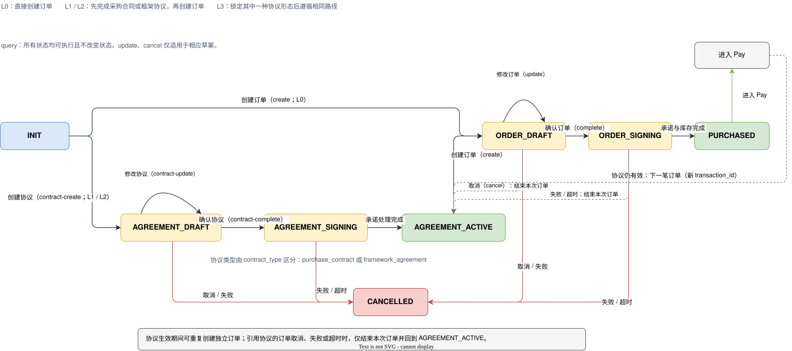

# 订购原语（Purchase） {#s-13-p3-purchase}

## 原语身份（Primitive Identity） {#s-purchase-identity}

```
primitive_id:   utp.purchase
version:        2026-07-01
intent:         双方对交易条款做出具有法律约束力的承诺
state_delta:    source current_price_terms / binding_terms → purchase_credential | contract_credential
actions:        create, update, complete, contract-create, contract-update, contract-complete, query, cancel
compensation:   释放库存 + 取消订购
```

---

## 概述（Overview） {#s-131-overview}

### 意图 {#s-1311}

Purchase 是 UTP 第三个交易原语（P3），其意图是让买卖双方对交易条款做出**具有法律约束力的承诺**。承诺一旦成立，双方即受条款约束，不可单方面撤回。Purchase 根据承诺对象产出订单凭证、采购合同凭证或框架协议凭证；三者均包含条款快照、操作准入记录和证据包引用。

Purchase 是交易从"协商"走向"执行"的关键转折点。在 Purchase 之前（Source、Negotiate），双方的交互是可逆的 —— 采购方可以放弃候选、退出协商，供应商可以拒绝报价。在 Purchase 之后，交易进入不可逆状态，任何变更都需要通过补偿机制（退款、退货等）或争议解决（Resolve 原语）来处理。

### 关键设计原则 {#s-1312}

**订单与合同使用独立操作。** `utp.purchase.create`、`update` 和 `complete` 处理订单；`utp.purchase.contract-create`、`contract-update` 和 `contract-complete` 处理采购合同或框架协议。`query` 与 `cancel` 按对象标识复用。订单操作负责库存锁定并衔接 Pay；合同操作形成可供后续订单引用的协议凭证。

### 范围 {#s-1313}

Purchase 覆盖以下场景：

- **B2C 即时下单**：基于 Source 的固定价格和采购方传入的商品项生成草案；若收货地址、物流选项等履约信息已完整，可直接 `complete`，否则仍可通过 `update` 调整草案。
- **B2B 采购合同**：在 `relationship_mode == L1`，或战略合作场景选定采购合同时，基于当前成交依据创建并完成采购合同承诺；合同生效后可作为后续订单的交易依据。
- **框架协议循环采购**：在 `relationship_mode == L2`，或战略合作场景选定框架协议时，先创建并完成框架协议承诺，再在其有效期、配额和适用范围内循环创建具体订单。

### 前置条件 {#s-1314}

| 条件 | 必需？ | 说明 |
| --- | --- | --- |
| `session.state ∈ {SOURCING, NEGOTIATING, PURCHASING}` | MUST | 会话处于寻源、询盘或订购阶段。 |
| `pricing_mode == L3 → negotiate.output.status == 'binding'` | MUST | 询报价模式下，Negotiate 原语 MUST 已完成并产出 Binding Terms。 |
| `pricing_mode ∈ {L0, L1, L2} → source.output.current_price_terms != null` | MUST | 固定价、阶梯价或规则计价模式下，Source 原语 MUST 返回当前有效价格条款。 |
| `session.topology.locked == true` | MUST | 商业拓扑已锁定。 |
| `buyer.identity.verified == true` | MUST | 采购方身份已验证。 |

### 后置条件 {#s-1315}

| 条件 | 说明 |
| --- | --- |
| `purchase.status == 'purchased'` 或 `agreement.status == 'agreement_active'` | 相应承诺凭证已成立；只有订单进入 `PURCHASED`。 |
| `purchase.purchase_id != null` 或 `contract.agreement_id != null` | 承诺凭证已生成唯一标识；订单为 `purchase_id`，协议为 `agreement_id`。 |
| `purchase.terms_snapshot` 被 SHA256 哈希锁定 | 条款快照不可篡改。 |
| `complete` 或 `contract-complete` 的 Mandate 准入已满足 | 完成操作已按[信任准入评估规则](../../protocol-core/security-trust.md)通过 Mandate 准入。 |
| `purchase.complete → inventory.locked(purchase.line_items) == true` | 仅订单在完成时锁定对应库存；协议不锁定某一笔订单库存。 |
| `purchase.complete → session.state == 'PAYING'` | 仅订单完成后进入支付阶段；合同和框架协议生效后可创建后续订单。 |
| `evidence_bundle.contains(['mandate', 'authorization_decision', 'terms_hash'])` | 证据包已生成。 |

### 语义契约 {#s-1316}

```json
{
  "primitive": "utp.purchase",
  "preconditions": [
    "session.state ∈ {SOURCING, NEGOTIATING, PURCHASING}",
    "IF mode.pricing_mode == L3 → negotiate.output.status == 'binding'",
    "IF mode.pricing_mode ∈ {L0, L1, L2} → source.output.current_price_terms != null",
    "session.topology.locked == true",
    "buyer.identity.verified == true"
  ],
  "postconditions": [
    "purchase.status == 'purchased' OR agreement.status == 'agreement_active'",
    "purchase.purchase_id != null OR contract.agreement_id != null",
    "purchase.terms_snapshot == 最终条款（SHA256 哈希锁定，不可篡改）",
    "complete 或 contract-complete 已满足第 5 章 Mandate 准入",
    "IF action == purchase.complete → inventory.locked(purchase.line_items) == true",
    "IF action == purchase.complete → session.state == 'PAYING'",
    "evidence_bundle.contains(['mandate', 'authorization_decision', 'terms_hash'])"
  ],
  "invariants": [
    "commitment.terms_snapshot 被 SHA256 哈希锁定",
    "commitment.terms.expiry > now()"
  ],
  "side_effects": [
    "订单完成时的库存最终锁定（卖方库存系统）",
    "相应承诺凭证的完成通知（卖方 Agent）"
  ],
  "compensation": {
    "on_inventory_lock_failure": "释放已锁库存 → 取消订购 → 通知采购方",
    "on_timeout": "释放临时 hold 和已锁库存 → 状态收敛至 CANCELLED 或 COMPENSATED → 返回结构化超时错误"
  }
}
```

---

## 生命周期与状态机（Lifecycle and State Machine） {#s-132-lifecycle-state-machine}

### Purchase 原语内部状态机 {#s-1321-purchase}



### 状态定义与迁移规则 {#s-1322}

Purchase 使用一张内部状态机描述订单与协议的衔接。订单由 `purchase.create`、`update`、`complete` 驱动；当关系模式要求长期关系时，采购合同或框架协议先由 `contract_*` 动作进入生效状态，再作为后续订单的引用依据。协议生效不替代订单状态，且可在有效期内反复创建独立订单。引用有效协议的订单若在草案阶段取消，或在承诺处理阶段失败、超时，本次订单交易结束，但原协议保持 `AGREEMENT_ACTIVE`，可继续创建后续订单。

| 状态 | 含义 | 进入条件 | 允许的操作 |
| --- | --- | --- | --- |
| `INIT` | 尚未创建订单或合同草案 | 开始创建订单或合同 | `purchase.create` 或 `purchase.contract-create` |
| `DRAFT` | 订单草案已创建 | `purchase.create` 成功执行 | `purchase.update`, `purchase.complete`, `purchase.query`, `purchase.cancel` |
| `SIGNING` | 订单正在完成承诺处理 | 订单 `purchase.complete` 已通过第 5 章 Mandate 准入，正在执行最终库存锁定与卖方承诺处理 | 等待库存锁定和承诺处理结果 |
| `PURCHASED` | 订购已成立（不可撤销） | 最终库存锁定和卖方承诺处理成功 | `purchase.query`；进入 Pay 原语；或发起 Resolve |
| `AGREEMENT_DRAFT` / `AGREEMENT_SIGNING` | 采购合同或框架协议草案 / 正在完成承诺处理 | `purchase.contract-create` / `purchase.contract-complete`；具体形态由 `contract_type` 区分 | 草案可 `contract-update`、`contract-complete`、`query`、`cancel`；承诺处理中仅可 `query` |
| `AGREEMENT_ACTIVE` | 采购合同或框架协议已生效 | 协议承诺处理完成 | `purchase.query`；在协议有效范围内反复创建引用该协议的独立订单 |
| `CANCELLED` | 无有效协议引用的订单，或合同 / 协议草案与承诺处理流程已取消 | 采购方取消草案，或库存锁定失败、承诺处理失败、超时导致取消；Mandate 准入失败不进入业务状态机。引用有效协议的订单不进入此状态，而是返回 `AGREEMENT_ACTIVE` | `purchase.query`（只读） |
| `COMPENSATED` | 补偿完成 | 补偿链执行完毕 | 当前 `transaction_id` 收敛结束；如需继续，应基于同一 `trade_context_id` 创建新的交易分支 |

### 状态迁移的原子性 {#s-1323}

`complete` 与 `contract-complete` 必须先通过[信任准入评估规则](../../protocol-core/security-trust.md)定义的 Mandate 准入，方可进入 `*_SIGNING`。所有 `*_SIGNING → *` 的状态迁移 MUST 是原子操作；订单额外保证最终库存锁定成功：

1. 卖方完成自身承诺处理
2. 当动作是 `purchase.complete` 时，最终库存锁定成功
3. `terms_hash` 与完成操作所依据的条款快照一致

若任一条件不满足，状态 MUST 回滚至相应的 `*_DRAFT`（可重试）或结束本次对象的承诺处理流程。对于引用有效 `agreement_ref` 的订单，承诺处理失败或超时后 MUST 返回 `AGREEMENT_ACTIVE`；本次订单交易收敛为取消或失败，但不得影响协议的有效性。其他不可重试情形迁移至 `CANCELLED`。

### B2C/B2B/框架协议路径对比 {#s-1324-b2cb2b}

```
Purchase 通用操作结构：

  订单：create → [update] → complete
  合同：contract-create → [contract-update] → contract-complete

  relationship=L0：order → PURCHASED → Pay
  relationship=L1：purchase_contract → AGREEMENT_ACTIVE → order → PURCHASED → Pay
  relationship=L2：framework_agreement → AGREEMENT_ACTIVE → order → PURCHASED → Pay
  relationship=L3：锁定其中一种协议形态 → AGREEMENT_ACTIVE → order → PURCHASED → Pay

  AGREEMENT_ACTIVE 有效期间：重复创建独立订单边界（每次成功后生成新的 transaction_id）
  引用协议的订单取消 / 承诺处理失败 / 超时：本次订单结束 → AGREEMENT_ACTIVE
```

### 与全局状态机的关系 {#s-1325}

订单对应全局状态 `PURCHASING`。`purchase.create` 的请求位于 `trade_context_id` 作用域，MUST NOT 预先携带 `transaction_id`；P3 标准响应负责确认一个或多个可独立成败、支付、履约、取消和争议的交易边界。该成功响应被 `evaluate_result` 接受并返回 `CREATE_TRANSACTIONS` 后，路径编排为每个边界生成独立 `transaction_id`，并创建对应的 PURCHASING StateView。`purchase.complete` 生成 Purchase Credential 后，内部进入 `PURCHASED`，全局状态迁移至 `PAYING`。`contract_*` 动作只形成合同级承诺，不进入 Pay，也不将既有子交易回迁到 `PURCHASING`。

若 Purchase 取消或失败，同一 `transaction_id` MUST NOT 回退到 `SOURCING`。协议引擎应将当前订单交易收敛到 `CANCELLED`、`FAILED` 或 `COMPENSATED` 等安全状态；若订单引用有效 `agreement_ref`，该收敛不影响父级协议，Purchase 聚合恢复为 `AGREEMENT_ACTIVE`，采购方可为后续订单创建新的交易边界和 `transaction_id`。其他场景中，采购方若需要重新寻源或重新询盘，应在同一 `trade_context_id` 下创建新的预交易分支。

**协议标识符行为：** 无论是否经过 Negotiate，`purchase.create` 都 MUST 携带来源 `trade_context_id`，并 MUST 省略 `transaction_id`。Negotiate 不生成交易 ID；Purchase Endpoint 也不得在原始 P3 标准响应中自行生成协议级交易 ID。只有 `evaluate_result` 接受成功响应后，才按 P3 确认的独立交易边界生成一个或多个 `transaction_id`。每笔引用协议的订单仍使用独立 `transaction_id` 与 `purchase_id`；合同和框架协议使用 `agreement_id` 作为自身标识。

---

## 错误处理（Error Handling） {#s-133-error-handling}

### 错误码定义 {#s-1331}

| 错误码 | 严重级别 | HTTP 映射 | 描述 | 建议处理 |
| --- | --- | --- | --- | --- |
| `PURCHASE.CREATE.INVALID_ITEMS` | error | 400 | 草案中的商品项无效（商品已下架、数量不满足 MOQ、或商品信息与输入不一致）。 | 检查商品可用性，更新商品项后重试。 |
| `PURCHASE.CREATE.PRICE_CHANGED` | warning | 409 | 商品价格与 Binding Terms 或 Source 返回的价格不一致（价格在协商期间发生了变化）。 | 回退至 Negotiate 重新协商，或接受新价格创建草案。 |
| `PURCHASE.CREATE.DUPLICATE` | error | 409 | 幂等键重复但请求内容不一致（可能表示不同的交易企图使用相同的幂等键）。 | 使用新的幂等键。 |
| `PURCHASE.UPDATE.IMMUTABLE_FIELD` | error | 400 | 尝试修改不可变字段（如 `line_items`、`unit_price`、`terms_hash`）。 | 仅修改允许变更的字段（`shipping_address`、`logistics_method`、`invoice_info`）。 |
| `PURCHASE.UPDATE.DRAFT_NOT_FOUND` | error | 404 | 指定 `purchase_id` 的草案不存在或已过期。 | 重新创建草案。 |
| `PURCHASE.COMPLETE.INVENTORY_UNAVAILABLE` | error | 409 | 最终库存锁定失败（库存不足或被其他订购占用）。 | 等待库存补充后重试，或调整采购数量。 |
| `PURCHASE.COMPLETE.TERMS_EXPIRED` | error | 410 | Binding Terms 或草案已过期。 | 重新协商条款或重新创建草案。 |
| `PURCHASE.COMPLETE.TOPOLOGY_CHANGED` | error | 409 | 商业拓扑在 Purchase 过程中发生了变更（如参与方退出）。 | 重新确认拓扑后重试。 |
| `PURCHASE.COMPLETE.TIMEOUT` | error | 504 | Purchase 操作超时（库存锁定或承诺处理超时）。 | 补偿链自动执行。可重新发起。 |
| `PURCHASE.CANCEL.STATE_CONFLICT` | warning | 409 | 订购已被取消（由采购方取消或补偿链触发）。 | 查看补偿详情，决定是否重新发起。 |

### 补偿链执行 {#s-1332}

当 Purchase 在 `SIGNING` 阶段失败时，协议引擎 MUST 自动执行补偿链：

```
失败原因                    补偿动作序列
─────────────────────────────────────────────────────────
库存锁定失败          →    释放已锁定的部分库存
                          → 通知采购方
                          → 状态 → CANCELLED

超时                  →    释放所有锁定
                          → 状态 → CANCELLED 或 COMPENSATED
                          → 返回 PURCHASE.COMPLETE.TIMEOUT
```

---

## 角色与访问约束 {#s-134-scopes}

Purchase 的授权要求由能力提供方在 Profile 的 `utp.purchase.authorization` 中声明；角色、组织、资源归属、证据包和收货信息的可见性由能力提供方的访问策略控制。

**角色约束：**

- Seller MUST NOT 执行 `create` 或 `update` 操作 —— 订购的发起方始终是 Buyer。
- `complete` 与 `contract-complete` 均由 Buyer 发起、Seller 处理；两者在进入业务处理前 MUST 满足[信任准入评估规则](../../protocol-core/security-trust.md)定义的 Mandate 准入要求。准入失败时，Seller MUST NOT 创建或迁移 Purchase 业务状态。
- `query` 为只读操作，MUST NOT 改变 Purchase 内部状态或全局状态。
- `cancel` 仅在 `DRAFT` 状态下允许。一旦进入 `SIGNING` 或 `PURCHASED` 状态，取消 MUST 通过 Resolve 原语或 Saga 补偿处理。

---

## 角色职责指引（Role Responsibility Guidelines） {#s-135-guidelines}

### Buyer 角色职责 {#s-1351-buyer}

| 职责 | 级别 | 说明 |
| --- | --- | --- |
| 创建草案 | MUST | 调用 `purchase.create` 创建订购草案。草案 MUST 基于有效 Binding Terms（`pricing_mode == L3`）或 Source 当前有效价格条款（`pricing_mode ∈ {L0, L1, L2}`）。 |
| 提供收货地址 | SHOULD | 在 `create` 或 `update` 中提供 `shipping_address`。若未提供，供应商 MAY 在 `complete` 前要求补充。 |
| 提供发票信息 | SHOULD（当 `compliance_level >= L1`） | 需要增值税发票时 MUST 提供 `invoice_info`。专票需要额外的银行信息。 |
| 选择 Trade Method | SHOULD | 从供应商提供的 Trade Method 列表中选择一种。若未选择，默认使用 `"prepay"`。 |
| 提交 Mandate | MUST | 在 `purchase.complete` 或 `contract-complete` 中提供满足操作准入要求的 Mandate。 |
| 及时完成 | SHOULD | 草案创建后 SHOULD 在有效期内完成 `complete`。超时草案将自动过期并释放资源。 |

### Seller 角色职责 {#s-1352-seller}

| 职责 | 级别 | 说明 |
| --- | --- | --- |
| 锁定订单库存 | MUST | 收到 `purchase.create` 请求后，MUST 校验 `line_items` 中的库存可用性，并 MAY 创建有有效期的临时库存 hold；最终库存锁定只能在订单 `purchase.complete` 成功时成立。 |
| 确认可行性 | MUST | 在 `purchase.complete` 之前，MUST 确认所有条款可执行（库存充足、交期可行、Trade Method 可用）。 |
| 执行 Mandate 准入 | MUST | 在处理 `purchase.complete` 或 `contract-complete` 前，按操作准入要求完成 Mandate 校验；失败时不得进入业务状态机。 |
| 生成承诺凭证 | MUST（实现层） | 完成后，MUST 在业务层生成对应的订单、采购合同或框架协议记录；订单将 `order_id` 映射到 `purchase_id`，协议使用 `agreement_id`。 |
| 发送确认通知 | MUST | 承诺成立后 MUST 向采购方发送确认通知；订单包含 `order_id`、预计交期和付款指引，协议包含 `agreement_id`、有效期和适用范围。 |
| 维护证据包 | MUST | 订购的 Mandate、Authorization Decision、哈希和条款快照 MUST 存入证据包（Evidence Bundle），保存期限不低于争议时效期。 |

---

## 模式驱动行为（Mode-Driven Behavior） {#s-136-mode-driven-behavior}

### Mode 驱动行为矩阵 {#s-1361-mode}

| `relationship_mode` | 允许的合同类型 | 建立顺序 | 完成后的状态影响 |
| --- | --- | --- | --- |
| L0 一次性交易 | 无 | 直接创建订单。 | 订单完成后进入 `PURCHASED`，全局进入 Pay。 |
| L1 复购合约 | `purchase_contract` | 先创建采购合同；合同生效后创建引用该合同的订单。 | 协议进入 `AGREEMENT_ACTIVE`；每笔订单独立进入 Pay 与 Fulfill。 |
| L2 框架协议 | `framework_agreement` | 先创建框架协议；在协议范围内循环创建订单。 | 协议进入 `AGREEMENT_ACTIVE`；每笔订单独立进入 Pay 与 Fulfill。 |
| L3 战略合作 | `purchase_contract` 或 `framework_agreement` | 双方在锁定 Mode 时选择一种合同形态；合同生效后创建引用该合同的订单。 | 合同生效后保持独立；每笔订单独立进入 Pay 与 Fulfill。 |
| 任意关系模式 | 由该模式允许的一种合同类型 | `contract-update` 仅在相应 `*_DRAFT` 状态可用；`contract-complete` 使合同进入其完成态。 | 仅订单操作需要库存锁定并在完成后进入 Pay。 |

### B2C 退化行为详解 {#s-1362-b2c}

当 Mode 为全 L0 时（典型 B2C 闪购），Purchase 的行为极大简化：

1. **`create` 直接生成**：采购方显式传入商品项、数量和必要的收货信息；协议引擎基于 Source 返回的 `current_price_terms` 填充或校验价格信息，不再需要通过 Negotiate 产出 Binding Terms。
2. **`update` 可选**：B2C 并不禁止修改地址、物流等可变履约信息；若这些信息已在 `create` 或 `complete` 时一次性提交，则可以不出现独立的 `update` 步骤。
3. **`complete` 一键确认**：采购方一键确认并提交满足操作准入要求的 Mandate 后，供应商自动完成承诺处理，库存锁定和订购成立在同一操作中完成。

**B2C 等效流程：**

```
purchase.create (基于传入商品项生成)
       |
       v
  purchase.update (可选：调整地址/物流等履约信息)
       |
       v
  purchase.complete (一键确认 + 自动承诺处理)
       |
       v
  PURCHASED → 进入 Pay
```

### 长期协议下的循环订购 {#s-1363}

当 `relationship_mode == L1` 时，订单 MUST 引用已生效采购合同；当 `relationship_mode == L2` 时，订单 MUST 引用已生效框架协议；当 `relationship_mode == L3` 时，订单 MUST 引用双方在锁定 Mode 时选定的其中一种生效合同。每次 `purchase.create` 成功结果被接受后，路径编排为该订单边界生成独立 `transaction_id`；P3 同时为订单生成独立 `purchase_id`：

```
合同或框架协议（已生效）
       |
       v
  ┌─── 循环开始 ───┐
  |                  |
  | purchase.create    |  ← 创建引用协议的具体订单
  | purchase.update    |  ← 调整本次采购细节
  | purchase.complete  |  ← 确认本次采购
  | cancel / 失败 / 超时 |  ← 结束本次订单，回到已生效协议
  |                  |
  | → Pay → Fulfill  |
  |                  |
  └─── 循环重复 ───┘
       |
       v
  (协议到期、终止或配额用尽)
```

每次循环生成的 PurchaseCredential MUST 引用 `agreement_ref`，并遵守被引用协议的有效期、可采购范围、价目表和配额约束。

---

## 操作定义（Actions） {#s-137-operations}

- **`utp.purchase.create`**
  - **角色绑定：** Buyer → Seller
  - **执行说明：** Buyer 基于有效 Binding Terms、Source 固定价格或生效 `agreement_ref` 创建订购草案；Seller 校验交易依据和可履行性后生成草案快照。
  - **适用状态：** `INIT`
  - **状态影响：** 创建订单草案并进入 `DRAFT`，全局进入或保持 `PURCHASING`
  - **后续操作：** `update`、`complete`、`query`、`cancel`
- **`utp.purchase.update`**
  - **角色绑定：** Buyer → Seller
  - **执行说明：** Buyer 修改订单草案中的可变履约信息；Seller 重新校验并生成更新后的草案快照和派生信息。
  - **适用状态：** `DRAFT`
  - **状态影响：** 保持 `DRAFT`
  - **后续操作：** `update`、`complete`、`query`、`cancel`
  - **关键约束：** 不得修改商品、价格、交易依据或条款哈希
- **`utp.purchase.complete`**
  - **角色绑定：** Buyer → Seller
  - **执行说明：** Buyer 对当前条款提交 Mandate；Seller 按操作准入要求完成 Mandate 准入并执行最终库存锁定，成功后形成不可撤销的订购凭证。
  - **适用状态：** `DRAFT`
  - **状态影响：** 进入 `SIGNING`，成功后进入 `PURCHASED` 并全局迁移至 Pay
  - **后续操作：** `query`、`utp.pay.initiate`
  - **关键约束：** Mandate 要求以操作准入规则为准
- **`utp.purchase.contract-create`**
  - **角色绑定：** Buyer → Seller
  - **执行说明：** Buyer 在允许的关系模式下创建采购合同或框架协议草案；Seller 校验合同类型与交易关系后生成协议条款快照。
  - **适用状态：** `INIT`
  - **状态影响：** 按 `contract_type` 创建 `AGREEMENT_DRAFT`
  - **后续操作：** `contract-update`、`contract-complete`、`query`、`cancel`
  - **关键约束：** 仅在 `relationship_mode ∈ {L1, L2, L3}` 时可用；L1 仅允许 `purchase_contract`，L2 仅允许 `framework_agreement`，L3 必须显式选择其中一种
- **`utp.purchase.contract-update`**
  - **角色绑定：** Buyer → Seller
  - **执行说明：** Buyer 修改未完成承诺的协议草案；Seller 重新校验条款并刷新协议条款快照。
  - **适用状态：** `AGREEMENT_DRAFT`
  - **状态影响：** 保持 `AGREEMENT_DRAFT`
  - **后续操作：** `contract-update`、`contract-complete`、`query`、`cancel`
  - **关键约束：** 已生效协议不得通过此 Action 修改
- **`utp.purchase.contract-complete`**
  - **角色绑定：** Buyer → Seller
  - **执行说明：** Buyer 对协议条款提交 Mandate；Seller 按操作准入要求完成 Mandate 准入和协议承诺处理，生成可供后续订单引用的协议凭证。
  - **适用状态：** `AGREEMENT_DRAFT`
  - **状态影响：** 进入 `AGREEMENT_SIGNING`，成功后进入 `AGREEMENT_ACTIVE`
  - **后续操作：** `query`、`utp.purchase.create`
  - **关键约束：** Mandate 要求以操作准入规则为准；合同完成不锁定具体订单库存，也不进入 Pay
- **`utp.purchase.query`**
  - **角色绑定：** Buyer → Seller
  - **执行说明：** Buyer 按订单或协议标识读取当前状态、条款摘要、凭证和证据引用；Seller 按访问策略返回可见信息，对象状态保持不变。
  - **适用状态：** `DRAFT`、`SIGNING`、`PURCHASED`、`AGREEMENT_*`、`CANCELLED`、`COMPENSATED`
  - **状态影响：** 无
  - **后续操作：** 保持当前状态下可执行的操作
- **`utp.purchase.cancel`**
  - **角色绑定：** Buyer → Seller
  - **执行说明：** Buyer 取消尚未完成承诺的订单或协议草案；Seller 释放相应临时资源并收敛该草案状态。
  - **适用状态：** `DRAFT`、`AGREEMENT_DRAFT`
  - **状态影响：** 引用有效协议的订单结束本次订单并返回 `AGREEMENT_ACTIVE`；其他订单或协议草案进入 `CANCELLED`
  - **后续操作：** 引用有效协议的订单可 `query`、`create`；其他情形仅可 `query`
  - **关键约束：** 不适用于 `*_SIGNING` 或已完成承诺

`valid_next_actions` 中的相对动作名按 `utp.purchase.{action}` 解析；跨原语动作保留完整名称。`utp.pay.initiate` 仅在订单 Purchase Credential 已生成且支付前置条件满足时暴露；已生效合同可暴露后续 `utp.purchase.create`。

---
