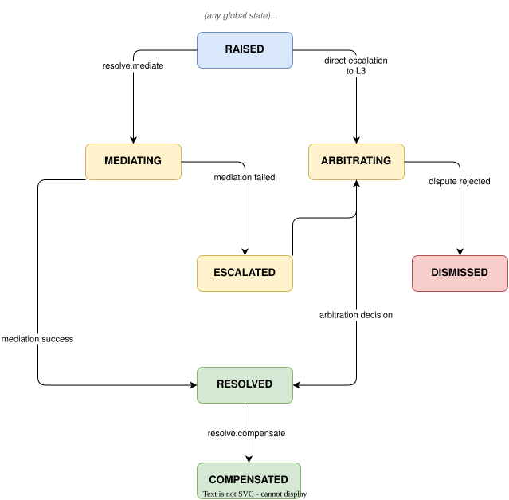
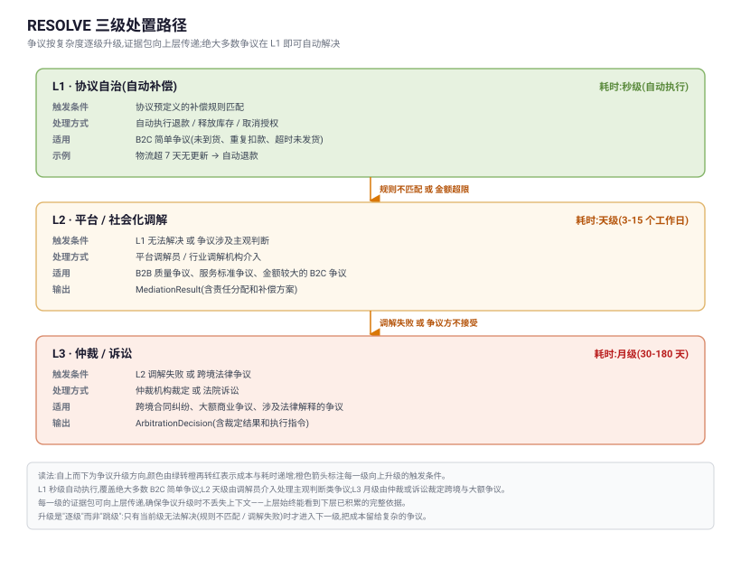

# Resolve 争议解决原语 {#s-16-p6-resolve}

## 原语身份 {#s-_1}

```
primitive_id:   utp.resolve
version:        2026-07-01
intent:         处理交易争议
state_delta:    any transaction state → DISPUTED → prior_state/terminal_state
actions:        raise, mediate, arbitrate, compensate
compensation:   恢复争议前状态
trigger:        can activate from ANY state (cross-cutting concern)
```

---

## Overview（概述） {#s-161-overview}

### 意图 {#s-1611}

Resolve 是 UTP 第六个交易原语（P6），其意图是**处理交易过程中产生的争议**。与其他五个原语不同，Resolve 不是交易流程的"最后一步"——它是一个**随时可激活的横切关注点（cross-cutting concern）**。任何原语执行后，只要任一方认为交易结果与预期不符，都可以激活 Resolve。

Resolve 的设计目标是将争议解决从"平台黑箱处理"提升为"协议级可验证机制"。传统的电商争议解决依赖平台客服人工裁定，裁定依据不透明、证据链不完整、结果不可预测。Resolve 通过**结构化证据包（Evidence Bundle）**、**五层责任模型（Responsibility Layering）** 和**三级处置路径（Three-level Resolution）**，使争议解决的每一步都有据可查、有理可推、有法可依。

### 关键设计原则 {#s-1612}

**五层责任分层模型。** 协议将交易链路中的主体建模为五类责任层：User（用户）、Agent（智能代理）、Merchant（商家）、Platform（平台）、Infrastructure（基础设施服务商）。争议发生时，协议通过分析 Mandate 链的签名主体与签名内容，自动判定首问责任方。Agent 幻觉导致的错误下单由 Agent 层承担；商家违约由 Merchant 层承担；支付系统故障由 Infrastructure 层承担。责任判定不是人工裁定，而是协议级的结构化推导。

**三级处置路径。** 争议按复杂度逐级升级：L1 协议自治（自动补偿规则）→ L2 平台/社会化调解 → L3 仲裁/诉讼。绝大多数 B2C 争议在 L1 即可解决（如自动退款、自动释放库存）。B2B 质量争议通常需要 L2 调解介入。跨境法律争议升级至 L3 仲裁。每一级的证据包可向上层传递，确保争议升级时不丢失上下文。

**证据包司法可采信。** Evidence Bundle 将 JWS 签名链、ES256 证书、Mandate 凭证、WYSIWYS 快照、时间戳链统一封装为 JSON+JWS 格式，可对接司法链与电子数据存证中心。证据包的设计目标是"字节级可验证、跨平台可携带、面向司法可采信"。

### 范围 {#s-1613}

Resolve 覆盖以下场景：

- **B2C 自动退款**：商品未到货、商品与描述不符等简单争议，由 L1 协议自治规则自动处理。
- **B2B 质量争议**：验货不通过、商品规格与约定不符等，由 L2 平台调解介入。
- **跨境贸易争议**：涉及不同法域的合同违约，由 L3 仲裁机构裁定。
- **Agent 行为争议**：Agent 幻觉导致的错误下单、超授权范围交易等，通过 Mandate 链分析判定责任。
- **支付争议**：重复扣款、金额不一致、支付授权被冒用等，通过 Tokenizer 审计日志和 Mandate 链追溯。

### 触发条件 {#s-1614}

| 条件 | 必需？ | 说明 |
| --- | --- | --- |
| 存在有效的 UTP Session | MUST | 争议 MUST 关联到一次具体的交易会话。 |
| 争议方为拓扑中的参与方 | MUST | 只有拓扑中的参与方才有权发起争议。 |
| 争议时效未过期 | MUST | 各原语的争议有时效限制（由 `compliance_level` 和 TradeMethod 约定）。超过时效的争议 MUST 拒绝。 |

### 后置条件 {#s-1615}

| 条件 | 说明 |
| --- | --- |
| 全局状态按全局状态机的 R3/R4 规则收敛 | Resolve 激活时全局状态进入 `DISPUTED`；争议驳回或继续履行时恢复争议前非终态；补偿导致交易终止时进入 `FAILED` 或 `CANCELLED`。`RESOLVED` 与 `COMPENSATED` 仅为 Resolve 原语内部结果状态。 |
| 或 `session.state` 恢复至争议前状态 | 若补偿链完全回滚了争议相关的状态变更。 |
| DisputeResolution 已生成 | 包含争议处理结果、责任分配、补偿执行详情。 |
| `evidence_bundle` 已追加争议证据 | 争议请求、证据包、调解/仲裁结果等已追加至证据包。 |

### 语义契约 {#s-1616}

```json
{
  "primitive": "utp.resolve",
  "preconditions": [
    "session != null",
    "transaction_id != null",
    "dispute_raiser ∈ session.topology.participants",
    "dispute.deadline > now() (争议时效未过期)",
    "dispute.scope ∈ {pay, fulfill, purchase, negotiate, source, global} (争议范围有效)",
    "lock_policy.scope ⊆ dispute.scope (锁定范围不得大于争议范围，除非 scope == global)"
  ],
  "postconditions": [
    "dispute_resolution != null",
    "dispute_resolution.status ∈ {resolved, compensated, dismissed, escalated}",
    "IF dispute_resolution.status == compensated → compensation_result.status == compensated AND all executed_actions.status == completed",
    "evidence_bundle.append(['dispute_request', 'evidence_package', 'resolution_result'])",
    "global_state == DISPUTED while active; on completion follow State Machine R3/R4"
  ],
  "invariants": [
    "compensation_order.total_compensation == sum(refund_amount, penalty_amount, valued_actions) (补偿金额守恒且币种一致)",
    "compensation_order.total_compensation <= purchase_credential.total (补偿金额不超过交易总额)",
    "evidence_bundle.integrity_check() == true (证据链完整性)",
    "responsibility_assignment.coverage == 1.0 (责任分配覆盖全部争议金额)"
  ],
  "side_effects": [
    "暂停争议相关的后续操作（如冻结 Escrow 释放、暂停尾款支付）",
    "通知所有拓扑参与方争议已发起",
    "证据包进入追加锁定：禁止修改或删除既有证据，仅允许追加带哈希链的新证据",
    "补偿执行（退款、退货、物流逆向等）"
  ],
  "compensation": {
    "on_resolution_timeout": "自动升级至下一级处置路径",
    "on_evidence_tampering": "证据链失效 → 直接裁定篡改方败诉",
    "on_compensation_failure": "记录失败原因 → 升级至 L2/L3"
  }
}
```

---

## Lifecycle / State Machine（生命周期 / 状态机） {#s-162-lifecycle-state-machine}

### Resolve 原语内部状态机 {#s-1621-resolve}



### 三级处置路径详解 {#s-1622}



### 状态定义与迁移规则 {#s-1623}

| 状态 | 含义 | 进入条件 | 允许的操作 |
| --- | --- | --- | --- |
| `RAISED` | 争议已登记 | `resolve.raise` 成功执行 | `resolve.mediate`, `resolve.arbitrate`（若直接升级） |
| `MEDIATING` | 调解中 | `resolve.mediate` 已调用，调解员已分配 | 等待调解结果；争议方可补充证据 |
| `ARBITRATING` | 仲裁中 | `resolve.arbitrate` 已调用，仲裁机构已受理 | 等待仲裁裁定；争议方可补充证据 |
| `RESOLVED` | 争议已形成处置结果 | 调解/仲裁达成一致或 L1 规则形成结果 | 无补偿时结案；有补偿时调用 `resolve.compensate`，处理中或失败仍保持本状态 |
| `COMPENSATED` | 补偿已执行 | `resolve.compensate` 的全部子动作均为 `completed` | 只读。交易恢复至争议前状态或进入新的约定状态 |
| `DISMISSED` | 争议被驳回 | 调解/仲裁裁定争议不成立 | 只读。交易继续执行 |
| `ESCALATED` | 已升级 | 当前级处置失败，升级至下一级 | 进入 `MEDIATING`（L1→L2）或 `ARBITRATING`（L2→L3） |

### Resolve 与其他原语的交互 {#s-1624-resolve}

Resolve 激活时，协议引擎 MUST 根据 DisputeScope 与 LockPolicy 暂停争议相关原语的后续操作。暂停不得默认扩大到整个交易；只有 `dispute_scope == "global"` 或 LockPolicy 明确要求全局锁时，才暂停整笔 `transaction_id` 下的后续动作。

```
Resolve 激活时的暂停规则:
─────────────────────────────────────────
争议范围 = Pay     → 暂停同一 transaction_id 下被 scope_ref 命中的 Pay 操作；冻结相关 Escrow 金额或退款余额
争议范围 = Fulfill → 暂停被命中的 order_id / batch_id 的 receive、reject 或放款条件；无争议批次 MAY 继续
争议范围 = Purchase → 暂停该 transaction_id 下尚未执行的 Pay/Fulfill；已完成事实保持不可回写
争议范围 = global  → 暂停整个交易会话的有副作用 Action；只读 query MAY 继续
```

LockPolicy MUST 明确列出 `locked_actions` 与 `locked_resources`，并至少实际锁定一个 Action、资源或金额。支付争议存在金额冻结时 MUST 提供 `locked_amount`；允许保留只读能力时 SHOULD 提供 `allowed_readonly_actions`。当争议范围只覆盖部分金额、部分订单或部分批次时，实现方 MUST 允许未被锁定的履约或支付义务按全局状态机继续推进。

### 与全局状态机的关系 {#s-1625}

Resolve 不对应普通交易推进阶段，但激活后会使交易级全局状态进入 `DISPUTED`。Resolve 内部结果状态不得直接写入全局状态字段；全局迁移 MUST 按全局状态机的 R1-R4 规则执行：

- `resolve.raise → RAISED`：全局状态进入 `DISPUTED`，并保存争议前状态。
- `RESOLVED` / `DISMISSED` / 部分 `COMPENSATED` 且结果要求继续履行：恢复争议前非终态，或进入 ResolutionOutcome 指定的继续履行状态。
- `COMPENSATED` 且结果要求终止交易：进入 `FAILED` 或 `CANCELLED`，不得写入全局 `COMPENSATED`。

**事务标识符行为：** Resolve 阶段 MUST 携带 `transaction_id`，通过此标识关联到完整的 Evidence Bundle（证据包）。Resolve 操作可回溯该 `transaction_id` 下所有历史状态迁移和签名凭证，用于责任判定。在 Saga 补偿链中，`transaction_id` 确保补偿操作（退款、退货等）作用于正确的事务上下文。如果同一 `transaction_id` 下已经发生了多次 Resolve（如 L1 自治失败后升级到 L2 平台调解），所有 Resolve 记录通过此标识形成完整的争议处理链。

---

## Error Handling（错误处理） {#s-163-error-handling}

### 错误码定义 {#s-1631}

| 错误码 | 严重级别 | HTTP 映射 | 描述 | 建议处理 |
| --- | --- | --- | --- | --- |
| `RESOLVE.RAISE.INVALID_SCOPE` | error | 400 | 争议范围无效（引用的原语不存在或与本次交易无关）。 | 修正 `dispute_scope` 和 `related_primitive` 后重试。 |
| `RESOLVE.RAISE.TIMEOUT_EXPIRED` | error | 410 | 争议时效已过期。 | 无法通过协议解决。可尝试线下渠道。 |
| `RESOLVE.RAISE.DUPLICATE_DISPUTE` | warning | 409 | 同一争议已存在（相同 `dispute_scope` + `related_primitive`）。 | 在已有争议中补充证据，而非重复发起。 |
| `RESOLVE.RAISE.NOT_PARTICIPANT` | error | 403 | 发起方不是当前交易拓扑中的参与方。 | 仅拓扑中的参与方可发起争议。 |
| `RESOLVE.MEDIATE.NO_MEDIATOR` | error | 503 | 无可用的调解员/调解机构。 | 等待调解员分配，或直接升级至仲裁。 |
| `RESOLVE.MEDIATE.EVIDENCE_INCOMPLETE` | warning | 400 | 证据包不完整（缺少必要的签名、时间戳或 WYSIWYS 快照）。 | 补充缺失的证据后重试。 |
| `RESOLVE.ARBITRATE.JURISDICTION_CONFLICT` | error | 409 | 仲裁管辖权冲突（争议涉及多个法域，无法确定管辖仲裁机构）。 | 按 TradeMethod 中约定的仲裁条款确定管辖。 |
| `RESOLVE.ARBITRATE.COST_DISPUTED` | warning | 400 | 仲裁费用分担方案有争议。 | 按协议默认规则（发起方预付，裁定后按责任比例分摊）。 |
| `RESOLVE.COMPENSATE.INSUFFICIENT_FUNDS` | error | 402 | 补偿执行失败（Escrow 余额不足、支付渠道退款失败等）。 | 升级至 L2/L3 处理。 |
| `RESOLVE.COMPENSATE.ALREADY_COMPENSATED` | warning | 409 | 该争议已经补偿完成，重复补偿被拒绝。 | 无需操作。 |
| `RESOLVE.EVIDENCE.TAMPERED` | error | 403 | 证据包完整性检查失败（JWS 签名不匹配、时间戳被篡改）。 | 严重安全事件。协议引擎 MUST 立即锁定证据包并通知所有参与方。篡改方将被自动裁定败诉。 |
| `RESOLVE.TIMEOUT` | error | 504 | 争议处理超时（调解/仲裁超过约定时限）。 | 自动升级至下一级处置路径。 |

### 补偿链执行 {#s-1632}

Resolve 的补偿动作取决于争议范围和裁定结果：

```
争议范围           裁定结果              补偿动作序列
─────────────────────────────────────────────────────────
Pay (重复扣款)    L1 自动退款      →    生成 RefundInstruction
                                        → 调用 utp.pay.refund
                                        → 追加 PAYMENT_REFUNDED 事件
                                        → Resolve 内部状态 → COMPENSATED；全局按 R3/R4 收敛

Fulfill (未到货)  L1 自动退款      →    生成 RefundInstruction（全额）
                                        → 调用 utp.pay.refund
                                        → 释放被 scope 命中的库存或履约资源
                                        → Resolve 内部状态 → COMPENSATED；全局按 R4 终止或按 R3 继续未争议部分

Fulfill (质量)    L2 调解折价      →    输出 ResolutionOutcome
                                        → 生成部分 RefundInstruction 或尾款扣减指令
                                        → 更新 CompensationOrder 与锁释放策略
                                        → Resolve 内部状态 → COMPENSATED；未争议批次 MAY 继续履约

Purchase (合同违约) L3 仲裁赔偿      →    按 ArbitrationDecision 生成 ResolutionOutcome
                                        → 执行 RefundInstruction / EscrowOperation / 违约金指令
                                        → 追加执行证据
                                        → Resolve 内部状态 → COMPENSATED；全局进入 FAILED 或 CANCELLED

全局              调解驳回         →    恢复交易执行
                                        → 解除暂停
                                        → 状态 → 争议前状态
```

### 错误响应格式 {#s-1633}

```json
{
  "error": {
    "code": "RESOLVE.MEDIATE.EVIDENCE_INCOMPLETE",
    "severity": "warning",
    "message": "Evidence package is incomplete. Missing: buyer WYSIWYS snapshot for closed payment mandate.",
    "details": {
      "dispute_id": "dsp-20260815-001",
      "transaction_id": "utp-txn-20260718-001",
      "evidence_checklist": {
        "present": ["purchase_credential", "payment_confirmation", "seller_signature", "timestamps"],
        "missing": ["buyer_wysiwy_snapshot", "closed_payment_mandate_confirmation"]
      }
    },
    "retryable": true,
    "request_id": "req-resolve-mediate-20260820-001",
    "timestamp": "2026-08-20T09:00:00Z",
    "recovery_actions": [
      {
        "action": "supplement_evidence",
        "description": "补充缺失的证据项后重新提交调解请求"
      }
    ]
  }
}
```

---

## 角色与访问约束 {#s-164-scopes}

Resolve 不定义固定的 OAuth scope。能力提供方是否要求用户授权应在 Profile 的 `utp.resolve` 声明中通过 `authorization` 表达；争议材料和证据包的可见性由能力提供方策略、参与方关系及适用法律程序控制。

| 操作或资源 | 描述 | 授予方 | 默认分配 |
| --- | --- | --- | --- |
| `raise` | 发起争议。 | 协议默认 | 核心声明的 `initiator_role` 为 Buyer；其他拓扑参与方须经授权并校验 claimant 关系 |
| `mediate` | 提交调解请求或补充材料。 | 协议默认 | 核心声明的 `initiator_role` 为 Buyer；Seller 或 Mediator 材料由 Arbiter 在授权后收录 |
| `arbitrate` | 提交仲裁请求。 | 协议默认 | 核心声明的 `initiator_role` 为 Buyer；其他争议方须通过授权入口提交 |
| `compensate` | 执行补偿操作。 | 协议受限 | `initiator_role` 与 `handler_role` 均为 Arbiter；L1 引擎或 Mediator 通过 Arbiter 角色绑定触发 |
| `view` | 查看争议详情和证据包。 | 协议默认 | Buyer、Seller 角色；争议相关方可见与其相关的证据 |
| 争议证据 | 访问完整证据包（含所有 Mandate、签名链、WYSIWYS 快照）。 | 协议按需授予 | Mediator、Arbiter 角色；司法机构（通过导出接口） |
| `export` | 导出证据包为 JSON+JWS 格式（用于司法存证）。 | 协议受限 | 仅争议当事方和 Arbiter 角色 |

**权限约束：**

- `compensate` 操作 MUST NOT 由 Buyer 或 Seller 直接调用。补偿只能由协议引擎（L1）或调解/仲裁裁定触发（L2/L3）。
- 证据包在争议期间进入**锁定状态** —— 所有参与方 MUST NOT 修改或删除已有证据。仅允许追加新证据。
- `export` 操作产出的证据包 MUST 包含完整的 JWS 签名链和时间戳，确保司法可采信性。

---

## Guidelines（角色职责指引） {#s-165-guidelines}

### Buyer 角色职责 {#s-1651-buyer}

| 职责 | 级别 | 说明 |
| --- | --- | --- |
| 及时发起争议 | SHOULD | 发现问题后 SHOULD 在争议时效内及时发起 `resolve.raise`。超过时效将丧失协议级争议解决权利。 |
| 提供证据 | MUST | 发起争议时 MUST 提供相关证据描述。在调解/仲裁过程中 MUST 配合提供额外证据。 |
| 接受裁定 | MUST | L2 调解达成一致或 L3 仲裁裁定后 MUST 遵守裁定结果。 |
| 配合补偿 | MUST | 若裁定涉及退货 MUST 配合物流逆向操作。 |

### Seller 角色职责 {#s-1652-seller}

| 职责 | 级别 | 说明 |
| --- | --- | --- |
| 及时回应 | MUST | 收到争议通知后 MUST 在规定时限内（由 `compliance_level` 决定）提交答辩和证据。超时未回应视为默认接受买方主张。 |
| 提供证据 | MUST | MUST 提供与争议相关的发货记录、质检报告、物流凭证等。 |
| 执行补偿 | MUST | 裁定结果要求退款或补发时 MUST 配合执行。 |
| 不篡改证据 | MUST | MUST NOT 修改或删除争议相关的任何证据。篡改证据将导致自动败诉。 |

### Mediator / Arbiter 角色职责 {#s-1653-mediator-arbiter}

| 职责 | 级别 | 说明 |
| --- | --- | --- |
| 独立公正 | MUST | MUST 独立于争议双方，公正处理争议。存在利益冲突时 MUST 主动声明并退出。 |
| 审核证据 | MUST | MUST 审核双方提交的全部证据，包括 Evidence Bundle 中的 JWS 签名链和 Mandate 凭证。 |
| 按时裁定 | SHOULD | SHOULD 在约定时限内完成裁定。超时将触发自动升级。 |
| 输出结构化结果 | MUST | 裁定结果 MUST 为结构化对象（MediationResult 或 ArbitrationDecision），包含责任分配和补偿指令。 |

---

## Mode-Driven Behavior（模式驱动行为） {#s-166-mode-driven-behavior}

### Mode 驱动行为矩阵 {#s-1661-mode}

| Mode 维度 | Level | Resolve 原语行为 |
| --- | --- | --- |
| **compliance_level** | L0（无特殊要求） | L1 协议自治为主。自动退款规则覆盖大多数 B2C 争议。争议时效较短（如 7 天）。 |
|  | L1 | L1 + L2。调解可由平台或行业机构执行。争议时效中等（如 30 天）。 |
|  | L2+ | 全部三级路径均可用。InspectionReport 作为质量争议的必要证据。争议时效较长（如 90 天）。 |
|  | L3 | 全部三级路径 + 司法对接。证据包 MUST 支持导出为司法可采信格式。仲裁条款 MUST 在 Purchase 阶段约定。 |
| **fulfillment_structure** | L0（直接履约） | 使用 Seller 直接交付和 Buyer 接收产生的履约证据，无独立物流、检验或清关证据。 |
|  | L1+（标准委托履约） | 物流争议可引入 Shipper 提供的物流记录作为证据。 |
|  | L2（分阶段履约） | 争议证据 MUST 标明受影响的履约阶段，并包含该阶段的前置条件、状态和完成证据；仅当该阶段以独立检验为完成条件时，才要求 Inspector 的 InspectionReport。 |
|  | L3（跨境/复杂履约） | 跨境履约争议涉及运输交接、关务文件、清关状态和单证证据。支付或金融凭证仅在 `payment_structure` 或商业拓扑要求时纳入证据包。 |
| **payment_structure** | L0（全额支付） | 补偿为全额退款或无补偿。 |
|  | L1+（多阶段付款） | 补偿可为部分退款（从未付阶段扣减或已付阶段退回）。 |
|  | L3（信用证） | 补偿涉及信用证修改或撤销，需银行参与。 |

### B2C 退化行为详解 {#s-1662-b2c}

当 Mode 为全 L0 时（典型 B2C），Resolve 的行为极大简化：

1. **L1 自动补偿**：绝大多数 B2C 争议由 L1 协议自治规则自动处理。
2. **无调解/仲裁**：B2C 场景下通常不需要 L2/L3。
3. **短时效**：争议时效通常为 7-15 天。

**B2C 等效流程：**

```
resolve.raise (Buyer 发起争议，如"商品未到货")
       |
       v
  L1 规则匹配: 物流超7天无更新 → 自动退款
       |
       v
  resolve.compensate (自动执行退款)
       |
       v
  COMPENSATED
```

### 五层责任模型详解 {#s-1663}

Resolve 通过五层责任模型自动判定首问责任方：

| 责任层 | 主体类型 | 典型争议场景 | 判定依据 |
| --- | --- | --- | --- |
| **User（用户）** | 人类用户 | 用户操作失误（如选错地址后要求退款） | 用户确认记录、操作日志 |
| **Agent（智能代理）** | AI Agent | Agent 幻觉导致的错误下单、超授权范围交易 | Mandate 链分析：open 凭证约束、closed 凭证与实际交易范围的比对 |
| **Merchant（商家）** | 供应商/卖家 | 商品质量不达标、延迟发货、虚假宣传 | InspectionReport、Fulfill 时效记录、Source 信息对比 |
| **Platform（平台）** | 电商平台 | 平台规则变更导致交易异常、平台推荐信息误导 | 平台规则版本记录、推荐算法日志 |
| **Infrastructure（基础设施）** | 支付/物流服务商 | 支付重复扣款、物流丢件 | Tokenizer 审计日志、物流 TrackingEvent 链 |

**责任判定流程：**

```
Step 1: 提取争议相关的 Mandate 链
Step 2: 比对 Mandate 签名主体与签名内容
  → Open Checkout / Payment Mandate 签名者 = User → 用户预授权边界
  → Closed Checkout / Payment Mandate 签名者 = User 或 Agent → 具体结算与支付授权
  → Merchant-signed Checkout = Merchant → 交易条款承诺层
Step 3: 定位不一致点
  → closed 凭证超出 open 凭证约束 → Agent 层责任
  → 商品与商家签署结算对象不符 → Merchant 层责任
  → 支付金额与 Closed Payment Mandate 不符 → Infrastructure 层责任
Step 4: 输出 ResponsibilityAssignment
```

---

## Actions（操作定义） {#s-167-operations}

Resolve 原语包含四个子操作：`raise`、`mediate`、`arbitrate`、`compensate`。

### utp.resolve.raise {#s-1671-utpresolveraise}

**意图：** 发起争议。争议方提交争议请求，包含争议类型、涉及的原语、事实描述和初步证据。协议引擎在收到争议请求后自动评估是否可适用 L1 自动补偿。

**请求：**

```json
{
  "action": "utp.resolve.raise",
  "session_id": "utp-session-b2b-001",
  "transaction_id": "utp-txn-20260718-001",
  "idempotency_key": "dsp-raise-20260815-001",
  "input": {
    "dispute_type": "quality_dispute",
    "dispute_scope": "fulfill",
    "related_primitive": "utp.fulfill",
    "related_shipment_id": "shp-20260805-001",
    "dispute_scope_detail": {
      "order_id": "ord-20260718-001",
      "batch_id": "batch-20260805-A",
      "claimed_amount": { "amount": "18805.80", "currency": "CNY" }
    },
    "lock_policy": {
      "locked_actions": ["utp.fulfill.receive", "utp.pay.term"],
      "locked_resources": [
        {
          "resource_type": "fulfillment_batch",
          "resource_id": "batch-20260805-A"
        }
      ],
      "allowed_readonly_actions": ["utp.fulfill.query", "utp.pay.query"]
    },
    "claimant": {
      "agent_id": "buyer-agent-001",
      "role": "Buyer"
    },
    "claim": {
      "summary": "Delivered servo motors do not meet agreed torque specification. 15 out of 100 units failed quality inspection.",
      "requested_resolution": "partial_refund",
      "requested_amount": { "amount": "18805.80", "currency": "CNY" },
      "deadline": "2026-09-15T23:59:59Z"
    },
    "evidence_refs": [
      "evd-insp-20260810-001",
      "evd-ship-20260805-001",
      "evd-pur-20260718-001"
    ]
  }
}
```

**响应：**

```json
{
  "action": "utp.resolve.raise",
  "session_id": "utp-session-b2b-001",
  "transaction_id": "utp-txn-20260718-001",
  "idempotency_key": "dsp-raise-20260815-001",
  "primitive_state": "RAISED",
  "execution_result": "SUCCESS",
  "output": {
    "dispute_id": "dsp-20260815-001",
    "status": "raised",
    "dispute_type": "quality_dispute",
    "dispute_scope": "fulfill",
    "dispute_scope_detail": {
      "order_id": "ord-20260718-001",
      "batch_id": "batch-20260805-A",
      "claimed_amount": { "amount": "18805.80", "currency": "CNY" }
    },
    "lock_policy": {
      "locked_actions": ["utp.fulfill.receive", "utp.pay.term"],
      "locked_resources": [
        {
          "resource_type": "fulfillment_batch",
          "resource_id": "batch-20260805-A"
        }
      ],
      "allowed_readonly_actions": ["utp.fulfill.query", "utp.pay.query"]
    },
    "claimant": {
      "agent_id": "buyer-agent-001",
      "role": "Buyer"
    },
    "respondent": {
      "agent_id": "seller-agent-001",
      "role": "Seller"
    },
    "claim": {
      "summary": "Delivered servo motors do not meet agreed torque specification.",
      "requested_resolution": "partial_refund",
      "requested_amount": { "amount": "18805.80", "currency": "CNY" }
    },
    "resolution_level": "L1",
    "auto_resolution_check": {
      "l1_applicable": false,
      "reason": "Quality dispute requires subjective assessment. L1 auto-compensation rules do not cover this scenario."
    },
    "recommended_level": "L2",
    "paused_operations": [
      "utp.fulfill.receive (shipment shp-20260805-001)",
      "utp.pay.term (尾款)"
    ],
    "respondent_deadline": "2026-08-22T23:59:59Z",
    "evidence_bundle_ref": "evd-dsp-20260815-001",
    "raised_at": "2026-08-15T10:00:00Z"
  },
  "valid_next_actions": [
    "utp.resolve.mediate"
  ]
}
```

### utp.resolve.mediate {#s-1672-utpresolvemediate}

**意图：** 提交调解请求或补充材料。核心 Action 由 Buyer 发起并由 Arbiter 处理；其他已授权争议参与方的材料及 Mediator 结论由 Arbiter 按交易拓扑和身份结果写入权威争议档案。

**请求（调解申请 —— 由争议方提交）：**

```json
{
  "action": "utp.resolve.mediate",
  "session_id": "utp-session-b2b-001",
  "transaction_id": "utp-txn-20260718-001",
  "idempotency_key": "dsp-mediate-20260820-001",
  "input": {
    "dispute_id": "dsp-20260815-001",
    "mediation_request": {
      "preferred_mediator_type": "platform",
      "additional_evidence": [
        {
          "type": "photo",
          "ref": "att-buyer-photo-001",
          "description": "Defective unit torque test result showing 85Nm vs specified 100Nm"
        },
        {
          "type": "document",
          "ref": "att-buyer-doc-001",
          "description": "Original specification sheet from Negotiate phase"
        }
      ],
      "settlement_proposal": {
        "option_a": {
          "description": "Replace 15 defective units within 14 days",
          "compensation": null
        },
        "option_b": {
          "description": "15% price reduction on defective units",
          "compensation": { "amount": "16200.00", "currency": "CNY" }
        }
      }
    }
  }
}
```

**响应（Arbiter 收录调解结果后返回权威争议档案）：**

```json
{
  "action": "utp.resolve.mediate",
  "session_id": "utp-session-b2b-001",
  "transaction_id": "utp-txn-20260718-001",
  "idempotency_key": "dsp-mediate-20260820-001",
  "primitive_state": "RESOLVED",
  "execution_result": "SUCCESS",
  "output": {
    "dispute_id": "dsp-20260815-001",
    "status": "resolved",
    "dispute_type": "quality_dispute",
    "dispute_scope": "fulfill",
    "dispute_scope_detail": {
      "order_id": "ord-20260718-001",
      "batch_id": "batch-20260805-A",
      "claimed_amount": { "amount": "18805.80", "currency": "CNY" }
    },
    "claimant": {
      "agent_id": "buyer-agent-001",
      "role": "Buyer"
    },
    "respondent": {
      "agent_id": "seller-agent-001",
      "role": "Seller"
    },
    "claim": {
      "summary": "Delivered servo motors do not meet agreed torque specification.",
      "requested_resolution": "partial_refund",
      "requested_amount": { "amount": "18805.80", "currency": "CNY" }
    },
    "resolution_level": "L2",
    "mediation_result": {
      "mediator_id": "mediator-platform-001",
      "mediator_type": "platform",
      "result": "partial_settlement",
      "responsibility_assignment": {
        "primary_responsible": {
          "layer": "Merchant",
          "agent_id": "cn-usc-91440300MA5FGH2B",
          "reason": "Inspection report confirms 15 units exceed torque tolerance. Seller responsible for quality gap."
        },
        "responsibility_ratio": {
          "Merchant": 1.0
        }
      },
      "settlement_description": "Seller refunds 2,430 CNY and arranges return shipping for 15 defective units.",
      "compensation_order": {
        "compensation_order_id": "comp-order-20260820-001",
        "refund_amount": { "amount": "2430.00", "currency": "CNY" },
        "total_compensation": { "amount": "2430.00", "currency": "CNY" },
        "refund_source": "escrow_holdback",
        "additional_actions": [
          {
            "action_type": "return_shipping",
            "target_action": "utp.fulfill.reject",
            "payload": {
              "batch_id": "batch-20260805-A",
              "quantity": 15
            }
          }
        ],
        "deadline": "2026-09-01T23:59:59Z"
      },
      "decided_at": "2026-08-20T16:00:00Z",
      "evidence_ref": "evd-mediation-20260820-001"
    },
    "resolution_outcome": {
      "outcome_id": "res-outcome-20260820-001",
      "dispute_id": "dsp-20260815-001",
      "result": "partial_compensation",
      "instructions": [
        {
          "instruction_type": "refund",
          "refund_instruction": {
            "payment_confirmation_id": "pay-cfm-20260720-001",
            "source_instruction_ref": "res-outcome-20260820-001",
            "refund_amount": { "amount": "2430.00", "currency": "CNY" },
            "refund_reason": "resolve.partial_quality_compensation",
            "scope_ref": {
              "batch_id": "batch-20260805-A",
              "item_refs": ["item-servo-200w-001"]
            }
          }
        },
        {
          "instruction_type": "return_shipment",
          "target_action": "utp.fulfill.reject",
          "payload": {
            "batch_id": "batch-20260805-A",
            "quantity": 15
          }
        }
      ],
      "compensation_order": {
        "compensation_order_id": "comp-order-20260820-001",
        "refund_amount": { "amount": "2430.00", "currency": "CNY" },
        "total_compensation": { "amount": "2430.00", "currency": "CNY" },
        "refund_source": "escrow_holdback",
        "additional_actions": [
          {
            "action_type": "return_shipping",
            "target_action": "utp.fulfill.reject"
          }
        ],
        "deadline": "2026-09-01T23:59:59Z"
      },
      "next_global_state_hint": "FULFILLING",
      "evidence_ref": "evd-resolution-20260820-001"
    },
    "evidence_bundle_ref": "evd-dsp-20260815-001",
    "raised_at": "2026-08-15T10:00:00Z",
    "resolved_at": "2026-08-20T16:00:00Z"
  },
  "valid_next_actions": [
    "utp.resolve.compensate"
  ]
}
```

### utp.resolve.arbitrate {#s-1673-utpresolvearbitrate}

**意图：** 提交仲裁请求。当调解失败或争议方不接受调解结果时，任一方可将争议升级至仲裁。仲裁结果具有约束力。

**请求：**

```json
{
  "action": "utp.resolve.arbitrate",
  "session_id": "utp-session-crossborder-001",
  "transaction_id": "utp-txn-crossborder-001",
  "idempotency_key": "dsp-arbitrate-20260901-001",
  "input": {
    "dispute_id": "dsp-20260901-001",
    "arbitration_request": {
      "arbitration_institution": "CIETAC",
      "arbitration_clause_ref": "arb-clause-purchase-crossborder-001",
      "jurisdiction": "Shanghai, China",
      "applicable_law": "CISG (United Nations Convention on Contracts for the International Sale of Goods)",
      "language": "en",
      "claim_amount": { "amount": "50000.00", "currency": "USD" },
      "grounds": "Seller failed to deliver goods meeting contractual quality standards. Mediation failed as parties could not agree on remediation timeline.",
      "evidence_bundle_export": true
    }
  }
}
```

**响应（仲裁裁定）：**

```json
{
  "action": "utp.resolve.arbitrate",
  "session_id": "utp-session-crossborder-001",
  "transaction_id": "utp-txn-crossborder-001",
  "idempotency_key": "dsp-arbitrate-20260901-001",
  "primitive_state": "RESOLVED",
  "execution_result": "SUCCESS",
  "output": {
    "dispute_id": "dsp-20260901-001",
    "status": "resolved",
    "dispute_type": "quality_dispute",
    "dispute_scope": "purchase",
    "dispute_scope_detail": {
      "order_id": "ord-crossborder-001",
      "claimed_amount": { "amount": "50000.00", "currency": "USD" }
    },
    "claimant": {
      "agent_id": "buyer-agent-crossborder-001",
      "role": "Buyer"
    },
    "respondent": {
      "agent_id": "seller-agent-crossborder-001",
      "role": "Seller"
    },
    "claim": {
      "summary": "Delivered goods do not meet contractual quality standards.",
      "requested_resolution": "terminate_with_refund",
      "requested_amount": { "amount": "50000.00", "currency": "USD" }
    },
    "resolution_level": "L3",
    "arbitration_decision": {
      "arbitration_case_id": "CIETAC-2026-SH-04521",
      "arbitration_institution": "CIETAC",
      "arbitrator_panel": ["arb-zhang-001", "arb-smith-002", "arb-wang-003"],
      "decision_date": "2026-11-15",
      "result": "claimant_favored",
      "responsibility_assignment": {
        "primary_responsible": {
          "layer": "Merchant",
          "agent_id": "cn-usc-91440300MA5FGH2B",
          "reason": "Evidence confirms systematic quality deviation. Seller breached contractual quality terms."
        },
        "responsibility_ratio": {
          "Merchant": 0.85,
          "Platform": 0.15
        },
        "platform_reason": "Platform recommended supplier without verifying recent quality audit records."
      },
      "compensation_order": {
        "compensation_order_id": "comp-order-20261115-001",
        "refund_amount": { "amount": "42500.00", "currency": "USD" },
        "total_compensation": { "amount": "42500.00", "currency": "USD" },
        "refund_source": "escrow_full_release_to_buyer",
        "deadline": "2026-12-15T23:59:59Z"
      },
      "evidence_bundle_ref": "evd-arb-20261115-001",
      "judicial_export_ref": "exp-ci-20261115-001"
    },
    "resolution_outcome": {
      "outcome_id": "res-outcome-20261115-001",
      "dispute_id": "dsp-20260901-001",
      "result": "terminate_with_refund",
      "instructions": [
        {
          "instruction_type": "refund",
          "refund_instruction": {
            "payment_confirmation_id": "pay-cfm-crossborder-001",
            "source_instruction_ref": "res-outcome-20261115-001",
            "refund_amount": { "amount": "42500.00", "currency": "USD" },
            "refund_reason": "resolve.arbitration_award"
          }
        },
        {
          "instruction_type": "cancel_transaction",
          "target_action": "utp.purchase.cancel",
          "payload": {
            "order_id": "ord-crossborder-001"
          }
        }
      ],
      "compensation_order": {
        "compensation_order_id": "comp-order-20261115-001",
        "refund_amount": { "amount": "42500.00", "currency": "USD" },
        "total_compensation": { "amount": "42500.00", "currency": "USD" },
        "refund_source": "escrow_full_release_to_buyer",
        "deadline": "2026-12-15T23:59:59Z"
      },
      "next_global_state_hint": "CANCELLED",
      "evidence_ref": "evd-resolution-20261115-001"
    },
    "evidence_bundle_ref": "evd-dsp-crossborder-001",
    "raised_at": "2026-09-01T09:00:00Z",
    "resolved_at": "2026-11-15T16:00:00Z"
  },
  "valid_next_actions": [
    "utp.resolve.compensate"
  ]
}
```

### utp.resolve.compensate {#s-1674-utpresolvecompensate}

**意图：** 执行补偿操作。根据 MediationResult 或 ArbitrationDecision 中的 CompensationOrder，执行退款、退货、物流逆向等补偿动作。此操作通常由协议引擎自动触发，也可由 Mediator/Arbiter 手动触发。

**请求：**

```json
{
  "action": "utp.resolve.compensate",
  "session_id": "utp-session-b2b-001",
  "transaction_id": "utp-txn-20260718-001",
  "idempotency_key": "dsp-compensate-20260821-001",
  "input": {
    "dispute_id": "dsp-20260815-001",
    "resolution_outcome_id": "res-outcome-20260820-001",
    "compensation_order_id": "comp-order-20260820-001"
  }
}
```

**响应：**

```json
{
  "action": "utp.resolve.compensate",
  "session_id": "utp-session-b2b-001",
  "transaction_id": "utp-txn-20260718-001",
  "idempotency_key": "dsp-compensate-20260821-001",
  "primitive_state": "COMPENSATED",
  "execution_result": "SUCCESS",
  "output": {
    "dispute_record": {
      "dispute_id": "dsp-20260815-001",
      "status": "compensated",
      "dispute_type": "quality_dispute",
      "dispute_scope": "fulfill",
      "dispute_scope_detail": {
        "order_id": "ord-20260718-001",
        "batch_id": "batch-20260805-A",
        "claimed_amount": { "amount": "18805.80", "currency": "CNY" }
      },
      "claimant": {
        "agent_id": "buyer-agent-001",
        "role": "Buyer"
      },
      "respondent": {
        "agent_id": "seller-agent-001",
        "role": "Seller"
      },
      "claim": {
        "summary": "Delivered servo motors do not meet agreed torque specification.",
        "requested_resolution": "partial_refund",
        "requested_amount": { "amount": "18805.80", "currency": "CNY" }
      },
      "resolution_level": "L2",
      "resolution_outcome": {
        "outcome_id": "res-outcome-20260820-001",
        "dispute_id": "dsp-20260815-001",
        "result": "partial_compensation",
        "instructions": [
          {
            "instruction_type": "refund",
            "refund_instruction": {
              "payment_confirmation_id": "pay-cfm-20260720-001",
              "source_instruction_ref": "res-outcome-20260820-001",
              "refund_amount": { "amount": "2430.00", "currency": "CNY" },
              "refund_reason": "resolve.partial_quality_compensation"
            }
          },
          {
            "instruction_type": "return_shipment",
            "target_action": "utp.fulfill.reject"
          }
        ],
        "compensation_order": {
          "compensation_order_id": "comp-order-20260820-001",
          "refund_amount": { "amount": "2430.00", "currency": "CNY" },
          "total_compensation": { "amount": "2430.00", "currency": "CNY" },
          "refund_source": "escrow_holdback",
          "additional_actions": [
            {
              "action_type": "return_shipping",
              "target_action": "utp.fulfill.reject"
            }
          ],
          "deadline": "2026-09-01T23:59:59Z"
        },
        "next_global_state_hint": "FULFILLING",
        "evidence_ref": "evd-resolution-20260820-001"
      },
      "compensation_result": {
        "status": "compensated",
        "executed_actions": [
          {
            "action_type": "refund",
            "target_action": "utp.pay.refund",
            "status": "completed",
            "result_ref": "rfnd-20260821-001",
            "amount": { "amount": "2430.00", "currency": "CNY" },
            "completed_at": "2026-08-21T10:15:00Z"
          },
          {
            "action_type": "return_shipping",
            "target_action": "utp.fulfill.reject",
            "status": "completed",
            "result_ref": "return-shipment-20260821-001",
            "completed_at": "2026-08-21T10:30:00Z"
          }
        ],
        "completed_at": "2026-08-21T10:30:00Z"
      },
      "evidence_bundle_ref": "evd-dsp-20260815-001",
      "raised_at": "2026-08-15T10:00:00Z",
      "resolved_at": "2026-08-20T16:00:00Z"
    },
    "refund_result": {
      "refund_id": "rfnd-20260821-001",
      "status": "refunded",
      "refunded_amount": { "amount": "2430.00", "currency": "CNY" },
      "channel_refund_id": "refund-alipay-20260821-001",
      "payment_event_ref": "payevt-refund-20260821-001",
      "evidence_ref": "evd-refund-20260821-001"
    }
  },
  "valid_next_actions": [
    "utp.fulfill.receive",
    "utp.pay.term"
  ]
}
```

---
