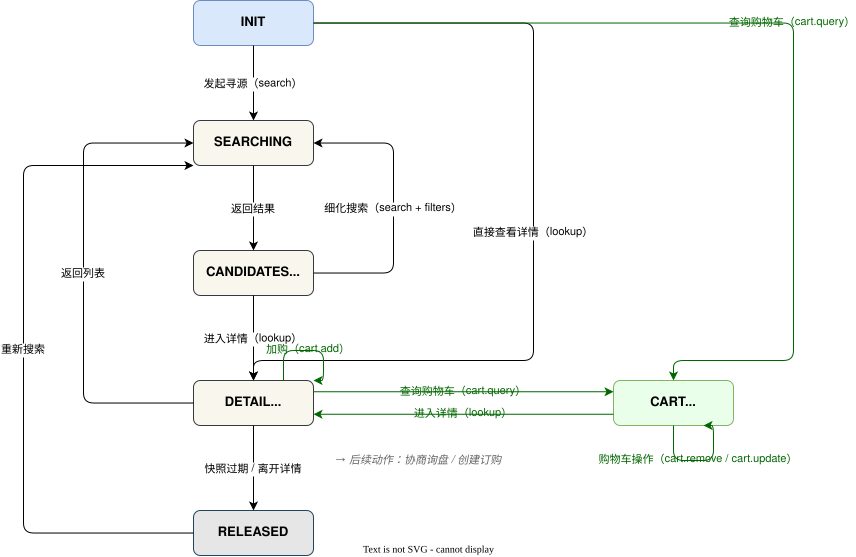

# 寻源原语 — 购物车扩展

## 寻源购物车扩展（Source Cart Extension） {#s-1111-source-cart-extension}

Source Cart 是挂载于 `utp.source` 的可选扩展，按照[原语扩展规范](../../../protocol-core/primitive-framework.md#s-105-extension-spec)为 Source 状态机增加购物车上下文及相关操作。该扩展用于在寻源阶段临时或持久保存采购候选项，便于采购方在多次 `search`（包括携带筛选条件的细化搜索）和 `lookup` 后统一比较和提交订购。购物车操作复用 Source 的全局阶段、交易上下文及核心状态边界。供应商通过在 Profile 的 `utp.source.extensions` 中声明 `utp.source_cart` 表示支持本扩展。

### 意图与范围 {#s-11111}

**意图：** Source Cart 扩展用于在 Source 寻源过程中暂存采购方已关注的候选商品项，使采购方能够跨多次 `search`、`lookup` 进行比较、调整选择，并将选中项提交给后续 Negotiate 或 Purchase 原语。

**范围：** Source Cart 覆盖以下场景：

- **加入购物车（`cart.add`）**：将有效详情快照中的候选商品项加入当前会话购物车或已授权持久购物车。
- **查看购物车（`cart.query`）**：查看当前会话购物车或已授权持久购物车，并进入购物车上下文。
- **更新购物车项（`cart.update`）**：在购物车上下文中调整已返回商品项的数量或选择状态。
- **移除购物车项（`cart.remove`）**：在购物车上下文中移除已返回的商品项。

该扩展挂载在 `utp.source` 下，扩展包名为 `utp.source_cart`，操作域为 `cart`。供应商 Profile 在 `utp.source` 的 `extensions` 中声明该扩展后，才表示支持本节定义的扩展操作。

Source Cart 运行于 `SOURCING` 阶段，扩展状态、操作结果和资源引用均归属当前 Source 上下文。

### 状态影响 {#s-11112}

Source Cart 会向 Source 内部状态机追加 `CART_ACTIVE` 扩展状态，并新增与该状态相关的迁移。Source 的 `INIT` 初始状态、`RELEASED` 内部终态，以及 `search`、`lookup` 的核心迁移保持不变。

| 扩展状态 | 含义 | 进入条件 | 允许的操作 |
| --- | --- | --- | --- |
| `CART_ACTIVE` | 采购方已进入购物车上下文，可查看、调整购物车项，并将选中项提交到后续交易原语。 | `cart.query` 成功返回购物车。 | `utp.source_cart.query`, `utp.source_cart.update`, `utp.source_cart.remove`。 |

`utp.source_cart.query` 可在 `INIT` 或 `SOURCING` 阶段调用，用于查看当前会话或持久购物车，并进入 `CART_ACTIVE` 扩展状态。

| Source 原状态 | 扩展启用后的影响 | 保持不变的约束 |
| --- | --- | --- |
| `INIT` | 额外允许 `utp.source_cart.query` 查看会话购物车或已授权持久购物车，并进入 `CART_ACTIVE`。 | `cart.add` 仅在获得有效 `lookup` 详情快照后可用。 |
| `CANDIDATES_READY` | 采购方通过 `lookup` 获得详情快照后可加入购物车。 | 候选集合仅表示比较结果，不锁定库存、价格或交易条件。 |
| `DETAIL_VIEWING` | 在详情快照有效时额外允许 `utp.source_cart.add`；加购后采购方可继续 `cart.query` 进入 `CART_ACTIVE`。 | 采购方仍可跳过购物车，直接以候选项调用 `utp.negotiate.inquiry` 或 `utp.purchase.create`。 |
| `RELEASED` | 不允许基于已释放快照执行 `cart.add`。 | 必须重新 `lookup` 获取有效详情快照后才能加购。 |

### 操作定义 {#s-11113}

- **`utp.source_cart.add`**
  - **角色绑定：** Buyer → Seller
  - **执行说明：** Buyer 将有效 `lookup` 详情快照中的候选项加入购物车；Seller 校验快照和商品可用性后写入购物车项。
  - **适用状态：** `DETAIL_VIEWING`
  - **状态影响：** 不进入 `CART_ACTIVE`
  - **后续操作：** `lookup`、`cart.query`
- **`utp.source_cart.query`**
  - **角色绑定：** Buyer → Seller
  - **执行说明：** Buyer 查看当前会话或持久购物车；Seller 返回调用方可访问的购物车内容和已选商品项。
  - **适用状态：** `INIT`、`SEARCHING`、`CANDIDATES_READY`、`DETAIL_VIEWING`、`CART_ACTIVE`
  - **状态影响：** 进入或保持 `CART_ACTIVE`
  - **后续操作：** `lookup`、`cart.query`、`cart.update`、`cart.remove`、`utp.negotiate.inquiry`、`utp.purchase.create`
- **`utp.source_cart.update`**
  - **角色绑定：** Buyer → Seller
  - **执行说明：** Buyer 修改已查看购物车项的数量或选择状态；Seller 校验目标项和可编辑范围后更新购物车。
  - **适用状态：** `CART_ACTIVE`
  - **状态影响：** 保持 `CART_ACTIVE`
  - **后续操作：** `lookup`、`cart.query`、`cart.update`、`cart.remove`、`utp.negotiate.inquiry`、`utp.purchase.create`
- **`utp.source_cart.remove`**
  - **角色绑定：** Buyer → Seller
  - **执行说明：** Buyer 移除已查看购物车项；Seller 删除目标项并返回剩余购物车状态。
  - **适用状态：** `CART_ACTIVE`
  - **状态影响：** 购物车仍有商品项时保持 `CART_ACTIVE`
  - **后续操作：** `lookup`、`cart.query`、`cart.update`、`cart.remove`、`utp.negotiate.inquiry`、`utp.purchase.create`

`utp.source_cart.update` 与 `utp.source_cart.remove` 只能作用于最近一次 `cart.query` 已返回的 `cart_item_id`。`utp.negotiate.inquiry` 与 `utp.purchase.create` 仅在购物车存在已选中商品项，且 Mode 与拓扑前置条件已满足时暴露。

### 身份与资源约束 {#s-11114}

会话维度购物车仅绑定当前 `session_id`，不要求用户身份认证。持久化购物车绑定已认证用户和 `source_cart/{cart_id}` 资源；能力提供方应在 `utp.source` 原语声明中以 `authorization.required=false` 预告可按需申请的授权 scope。临时购物车操作可继续执行；访问持久化资源时，服务端返回引用该已声明 scope 的结构化授权错误，Agent 据此回到 Profile 发起授权。

服务端 MUST 仅返回与调用方身份关联的持久化购物车资源，并按自身访问策略处理商品、数量和用户资料等字段可见性。

### 扩展错误码（Extension Error Codes） {#s-11115}

| 错误码 | 严重级别 | HTTP 映射 | 描述 | 建议处理 |
| --- | --- | --- | --- | --- |
| `SOURCE.CART.UNSUPPORTED` | error | 404 | 供应商未声明 `cart` 扩展能力。 | 隐藏购物车相关动作，回退到核心 Source 流程。 |
| `SOURCE.CART.ITEM_UNAVAILABLE` | warning | 409 | 候选项暂时不可加入购物车，或加入后已不可购买。 | 重新 `lookup` 或提示采购方选择其他候选。 |
| `SOURCE.CART.LIMIT_EXCEEDED` | error | 422 | 购物车商品数、单项数量或持久购物车容量超过限制。 | 调整数量或移除部分商品后重试。 |

### 非错误结果（Non-error Results） {#s-source-cart-non-error-results}

已存在的商品项被合并，或购物车项的价格、库存或交易条件发生变化，都属于可预期的业务结果，MUST NOT 编码为错误响应。服务端 MUST 返回正常 Action Response，将 `execution_result` 设为 `SUCCESS`，并通过 `output.status` 表达结果：

- `ITEM_MERGED`：目标商品项已存在，服务端已合并数量或返回既有项。
- `TERMS_CHANGED`：购物车项的价格、库存或交易条件已变化。响应 MUST 包含最新购物车项；必要时通过 `valid_next_actions` 引导重新执行 `utp.source.lookup`。

### 扩展传输绑定（Extension Transport Bindings） {#s-11116}

Source Cart 扩展遵循 Source 传输绑定规则。扩展操作名称按 `utp.source_cart.{action}` 映射到各传输协议，并复用 Source 的消息信封、鉴权、幂等和错误响应规则。

| 绑定类型 | 映射规则 |
| --- | --- |
| REST | 使用 `/utp/v1/source/cart` 作为资源根；`add` 使用 `POST /items`，`query` 使用 `GET /`，`update` 使用 `PATCH /items/{cart_item_id}`，`remove` 使用 `DELETE /items/{cart_item_id}`。 |
| MCP | Tool Name 使用 `utp_source_cart_{action}`，例如 `utp_source_cart_query`。 |
| A2A | Task Name 使用 `utp:source:cart:{action}`，例如 `utp:source:cart:add`。 |
| SDK | 挂载在 `client.source.cart` 下，方法名与扩展操作一致：`add`、`query`、`update`、`remove`。 |
