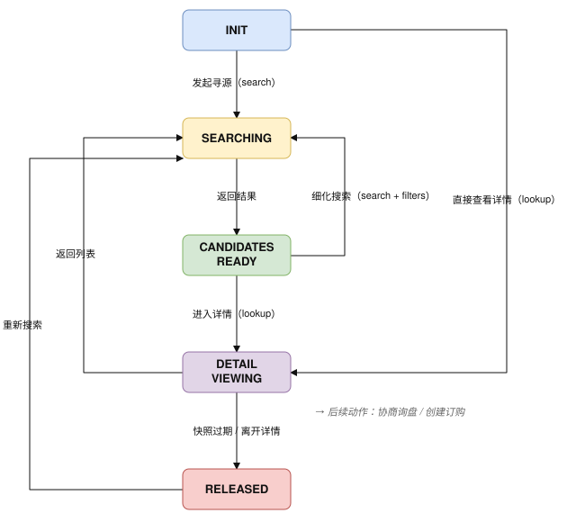

# 寻源原语（Source） {#s-10-p1-source}

## 原语身份（Primitive Identity） {#s-source-identity}

```
primitive_id:  utp.source
version:       2026-07-01
intent:        采购方寻找可供采购的商品/服务/供应商
state_delta:   ∅ → candidate_set
actions:       search, lookup
compensation:  失效候选快照
```

---

## 概述（Overview） {#s-111-overview}

### 意图 {#s-1111}

Source 是 UTP 交易原语中的第一个（P1），其意图是使采购方 Agent 能够寻找可供采购的商品、服务或供应商。Source 的产出是一个**候选集合（Candidate Set）**，供后续原语（Negotiate 或 Purchase）消费。

### 范围 {#s-1112}

Source 覆盖以下场景：

- **商品搜索（Product Search）**：基于关键词、图片、链接搜索商品。
- **供应商寻源（Supplier Sourcing）**：基于品类、地域、资质筛选供应商。
- **商品详情查询（Item Lookup）**：查询单个商品/服务的完整交易条件。
- **多维筛选（Qualification Filtering）**：基于认证、价格区间、MOQ、交期等多条件过滤。

Source 不覆盖参与方身份发现（属于 Layer 0 Discovery Infrastructure，参见[发现与协商](../../protocol-core/discovery-negotiation.md)）和能力发现（属于 Profile Discovery，`/.well-known/utp`）。Source 在 Layer D3（商品/服务发现层）工作，假设 D1/D2 层已完成。

### 前置条件 {#s-1113}

| 条件 | 必需？ | 说明 |
| --- | --- | --- |
| `session.state ∈ {INIT, SOURCING}` | MUST | 会话处于初始或发现阶段。 |
| `session.topology.locked == true` | MUST | 商业拓扑已锁定（参见[商业拓扑](../../protocol-core/business-topology.md)）。 |
| `session.mode != null` | MUST | Transaction Mode 已协商确定（参见[采购模式](../../protocol-core/procurement-models.md)）。 |
| `buyer.identity.verified == true` | SHOULD | 采购方身份已验证。部分供应商 MAY 在未验证身份时返回降级结果。 |

### 后置条件 {#s-1114}

| 条件 | 说明 |
| --- | --- |
| `session.state == 'SOURCING'` | 会话进入发现阶段。 |
| `candidate_set != null` | 候选集合已生成，包含至少一个候选项或为空集合。 |
| `candidate_set.expires_at` 已声明（若适用） | 候选集合 MAY 声明快照有效期。快照仅表示查询时点的价格、库存和能力状态，不构成库存或价格锁定。 |

### 语义契约 {#s-1115}

```json
{
  "primitive": "utp.source",
  "preconditions": [
    "session.state ∈ {INIT, SOURCING}",
    "session.topology.locked == true",
    "session.mode != null"
  ],
  "postconditions": [
    "session.state == 'SOURCING'",
    "candidate_set != null",
    "∀c ∈ candidate_set: c.item_id != null ∧ c.supplier_id != null"
  ],
  "invariants": [
    "candidate_set 中的每个候选项 MUST 引用有效的供应商 Profile",
    "pricing_mode=L1 时，候选项 MUST 包含 PricingTiers；pricing_mode=L2 时，候选项 MUST 包含可复算的规则计价信息；pricing_mode=L3 时，候选项 MUST 提供发起询盘所需的商品与供应商事实，不得将参考价表述为正式报价"
  ],
  "side_effects": [
    "供应商侧搜索日志记录（用于分析和推荐优化）",
    "候选快照生成（仅表示查询时点状态，不保证后续 Purchase 成功）"
  ],
  "compensation": {
    "on_snapshot_expired": "标记候选快照失效 → 要求重新 search 或 lookup",
    "on_timeout": "返回结构化超时错误，不产生持久资源回滚"
  }
}
```

---

## 生命周期与状态机（Lifecycle and State Machine） {#s-112-lifecycle-state-machine}

### Source 原语内部状态机 {#s-1121-source}



### 状态定义与迁移规则 {#s-1122}

| 状态 | 含义 | 进入条件 | 允许的操作 |
| --- | --- | --- | --- |
| `INIT` | 尚未发起 Source | 会话刚建立 | `search`, `lookup` |
| `SEARCHING` | 正在执行搜索 | 采购方提交搜索请求 | 等待结果返回 |
| `CANDIDATES_READY` | 候选集合已生成 | 搜索结果返回 | `lookup`（进入详情临时态）, `search`（新一轮搜索或携带筛选条件细化搜索） |
| `DETAIL_VIEWING` | 采购方正在查看候选详情，候选快照临时有效 | `lookup` 返回详情，且候选快照未过期 | `lookup`（刷新详情）, `search`（重新搜索）, 以 `candidate_id` 调用 `utp.negotiate.inquiry` 或 `utp.purchase.create` |
| `RELEASED` | Source 详情临时态已释放（内部终态），不再表示价格或库存锁定。 | `candidate_set.expires_at` 到期、采购方离开详情、重新搜索，或供应商声明候选信息已变化 | `search`（重新搜索）, `lookup`（重新获取详情） |

### 与全局状态机的关系 {#s-1123}

Source 对应全局状态 `SOURCING`。采购方完成详情查看后 MAY 直接将候选项传递给 `utp.negotiate.inquiry` 或 `utp.purchase.create`：前者触发全局状态迁移至 `NEGOTIATING`，后者触发全局状态迁移至 `PURCHASING`。

**协议标识符行为：** Source 属于 `trade_context_id` 作用域，不产生或携带 `transaction_id`；`request_id` 只负责单次请求—响应关联，不能替代交易上下文标识。一次 Source 可以返回多个供应商候选，候选进入 Negotiate 时仍共享当前 `trade_context_id`；后续 `purchase.create` 的成功结果被 `evaluate_result` 接受后，才按 P3 确认的独立交易边界生成一个或多个 `transaction_id`。

**非绑定信息声明：** Source 返回的价格、库存、交期、资质、物流和付款方式信息用于候选比较与后续决策，除非后续 Negotiate 或 Purchase 明确签名确认，否则不构成 Binding Terms 或 Purchase Credential。Purchase 创建时 MUST 重新校验库存、价格和交易条件。

---

## 错误处理（Error Handling） {#s-113-error-handling}

Source 错误响应 MUST 使用原语通用框架定义的[标准错误响应格式](../../protocol-core/primitive-framework.md#s-1043-standard-error-response)。本节仅定义 Source 原语特有错误码。

### 错误码定义 {#s-1131}

| 错误码 | 严重级别 | HTTP 映射 | 描述 | 建议处理 |
| --- | --- | --- | --- | --- |
| `SOURCE.SEARCH.INVALID_QUERY` | error | 400 | 搜索请求格式无效（如 `query` 为空、`filters` 类型错误）。 | 修正请求参数后重试。 |
| `SOURCE.SEARCH.NO_RESULTS` | info | 200 | 搜索未返回任何匹配结果（非错误，空候选集合）。 | 调整搜索条件或扩大搜索范围。 |
| `SOURCE.SEARCH.RATE_LIMITED` | warning | 429 | 搜索频率超过供应商限流阈值。 | 按 `Retry-After` 头部等待后重试。 |
| `SOURCE.LOOKUP.ITEM_NOT_FOUND` | error | 404 | 查询的商品/服务 ID 不存在或已下架。 | 从候选集合中移除此项。 |
| `SOURCE.LOOKUP.SUPPLIER_UNAVAILABLE` | warning | 503 | 供应商端点暂时不可达。 | 跳过此供应商，稍后重试。 |
| `SOURCE.SEARCH.INVALID_FILTERS` | error | 400 | 筛选条件无效（如价格区间 `min > max`、不存在的认证类型）。 | 修正筛选条件。 |
| `SOURCE.SNAPSHOT.EXPIRED` | error | 410 | 候选快照已过期或供应商声明候选信息已变化。 | 重新搜索或重新查询详情。 |
| `SOURCE.AUTH.INSUFFICIENT` | error | 403 | 采购方身份未通过供应商的访问控制策略。 | 完成身份验证后重试。 |
| `SOURCE.TIMEOUT` | error | 504 | 搜索操作超时。 | 缩小搜索范围后重试。 |
| `SOURCE.MODE.UNSUPPORTED` | error | 422 | 供应商不支持请求的 Mode 配置所要求的 Source 行为（如请求阶梯价格但供应商仅支持固定价格）。 | 调整 Mode 或更换供应商。 |

---

## 访问与角色约束 {#s-114-scopes}

Source 的授权要求由能力提供方在 Profile 的 `authorization` 中声明。能力提供方 MAY 依据自身策略实施 Agent 认证、频控或字段脱敏；字段可见性由能力提供方的访问策略控制。

`search` 与 `lookup` 均由采购方发起。`lookup` 返回的资质材料、认证证书或审计摘要的可见范围由能力提供方按照调用方身份、角色、资源归属和合规策略决定；字段可见性处理沿用当前 Action 和 Source 状态。

---

## 角色职责指引（Role Responsibility Guidelines） {#s-115-guidelines}

### Buyer 角色职责 {#s-1151-buyer}

| 职责 | 级别 | 说明 |
| --- | --- | --- |
| 提供结构化搜索请求 | MUST | 搜索请求 MUST 包含明确的查询意图（关键词、品类、属性条件），避免模糊或过宽的查询。 |
| 声明 Mode Hint | SHOULD | 在搜索请求中包含 `mode_hint`，提示期望的 Transaction Mode，使供应商能返回匹配的响应格式。 |
| 声明拓扑需求 | SHOULD | 若交易需要特殊拓扑（如 Escrow），MAY 在 `topology_request` 中声明。 |
| 理解候选临时性 | SHOULD | 采购方 SHOULD 在候选快照有效期内完成后续 Negotiate 或 Purchase。快照过期后 MUST 重新搜索或查询详情。 |
| 合规筛选 | MUST（当 `compliance_level ∈ {L1, L2, L3}`） | 当 Mode 要求合规核验时，MUST 在 `search` 的 `filters` 中指定所需的认证类型。 |

### Seller 角色职责 {#s-1152-seller}

| 职责 | 级别 | 说明 |
| --- | --- | --- |
| 返回结构化候选信息 | MUST | 响应 MUST 包含标准化的 Candidate 对象，字段完整且准确。 |
| 根据 Mode 调整响应 | MUST | 根据 `session.mode.pricing_mode` 决定是否包含 `PricingTiers`；根据 `compliance_level` 决定是否包含 `SupplierCredentials`。 |
| 保证价格准确性 | MUST | 返回的价格信息 MUST 在响应有效期内准确。若价格无法保证，MUST 显式声明 `price_validity` 为 `null`。 |
| 声明候选有效期 | SHOULD | 供应商 SHOULD 在候选响应中声明价格、库存和交期信息的有效期。若无法保证时效性，MUST 显式声明相应字段为非绑定参考信息。 |
| 返回 Mode 能力 | SHOULD | 在响应中包含 `mode_response`，声明供应商实际支持的 Mode 范围，帮助采购方判断匹配度。 |
| 资质信息维护 | MUST（当 `compliance_level >= L1`） | 供应商 MUST 确保资质信息的准确性和时效性。过期或被吊销的认证 MUST NOT 出现在响应中。 |

---

## 模式驱动行为（Mode-Driven Behavior） {#s-116-mode-driven-behavior}

Source 的 Action、校验规则和结构化输出由 `pricing_mode` 与 `compliance_level` 决定；其他 Mode 维度由 Profile、商业拓扑或后续原语处理。

### pricing_mode 对 Source 的影响 {#s-1161-pricing_mode-source}

| pricing_mode | Source 行为变化 |
| --- | --- |
| L0（固定售价） | 响应中每个候选项包含单一固定价格（`unit_price`）及其有效期快照。`PricingTiers` 和规则计价信息 MUST NOT 出现。采购方可直接进入 Purchase。 |
| L1（阶梯报价） | 响应中每个候选项 MUST 包含 `PricingTiers` 对象，含数量阶梯、命中阶梯和对应单价。采购方据此确定数量后直接进入 Purchase。 |
| L2（规则计价） | 响应中候选项 MUST 包含规范化计价输入、计价规则标识及版本和计算结果，使相同输入可重复得到相同价格。`PricingTiers` 与 `negotiable` MUST NOT 用于表达该模式。采购方直接进入 Purchase。 |
| L3（询报价） | 响应中候选项提供发起询盘所需的商品、规格、供应商和能力事实；Source 不产生正式价格或报价。采购方必须进入 Negotiate 的 `inquiry → quote → binding` 流程。 |

### compliance_level 对 Source 的影响 {#s-1162-compliance_level-source}

| compliance_level | Source 行为变化 |
| --- | --- |
| L0（无合规要求） | 响应不包含 `SupplierCredentials`。`search.filters` 不支持资质筛选条件。 |
| L1（资质核验） | 响应 MUST 包含 `SupplierCredentials` 摘要。`search.filters` 支持按认证类型筛选。供应商 MUST 验证证书有效性。 |
| L2（跨境合规） | 响应 MUST 包含完整的资质详情和合规声明（进出口许可、原产地证明）。`search.filters` 支持跨境合规条件。 |
| L3（全面审计） | 响应 MUST 包含审计报告引用（`audit_report_ref`）。所有资质信息 MUST 附带时间戳和签发机构签名。 |

### 非直接影响维度 {#s-1163-source}

`decision_path`、`payment_structure`、`fulfillment_structure` 与 `relationship_mode` 不直接改变 Source 的 Action、校验规则或结构化输出。供应商对付款、履约、长期合作等能力的声明属于 Profile、商业拓扑或 Mode 能力协商的职责，不得作为 Source 的 Mode 驱动必填输出。

---

## 操作定义（Actions） {#s-117-operations}

- **`utp.source.search`**
  - **角色绑定：** Buyer → Seller
  - **执行说明：** Buyer 提交寻源条件及可选 `filters`；Seller 检索可供给商品并返回候选集合。若携带 `candidate_set_id`，则在该未过期候选快照范围内执行细化搜索。
  - **适用状态：** `INIT`、`SEARCHING`、`CANDIDATES_READY`、`RELEASED`
  - **状态影响：** 进入或保持 `SEARCHING`，成功返回后形成新的 `CANDIDATES_READY` 快照
  - **后续操作：** `utp.source.search`、`utp.source.lookup`
- **`utp.source.lookup`**
  - **角色绑定：** Buyer → Seller
  - **执行说明：** Buyer 指定商品项查看详情；Seller 返回可用于比较和后续交易的详情快照，但不由此锁定库存或交易承诺。
  - **适用状态：** `INIT`、`CANDIDATES_READY`、`CART_ACTIVE`
  - **状态影响：** 进入 `DETAIL_VIEWING`，详情快照在有效期内可被后续 Negotiate 或 Purchase 消费
  - **后续操作：** `utp.source.search`、`utp.source.lookup`、`utp.negotiate.inquiry`、`utp.purchase.create`

`valid_next_actions` 中的 `utp.negotiate.inquiry` 与 `utp.purchase.create` 仅在详情快照仍有效、候选项具备可询盘或可订购条件，且 Mode 与拓扑前置条件已满足时暴露。候选集合或详情快照过期后，响应只能引导采购方重新 `search` 或重新 `lookup`。

Source 的可选购物车能力见[购物车扩展](extensions/cart.html)。
