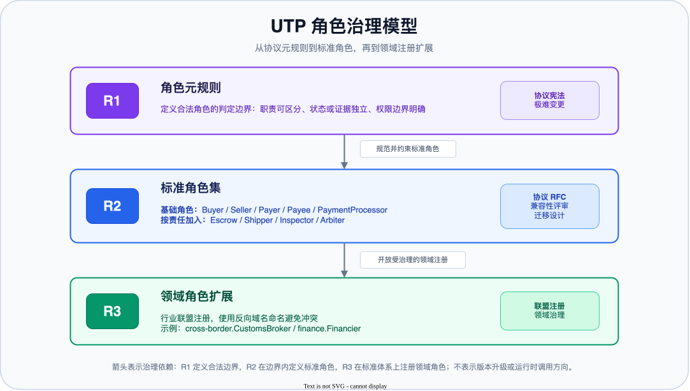
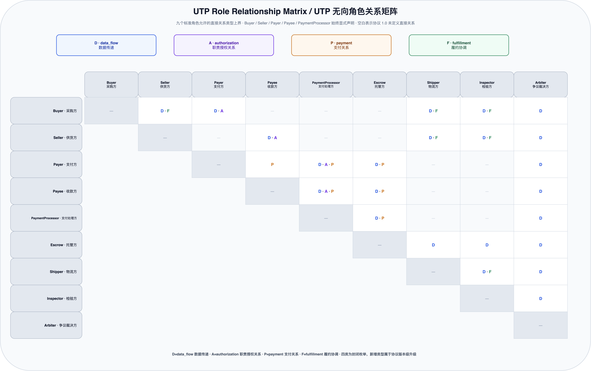

    <h1 id="s-9-commerce-topology">商业拓扑</h1>

商业拓扑（Commerce Topology）定义一类采购交易的抽象责任结构。它以角色为节点、角色关系为边，说明本类交易需要哪些协议角色，以及这些角色之间允许存在的业务关系。它用于表达职责协作边界，并为发现范围、权限解释和后续路径编排提供稳定输入。

商业拓扑采用无向图 <code>G = (R, U)</code>：<code>R（Roles）</code> 是角色节点集合，<code>U（Role Relationships）</code> 是角色之间的无向关系集合。

<h2 id="s-91-topology-model">Topology Model（拓扑模型）</h2>
<h3 id="s-911-commerce-topology">CommerceTopology 形式定义</h3>

<code>CommerceTopology</code> 表达一类采购交易中必须被协议显式识别的角色集合，以及这些角色之间允许建立的无向业务关系。它为应用层形成第 3 章的发现范围配置和后续执行 DAG 提供责任结构，不是 Business Domain 清单，也不描述 Action 调用方向或原语执行顺序。

<pre class="highlight"><code>CommerceTopology = G(R, U) = {
  topology_id: string,
  roles: RoleId[],
  role_relationships: RoleRelationship[]
}
</code></pre>
<table>
<thead><tr><th>字段</th><th>类型</th><th>必需？</th><th>说明</th></tr></thead>
<tbody>
<tr><td><code>topology_id</code></td><td>string</td><td>MUST</td><td>拓扑模板的稳定标识；在同一注册表作用域内 MUST 唯一。</td></tr>
<tr><td><code>roles</code></td><td>RoleId[]</td><td>MUST</td><td>本类交易需要的完整抽象责任集合。<code>RoleId</code> 是角色注册表中 <code>RoleDefinition.role_id</code> 的字符串值。</td></tr>
<tr><td><code>role_relationships</code></td><td>RoleRelationship[]</td><td>MUST</td><td>角色之间的无向业务关系集合；字段和关系类型以 9.3 节为唯一规范性定义。</td></tr>
</tbody>
</table>

<strong>整体约束：</strong>

<ol>
<li><code>roles</code> MUST 非空、无重复并按 RoleId 字典序排列，只能包含 R2 或 R3 角色注册表中已经存在的抽象角色，MUST NOT 包含 Business Domain 或组织实例。</li>
<li><code>roles</code> MUST 显式包含 Buyer、Seller、Payer、Payee、PaymentProcessor；同一 Business Domain 同时承担多个角色时也不得合并这些节点。</li>
<li>每条 <code>RoleRelationship.role_pair</code> 的两个角色均 MUST 存在于 <code>roles</code>；同一规范化角色对在一个拓扑中只能出现一次。</li>
<li><code>CommerceTopology</code> MUST NOT 包含原语节点、状态、条件判断、执行顺序、调用方向、具体消息类型或 <code>role_domain_bindings</code>。</li>
</ol>

<h2 id="s-92-role-registry-governance">Role Registry &amp; Governance（角色注册与治理）</h2>

<h3 id="s-921-roledefinition">RoleDefinition 与 RolePermissions 实体</h3>

<strong>RoleDefinition 实体定义：</strong>

<table>
<thead>
<tr>
<th>字段名</th>
<th>类型</th>
<th>必需？</th>
<th>描述</th>
</tr>
</thead>
<tbody>
<tr>
<td><code>role_id</code></td>
<td>string</td>
<td>MUST</td>
<td>角色唯一标识。核心角色使用短名称（如 <code>"Buyer"</code>），领域角色使用 <code>&lt;domain&gt;.&lt;RoleName&gt;</code> 格式。</td>
</tr>
<tr>
<td><code>display_name</code></td>
<td>string</td>
<td>MUST</td>
<td>角色可读名称。</td>
</tr>
<tr>
<td><code>description</code></td>
<td>string</td>
<td>MUST</td>
<td>角色职责描述。</td>
</tr>
<tr>
<td><code>governance_layer</code></td>
<td>string</td>
<td>MUST</td>
<td>所属治理层。有效值：<code>"R2"</code>, <code>"R3"</code>。</td>
</tr>
<tr>
<td><code>bound_primitives</code></td>
<td>string[]</td>
<td>MUST</td>
<td>该角色绑定的交易原语列表。</td>
</tr>
<tr>
<td><code>default_permissions</code></td>
<td>RolePermissions</td>
<td>SHOULD</td>
<td>默认权限配置。</td>
</tr>
<tr>
<td><code>registered_by</code></td>
<td>string</td>
<td>SHOULD</td>
<td>注册方标识（R3 领域角色适用）。</td>
</tr>
<tr>
<td><code>validity_conditions</code></td>
<td>string[]</td>
<td>MUST</td>
<td>R1 元规则的三个条件的满足说明。</td>
</tr>
</tbody>
</table>

<strong>RolePermissions 实体定义：</strong>

<table>
<thead>
<tr><th>字段名</th><th>类型</th><th>必需？</th><th>描述</th></tr>
</thead>
<tbody>
<tr><td><code>visible_primitives</code></td><td>string[]</td><td>SHOULD</td><td>该角色默认可见的标准原语标识集合。</td></tr>
<tr><td><code>visible_fields</code></td><td>string[]</td><td>SHOULD</td><td>该角色默认可读取的字段路径模式集合。</td></tr>
<tr><td><code>executable_actions</code></td><td>string[]</td><td>SHOULD</td><td>该角色默认可发起的完整 Action 标识集合；值 MUST 使用 <code>utp.&lt;primitive&gt;.&lt;operation&gt;</code> 格式。</td></tr>
<tr><td><code>data_restrictions</code></td><td>object[]</td><td>SHOULD</td><td>字段级限制集合。每项包含 <code>field: string</code> 和 <code>access: "allowed" | "denied"</code>；显式限制优先于默认可见范围。</td></tr>
</tbody>
</table>

<strong>RoleDefinition 示例（核心角色）：</strong>

<pre class="highlight"><code class="language-json">{
  &quot;role_id&quot;: &quot;Buyer&quot;,
  &quot;display_name&quot;: &quot;采购方&quot;,
  &quot;description&quot;: &quot;发起采购需求、选择商品/供应商、确认交易条款、确认收货&quot;,
  &quot;governance_layer&quot;: &quot;R2&quot;,
  &quot;bound_primitives&quot;: [
    &quot;utp.source&quot;,
    &quot;utp.negotiate&quot;,
    &quot;utp.purchase&quot;,
    &quot;utp.fulfill&quot;,
    &quot;utp.resolve&quot;
  ],
  &quot;default_permissions&quot;: {
    &quot;visible_primitives&quot;: [&quot;utp.source&quot;, &quot;utp.negotiate&quot;, &quot;utp.purchase&quot;, &quot;utp.pay&quot;, &quot;utp.fulfill&quot;, &quot;utp.resolve&quot;],
    &quot;visible_fields&quot;: [&quot;order.*&quot;, &quot;pricing.*&quot;, &quot;shipping.*&quot;],
    &quot;executable_actions&quot;: [&quot;source.search&quot;, &quot;negotiate.inquiry&quot;, &quot;purchase.create&quot;, &quot;fulfill.receive&quot;, &quot;resolve.raise&quot;],
    &quot;data_restrictions&quot;: [
      { &quot;field&quot;: &quot;supplier.cost_structure&quot;, &quot;access&quot;: &quot;denied&quot; },
      { &quot;field&quot;: &quot;supplier.profit_margin&quot;, &quot;access&quot;: &quot;denied&quot; }
    ]
  },
  &quot;validity_conditions&quot;: [
    &quot;职责可区分性：Buyer 代表采购需求发起方，与 Seller（供货方）职责本质不同&quot;,
    &quot;原语绑定性：Buyer 承担 Source、Negotiate、Purchase 等多个原语的发起权限&quot;,
    &quot;权限差异性：Buyer 可见订单和定价信息，但不可见供应商成本结构&quot;
  ]
}
</code></pre>

<strong>RoleDefinition 示例（领域角色）：</strong>

<pre class="highlight"><code class="language-json">{
  &quot;role_id&quot;: &quot;cross-border.Inspector&quot;,
  &quot;display_name&quot;: &quot;检验方&quot;,
  &quot;description&quot;: &quot;独立第三方验货机构，执行商品质量检验并出具检验报告&quot;,
  &quot;governance_layer&quot;: &quot;R3&quot;,
  &quot;bound_primitives&quot;: [&quot;utp.fulfill&quot;],
  &quot;default_permissions&quot;: {
    &quot;visible_primitives&quot;: [&quot;utp.fulfill&quot;],
    &quot;visible_fields&quot;: [&quot;order.line_items&quot;, &quot;shipping.*&quot;, &quot;inspection.*&quot;],
    &quot;executable_actions&quot;: [&quot;fulfill.notify&quot;],
    &quot;data_restrictions&quot;: [
      { &quot;field&quot;: &quot;payment.*&quot;, &quot;access&quot;: &quot;denied&quot; },
      { &quot;field&quot;: &quot;pricing.*&quot;, &quot;access&quot;: &quot;denied&quot; },
      { &quot;field&quot;: &quot;negotiate.*&quot;, &quot;access&quot;: &quot;denied&quot; }
    ]
  },
  &quot;registered_by&quot;: &quot;org.cross-border-alliance&quot;,
  &quot;validity_conditions&quot;: [
    &quot;职责可区分性：Inspector 执行独立检验，与 Seller（供货）和 Buyer（采购）职责本质不同&quot;,
    &quot;原语绑定性：Inspector 通过 Fulfill.notify 上报验货结论&quot;,
    &quot;权限差异性：Inspector 可见商品规格和物流信息，但不可见支付金额和议价过程&quot;
  ]
}
</code></pre>

<h3 id="s-922-standard-roles">R2：标准角色集与角色加入规则</h3>

协议 1.0 版本定义以下角色。Buyer、Seller、Payer、Payee、PaymentProcessor 是始终显式进入拓扑的基础角色；即使同一 Business Domain 同时承担多个角色，也不得在商业拓扑中省略或合并角色节点。Escrow、Shipper、Inspector、Arbiter 等扩展角色只有承担相应独立协议责任时才进入拓扑。

<table>
<thead>
<tr>
<th>分层</th>
<th>角色标识</th>
<th>角色名称</th>
<th>默认需要？</th>
<th>职责</th>
<th><code>bound_primitives</code></th>
</tr>
</thead>
<tbody>
<tr>
<td>核心角色</td>
<td><code>Buyer</code></td>
<td>采购方</td>
<td>是</td>
<td>发起采购、选品、确认收货</td>
<td><code>utp.source</code>, <code>utp.negotiate</code>, <code>utp.purchase</code>, <code>utp.fulfill</code>, <code>utp.resolve</code></td>
</tr>
<tr>
<td>核心角色</td>
<td><code>Seller</code></td>
<td>供货方</td>
<td>是</td>
<td>提供商品/服务、报价、发货</td>
<td><code>utp.source</code>, <code>utp.negotiate</code>, <code>utp.purchase</code>, <code>utp.fulfill</code>, <code>utp.resolve</code></td>
</tr>
<tr>
<td>核心角色</td>
<td><code>Payer</code></td>
<td>支付方</td>
<td>是</td>
<td>承担付款义务并执行资金转移；不与 Buyer 角色合并</td>
<td><code>utp.pay</code>, <code>utp.resolve</code></td>
</tr>
<tr>
<td>核心角色</td>
<td><code>Payee</code></td>
<td>收款方</td>
<td>是</td>
<td>承担收款及退款接收义务；不与 Seller 角色合并</td>
<td><code>utp.pay</code>, <code>utp.resolve</code></td>
</tr>
<tr>
<td>核心角色</td>
<td><code>PaymentProcessor</code></td>
<td>支付处理方</td>
<td>是</td>
<td>处理支付授权、扣款确认、退款通道和支付状态证明</td>
<td><code>utp.pay</code>, <code>utp.resolve</code></td>
</tr>
<tr>
<td>扩展角色</td>
<td><code>Escrow</code></td>
<td>托管方</td>
<td>否</td>
<td>资金托管、冻结、条件放款、争议冻结和退款</td>
<td><code>utp.pay</code>, <code>utp.resolve</code></td>
</tr>
<tr>
<td>扩展角色</td>
<td><code>Shipper</code></td>
<td>物流方</td>
<td>否</td>
<td>物流配送、运输管理</td>
<td><code>utp.fulfill</code>, <code>utp.resolve</code></td>
</tr>
<tr>
<td>扩展角色</td>
<td><code>Inspector</code></td>
<td>检验方</td>
<td>否</td>
<td>独立验货、质检并提交验货报告</td>
<td><code>utp.fulfill</code>, <code>utp.resolve</code></td>
</tr>
<tr>
<td>扩展角色</td>
<td><code>Arbiter</code></td>
<td>争议裁决方</td>
<td>否</td>
<td>接收争议、查看证据并给出裁决结论</td>
<td><code>utp.resolve</code></td>
</tr>
</tbody>
</table>

<strong>角色映射说明：</strong>

<ul>
<li>Buyer、Seller、Payer、Payee、PaymentProcessor MUST 作为五个不同的职责角色显式声明，不得通过默认兼任规则省略 Payer、Payee 或 PaymentProcessor。</li>
<li>同一 Business Domain MAY 在 <code>role_domain_bindings</code> 中同时映射 Buyer 与 Payer，或同时映射 Seller、Payee 与 PaymentProcessor；这些 Domain 映射不改变商业拓扑中的五个角色节点。</li>
<li>Payer、Payee、PaymentProcessor 分别承担付款、收款和支付处理职责；Buyer、Seller 分别承担采购和供货职责。角色是否由同一主体或同一 Business Domain 承担不改变职责边界。</li>
<li>同一个平台或机构可以同时承担 <code>PaymentProcessor</code> 和 <code>Escrow</code> 两个角色；协议层按职责拆角色，不按平台数量拆角色。</li>
</ul>

<strong>同一 Business Domain 承担多个角色时的 Action 声明边界：</strong>

<ul>
<li>角色定义与实现能力声明 MUST 分离。<code>RoleDefinition</code> 中的 <code>bound_primitives</code> 和 <code>default_permissions</code> 描述角色的标准职责与默认权限边界，不表示同一 Business Domain 必须在其映射的每个角色下重复声明相同 Action。</li>
<li>同一 Business Domain 承担多个角色时，每个对外提供的 Action MUST 保留其实际角色归属；实现方 MUST NOT 为了证明某个角色存在，而把另一个角色负责的 Action 复制到该角色下。</li>
<li>角色可以仅承担原语义务、接收业务结果或作为资金与权益归属方，而不独立提供可调用 Action。此时实现方 MAY 只声明该角色绑定及其参与的原语，不要求为该角色构造非空的 <code>executable_actions</code>。</li>
<li>同一 Business Domain 内部不同角色之间的函数调用、服务路由、记账或结算处理属于实现细节，MUST NOT 被声明为额外的对外 Action，也 MUST NOT 因此在 CommerceTopology 中引入有向调用边。只有跨越 Business Domain 边界、需要被其他 Domain 调用或验证的能力，才进入 Profile 的 Action 能力声明；实际调用方向仍由对应原语和当前 Action 确定。</li>
</ul>

例如，卖方侧同一 Business Domain 可以同时承担 Seller、Payee 和 PaymentProcessor，但三个角色节点及 <code>[Payee, Seller]</code>、<code>[Payee, PaymentProcessor]</code> 等角色关系仍保持显式。对外提供的 <code>Pay.confirm</code>、<code>Pay.refund</code>、<code>Pay.reconcile</code> 等支付处理能力归属于 <code>PaymentProcessor</code>；Payee 只承担收款、退款接收和权益归属职责，不重复声明上述 Action。若支付处理完全由同一 Business Domain 内部实现，内部函数调用、账户路由、记账或结算仍不作为额外的对外 Action。

<strong>PaymentProcessor 与 Escrow 的边界：</strong>

<code>PaymentProcessor</code> 是每笔交易中处理支付授权、支付确认、退款结果和支付状态的基础责任角色，因此始终进入拓扑；它不要求由独立机构或独立 Business Domain 承担。具体支付通道能力放在 Pay 原语配置或 Profile 能力中，只有跨越 Business Domain 边界、需要被其他 Domain 调用或验证的处理能力才声明为对外 Action。

<code>Escrow</code> 负责"钱先放在第三方，满足条件后再释放"。它的核心不是支付执行，而是条件性控制资金归属。

<pre class="highlight"><code>Payer -&gt; Escrow -&gt; Payee
Fulfill.receive / InspectionReport -&gt; Escrow.release
Resolve.raise -&gt; Escrow.freeze
</code></pre>

<strong>角色加入规则：</strong>

<table>
<thead>
<tr>
<th>角色</th>
<th>加入条件</th>
</tr>
</thead>
<tbody>
<tr>
<td><code>Buyer</code></td>
<td>永远加入。</td>
</tr>
<tr>
<td><code>Seller</code></td>
<td>永远加入。</td>
</tr>
<tr>
<td><code>Payer</code></td>
<td>永远加入；由 <code>role_domain_bindings</code> 指定承担付款职责的 Business Domain。</td>
</tr>
<tr>
<td><code>Payee</code></td>
<td>永远加入；由 <code>role_domain_bindings</code> 指定承担收款职责的 Business Domain。</td>
</tr>
<tr>
<td><code>PaymentProcessor</code></td>
<td>永远加入；由 <code>role_domain_bindings</code> 指定承担支付处理职责的 Business Domain，可以与 Payer、Payee 或 Seller 映射到同一 Business Domain。</td>
</tr>
<tr>
<td><code>Escrow</code></td>
<td>钱不是直接给卖方，而是需要托管、冻结、验收后放款、争议冻结或退款时加入。</td>
</tr>
<tr>
<td><code>Shipper</code></td>
<td><code>fulfillment_structure</code> 取 <code>L1</code>、<code>L2</code> 或 <code>L3</code> 之一，且物流不是 Seller 自己负责，而是独立履约方需要提交运单、轨迹或异常时加入。</td>
</tr>
<tr>
<td><code>Inspector</code></td>
<td>某一履约阶段或交易条款要求独立验货，且验货结论会影响收货、付款、放款或争议时加入；不由 <code>fulfillment_structure</code> 等级自动推导。</td>
</tr>
<tr>
<td><code>Arbiter</code></td>
<td>争议需要第三方裁决，并且裁决会影响退款、赔付、放款或履约责任时加入。</td>
</tr>
</tbody>
</table>

<strong>变更规则：</strong>

<ol>
<li>核心角色的新增、语义修改或废弃 MUST 走 RFC 治理流程。</li>
<li>变更提案 MUST 获得至少三个独立实现方的支持。</li>
<li>变更 MUST 通过向后兼容性评审。</li>
</ol>

<h3 id="s-923-governance-overview">治理模型概述</h3>

与 Mode 维度治理类似（参见<a href="procurement-models.md#s-84-dimension-governance">第 8 章 8.4 节</a>），角色集合 R 采用三层治理模型（R1 / R2 / R3）。其中 R1 是判断角色能否成立的元规则，不是 <code>RoleDefinition.governance_layer</code> 的实例取值；可注册的角色实体只属于 R2 或 R3，在通用性与领域适应性之间取得平衡。

<h3 id="s-924-r1">R1：角色元规则（协议宪法）</h3>

一个候选角色 MUST 同时满足以下三个条件才能成为 UTP 标准角色：

<strong>条件一：职责可区分性（Role Identity）</strong>

该角色 MUST 代表一种与其他角色有本质区别的事务职责。

<ul>
<li>正例："Inspector"（检验方）和"Seller"（供货方）的职责本质不同 —— 前者执行检验，后者提供商品。</li>
<li>反例："Buyer Approver"（买方审批员）和"Buyer"（买方）不应是两个角色 —— 它们职责不可区分，只是权限差异。权限差异通过 RolePermissions 处理，不需要定义新角色。</li>
</ul>

<strong>条件二：原语绑定性（Primitive Binding）</strong>

该角色 MUST 承担至少一个交易原语的执行权限或义务。

<ul>
<li>正例："Shipper"承担 Fulfill 原语中发货和物流追踪的执行义务。</li>
<li>反例："Log Viewer"（日志查看者）不执行任何原语 —— 它是外部观察者，不应出现在 CommerceTopology 中。</li>
</ul>

<strong>条件三：权限差异性（Access Control）</strong>

该角色与其他角色在数据访问权限上 MUST 有明确差异。

<ul>
<li>正例："Buyer"可以看到订单详情但不应看到供应商的成本结构；"Inspector"可以看到检验报告但不应看到支付金额。</li>
<li>反例：若某角色的数据访问权限与"Buyer"完全相同，它可能只是"Buyer"的别名，不应定义为新角色。</li>
</ul>

<h3 id="s-925-r3">R3：领域角色扩展</h3>

行业联盟 MAY 在角色注册表中注册领域角色。领域角色注册需满足 R1 元规则，但"职责可区分性"的判定标准在领域内评估（不需要跨行业通用）。

当前 UTP 采购协议以 Buyer、Seller、Payer、Payee、PaymentProcessor 为始终显式声明的基础角色，并定义 Escrow、Shipper、Inspector、Arbiter 等按责任加入的标准角色。供应链金融、碳排放交易、数据交易等行业角色不属于当前采购协议的角色集合，后续如要支持，应作为独立行业扩展重新评审。

跨境清关通常先作为 <code>Fulfill</code> 的单证/清关证据流表达；只有当关务服务方需要独立签署清关结果、承担可审计协议责任，并影响 Pay、Fulfill 或 Resolve 的状态时，才应注册为 R3 领域角色。

<strong>角色注册表约束：</strong>

<ol>
<li>注册表中 MUST 确保角色命名不冲突。</li>
<li>领域角色标识 SHOULD 使用 <code>&lt;domain&gt;.&lt;RoleName&gt;</code> 格式（如 <code>cross-border.Inspector</code>）。</li>
<li>实现方按需支持领域角色；普通采购平台 MAY 只实现基础角色集。</li>
</ol>

<h2 id="s-93-role-relationships">Role Relationships（角色关系）</h2>

<h3 id="s-931-role-relationship">RoleRelationship 实体与关系类型</h3>

<code>RoleRelationship</code> 是 CommerceTopology 中两个角色之间的无向业务关系。它只表达“这两个角色之间存在哪些类别的业务联系”，不表达调用、消息、资金或证据的流向，不描述具体参与方连接，不绑定交易原语，也不描述原语内部状态机。

<table>
<thead>
<tr>
<th>字段</th>
<th>类型</th>
<th>必需？</th>
<th>说明</th>
</tr>
</thead>
<tbody>
<tr>
<td><code>role_pair</code></td>
<td>RoleId[2]</td>
<td>是</td>
<td>恰好包含两个不同角色的无向角色对。两个 RoleId MUST 按字典序排列；数组顺序不表达方向。</td>
</tr>
<tr>
<td><code>relation_types</code></td>
<td>enum[]</td>
<td>是</td>
<td>角色对支持的关系类型集合：authorization、data_flow、fulfillment、payment。数组 MUST 非空、无重复并按字典序排列。</td>
</tr>
<tr>
<td><code>description</code></td>
<td>string</td>
<td>否</td>
<td>该双向角色关系在业务上的整体含义。</td>
</tr>
</tbody>
</table>

<strong>封闭关系类型：</strong>

<table>
<thead>
<tr>
<th>类型</th>
<th>中文名称</th>
<th>定义</th>
</tr>
</thead>
<tbody>
<tr>
<td><code>data_flow</code></td>
<td>数据传递</td>
<td>商品目录、采购需求、报价、订单状态、支付结果、物流信息、检验报告、签收凭证和争议材料等业务数据的交换。</td>
</tr>
<tr>
<td><code>authorization</code></td>
<td>职责授权关系</td>
<td>两个角色之间稳定存在的业务职责授权依赖，例如 Buyer 指定 Payer 承担付款职责、Seller 指定 Payee 承担收款职责，以及 Payer 或 Payee 授权 PaymentProcessor 处理资金。它不表达安全鉴权、单笔交易中的临时委托或裁决后的处置指令。</td>
</tr>
<tr>
<td><code>payment</code></td>
<td>支付关系</td>
<td>支付、退款、托管、放款、分账等资金转移或资金处置关系。</td>
</tr>
<tr>
<td><code>fulfillment</code></td>
<td>履约协调</td>
<td>发货、交付、签收、验货、验收等履约动作及其协作关系。</td>
</tr>
</tbody>
</table>

<h3 id="s-933-standard-relationships">示例与标准角色关系全集</h3>
<pre class="highlight"><code class="language-json">[
  {
    &quot;role_pair&quot;: [&quot;Buyer&quot;, &quot;Seller&quot;],
    &quot;relation_types&quot;: [
      &quot;data_flow&quot;,
      &quot;fulfillment&quot;
    ],
    &quot;description&quot;: &quot;采购方与供应方之间存在数据传递和履约协调关系&quot;
  },
  {
    &quot;role_pair&quot;: [&quot;Payer&quot;, &quot;PaymentProcessor&quot;],
    &quot;relation_types&quot;: [
      &quot;authorization&quot;,
      &quot;data_flow&quot;,
      &quot;payment&quot;
    ],
    &quot;description&quot;: &quot;支付方与支付处理方之间存在支付执行、结果确认和退款关系&quot;
  }
]
</code></pre>

<strong>标准角色关系全集：</strong>下表定义协议 1.0 九个标准角色之间允许的直接角色对及其关系类型上界。Buyer、Seller、Payer、Payee、PaymentProcessor 始终显式进入 CommerceTopology；Escrow、Shipper、Inspector、Arbiter 及其关系按本次交易实际责任选择，不得因为关系在本表中存在就默认全部启用。

<table>
<thead>
<tr>
<th>角色对 <code>role_pair</code></th>
<th><code>relation_types</code></th>
<th>典型含义或启用条件</th>
</tr>
</thead>
<tbody>
<tr><td><code>[Buyer, Seller]</code></td><td>data_flow, fulfillment</td><td>采购需求、报价、订单状态等业务数据交换，以及交付、签收等履约协调；不承载支付关系。</td></tr>
<tr><td><code>[Buyer, Payer]</code></td><td>authorization, data_flow</td><td>采购方向支付方传递付款授权，并同步支付确认或失败结果；两个角色即使映射到同一 Business Domain 也保持显式。</td></tr>
<tr><td><code>[Payee, Seller]</code></td><td>authorization, data_flow</td><td>供应方向收款方传递收款授权，并同步收款、退款或结算结果；两个角色即使映射到同一 Business Domain 也保持显式。</td></tr>
<tr><td><code>[Payee, Payer]</code></td><td>payment</td><td>支付方与收款方之间的直接支付或退款；两个角色始终显式声明。</td></tr>
<tr><td><code>[Payer, PaymentProcessor]</code></td><td>authorization, data_flow, payment</td><td>Payer 委托支付处理，执行支付或退款，并交换支付确认和退款结果。</td></tr>
<tr><td><code>[Payee, PaymentProcessor]</code></td><td>authorization, data_flow, payment</td><td>Payee 委托收款、结算或退款处理，并交换到账和分账凭证。</td></tr>
<tr><td><code>[Escrow, Payer]</code></td><td>data_flow, payment</td><td>Payer 的资金入托管、托管退款及其状态凭证交换。</td></tr>
<tr><td><code>[Escrow, Payee]</code></td><td>data_flow, payment</td><td>Payee 的条件放款、退款及其托管状态凭证交换。</td></tr>
<tr><td><code>[Escrow, PaymentProcessor]</code></td><td>data_flow, payment</td><td>支付处理后入托管、冻结、放款或退款，并交换处理结果、托管状态和对账凭证。</td></tr>
<tr><td><code>[Seller, Shipper]</code></td><td>data_flow, fulfillment</td><td>供应方与物流方交换发货指令、轨迹、异常信息和交付证明并协调履约；具体委托关系由履约条款或 Mandate 表达。</td></tr>
<tr><td><code>[Buyer, Shipper]</code></td><td>data_flow, fulfillment</td><td>物流交付、签收，以及轨迹、异常信息和交付证明交换。</td></tr>
<tr><td><code>[Buyer, Inspector]</code></td><td>data_flow, fulfillment</td><td>采购方与检验方执行验货或验收并交换检验报告；具体委托关系由检验条款或 Mandate 表达。</td></tr>
<tr><td><code>[Inspector, Seller]</code></td><td>data_flow, fulfillment</td><td>供应方与检验方配合检验并交换质量和验收报告；具体委托关系由检验条款或 Mandate 表达。</td></tr>
<tr><td><code>[Inspector, Shipper]</code></td><td>data_flow, fulfillment</td><td>运输交接、到货检验和验收阶段的履约协调及凭证交换。</td></tr>
<tr><td><code>[Escrow, Shipper]</code></td><td>data_flow</td><td>物流轨迹、妥投或异常证明作为托管放款条件。</td></tr>
<tr><td><code>[Escrow, Inspector]</code></td><td>data_flow</td><td>检验与验收报告作为托管放款、冻结或退款条件。</td></tr>
<tr><td><code>[Arbiter, Buyer]</code></td><td>data_flow</td><td>采购方提交争议证据并接收裁决结论。</td></tr>
<tr><td><code>[Arbiter, Seller]</code></td><td>data_flow</td><td>供应方提交争议证据并接收裁决结论。</td></tr>
<tr><td><code>[Arbiter, Payer]</code></td><td>data_flow</td><td>支付方提交付款证据并接收责任结论。</td></tr>
<tr><td><code>[Arbiter, Payee]</code></td><td>data_flow</td><td>收款方提交收款证据并接收责任结论。</td></tr>
<tr><td><code>[Arbiter, PaymentProcessor]</code></td><td>data_flow</td><td>交换支付处理凭证和裁决结果；退款或支付处置权限由 Resolve 原语或 Mandate 表达。</td></tr>
<tr><td><code>[Arbiter, Escrow]</code></td><td>data_flow</td><td>交换托管资金凭证和裁决结果；冻结、放款或退款权限由 Resolve 原语或 Mandate 表达。</td></tr>
<tr><td><code>[Arbiter, Shipper]</code></td><td>data_flow</td><td>提交物流、交接和签收证据并接收相关裁决结论。</td></tr>
<tr><td><code>[Arbiter, Inspector]</code></td><td>data_flow</td><td>提交检验、验收报告并接收相关裁决结论。</td></tr>
</tbody>
</table>

<h2 id="s-96">本章实体索引（Entity Index）</h2>

本章当前定义的完整实体列表如下。实体字段及其规范性约束以“所属节”中的定义为准，本节仅提供汇总索引，不重复定义实体。

<table>
<thead><tr><th>实体名称</th><th>所属节</th><th>说明</th></tr></thead>
<tbody>
<tr><td>RoleId</td><td>9.1.1</td><td>引用 <code>RoleDefinition.role_id</code> 的角色字符串标识</td></tr>
<tr><td>CommerceTopology</td><td>9.1.1</td><td>无向角色关系模板图 <code>G=(R,U)</code>，包含 topology_id、roles 和 role_relationships</td></tr>
<tr><td>RoleDefinition</td><td>9.2.1</td><td>角色元数据定义，含治理层级、原语绑定和默认权限</td></tr>
<tr><td>RolePermissions</td><td>9.2.1</td><td>角色注册表提供的默认可见原语、字段、Action 和数据限制</td></tr>
<tr><td>RoleRelationship</td><td>9.3.1</td><td>两个角色之间的无向业务关系，不绑定原语、Business Domain 或交互方向</td></tr>
</tbody>
</table>
