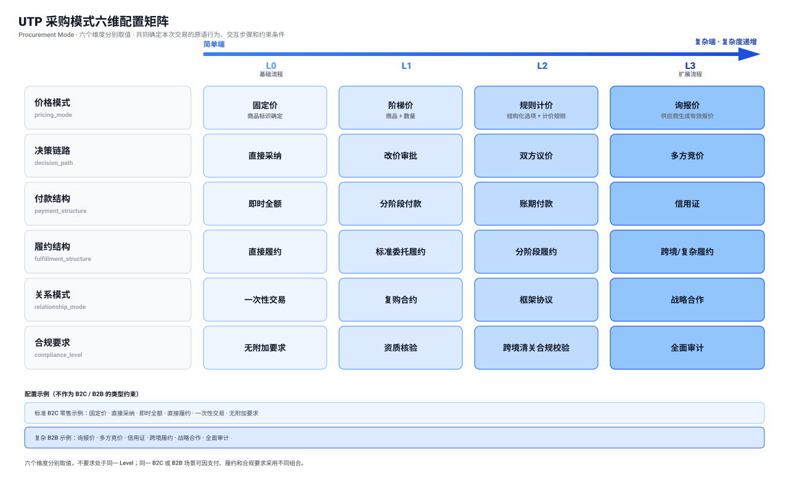

<h1 id="s-8-procurement-mode">采购模式</h1>

采购模式（Procurement Mode）用于描述一笔采购交易在价格形成、价格决策、付款、履约、交易关系和合规要求方面的执行要求。UTP 对 B2C 与 B2B 采用统一的协议模型，并通过六个可独立协商的维度配置每笔交易的原语行为、交互流程和约束条件。两类交易共享相同的消息模型、交易原语和状态语义，差异由实际 Mode 配置表达。

<h2 id="s-81-mode-dimensions">Mode 维度（Mode Dimensions）</h2>
<h3 id="s-811">维度模型</h3>

一次交易的 Mode 是一个六元组：

<figure id="s-811-mode-matrix" style="margin: 20px 0 28px;">
  
  <figcaption style="margin-top: 10px; color: #6b7280; font-size: 13px; text-align: center;">
    采购模式六维配置矩阵
  </figcaption>
</figure>
<h3 id="s-812">六维度定义表</h3>
<table>
<thead>
<tr>
<th>维度</th>
<th>标识符</th>
<th>L0（简单端）</th>
<th>L1</th>
<th>L2</th>
<th>L3（复杂端）</th>
<th>决定因素</th>
</tr>
</thead>
<tbody>
<tr>
<td><strong>价格模式</strong></td>
<td><code>pricing_mode</code></td>
<td>固定价</td>
<td>阶梯价</td>
<td>规则计价</td>
<td>询报价</td>
<td>卖方当前有效价格能否由商品、数量和结构化选项按确定规则得到，或必须由供应商响应完整询价后生成</td>
</tr>
<tr>
<td><strong>决策链路</strong></td>
<td><code>decision_path</code></td>
<td>直接采纳</td>
<td>改价审批</td>
<td>双方议价</td>
<td>多方竞价</td>
<td>买方取得当前有效价格后，是直接采纳、提交一次改价请求、与卖方议价，还是组织多个供应商进行价格竞争</td>
</tr>
<tr>
<td><strong>付款结构</strong></td>
<td><code>payment_structure</code></td>
<td>即时全额</td>
<td>分阶段付款</td>
<td>账期付款</td>
<td>信用证</td>
<td>交易金额、买卖双方信任度、行业惯例</td>
</tr>
<tr>
<td><strong>履约结构</strong></td>
<td><code>fulfillment_structure</code></td>
<td>直接履约</td>
<td>标准委托履约</td>
<td>分阶段履约</td>
<td>跨境/复杂履约</td>
<td>货物/服务如何交付，是否委托、分阶段或跨境</td>
</tr>
<tr>
<td><strong>关系模式</strong></td>
<td><code>relationship_mode</code></td>
<td>一次性交易</td>
<td>复购合约</td>
<td>框架协议</td>
<td>战略合作</td>
<td>交易频率、供应链稳定性需求</td>
</tr>
<tr>
<td><strong>合规要求</strong></td>
<td><code>compliance_level</code></td>
<td>无附加要求</td>
<td>资质核验</td>
<td>跨境清关合规校验</td>
<td>全面审计</td>
<td>主体与商品资质、跨境清关要求及审计要求</td>
</tr>
</tbody>
</table>
<h3 id="s-813-level">Level 语义精确定义</h3>

每个 Level MUST 有明确的、可机器判定的定义。以下逐维度定义各 Level 的精确语义。

<strong>pricing_mode（价格模式）：</strong>

<table>
<thead>
<tr>
<th>Level</th>
<th>语义</th>
<th>协议行为</th>
</tr>
</thead>
<tbody>
<tr>
<td>L0</td>
<td>固定价：仅凭商品标识（含确定的 SKU 或销售单元）即可得到当前价格，采购数量不改变单价</td>
<td>Source 返回固定价格、币种、适用范围和有效期快照；买方是否接受或提出改价由 <code>decision_path</code> 决定</td>
</tr>
<tr>
<td>L1</td>
<td>阶梯价：商品标识和采购数量确定后，按照供应商公开的数量阶梯表唯一确定单价</td>
<td>Source 返回阶梯表、采购数量命中的阶梯和对应单价；买方对该价格的后续处理仍由 <code>decision_path</code> 决定</td>
</tr>
<tr>
<td>L2</td>
<td>规则计价：根据规格、材质、工艺、服务组合等结构化选项，按照已声明的确定性规则计算价格</td>
<td>协议记录规范化计价输入、计价规则及版本和计算结果，使相同输入可重复得到相同价格；运费、税费和保险费原则上作为独立金额项表达</td>
</tr>
<tr>
<td>L3</td>
<td>询报价：无法仅依据公开规则确定价格；供应商收到完整询价条件后生成具有有效期的正式报价</td>
<td>Negotiate 传递询价条件并取得 Quote；报价可以由系统自动生成或由人员确认，是否直接采纳、提交改价、进行双方议价或进入多方竞价由 <code>decision_path</code> 决定</td>
</tr>
</tbody>
</table>

<code>pricing_mode</code> 只描述卖方当前有效价格的形成方式，不描述买方如何响应该价格。询报价不必然进入议价，固定价或阶梯价也可以进入改价或多轮议价。运费、税费、保险费等附加金额 SHOULD 与商品或服务价格分别列示；只有报价明确采用含税、含运费或包干总价时，才作为报价总额的一部分。

<strong>decision_path（决策链路）：</strong>

<table>
<thead>
<tr>
<th>Level</th>
<th>语义</th>
<th>协议行为</th>
</tr>
</thead>
<tbody>
<tr>
<td>L0</td>
<td>直接采纳：买方不提出改价，按卖方当前有效价格成交</td>
<td>不产生改价请求；当前价格被接受后形成 Binding Terms 并进入 Purchase</td>
</tr>
<tr>
<td>L1</td>
<td>改价审批：买方针对卖方当前报价提交一次明确的新价格，卖方对该改价请求作出同意或拒绝</td>
<td>仅允许一轮 <code>counter_offer → approve/reject</code>；卖方同意后以买方提交的新价格形成 Binding Terms，卖方拒绝后结束本次改价，不得在 L1 内返回其他价格</td>
</tr>
<tr>
<td>L2</td>
<td>双方议价：买卖双方围绕价格或影响价格的交易条件进行多轮报价与还价</td>
<td>Negotiate 支持多轮 <code>quote</code> 与 <code>counter_offer</code> 循环；任一方接受当前价格后形成 Binding Terms，或由任一方退出</td>
</tr>
<tr>
<td>L3</td>
<td>多方竞价：两个或以上供应商在统一采购要求和竞价规则下分别提交价格方案，通过价格竞争确定成交结果</td>
<td>Negotiate 维护多个供应商报价分支，按照已声明的竞价规则接收和比较有效价格，确定中选报价并产出 Binding Terms；随后由 Purchase 基于该 Binding Terms 完成具有约束力的交易确认</td>
</tr>
</tbody>
</table>

<strong>payment_structure（付款结构）：</strong>

<table>
<thead>
<tr>
<th>Level</th>
<th>语义</th>
<th>协议行为</th>
</tr>
</thead>
<tbody>
<tr>
<td>L0</td>
<td>即时全额：一次性支付全部金额</td>
<td>Pay 原语单次执行</td>
</tr>
<tr>
<td>L1</td>
<td>分阶段付款：按照订购条款约定的付款节点，将应付总额拆分为两个或多个付款阶段；每个阶段具有明确的触发条件和应付金额或比例</td>
<td>Purchase 成立时 MUST 锁定各付款阶段的标识、触发条件和应付金额或比例。Pay 每次只执行当前已满足触发条件的付款阶段；Action Response MUST 通过 <code>valid_next_actions</code> 返回后续候选动作，路径编排器据此决定继续 Pay、等待 Fulfill 事件或结束。L1 不预设订金、进度款、尾款等阶段名称，也不预设固定的阶段数量</td>
</tr>
<tr>
<td>L2</td>
<td>账期付款：约定信用期，延期支付</td>
<td>Pay 含账期管理子流程（账期开始 → 到期提醒 → 逾期处理）</td>
</tr>
<tr>
<td>L3</td>
<td>信用证：通过银行信用证结算</td>
<td>Pay 含信用证开立、交单、承兑、付款的完整子流程</td>
</tr>
</tbody>
</table>

<strong>fulfillment_structure（履约结构）：</strong>

<table>
<thead>
<tr>
<th>Level</th>
<th>语义</th>
<th>协议行为</th>
</tr>
</thead>
<tbody>
<tr>
<td>L0</td>
<td>直接履约：卖方直接交付，不需要独立履约方</td>
<td>Fulfill 简化，订单履约通知、查询与验收可跳过或由 Seller 自动完成</td>
</tr>
<tr>
<td>L1</td>
<td>标准委托履约：卖方将单一履约阶段的主要交付责任委托给一个独立履约服务方</td>
<td>Fulfill 展开为发货请求、运单、轨迹；商业拓扑可能加入 Shipper</td>
</tr>
<tr>
<td>L2</td>
<td>分阶段履约：一次交易的履约义务被拆分为两个或多个具有明确完成条件的履约阶段</td>
<td>每个履约阶段 MUST 具有独立标识、前置条件、执行状态和完成证据；依赖条件未满足时，后续阶段 MUST NOT 推进</td>
</tr>
<tr>
<td>L3</td>
<td>跨境/复杂履约：跨境运输、清关、单证、多个履约责任方和强证据链</td>
<td>Fulfill 增加跨段交接、清关/单证/交接证据；多个参与方可共同承担 Shipper 角色</td>
</tr>
</tbody>
</table>

<code>fulfillment_structure</code> 关注履约义务的组织方式，不关注最终映射到几个 Business Domain。Mode 只推导所需角色与所需原语：所需角色用于生成商业拓扑的角色节点和角色关系边，所需原语作为后续执行 DAG 的独立输入。角色映射到哪些 Business Domain，以及同一 Business Domain 是否承担多个角色，由《商业拓扑》的 <code>TopologyConfiguration.role_domain_bindings</code> 确定。

<strong>relationship_mode（关系模式）：</strong>

<table>
<thead>
<tr>
<th>Level</th>
<th>语义</th>
<th>协议行为</th>
</tr>
</thead>
<tbody>
<tr>
<td>L0</td>
<td>一次性交易：无历史关系，无后续合约</td>
<td>单次执行 P1→P5 链路</td>
</tr>
<tr>
<td>L1</td>
<td>复购合约：先签署采购合同，再在合同范围内创建后续订单</td>
<td>Purchase 先建立合同级承诺；后续订单引用合同，不复用未签署的 Negotiate 结果</td>
</tr>
<tr>
<td>L2</td>
<td>框架协议：先签署框架协议，再在协议范围内分批执行具体采购</td>
<td>框架协议生效后，订单的 Purchase→Pay→Fulfill 可循环执行</td>
</tr>
<tr>
<td>L3</td>
<td>战略合作：深度供应链协作，共享预测和库存</td>
<td>双方锁定采购合同或框架协议其中一种长期合同形态，再在其范围内创建订单；原语间支持数据共享和协同规划</td>
</tr>
</tbody>
</table>

<strong>compliance_level（合规要求）：</strong>

<table>
<thead>
<tr>
<th>Level</th>
<th>语义</th>
<th>协议行为</th>
</tr>
</thead>
<tbody>
<tr>
<td>L0</td>
<td>无附加要求：除交易依法必须遵守的基础规则外，不增加额外的协议级合规要求</td>
<td>不增加额外的资质核验、跨境清关合规校验或审计步骤</td>
</tr>
<tr>
<td>L1</td>
<td>资质核验：校验交易主体、供应商及商品所需资质</td>
<td>Source 阶段 MUST 验证适用的主体资质、供应商认证和商品资质引用的真实性与有效性</td>
</tr>
<tr>
<td>L2</td>
<td>跨境清关合规校验：交易履约涉及跨越关境时，需要校验该交易是否满足相关关境的通关条件。</td>
<td>协议 MUST 将适用的清关校验结果作为相关交易动作的前置条件或证据要求。具体校验项由商品类别、适用法域、贸易路径和参与方责任确定；校验未完成或未通过时，依赖清关结果的后续动作 MUST NOT 推进。</td>
</tr>
<tr>
<td>L3</td>
<td>全面审计：对本次采购实际适用的合规事项形成完整审计追踪和报告</td>
<td>对本次采购实际适用的资质、跨境清关及其他监管要求执行全链路审计，Evidence Bundle 扩展为审计报告格式</td>
</tr>
</tbody>
</table>

<code>compliance_level</code> 描述本次采购适用的合规要求及其协议行为，不决定其他 Mode 维度的 Level。L2 表示履约跨越关境时启用跨境清关合规校验，并在适用的主体与商品资质上继承 L1 要求；它不描述物流段数或关务复杂度。L3 对本次采购实际适用的合规事项形成完整审计，但不因 Level 升高而引入本次采购不适用的跨境清关义务。

<h2 id="s-82-mode-evaluation-upgrade">Mode 判定与升级（Mode Determination and Upgrade）</h2>

《发现与协商》的结果为每个 Mode 维度确定一个可用 Level 交集集合，当前生效的 Mode 则为每个维度选择一个确定 Level。升级表示从当前 Level 切换到复杂度编号更高的 Level，不表示目标 Level 包含当前 Level 或任何中间 Level。升级目标 MUST 是该维度交集集合中明确存在的成员；例如交集为 <code>["L1", "L3"]</code> 时，可以从 L1 直接升级到 L3，但不得选择或隐含支持 L2。

<h3 id="s-821-mode-evaluation-inputs">Mode 判定依据</h3>

Mode 决定 Agent 可以规划和执行哪些 Action，Action 不得反向触发 Mode 升级。买方 Agent MUST 在生成下一项 Action 之前，根据机器可读的采购目标、Mandate、当前交易计划、已经确认的结构化交易事实、本文档定义的核心 Level 规则和已启用的领域扩展规则，重新判定本次交易所需的 Mode。相同输入和规则 MUST 产生相同的 Mode 判定结果。

<h3 id="s-823-modeupgrade">ModeUpgrade 实体</h3>
<table>
<thead>
<tr>
<th>字段名</th>
<th>类型</th>
<th>必需？</th>
<th>描述</th>
</tr>
</thead>
<tbody>
<tr>
<td><code>upgrade_id</code></td>
<td>string</td>
<td>MUST</td>
<td>升级记录唯一标识。</td>
</tr>
<tr>
<td><code>session_id</code></td>
<td>string</td>
<td>MUST</td>
<td>关联的 UTP Session ID。</td>
</tr>
<tr>
<td><code>requester_id</code></td>
<td>string</td>
<td>MUST</td>
<td>执行 Mode 判定并编排升级的买方 Agent 的 <code>agent_id</code>。</td>
</tr>
<tr>
<td><code>dimension</code></td>
<td>string</td>
<td>MUST</td>
<td>发生升级的维度标识（如 <code>"payment_structure"</code>）。</td>
</tr>
<tr>
<td><code>current_level</code></td>
<td>string</td>
<td>MUST</td>
<td>当前 Level。</td>
</tr>
<tr>
<td><code>target_level</code></td>
<td>string</td>
<td>MUST</td>
<td>Mode 判定确定的目标 Level。其复杂度编号 MUST 高于 <code>current_level</code>，并且 MUST 是《发现与协商》结果中该维度 Level 交集集合的成员。</td>
</tr>
<tr>
<td><code>reason</code></td>
<td>string</td>
<td>SHOULD</td>
<td>触发本次重新判定的采购目标、交易计划或交易事实引用，以及适用的 Mode 规则引用。</td>
</tr>
</tbody>
</table>
<h3 id="s-824-upgrade-rules">Mode 升级约束</h3>
<ol>
<li>升级 MUST 仅允许切换至复杂度编号更高的 Level，不允许降级。</li>
<li>目标 Level MUST 是《发现与协商》结果中该维度交集集合的成员。协议不得根据目标 Level 的编号推断任何未出现在集合中的中间 Level 可用。</li>
<li>Mode 判定及升级 MUST 在生成下一项 Action 之前完成。任何 Action 均不得超出当前生效 Mode 允许的行为。</li>
<li>一次 Mode 判定要求多个维度升级时，所有相关维度 MUST 原子更新；任一目标 Level 不在对应交集集合中或超出 Mandate 时，不得执行部分升级。</li>
<li>原语只负责返回其规范定义的业务结果和结构化交易事实，不负责判断、发起或批准 Mode 升级。</li>
<li>升级完成后，相关参与方 MUST 更新本地 Mode 上下文。升级不改变《发现与协商》已经确定的 Level 交集集合。</li>
<li>升级不可逆；已经完成的原语不受后续升级影响。</li>
<li>交集集合仅含当前 Level、目标 Level 不在交集集合中或超出 Mandate 时，Agent MUST 重新规划、重新发现协商或终止任务，不得自动扩大能力或授权边界。</li>
</ol>

<h2 id="s-83-mode-primitive-rules">Mode 与原语、角色关联规则（Mode-Based Primitive and Role Association Rules）</h2>
<h3 id="s-831-primitive-constraints">Mode 对原语执行的约束</h3>

当前生效的 Mode 决定各交易原语可以执行的 Action、适用的处理流程和约束条件。原语 MUST 按当前 Mode 中各维度的确定 Level 执行，不得使用未在《发现与协商》交集集合中确认或尚未生效的 Level。

<table>
<thead>
<tr>
<th>Mode 配置</th>
<th>Source 行为</th>
<th>Negotiate 行为</th>
<th>Purchase 行为</th>
</tr>
</thead>
<tbody>
<tr>
<td>pricing=L0, decision=L0</td>
<td>商品搜索，返回固定价格</td>
<td>退化（跳过）</td>
<td>一键下单</td>
</tr>
<tr>
<td>pricing=L2, decision=L2</td>
<td>供应商发现+资质筛选</td>
<td>完整询盘/报价/议价</td>
<td>双方签名确认</td>
</tr>
<tr>
<td>payment=L1（分阶段付款）</td>
<td>无影响</td>
<td>无影响</td>
<td>仅锁定已经确定的分阶段付款条款，不改变 Purchase 的 Action、内部流程或状态迁移</td>
</tr>
<tr>
<td>relationship=L2（框架协议）</td>
<td>框架内供应商查找</td>
<td>框架条款协商</td>
<td>框架内循环执行</td>
</tr>
</tbody>
</table>

详细的行为多态定义参见各交易原语文档。

<h3 id="s-832-role-primitive-associations">Mode Level 角色与原语关联定义</h3>

六维 Mode Level 关联定义 MUST 在根对象中声明 <code>base_roles</code>，并在每个 Level 中声明 <code>associated_roles</code> 与 <code>primitives</code>。角色值 MUST 引用角色注册表中的 <code>role_id</code>；<code>primitives</code> MUST 使用标准交易原语标识。

字段结构如下：

<table>
<thead>
<tr>
<th>所属对象</th>
<th>字段名</th>
<th>类型</th>
<th>必需？</th>
<th>描述</th>
</tr>
</thead>
<tbody>
<tr>
<td>根对象</td>
<td><code>version</code></td>
<td>string</td>
<td>MUST</td>
<td>Mode Level 关联定义的版本。</td>
</tr>
<tr>
<td>根对象</td>
<td><code>base_roles</code></td>
<td>string[]</td>
<td>MUST</td>
<td>每笔交易始终显式存在的基础角色集合。</td>
</tr>
<tr>
<td>根对象</td>
<td><code>dimensions</code></td>
<td>object[]</td>
<td>MUST</td>
<td>六个核心维度的关联定义列表。</td>
</tr>
<tr>
<td>维度对象</td>
<td><code>dimension_id</code></td>
<td>string</td>
<td>MUST</td>
<td>核心维度的稳定标识。</td>
</tr>
<tr>
<td>维度对象</td>
<td><code>display_name</code></td>
<td>string</td>
<td>MUST</td>
<td>核心维度的显示名称。</td>
</tr>
<tr>
<td>维度对象</td>
<td><code>levels</code></td>
<td>object[]</td>
<td>MUST</td>
<td>该维度的 L0—L3 关联定义。</td>
</tr>
<tr>
<td>Level 对象</td>
<td><code>level</code></td>
<td>string</td>
<td>MUST</td>
<td>Level 标识，有效值为 <code>L0</code>、<code>L1</code>、<code>L2</code>、<code>L3</code>。</td>
</tr>
<tr>
<td>Level 对象</td>
<td><code>associated_roles</code></td>
<td>string[]</td>
<td>MUST</td>
<td>该 Level 可能涉及或影响的角色标识列表，不等同于本次交易的必选角色集合。</td>
</tr>
<tr>
<td>Level 对象</td>
<td><code>primitives</code></td>
<td>string[]</td>
<td>MUST</td>
<td>该 Level 直接改变其 Action、内部流程、校验规则或结构化输出的标准交易原语标识列表，不直接决定执行 DAG。</td>
</tr>
</tbody>
</table>

<strong>六维 Mode Level 关联定义：</strong>

<pre class="highlight"><code class="language-json">{
  "version": "1.0",
  "base_roles": ["Buyer", "Payee", "Payer", "PaymentProcessor", "Seller"],
  "dimensions": [
    {
      "dimension_id": "pricing_mode",
      "display_name": "价格模式",
      "levels": [
        {
          "level": "L0",
          "associated_roles": ["Buyer", "Seller"],
          "primitives": ["utp.source"]
        },
        {
          "level": "L1",
          "associated_roles": ["Buyer", "Seller"],
          "primitives": ["utp.source"]
        },
        {
          "level": "L2",
          "associated_roles": ["Buyer", "Seller"],
          "primitives": ["utp.source"]
        },
        {
          "level": "L3",
          "associated_roles": ["Buyer", "Seller"],
          "primitives": ["utp.source", "utp.negotiate"]
        }
      ]
    },
    {
      "dimension_id": "decision_path",
      "display_name": "决策链路",
      "levels": [
        {
          "level": "L0",
          "associated_roles": ["Buyer", "Seller"],
          "primitives": ["utp.purchase"]
        },
        {
          "level": "L1",
          "associated_roles": ["Buyer", "Seller"],
          "primitives": ["utp.negotiate"]
        },
        {
          "level": "L2",
          "associated_roles": ["Buyer", "Seller"],
          "primitives": ["utp.negotiate"]
        },
        {
          "level": "L3",
          "associated_roles": ["Buyer", "Seller"],
          "primitives": ["utp.negotiate"]
        }
      ]
    },
    {
      "dimension_id": "payment_structure",
      "display_name": "付款结构",
      "levels": [
        {
          "level": "L0",
          "associated_roles": ["Payee", "Payer", "PaymentProcessor"],
          "primitives": ["utp.pay"]
        },
        {
          "level": "L1",
          "associated_roles": ["Payee", "Payer", "PaymentProcessor"],
          "primitives": ["utp.pay"]
        },
        {
          "level": "L2",
          "associated_roles": ["Payee", "Payer", "PaymentProcessor"],
          "primitives": ["utp.pay"]
        },
        {
          "level": "L3",
          "associated_roles": ["Payee", "Payer", "PaymentProcessor"],
          "primitives": ["utp.pay"]
        }
      ]
    },
    {
      "dimension_id": "fulfillment_structure",
      "display_name": "履约结构",
      "levels": [
        {
          "level": "L0",
          "associated_roles": ["Buyer", "Seller"],
          "primitives": ["utp.fulfill"]
        },
        {
          "level": "L1",
          "associated_roles": ["Buyer", "Seller", "Shipper"],
          "primitives": ["utp.fulfill"]
        },
        {
          "level": "L2",
          "associated_roles": ["Buyer", "Inspector", "Seller", "Shipper"],
          "primitives": ["utp.fulfill"]
        },
        {
          "level": "L3",
          "associated_roles": ["Buyer", "Inspector", "Seller", "Shipper"],
          "primitives": ["utp.fulfill"]
        }
      ]
    },
    {
      "dimension_id": "relationship_mode",
      "display_name": "关系模式",
      "levels": [
        {
          "level": "L0",
          "associated_roles": ["Buyer", "Seller"],
          "primitives": []
        },
        {
          "level": "L1",
          "associated_roles": ["Buyer", "Seller"],
          "primitives": ["utp.purchase"]
        },
        {
          "level": "L2",
          "associated_roles": ["Buyer", "Seller"],
          "primitives": ["utp.purchase"]
        },
        {
          "level": "L3",
          "associated_roles": ["Buyer", "Seller"],
          "primitives": ["utp.purchase"]
        }
      ]
    },
    {
      "dimension_id": "compliance_level",
      "display_name": "合规要求",
      "levels": [
        {
          "level": "L0",
          "associated_roles": ["Buyer", "Seller"],
          "primitives": []
        },
        {
          "level": "L1",
          "associated_roles": ["Buyer", "Seller"],
          "primitives": ["utp.source"]
        },
        {
          "level": "L2",
          "associated_roles": ["Buyer", "Inspector", "Seller", "Shipper"],
          "primitives": [
            "utp.source",
            "utp.fulfill"
          ]
        },
        {
          "level": "L3",
          "associated_roles": ["Buyer", "Inspector", "Seller"],
          "primitives": [
            "utp.source",
            "utp.negotiate",
            "utp.purchase",
            "utp.pay",
            "utp.fulfill",
            "utp.resolve"
          ]
        }
      ]
    }
  ]
}</code></pre>

<h2 id="s-84-dimension-governance">维度扩展与治理（Dimension Extension and Governance）</h2>
<h3 id="s-841">治理模型概述</h3>

维度的定义不是静态的。随着商业场景演进，新维度可能出现（如碳排放交易的 <code>sustainability_level</code>、AI 生成服务的 <code>delivery_certainty</code>）。但并非任何维度都可纳入 Mode 体系 —— 如果谁都能定义维度，不同实现使用不同维度体系，Mode 协商将失去互操作性。

UTP 采用三层治理模型（M1 - M3）：M1 定义维度成立规则，M2 定义协议核心维度，M3 管理经过注册的领域扩展维度。交易参与方不得在单次交易中临时创建新的 Mode 维度。

<h3 id="s-842-m1">M1：维度元规则（协议宪法）</h3>

M1 定义"什么是一个合法的 Mode 维度"的判定标准。一个候选维度 MUST 同时满足以下四个条件才能成为 Mode 维度：

<strong>条件一：正交性（Orthogonality）</strong>

候选维度 MUST 与其他已有维度线性无关。一个维度的 Level 变化不隐含任何其他维度的 Level 变化。

<ul>
<li>正例：<code>pricing_mode</code> 和 <code>decision_path</code> 可以独立取值 —— 固定价也可以进入改价审批（pricing=L0, decision=L1），询报价也可以由买方直接采纳（pricing=L3, decision=L0）。</li>
<li>反例：若定义 <code>order_complexity</code> 维度（订单复杂度），它与 <code>pricing_mode</code> 和 <code>decision_path</code> 高度耦合，不满足正交性。</li>
</ul>

<strong>条件二：可枚举性（Enumerability）</strong>

候选维度 MUST 能映射到 L0-L3 的有序标尺，且每个 Level 有明确的、可机器判定的定义。

<ul>
<li>正例：<code>pricing_mode</code> 的 L0=固定价、L1=阶梯价、L2=规则计价、L3=询报价，每个 Level 均有明确的结构化判定条件。</li>
<li>反例：<code>transaction_complexity</code>（交易复杂度）过于模糊，无法明确枚举各 Level。</li>
</ul>

<strong>条件三：行为可观测性（Behavioral Observability）</strong>

候选维度的不同 Level MUST 导致交易原语行为的差异化。如果 Level 变化后所有原语的行为不变，该维度无协议意义。

<ul>
<li>正例：<code>pricing_mode</code> 从 L0 变为 L2 时，价格响应需要增加结构化计价输入、规则版本和计算结果；变为 L3 时，Negotiate 需要执行完整询价与报价流程。</li>
<li>反例：若定义 <code>ui_theme</code>（界面主题）维度，不同 Level 不影响任何原语行为，不满足此条件。</li>
</ul>

<strong>条件四：普遍性（Universality）</strong>

核心维度（M2）MUST 跨行业、跨地域有意义。领域维度（M3）只需在特定行业内具有普遍性。

<ul>
<li>正例：<code>payment_structure</code> 在所有电商采购场景中都有意义。</li>
<li>反例：<code>customs_complexity</code>（海关复杂度）仅在跨境场景有意义，适合作为 M3 领域维度而非 M2 核心维度。</li>
</ul>
<h3 id="s-843-m2">M2：核心维度集（协议规范正文）</h3>

协议 1.0 版本在规范正文中定义初始的 6 个核心维度（见<a href="#s-812">六维度定义表</a>）。这些维度覆盖绝大多数 B2B 和 B2C 场景。

<strong>变更规则：</strong>

<ol>
<li>核心维度的新增、语义修改或废弃 MUST 走 RFC 治理流程。</li>
<li>变更提案 MUST 获得至少三个独立实现方的支持。</li>
<li>变更 MUST 通过向后兼容性评审 —— 新维度 MUST NOT 破坏已有 Mode 配置的语义。</li>
<li>废弃维度时 MUST 定义迁移路径，确保已有实现可平滑过渡。</li>
</ol>
<h3 id="s-844-m3">M3：领域维度扩展（行业联盟注册）</h3>

当核心维度不足以描述某个行业的交易复杂度时，行业联盟 MAY 定义领域维度组，并在 UTP 维度注册表中注册。

<strong>领域维度注册要求：</strong>

<ol>
<li>MUST 满足 M1 元规则的正交性、可枚举性和行为可观测性。</li>
<li>普遍性要求降低 —— 只需在特定行业内具有普遍性。</li>
<li>注册表中 MUST 确保命名不冲突、定义不歧义。</li>
<li>领域维度组标识 MUST 使用反向域名格式（如 <code>org.cross-border-alliance.cross_border</code>）。</li>
</ol>

<strong>领域维度组示例：</strong>

<table>
<thead>
<tr>
<th>领域</th>
<th>扩展组标识</th>
<th>维度</th>
<th>Level 示例</th>
</tr>
</thead>
<tbody>
<tr>
<td>跨境贸易</td>
<td><code>org.cross-border.cross_border</code></td>
<td><code>customs_complexity</code></td>
<td>L0=无关税 → L3=多国关税+反倾销</td>
</tr>
<tr>
<td>跨境贸易</td>
<td><code>org.cross-border.cross_border</code></td>
<td><code>currency_risk</code></td>
<td>L0=本币 → L3=多币种+汇率对冲</td>
</tr>
<tr>
<td>政府采购</td>
<td><code>org.public-procurement.gov</code></td>
<td><code>bidding_type</code></td>
<td>L0=直接采购 → L3=公开招标</td>
</tr>
<tr>
<td>政府采购</td>
<td><code>org.public-procurement.gov</code></td>
<td><code>fiscal_constraint</code></td>
<td>L0=无 → L3=跨预算年度+分期审批</td>
</tr>
<tr>
<td>绿色供应链</td>
<td><code>org.green-supply.sustainability</code></td>
<td><code>carbon_reporting</code></td>
<td>L0=无要求 → L3=全链路碳足迹审计</td>
</tr>
</tbody>
</table>

核心 <code>compliance_level=L2</code> 表示本次采购启用跨境清关合规校验；领域扩展中的 <code>customs_complexity</code> 仅在需要时进一步描述单一关区、多国中转、反倾销或特殊监管区等关务复杂度。前者决定是否执行跨境清关合规校验，后者细化关务复杂度，二者不得重复表达同一语义。

<strong>实现方按需支持</strong> —— 跨境平台实现 <code>cross_border</code> 扩展，不做出海业务的平台 MAY 不实现。

<h3 id="s-845-dimensiondefinition">DimensionDefinition 实体</h3>

<strong>DimensionDefinition 实体定义：</strong>

<table>
<thead>
<tr>
<th>字段名</th>
<th>类型</th>
<th>必需？</th>
<th>描述</th>
</tr>
</thead>
<tbody>
<tr>
<td><code>dimension_id</code></td>
<td>string</td>
<td>MUST</td>
<td>维度唯一标识。核心维度使用短名称（如 <code>"pricing_mode"</code>），领域维度使用反向域名格式。</td>
</tr>
<tr>
<td><code>display_name</code></td>
<td>string</td>
<td>MUST</td>
<td>维度可读名称。</td>
</tr>
<tr>
<td><code>governance_layer</code></td>
<td>string</td>
<td>MUST</td>
<td>所属治理层。有效值：<code>"M2"</code>、<code>"M3"</code>。M1 不产生实体。</td>
</tr>
<tr>
<td><code>levels</code></td>
<td>object[]</td>
<td>MUST</td>
<td>各 Level 的内嵌定义列表。每个元素包含 <code>level</code> 和 <code>definition</code>；列表 MUST 至少包含 L0 定义。</td>
</tr>
<tr>
<td><code>orthogonality_proof</code></td>
<td>string</td>
<td>SHOULD</td>
<td>正交性论证说明，描述该维度与其他维度的独立性。</td>
</tr>
<tr>
<td><code>behavioral_impact</code></td>
<td>string[]</td>
<td>SHOULD</td>
<td>行为影响说明，列出该维度影响的原语列表。</td>
</tr>
<tr>
<td><code>registered_by</code></td>
<td>string</td>
<td>SHOULD</td>
<td>注册方标识（M3 领域维度适用）。</td>
</tr>
<tr>
<td><code>registry_url</code></td>
<td>URI</td>
<td>SHOULD</td>
<td>注册表中的条目 URL（M3 领域维度适用）。</td>
</tr>
</tbody>
</table>

<strong>DimensionDefinition 示例（核心维度）：</strong>

<pre class="highlight"><code class="language-json">{
  &quot;dimension_id&quot;: &quot;pricing_mode&quot;,
  &quot;display_name&quot;: &quot;价格模式&quot;,
  &quot;governance_layer&quot;: &quot;M2&quot;,
  &quot;levels&quot;: [
    { &quot;level&quot;: &quot;L0&quot;, &quot;definition&quot;: &quot;固定价：商品标识确定后即可取得当前价格，采购数量不改变单价&quot; },
    { &quot;level&quot;: &quot;L1&quot;, &quot;definition&quot;: &quot;阶梯价：商品标识和采购数量按公开数量阶梯表确定单价&quot; },
    { &quot;level&quot;: &quot;L2&quot;, &quot;definition&quot;: &quot;规则计价：结构化规格、材质、工艺或服务选项按确定规则计算价格&quot; },
    { &quot;level&quot;: &quot;L3&quot;, &quot;definition&quot;: &quot;询报价：供应商依据完整询价条件生成具有有效期的正式报价&quot; }
  ],
  &quot;orthogonality_proof&quot;: &quot;pricing_mode 描述卖方当前有效价格如何产生，decision_path 描述买方取得价格后如何推进交易：固定价可以进入改价审批（pricing=L0, decision=L1），询报价也可以被直接采纳（pricing=L3, decision=L0）。&quot;,
  &quot;behavioral_impact&quot;: [&quot;utp.source&quot;, &quot;utp.negotiate&quot;, &quot;utp.purchase&quot;]
}
</code></pre>

<h2 id="s-85">实体索引（Entity Index）</h2>

本文档当前定义的完整实体列表如下。实体字段及其规范性约束以“定义位置”中的说明为准，本节仅提供汇总索引，不重复定义实体。

<table>
<thead>
<tr>
<th>实体名称</th>
<th>定义位置</th>
<th>说明</th>
</tr>
</thead>
<tbody>
<tr>
<td>ModeUpgrade</td>
<td>ModeUpgrade 实体</td>
<td>买方 Agent 根据采购目标、Mandate、交易计划、结构化事实和适用 Mode 规则重新判定后生成的 Mode 升级记录</td>
</tr>
<tr>
<td>DimensionDefinition</td>
<td>DimensionDefinition 实体</td>
<td>Mode 维度的元数据定义，含治理层级和内嵌 Level 定义</td>
</tr>
</tbody>
</table>

<strong>交叉引用：</strong>

<ul>
<li>Mode 协商在会话建立中的时序位置见<a href="transport-communication.html">《传输与通信》</a></li>
<li>Mode 与原语执行规则详见各交易原语文档</li>
<li>履约结构（<code>fulfillment_structure</code>）维度与商业拓扑中履约角色、角色关系边的关系见<a href="business-topology.html">《商业拓扑》</a></li>
<li>合规要求（<code>compliance_level</code>）维度与资质认证的关系见<a href="risk-audit.html">《风控与审计》</a></li>
</ul>
