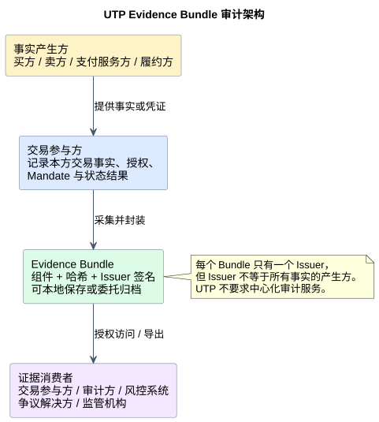

<h1 id="s-7-security-trust">风控与审计（Risk &amp; Audit — L2）</h1>

风控与审计是 UTP 协议 Layer 2 的保障层，为交易事实、资金流向与关键操作提供<strong>可独立验证</strong>的协议级机制。本章定义三类核心能力：

<ul>
<li><strong>风控信号</strong>（Risk Signal）：协议只定义最小数据结构与传递方式，不定义采集来源、PII 分级、保留策略或风控策略；</li>
<li><strong>电子证据包</strong>（Evidence Bundle）：将交易全生命周期证据组件化为可验证、可导出、可审计的标准容器；</li>
<li><strong>动态信任调整</strong>（Dynamic Trust Adjustment，DTA）：协议引擎基于可验证事实对 Agent 信任等级进行治理的事件机制，只规定事件格式与协议级影响，不规定升级/降级策略。</li>
</ul>

资金托管（Escrow）的详细规范已移至 <a href="../primitives/pay/index.md#s-1410-escrow">P4 支付原语的 Escrow（资金托管）小节</a>。Mandate Chain 的签发与数据结构见 <a href="identity-authorization.md#s-64">《身份与授权》 Mandate Chain</a>。

<h2 id="s-71-risk-signals">Risk Signals（风控信号）</h2>

<h3 id="s-711">概述</h3>

<strong>风控信号</strong>（Risk Signal）是交易全生命周期中采集的可验证环境事实（Observable Fact）。UTP 风控信号覆盖从寻源到履约的完整交易链路，支持多参与方采集，服务于授权、速率限制、欺诈防控及其他信任评估场景。

<blockquote>

<strong>协议边界声明：</strong>UTP 只定义 Risk Signal 的<strong>最小数据结构与传递方式</strong>，<strong>不定义</strong>采集来源、PII 分级、保留策略等平台运营职责，也不定义任何风控策略、阈值、评分模型或处置动作。如何消费 Risk Signal、如何构建风控策略，由消费方自主决定。

</blockquote>

这一边界与 A2A 认证框架的分层思路类似：协议层输出可验证事实，策略由部署方根据自身合规要求与风险偏好制定。采集来源追踪、PII 分级、保留策略等平台运营职责由 <a href="#s-72-evidence-bundle">Evidence Bundle（7.2）</a>承担。

风控信号以键值对形式承载于消息信封中。每个信号以反向域名命名的信号名为标识，对应任意 JSON 类型的信号值，标准字段如下：

<table>
<thead>
<tr><th>字段名</th><th>类型</th><th>必填</th><th>描述</th></tr>
</thead>
<tbody>
<tr><td><code>risk_signals</code></td><td>object</td><td>否</td><td>与本消息或本会话相关的风控信号集合。信号名采用反向域名格式（见 <a href="#s-712">7.1.2</a>），信号值为任意 JSON 类型（见 <a href="#s-713">7.1.3</a>）。</td></tr>
</tbody>
</table>

<code>risk_signals</code> 位于 <a href="transport-communication.md#s-411">MessageEnvelope</a> 层，而非业务负载（payload）层。其设计意图是：任何原语消息 MAY 在信封中附带与本消息相关的风控上下文，且不影响 payload 的结构定义；接收方 MAY 消费这些信号，但 <strong>MUST NOT</strong> 因无法识别的信号名而拒绝消息。信号的持久化与审计消费由 <a href="#s-72-evidence-bundle">Evidence Bundle</a> 承担。

<h3 id="s-712">命名与扩展</h3>

所有信号名 <strong>MUST</strong> 采用反向域名格式，以确保不同来源的信号互不冲突。格式为 <code>{反向域名}.{信号类别}.{具体信号}</code>，标准信号由 UTP 规范注册表维护，实现方可通过自有域名命名空间扩展。

反向域名本身已隐含编码了信号的类别与来源信息——例如 <code>org.utp.transport.*</code> 表示传输层信号，<code>org.utp.identity.*</code> 表示身份与认证信号，<code>org.utp.device.*</code> 表示设备与环境信号——因此协议无需额外的信号类型或来源字段。

<strong>命名冲突避免：</strong>自定义信号 <strong>MUST NOT</strong> 使用 <code>org.utp.*</code> 命名空间；该命名空间保留给 UTP 规范标准信号。

<strong>自定义信号扩展：</strong>实现方可通过自有域名命名空间注册自定义信号（如 <code>com.acme.risk.device_id_hash</code>）。自定义信号遵循以下规则：

<ul>
<li>信号名 <strong>MUST</strong> 采用反向域名格式，且 <strong>MUST NOT</strong> 使用 <code>org.utp.*</code> 命名空间；</li>
<li>自定义信号的值类型与来源约束与标准信号一致（见 <a href="#s-713">7.1.3</a>）；</li>
<li>自定义信号 <strong>MUST NOT</strong> 覆盖或重定义 UTP 标准注册信号的同名信号。</li>
</ul>

<strong>PII 分级：</strong>个人信息分级在 EvidenceComponent 层执行，不在信号层定义。信号被纳入 Evidence Bundle 时，其对应的 EvidenceComponent <strong>MUST</strong> 通过 <code>pii_level</code> 字段标注个人信息分级（<code>"none"</code>、<code>"low"</code>、<code>"high"</code>），具体分级规则参见 <a href="#s-724-evidencecomponent">7.2.4 EvidenceComponent 定义</a>。

<h3 id="s-713">数据结构</h3>

每个信号的值可以是任意 JSON 类型，具体由对应信号名的规范定义：

<ul>
<li><strong>简单值</strong>（字符串 / 数值）：如 IP 地址、User-Agent，一个标量即可表达。</li>
<li><strong>复合对象</strong>：如签名失败记录、聚合风险指标，需要多个字段共同描述。</li>
<li><strong>证明结构</strong>：含签名和公钥来源的可验证声明（如设备安全态势证明）。证明类信号是独立的 peer 信号（拥有独立的反向域名信号名），而非其他信号的附属元数据。其信号值 <strong>MUST</strong> 包含四个字段：<code>provider_jwks</code>（证明提供方的 JWKS endpoint URL）、<code>kid</code>（密钥标识，与 JWKS 中的 <code>kid</code> 对应）、<code>payload</code>（被签名的声明内容）、<code>sig</code>（对 <code>payload</code> 的数字签名，base64url 编码）。接收方 <strong>SHOULD</strong> 通过 <code>provider_jwks</code> 获取公钥，用 <code>kid</code> 定位密钥，验证 <code>sig</code> 对 <code>payload</code> 的签名有效性；签名验证失败的信号 <strong>MUST</strong> 被视为不可信。</li>
</ul>

所有信号名 <strong>MUST</strong> 采用反向域名命名法（见 <a href="#s-712">7.1.2</a>），用于唯一标识信号类型并隐含编码其来源与语义。信号值 <strong>MUST NOT</strong> 是买方自主断言的主观声称（如"我是高信用用户"）；信号 <strong>MUST</strong> 基于协议引擎的直接观察或第三方的可独立验证的证明。接收方收到无法验证来源的信号时 <strong>SHOULD NOT</strong> 将其作为授权或风控决策的主要依据。

<strong>类型由信号名承载：</strong>信号的类型语义完全由反向域名 key 表达，接收方据此判断值的结构和含义，因此信号值中 <strong>MUST NOT</strong> 包含额外的 <code>type</code> 字段。例如 <code>org.utp.transport.buyer_ip</code> 本身就说明了值是 IP 地址，<code>org.utp.transport.device_attestation</code> 本身就说明了值是设备证明。这与 UCP 使用独立 <code>type</code> 字段的做法不同——UTP 通过命名空间自描述，省去冗余字段。

以下示例展示三种不同结构的信号值：简单字符串、复合对象、含签名和公钥来源的证明结构。

<pre><code class="language-json">{
  "risk_signals": {
    "org.utp.transport.buyer_ip": "203.0.113.42",
    "org.utp.transport.signature_failure": {
      "failure_count": 3,
      "last_failure_at": "2026-07-20T09:15:00Z",
      "signature_algorithm": "ES256"
    },
    "com.acme.device.attestation": {
      "provider_jwks": "https://acme.com/.well-known/jwks.json",
      "kid": "acme-key-2026-01",
      "payload": {
        "device_id_hash": "sha256-a1b2c3...",
        "security_level": "high"
      },
      "sig": "base64url-ES256-signature..."
    }
  }
}</code></pre>
<ul>
<li><code>org.utp.transport.buyer_ip</code>：IP 地址，简单字符串值。</li>
<li><code>org.utp.transport.signature_failure</code>：签名失败记录，复合对象，包含失败次数、最近失败时间和签名算法。</li>
<li><code>com.acme.device.attestation</code>：设备安全态势证明，含签名和公钥来源，接收方可独立验证。</li>
</ul>

<h3 id="s-714">采集规则</h3>

采集要求随操作风险等级递增：低风险操作只需基础传输层信号，高风险资金或状态迁移操作要求完整信号采集与 Evidence Bundle 归档。协议只规定各操作类型下的采集粒度要求，具体采集哪些信号由实现方根据操作语义决定。

<table>
<thead>
<tr><th>操作风险等级</th><th>典型操作</th><th>采集要求</th></tr>
</thead>
<tbody>
<tr><td>低风险</td><td>只读发现、Profile 验证</td><td>采集传输层基础信号（签名结果、消息时序等），<strong>MAY</strong> 依赖实现方本地日志</td></tr>
<tr><td>中风险</td><td>授权、Mandate 相关操作</td><td>采集相关信号并写入 Evidence Bundle，包括授权验证结果、Mandate Chain 验证结果</td></tr>
<tr><td>高风险</td><td>资金操作、状态迁移</td><td>采集完整信号并写入 Evidence Bundle，<strong>SHOULD</strong> 附带第三方证明（须可独立验证）</td></tr>
</tbody>
</table>

<strong>采集触发条件：</strong>

<ol>
<li>消息到达时：采集签名、时序等传输层信号；</li>
<li>授权验证时：采集授权决策与 Delegation Scope 校验结果；</li>
<li>资金操作前：采集支付授权强度与风险标志；</li>
<li>争议发生时：按请求方要求补充采集指定信号。</li>
</ol>

<h3 id="s-715">传递与请求</h3>

风控信号通过消息信封的 <code>risk_signals</code> 字段传递（字段定义见 <a href="#s-711">7.1.1</a>）。信号传递的协议级规则：

<ol>
<li>发送方 <strong>MAY</strong> 在消息信封中附带已采集的信号，为接收方提供风控上下文；</li>
<li>接收方 <strong>SHOULD</strong> 解析 <code>risk_signals</code> 并按自身策略消费，<strong>MUST NOT</strong> 因无法识别的信号名而拒绝消息；</li>
<li>协议引擎 <strong>MUST</strong> 将信封中的信号与 Evidence Bundle 关联存储（以 <code>message_id</code> 为关联键），以便事后审计追溯；</li>
<li>信号传递 <strong>MUST NOT</strong> 替代消息签名或授权验证，仅作为风控评估的补充上下文。</li>
</ol>

示例参见 <a href="transport-communication.md#s-411">《传输与通信》 MessageEnvelope</a>。

<h4 id="s-7151">信号请求机制</h4>

接收方可能需要发送方补充特定信号。除发送方主动附带外，协议支持接收方通过响应消息请求所需信号。<strong>此机制仅适用于 UTP 标准注册信号</strong>（<code>org.utp.*</code> 命名空间下定义了请求语义的信号），自定义信号不在本机制范围内。

接收方可在响应的 <code>messages</code> 数组中发出信号请求，通过 <code>code: "signal"</code> 标识请求类型，并使用 JSONPath 表达式（如 <code>$.risk_signals['org.utp.transport.buyer_ip']</code>）指明所需信号的具体路径。以下为包含必选信号和可选信号的请求示例：

<pre><code class="language-json">{
  "messages": [
    {
      "type": "error",
      "code": "signal",
      "path": "$.risk_signals['org.utp.transport.buyer_ip']",
      "content": "Buyer IP is required for risk evaluation."
    },
    {
      "type": "info",
      "code": "signal",
      "path": "$.risk_signals['org.utp.device.user_agent']",
      "content": "User Agent may improve risk assessment accuracy."
    }
  ]
}</code></pre>

上述请求的语义含义如下：

<ul>
<li><code>type: "error"</code>：缺少该信号将阻塞交易继续，发送方 <strong>SHOULD</strong> 在下次请求中附带所请求的信号；因技术限制无法提供时 <strong>MAY</strong> 通过消息说明原因；</li>
<li><code>type: "info"</code>：该信号非必须，但有助于改进风控评估精度；</li>
<li><code>path</code>：使用 JSONPath 表达式，通过信号名直接定位 <code>risk_signals</code> 集合中的目标信号（如 <code>$.risk_signals['org.utp.transport.buyer_ip']</code>）；</li>
<li>接收方 <strong>MUST NOT</strong> 通过此机制请求标准注册表之外的自定义信号。</li>
</ul>

<h3 id="s-716">隐私与合规</h3>

风控信号的采集与处理涉及个人信息保护，实现方须遵循以下合规要求：

<ol>
<li><strong>最小必要</strong>：平台 <strong>SHOULD</strong> 仅采集与当前交易安全验证直接相关的信号，<strong>SHOULD NOT</strong> 为构建用户画像等与交易无关的目的过度采集环境数据。</li>
<li><strong>透明告知</strong>：当采集的信号包含个人信息时，实现方 <strong>SHOULD</strong> 向数据主体说明采集目的。</li>
<li><strong>存储隔离</strong>：包含直接标识信息的信号，其对应的 EvidenceComponent <strong>SHOULD</strong> 与通用证据组件隔离存储，并设置更细粒度的访问控制。</li>
<li><strong>跨境限制</strong>：涉及跨境传输时，含个人信息的信号 <strong>MUST</strong> 符合数据出境合规要求；必要时在导出清单（Export Manifest）中声明处理方式。</li>
<li><strong>保留期限</strong>：信号的保留期限由 <a href="#s-723-evidencebundle">EvidenceBundle.retention_policy</a>（见 <a href="#s-723-evidencebundle">7.2.3</a>）统一管理，<strong>MUST</strong> 同时符合保留策略要求与管辖法域的法定期限，到期后安全删除。</li>
</ol>

<h3 id="s-717">与消费方的边界</h3>

协议层输出标准化的可验证事实，消费方据此做出交易级决策。两层分工如下：

<table>
<thead>
<tr><th>层次</th><th>责任主体</th><th>输出</th><th>不输出</th></tr>
</thead>
<tbody>
<tr><td>协议层（UTP）</td><td>协议引擎 / 平台</td><td>标准化、可验证的风控信号</td><td>风控策略、评分模型、处置动作</td></tr>
<tr><td>消费方（应用层）</td><td>卖方 Agent、买方 Agent、平台风控等</td><td>基于风控信号的交易决策</td><td>对协议信号采集义务的替代</td></tr>
</tbody>
</table>

消费方风控系统可自由订阅、聚合和加权协议输出的风控信号，并据此决定放行、增强认证、人工复核或拒绝交易。协议层 <strong>MUST NOT</strong> 强制要求消费方采用特定风控策略，也不替代消费方自身的交易级风控判断。

协议层的准入判定（Profile 验证、Agent 认证、Mandate 校验）是强制的，不受消费方策略覆盖；风控信号的消费是可选的，由消费方自主决定。

<h2 id="s-72-evidence-bundle">Evidence Bundle（电子证据包）</h2>

<h3 id="s-721">概述</h3>

UTP 定义协议级电子证据包（Evidence Bundle），将交易全生命周期中产生的凭证统一封装为可对外交付的标准证据容器。其设计目标是：<strong>字节级可验证、跨平台可携带、面向司法可采信</strong>。

Evidence Bundle 不是必须由 UTP 官方或某个中心化审计服务提供的产品，而是一个由实现方维护的证据组件（Evidence Component）集合。每个组件都有独立的内容哈希与来源引用，整体通过 <code>integrity_hash</code> 保证一致性。UTP 规定证据格式、最小记录要求、完整性验证和访问/导出语义，不规定数据库、部署形态或唯一的审计服务供应方。

<strong>操作最低证据集：</strong>除原语章节另有更高要求外，涉及资金、授权或状态迁移的操作 MUST 至少记录以下组件；只读操作 MAY 省略与其无关的组件，但 MUST 记录请求摘要、身份验证结果与 Authorization Decision。

<table>
<thead><tr><th>操作类型</th><th>最低证据组件</th></tr></thead>
<tbody>
<tr><td>Discover / Profile 验证</td><td>请求摘要、UTPProfile 原文或哈希、签名链/Trust Anchor 验证结果、时间戳</td></tr>
<tr><td>Negotiate / Session 建立</td><td>双方能力声明、协商结果、认证机制、操作准入要求解析结果、准入判定结果与证据引用</td></tr>
<tr><td>Purchase / Commit</td><td>Binding Terms 哈希、Mandate Chain 引用、授权决策、Delegation Scope 校验结果、状态迁移结果</td></tr>
<tr><td>Pay</td><td>Checkout Mandate、Payment Mandate、确认内容哈希、支付请求/响应摘要、幂等键、支付结果与状态迁移结果</td></tr>
<tr><td>Fulfill / Resolve</td><td>操作 Mandate 或争议授权、履约/争议事实、参与方签名、裁决或补偿结果</td></tr>
</tbody>
</table>

<h4 id="s-7211">审计架构与部署边界</h4>

UTP 采用<strong>参与方分别留证、按需验证</strong>的架构。各参与方记录自己产生或观察到的事实，审计、Resolve 或监管方按授权取得证据并独立验证；协议不要求部署中心化审计服务。

<table>
<thead><tr><th>角色</th><th>角色定义</th><th>具体主体</th><th>责任边界</th></tr></thead>
<tbody>
<tr><td>事实提供方</td><td>对某项事实的产生、准确性和凭证有效性负责</td><td>产生订单事实的买方或卖方；产生支付事实的支付服务方；产生履约事实的物流或验货方；产生身份或设备证明的认证服务方</td><td>提供可验证的事实原文、凭证或引用，并负责其签发和撤销语义。</td></tr>
<tr><td>交易参与方</td><td>在交易中承担买方、卖方、支付、履约或代理职责的一方</td><td>买方、卖方、支付方、履约方、代理方</td><td>记录本方请求、认证、授权、Mandate 和状态结果，并提交本方掌握的证据。</td></tr>
<tr><td>证据颁发主体（Evidence Issuer）</td><td>负责创建 Evidence Bundle，并对 Bundle 完整性进行签名的一方</td><td>交易参与方、受托归档方、共同认可的审计方</td><td>负责 Bundle 哈希和签名；保存可以由证据颁发主体或受托存储方承担；证据颁发主体不替他方事实背书。</td></tr>
<tr><td>证据消费者</td><td>获授权读取证据并据此作出判断的一方</td><td>交易参与方、审计方、风控系统、争议解决方、监管机构</td><td>按授权读取证据，独立验证后完成记录核对、审计、风控、争议处理或合规检查。</td></tr>
</tbody>
</table>

<strong>角色关系：</strong>“事实提供方”和“交易参与方”可以是同一主体，但含义不同。例如，卖方既是交易参与方，也是订单条款和发货事实的事实提供方；支付服务方可以是事实提供方，但不一定是该笔商品交易的交易参与方。角色是否重合，取决于该主体在具体交易中的职责。

<strong>最小边界：</strong>无论如何保存或传递，MUST 保留 <code>source_ref</code>、<code>evidence_issuer</code>、组件哈希和验证结果，使第三方能够区分“谁产生事实”和“谁整理证据”。

<strong>证据消费者定义：</strong>证据消费者是获授权读取 Evidence Bundle，并根据其中证据作出业务、审计或监管判断的角色。具体角色包括：交易参与方核对本方记录，审计方检查协议执行过程，风控系统决定放行、增强认证或拒绝，争议解决方处理争议，监管机构依法开展合规检查。同一主体 MAY 同时承担多个角色，但每次使用证据时 MUST 明确访问目的和授权范围。

<h4 id="s-7212">责任链与跨参与方证据</h4>

一笔交易不要求所有事实集中在一个 Bundle 中。各方可以保存自己的证据，并通过 <code>source_ref</code>、交易标识、Mandate 引用和内容哈希建立关联。Resolve 或审计方取得必要组件后，MUST 先验证事实凭证，再验证 Bundle 完整性。

<ol>
<li>事实产生方负责事实内容的准确性、签发和撤销语义；</li>
<li>交易参与方负责记录其实际执行的请求、决策和状态结果；</li>
<li>证据包颁发方负责组件集合、哈希链、签名及导出一致性；</li>
<li>存储方负责保留、访问控制、备份和导出可用性；</li>
<li>证据消费者负责验证证据后再作风控、审计或争议裁决，MUST NOT 仅因 Bundle 由某一方签发就推定所有组件真实。</li>
</ol>

<figure id="s-721-architecture" style="margin: 24px 0 32px;">
  

    
  

  <figcaption style="margin-top: 10px; color: #6b7280; font-size: 13px; text-align: center;">
    图 7-1 Evidence Bundle 审计架构与责任边界（可在图内滚动查看完整架构；<a href="../../assets/diagrams/png2x/evidence-bundle-audit-architecture.png">PNG 大图</a>）
  </figcaption>
</figure>

<h3 id="s-722">证据包颁发机制</h3>

<strong>证据颁发主体（Evidence Issuer）：</strong>每个 Evidence Bundle <strong>MUST</strong> 由唯一的证据颁发主体创建并签名。唯一的证据颁发主体表示该 Bundle 的容器完整性责任主体，不表示该主体是所有底层事实的唯一产生方，也不要求其成为全网中心化服务。证据颁发主体通常是：

<ul>
<li>交易参与方：为其负责的交易整理并维护主证据包；</li>
<li>经交易各方共同认可的第三方审计服务；</li>
<li>争议解决机构在争议升级后 fork 的独立证据包副本。</li>
</ul>

证据颁发主体 MUST NOT 修改或重新颁发其他参与方已签名的原始事实凭证；如需补充、撤销或纠正，证据颁发主体应追加新的 EvidenceComponent，并保留原组件及其验证结果。

<strong>创建时机：</strong>

<ol>
<li>交易会话建立后，负责交易记录的一方 <strong>SHOULD</strong> 立即创建空 Evidence Bundle；</li>
<li>每当发生可审计事件（状态迁移、授权验证、支付确认、争议提交等），相关 Evidence Component <strong>MUST</strong> 被追加；</li>
<li>交易结束后，证据包进入只读归档状态，证据颁发主体 <strong>MUST</strong> 签发最终 <code>issuer_signature</code>。</li>
</ol>

<h3 id="s-723-evidencebundle">EvidenceBundle 实体</h3>
<table>
<thead>
<tr><th>字段名</th><th>类型</th><th>必填</th><th>描述</th></tr>
</thead>
<tbody>
<tr><td><code>bundle_id</code></td><td>string</td><td>是</td><td>证据包全局唯一标识，UUID v4 格式。</td></tr>
<tr><td><code>session_id</code></td><td>string</td><td>是</td><td>关联的 UTP Session ID。</td></tr>
<tr><td><code>evidence_issuer</code></td><td>string</td><td>是</td><td>证据颁发主体标识（Agent ID 或服务 DID）。</td></tr>
<tr><td><code>issuer_signature</code></td><td>string</td><td>是</td><td>证据颁发主体对 <code>integrity_hash</code> 的 JWS 签名。</td></tr>
<tr><td><code>created_at</code></td><td>ISO-8601</td><td>是</td><td>证据包创建时间。</td></tr>
<tr><td><code>last_updated_at</code></td><td>ISO-8601</td><td>是</td><td>最近更新时间。</td></tr>
<tr><td><code>integrity_hash</code></td><td>string</td><td>是</td><td>证据包完整内容的 SHA-256 哈希值，计算方式见 <a href="#s-726">7.2.6</a>。</td></tr>
<tr><td><code>components</code></td><td>EvidenceComponent[]</td><td>是</td><td>证据组件列表。</td></tr>
<tr><td><code>retention_policy</code></td><td>object</td><td>是</td><td>Evidence Bundle 的保留策略，包含 <code>policy_id</code>、<code>minimum_retention</code>、<code>jurisdiction</code> 和 <code>deletion_procedure</code>。</td></tr>
<tr><td><code>export_format</code></td><td>string</td><td>是</td><td>导出格式。固定值 <code>"json+jws"</code>。</td></tr>
<tr><td><code>tsa_stamps</code></td><td>object[]</td><td>否</td><td>可信时间戳服务签发的时间戳列表，每项包含 <code>token_id</code>、<code>tsa_id</code>、<code>timestamp</code> 和 <code>signature</code>。</td></tr>
<tr><td><code>export_manifest</code></td><td>ExportManifest</td><td>否</td><td>最近一次导出的清单。若未导出过，可省略。</td></tr>
</tbody>
</table>

<h3 id="s-724-evidencecomponent">EvidenceComponent 实体</h3>
<table>
<thead>
<tr><th>字段名</th><th>类型</th><th>必填</th><th>描述</th></tr>
</thead>
<tbody>
<tr><td><code>component_type</code></td><td>string</td><td>是</td><td>组件类型。有效值：<code>"jws_signature"</code>、<code>"certificate"</code>、<code>"mandate"</code>、<code>"wysiwys_snapshot"</code>、<code>"status_event"</code>、<code>"webhook_log"</code>、<code>"profile_snapshot"</code>、<code>"timestamp"</code>、<code>"risk_signal"</code>、<code>"escrow_operation"</code>、<code>"authorization_decision"</code>。</td></tr>
<tr><td><code>component_id</code></td><td>string</td><td>是</td><td>组件唯一标识。</td></tr>
<tr><td><code>content</code></td><td>object</td><td>是</td><td>组件原始内容或引用。</td></tr>
<tr><td><code>content_hash</code></td><td>string</td><td>是</td><td><code>content</code> 的 SHA-256 哈希值。</td></tr>
<tr><td><code>source_ref</code></td><td>string</td><td>是</td><td>组件来源引用，如消息 ID、Mandate ID、Attestation ID。</td></tr>
<tr><td><code>collected_at</code></td><td>ISO-8601</td><td>是</td><td>组件采集或生成时间。</td></tr>
<tr><td><code>pii_level</code></td><td>enum</td><td>是</td><td>个人信息分级：<code>"none"</code>、<code>"low"</code>、<code>"high"</code>。</td></tr>
<tr><td><code>metadata</code></td><td>object</td><td>否</td><td>扩展元数据，键名建议采用反向域名命名法。</td></tr>
</tbody>
</table>

<h4 id="s-7241">EvidenceBundle 示例</h4>
<pre><code class="language-json">{
  "bundle_id": "bundle-20260720-001",
  "session_id": "utp-session-x9y8z7w6",
  "evidence_issuer": "seller-agent-001",
  "issuer_signature": "eyJhbGciOiJFUzI1NiJ9...",
  "created_at": "2026-07-20T08:00:00Z",
  "last_updated_at": "2026-07-20T10:30:00Z",
  "integrity_hash": "sha256-abc123...",
  "components": [
    {
      "component_type": "risk_signal",
      "component_id": "comp-sig-001",
      "content": {
        "org.utp.transport.signature_failure": {
          "failure_count": 3,
          "last_failure_at": "2026-07-20T09:15:00Z",
          "signature_algorithm": "ES256"
        }
      },
      "content_hash": "sha256-def456...",
      "source_ref": "msg-a1b2c3d4-e5f6-7890-abcd-ef1234567890",
      "collected_at": "2026-07-20T09:15:30Z",
      "pii_level": "none"
    },
    {
      "component_type": "mandate",
      "component_id": "comp-mandate-001",
      "content": {
        "mandate_id": "mandate-payment-001",
        "type": "payment_mandate"
      },
      "content_hash": "sha256-ghi789...",
      "source_ref": "mandate-payment-001",
      "collected_at": "2026-07-20T09:20:00Z",
      "pii_level": "low"
    }
  ],
  "retention_policy": {
    "policy_id": "retention-7year",
    "minimum_retention": "2033-07-20T00:00:00Z",
    "jurisdiction": "CN"
  },
  "export_format": "json+jws",
  "tsa_stamps": [
    {
      "token_id": "tsa-001",
      "tsa_id": "tsa.example.org",
      "timestamp": "2026-07-20T10:30:00Z",
      "signature": "base64-tsa-sig..."
    }
  ]
}</code></pre>

<h3 id="s-725">申请使用流程</h3>

Evidence Bundle 的访问不是无条件的。任何非交易参与方请求访问时，<strong>MUST</strong> 经过申请与审批流程。

<h4 id="s-7251">EvidenceBundleRequest 实体</h4>
<table>
<thead>
<tr><th>字段名</th><th>类型</th><th>必填</th><th>描述</th></tr>
</thead>
<tbody>
<tr><td><code>request_id</code></td><td>string</td><td>是</td><td>申请唯一标识。</td></tr>
<tr><td><code>requester</code></td><td>string</td><td>是</td><td>申请方标识（Agent ID 或 DID）。</td></tr>
<tr><td><code>bundle_id</code></td><td>string</td><td>是</td><td>目标 Evidence Bundle ID。</td></tr>
<tr><td><code>purpose</code></td><td>string</td><td>是</td><td>申请目的，如 <code>"audit"</code>、<code>"dispute_resolution"</code>、<code>"regulatory_inquiry"</code>。</td></tr>
<tr><td><code>legal_basis</code></td><td>string</td><td>是</td><td>法律依据或合同授权引用。</td></tr>
<tr><td><code>requested_components</code></td><td>string[]</td><td>否</td><td>申请的组件类型列表。若为空表示申请全部组件。</td></tr>
<tr><td><code>requested_at</code></td><td>ISO-8601</td><td>是</td><td>申请时间。</td></tr>
</tbody>
</table>

<h4 id="s-7252">EvidenceBundleAccessDecision 实体</h4>
<table>
<thead>
<tr><th>字段名</th><th>类型</th><th>必填</th><th>描述</th></tr>
</thead>
<tbody>
<tr><td><code>decision_id</code></td><td>string</td><td>是</td><td>决策唯一标识。</td></tr>
<tr><td><code>bundle_id</code></td><td>string</td><td>是</td><td>目标 Evidence Bundle ID。</td></tr>
<tr><td><code>request_id</code></td><td>string</td><td>是</td><td>对应申请 ID。</td></tr>
<tr><td><code>decision</code></td><td>enum</td><td>是</td><td>决策结果：<code>"approved"</code>、<code>"approved_with_redaction"</code>、<code>"denied"</code>。</td></tr>
<tr><td><code>decided_by</code></td><td>string</td><td>是</td><td>审批方标识。</td></tr>
<tr><td><code>decided_at</code></td><td>ISO-8601</td><td>是</td><td>审批时间。</td></tr>
<tr><td><code>conditions</code></td><td>object</td><td>否</td><td>附加条件，如允许的用途、禁止二次共享、组件白名单。</td></tr>
<tr><td><code>expires_at</code></td><td>ISO-8601</td><td>否</td><td>访问授权过期时间。</td></tr>
</tbody>
</table>

<h4 id="s-7253">访问控制规则</h4>
<ol>
<li>交易参与方 <strong>MAY</strong> 直接访问本方生成的 Evidence Bundle 组件；</li>
<li>非参与方 <strong>MUST</strong> 提交 EvidenceBundleRequest，并出示合法法律基础；</li>
<li>审批方 <strong>MUST</strong> 在 EvidenceBundleAccessDecision 中记录决策依据；</li>
<li>对于 <code>high</code> PII 组件，默认 <strong>MUST</strong> 采用 <code>approved_with_redaction</code> 或拒绝，除非申请方获得数据主体明确授权。</li>
</ol>

<h3 id="s-726">签发安全机制</h3>

Evidence Bundle 的不可篡改性依赖三层机制：

<ol>
<li><strong>组件哈希</strong>：每个 EvidenceComponent 的 <code>content_hash</code> 是 <code>SHA-256(content)</code>；</li>
<li><strong>整体哈希</strong>：<code>integrity_hash = SHA-256(components[0].content_hash || components[1].content_hash || ... || components[n].content_hash)</code>，按 <code>component_id</code> 字典序拼接；</li>
<li><strong>证据颁发主体签名</strong>：证据颁发主体使用私钥对 <code>integrity_hash</code> 生成 JWS 签名，存入 <code>issuer_signature</code>。</li>
</ol>

每次追加组件后，负责整理证据的一方 <strong>MUST</strong> 重新计算 <code>integrity_hash</code> 并更新 <code>last_updated_at</code>。交易结束后，证据颁发主体 <strong>MUST</strong> 签发最终签名，签名后证据包进入只读状态。

<h3 id="s-727">导出规则</h3>

Evidence Bundle 可应合法请求导出为标准证据文件。导出时 <strong>MUST</strong> 附带 ExportManifest，声明导出内容与处理方式。

<h4 id="s-7271">ExportManifest 实体</h4>
<table>
<thead>
<tr><th>字段名</th><th>类型</th><th>必填</th><th>描述</th></tr>
</thead>
<tbody>
<tr><td><code>manifest_id</code></td><td>string</td><td>是</td><td>导出清单唯一标识。</td></tr>
<tr><td><code>bundle_id</code></td><td>string</td><td>是</td><td>源 Evidence Bundle ID。</td></tr>
<tr><td><code>exported_at</code></td><td>ISO-8601</td><td>是</td><td>导出时间。</td></tr>
<tr><td><code>exported_by</code></td><td>string</td><td>是</td><td>执行导出的服务或主体标识。</td></tr>
<tr><td><code>component_manifest</code></td><td>object[]</td><td>是</td><td>每个导出组件的 ID、类型、内容哈希及是否脱敏。</td></tr>
<tr><td><code>pii_redaction_policy</code></td><td>string</td><td>是</td><td>脱敏策略说明，如 <code>"hash_only"</code>、<code>"mask"</code>、<code>"exclude"</code>。</td></tr>
<tr><td><code>cross_border_flag</code></td><td>boolean</td><td>是</td><td>是否涉及跨境传输。</td></tr>
<tr><td><code>jurisdiction</code></td><td>string</td><td>否</td><td>导出目标司法管辖区。</td></tr>
<tr><td><code>retention_until</code></td><td>ISO-8601</td><td>是</td><td>导出副本的保留截止时间。</td></tr>
</tbody>
</table>

<h4 id="s-7272">导出约束</h4>
<ol>
<li>导出操作本身 <strong>MUST</strong> 在审计日志（Audit Log）中记录，并将 ExportManifest 保存为 Evidence Bundle 的 <code>export_manifest</code> 字段；</li>
<li><code>high</code> PII 组件导出时 <strong>MUST</strong> 脱敏，除非 EvidenceBundleAccessDecision 明确授权完整导出；</li>
<li>跨境导出 <strong>MUST</strong> 在 ExportManifest 中声明 <code>cross_border_flag=true</code> 与目标 <code>jurisdiction</code>；</li>
<li>导出副本 <strong>MUST</strong> 附带原证据颁发主体签名与导出清单签名，便于第三方验证完整性。</li>
</ol>

<h3 id="s-728">完整逻辑链路</h3>

Evidence Bundle 的生命周期链路如下：

<pre><code>会话建立
  → 交易参与方创建 EvidenceBundle（生成 bundle_id、evidence_issuer、retention_policy）
  → 交易过程中持续追加 EvidenceComponent（Mandate、签名、状态事件、Risk Signal 等）
  → 每次追加后重算 integrity_hash
  → 交易结束/争议触发时证据颁发主体签发最终 JWS 签名
  → 第三方申请访问 → 提交 EvidenceBundleRequest
  → 审批方生成 EvidenceBundleAccessDecision
  → 获准后按脱敏策略导出，生成 ExportManifest
  → 导出事件写入审计日志
</code></pre>

<h2 id="s-73-dynamic-trust-adjustment">Dynamic Trust Adjustment（动态信任调整）</h2>

<h3 id="s-731">概述</h3>

<strong>动态信任调整</strong>（Dynamic Trust Adjustment，DTA）是协议引擎对 Agent 长期信任状态进行治理的事件机制。它基于可验证事实（如 Risk Signal、对账异常、Mandate 验证失败）产生信任等级变化事件，进而影响协议级行为（如 HAI 控制等级、Delegation Scope 边界）。

<blockquote>

<strong>协议边界声明：</strong>UTP 只定义 DTA 的<strong>事件格式、信任等级语义、以及等级变化对协议级能力的约束映射</strong>，<strong>不定义</strong>具体的升级/降级策略、触发阈值或评分算法。策略由协议引擎实现方或平台治理方制定。

</blockquote>

<h3 id="s-732">实现主体与消费方</h3>

<strong>实现主体：</strong>DTA 事件的签发方可以是协议引擎、审计服务或其他受信任治理方；UTP 不要求存在单一中心化的全局信任服务。任何消费者 MUST 先验证事件签名、来源、时间顺序与触发证据，再按本地治理策略计算当前有效信任状态。单一交易参与方不得仅凭本方声明直接改变其他参与方的协议权限。

<strong>消费方：</strong>

<ul>
<li><strong>HAI 控制层</strong>：根据信任等级调整人机协同交互强度（见 <a href="human-agent-interaction.md">《人机交互协同》</a>）；</li>
<li><strong>Delegation Scope 执行层</strong>：收紧或放宽 Agent 的自主操作边界；</li>
<li><strong>买方 Agent</strong>：接收自身信任等级变化通知，调整行为策略；</li>
<li><strong>审计系统</strong>：将 TrustAdjustmentEvent 写入 Evidence Bundle；</li>
<li><strong>争议裁决方</strong>：将历史 TrustAdjustmentEvent 作为责任判定参考。</li>
</ul>

商家风控系统可订阅 TrustAdjustmentEvent 作为参考，但主要消费原始 Risk Signal 进行单笔交易决策。

<h3 id="s-733-trustadjustmentevent">TrustAdjustmentEvent 实体</h3>
<table>
<thead>
<tr><th>字段名</th><th>类型</th><th>必填</th><th>描述</th></tr>
</thead>
<tbody>
<tr><td><code>event_id</code></td><td>string</td><td>是</td><td>事件全局唯一标识。</td></tr>
<tr><td><code>subject_agent</code></td><td>string</td><td>是</td><td>被调整信任等级的 Agent ID。</td></tr>
<tr><td><code>previous_trust_level</code></td><td>enum</td><td>是</td><td>调整前信任等级。有效值：<code>"L0"</code>、<code>"L1"</code>、<code>"L2"</code>、<code>"L3"</code>。</td></tr>
<tr><td><code>new_trust_level</code></td><td>enum</td><td>是</td><td>调整后信任等级。有效值同 <code>previous_trust_level</code>。</td></tr>
<tr><td><code>trigger_signal</code></td><td>string</td><td>否</td><td>触发本事件的 Risk Signal ID。若由多个信号聚合触发，可省略本字段而在 <code>trigger_evidence</code> 中列出。</td></tr>
<tr><td><code>trigger_evidence</code></td><td>string[]</td><td>是</td><td>触发证据引用列表，包括 Risk Signal ID、Mandate 验证失败记录、对账异常记录等。</td></tr>
<tr><td><code>adjustment_reason</code></td><td>string</td><td>是</td><td>调整原因摘要，供审计与争议参考。</td></tr>
<tr><td><code>effective_at</code></td><td>ISO-8601</td><td>是</td><td>事件生效时间。</td></tr>
<tr><td><code>expires_at</code></td><td>ISO-8601</td><td>否</td><td>调整有效期截止时间。若省略表示长期有效，直至被后续事件覆盖。</td></tr>
<tr><td><code>hai_impact</code></td><td>object</td><td>否</td><td>对 HAI 控制等级的影响。字段包括 <code>required_hai_level</code>、<code>affected_operations</code>。</td></tr>
<tr><td><code>delegation_scope_impact</code></td><td>object</td><td>否</td><td>对 Delegation Scope 的影响。字段包括 <code>scope_restriction</code>、<code>requires_reauthorization</code>。</td></tr>
<tr><td><code>issued_by</code></td><td>string</td><td>是</td><td>签发事件的主体标识，可以是协议引擎、审计服务或其他受信任治理方；接收方 MUST 依据 Trust Anchor 或等价信任链验证其来源。</td></tr>
</tbody>
</table>

<h4 id="s-7331">TrustAdjustmentEvent 示例</h4>
<pre><code class="language-json">{
  "event_id": "dta-20260720-001",
  "subject_agent": "buyer-agent-001",
  "previous_trust_level": "L2",
  "new_trust_level": "L1",
  "trigger_signal": "sig-20260720-001",
  "trigger_evidence": [
    "sig-20260720-001",
    "authz-decision-20260720-001"
  ],
  "adjustment_reason": "连续签名失败触发信任降级",
  "effective_at": "2026-07-20T09:16:00Z",
  "expires_at": "2026-08-20T00:00:00Z",
  "hai_impact": {
    "required_hai_level": "CONFIRMED",
    "affected_operations": ["utp.pay.initiate", "utp.purchase.create"]
  },
  "delegation_scope_impact": {
    "scope_restriction": "payment_amount_daily_limit_halved",
    "requires_reauthorization": true
  },
  "issued_by": "utp-engine-platform"
}</code></pre>

<h3 id="s-734">协议级影响</h3>

信任等级变化对协议行为的约束映射如下：

<table>
<thead>
<tr><th>信任等级</th><th>HAI 控制等级要求</th><th>Delegation Scope 影响</th></tr>
</thead>
<tbody>
<tr><td>L3（高信任）</td><td>允许 AUTONOMOUS 或 SUPERVISED 执行低风险操作</td><td>可执行较宽范围的自主操作</td></tr>
<tr><td>L2（正常信任）</td><td>高风险操作需 CONFIRMED 等级</td><td>维持当前 Delegation Scope，敏感操作需人工确认</td></tr>
<tr><td>L1（受限信任）</td><td>大多数资金操作需 CONFIRMED，低风险操作可降至 SUPERVISED</td><td>Delegation Scope 收紧，历史授权需复核</td></tr>
<tr><td>L0（不可信）</td><td>禁止自主执行；所有操作进入人工审核</td><td>暂停或吊销相关 Delegation Scope</td></tr>
</tbody>
</table>

<strong>约束规则：</strong>

<ol>
<li>协议引擎 <strong>MUST</strong> 在执行操作前检查 Agent 当前信任等级是否满足该操作所需的最低等级；</li>
<li>当已验证的 DTA 事件降低信任等级时，协议引擎 <strong>MUST</strong> 重新评估当前会话中尚未执行的高风险操作授权；已经完成的不可逆操作不因事后事件回滚，但撤销或调整记录 MUST 进入 Evidence Bundle；</li>
<li>HAI 控制等级的上调 <strong>MUST NOT</strong> 静默绕过，必须向用户或监管认可的 Confirmation Surface 发出明确通知。</li>
</ol>

<h3 id="s-735">与商家风控的边界</h3>
<table>
<thead>
<tr><th>维度</th><th>商家风控</th><th>协议级 DTA</th></tr>
</thead>
<tbody>
<tr><td>时间范围</td><td>单笔交易</td><td>Agent 长期信任状态</td></tr>
<tr><td>决策内容</td><td>放行/拒绝/增强认证</td><td>信任等级与协议能力映射</td></tr>
<tr><td>实现主体</td><td>商家 / 平台风控</td><td>DTA 事件签发方与本地协议引擎消费者</td></tr>
<tr><td>输入</td><td>Risk Signal + 商家私有数据</td><td>Risk Signal + 协议级事件</td></tr>
<tr><td>输出</td><td>交易决策</td><td>TrustAdjustmentEvent</td></tr>
</tbody>
</table>

二者互补：商家风控决定"这笔交易是否接受"；DTA 决定"该 Agent 在协议层面具备哪些操作权限"。协议 <strong>MUST NOT</strong> 用 DTA 替代商家的交易级风控判断。

<h2 id="s-74-entities">实体定义速查</h2>

本节集中列出本章实体定义的入口。实体字段在所属业务规则附近说明，统一从以下索引访问；本节不重复复制字段表。

<table>
<thead><tr><th>实体</th><th>定义入口</th><th>用途</th></tr></thead>
<tbody>
<tr><td>risk_signals（信号格式）</td><td><a href="#s-713">7.1.3</a></td><td>记录可验证的风控事实（键值对）</td></tr>
<tr><td>EvidenceBundle</td><td><a href="#s-723-evidencebundle">7.2.3</a></td><td>汇总交易证据并提供完整性保护</td></tr>
<tr><td>EvidenceComponent</td><td><a href="#s-724-evidencecomponent">7.2.4</a></td><td>Evidence Bundle 的证据组件</td></tr>
<tr><td>EvidenceBundleRequest / EvidenceBundleAccessDecision</td><td><a href="#s-7251">7.2.5</a></td><td>证据访问申请与授权决定</td></tr>
<tr><td>ExportManifest</td><td><a href="#s-7271">7.2.7</a></td><td>证据导出内容与处理声明</td></tr>
<tr><td>TrustAdjustmentEvent</td><td><a href="#s-733-trustadjustmentevent">7.3.3</a></td><td>动态信任调整事件</td></tr>
</tbody>
</table>
<h3 id="s-743">实体关系图</h3>
<pre><code>MessageEnvelope
  └── risk_signals: { [key: string]: any }  （键值对，key 为反向域名信号名，value 为任意 JSON 类型信号值）

EvidenceBundle
  ├── evidence_issuer / issuer_signature
  ├── integrity_hash
  ├── components: EvidenceComponent[]
  │     ├── component_type = "risk_signal"
  │     ├── content = { [key: string]: any }（信号键值对子集）
  │     └── content_hash
  ├── retention_policy: object（统一管理信号保留期限）
  └── export_manifest: ExportManifest

EvidenceBundleRequest → EvidenceBundleAccessDecision
</code></pre>
